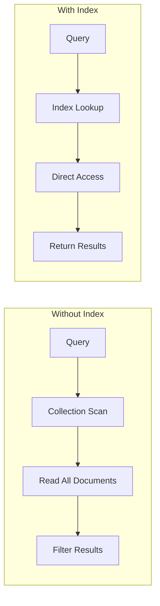

# How to Use MongoDB Indexes Effectively

Author: [nawazdhandala](https://www.github.com/nawazdhandala)

Tags: MongoDB, Indexes, Performance, Database, Query Optimization, Best Practices

Description: Master MongoDB indexing strategies to dramatically improve query performance. Learn about index types, creation strategies, and optimization techniques with practical examples.

---

Indexes are the backbone of MongoDB query performance. Without proper indexes, MongoDB must scan every document in a collection to find matching results - a process that becomes increasingly slow as your data grows. This guide will help you understand and implement effective indexing strategies.

## Understanding Index Fundamentals

MongoDB indexes work like a book index - they provide shortcuts to find data without reading every page. Let's visualize how indexes improve query performance:



## Index Types and When to Use Them

### Single Field Index

The most basic index type, perfect for queries on individual fields:

```javascript
// Create a single field index
db.users.createIndex({ email: 1 })  // Ascending
db.users.createIndex({ createdAt: -1 })  // Descending

// This query will use the email index
db.users.find({ email: "user@example.com" })

// Index for case-insensitive queries
db.users.createIndex(
    { email: 1 },
    { collation: { locale: 'en', strength: 2 } }
)
```

### Compound Index

Indexes on multiple fields - order matters:

```javascript
// Compound index on status and createdAt
db.orders.createIndex({ status: 1, createdAt: -1 })

// This query uses the index efficiently
db.orders.find({ status: "pending" }).sort({ createdAt: -1 })

// This also uses the index (prefix)
db.orders.find({ status: "pending" })

// This does NOT use the index efficiently (missing prefix)
db.orders.find({ createdAt: { $gt: new Date("2024-01-01") } })

// Compound index for range queries
// Put equality conditions first, then ranges
db.products.createIndex({ category: 1, price: 1 })

// Efficient
db.products.find({ category: "electronics", price: { $gt: 100, $lt: 500 } })
```

### Multikey Index

Automatically created when indexing array fields:

```javascript
// Document with array field
{
    _id: 1,
    name: "Product",
    tags: ["electronics", "sale", "featured"]
}

// Create multikey index
db.products.createIndex({ tags: 1 })

// Efficient queries on array elements
db.products.find({ tags: "electronics" })
db.products.find({ tags: { $in: ["electronics", "sale"] } })
```

### Text Index

Full-text search capabilities:

```javascript
// Create text index
db.articles.createIndex({
    title: "text",
    content: "text",
    tags: "text"
}, {
    weights: {
        title: 10,
        tags: 5,
        content: 1
    }
})

// Text search queries
db.articles.find({ $text: { $search: "mongodb indexing" } })

// With score sorting
db.articles.find(
    { $text: { $search: "mongodb indexing" } },
    { score: { $meta: "textScore" } }
).sort({ score: { $meta: "textScore" } })

// Phrase search
db.articles.find({ $text: { $search: "\"exact phrase\"" } })

// Exclude terms
db.articles.find({ $text: { $search: "mongodb -tutorial" } })
```

### Geospatial Index

For location-based queries:

```javascript
// 2dsphere index for GeoJSON data
db.locations.createIndex({ location: "2dsphere" })

// Document with GeoJSON point
{
    _id: 1,
    name: "Coffee Shop",
    location: {
        type: "Point",
        coordinates: [-73.856077, 40.848447]  // [longitude, latitude]
    }
}

// Find locations near a point
db.locations.find({
    location: {
        $near: {
            $geometry: {
                type: "Point",
                coordinates: [-73.856077, 40.848447]
            },
            $maxDistance: 1000  // meters
        }
    }
})
```

### Hashed Index

For equality queries with even distribution:

```javascript
// Create hashed index
db.users.createIndex({ sessionId: "hashed" })

// Good for sharding
sh.shardCollection("mydb.users", { userId: "hashed" })

// Only supports equality queries
db.users.find({ sessionId: "abc123" })  // Uses index
db.users.find({ sessionId: { $gt: "abc" } })  // Does NOT use index
```

## Index Properties and Options

### Unique Index

Prevent duplicate values:

```javascript
// Unique index
db.users.createIndex({ email: 1 }, { unique: true })

// Compound unique index
db.orders.createIndex(
    { userId: 1, orderId: 1 },
    { unique: true }
)

// Unique with sparse (ignore nulls)
db.users.createIndex(
    { socialSecurityNumber: 1 },
    { unique: true, sparse: true }
)
```

### Partial Index

Index only documents matching a filter:

```javascript
// Index only active users
db.users.createIndex(
    { email: 1 },
    { partialFilterExpression: { active: true } }
)

// Index only recent orders
db.orders.createIndex(
    { status: 1, createdAt: -1 },
    {
        partialFilterExpression: {
            createdAt: { $gt: new Date("2024-01-01") }
        }
    }
)

// Query must include filter condition to use partial index
db.users.find({ email: "user@example.com", active: true })  // Uses index
db.users.find({ email: "user@example.com" })  // May NOT use index
```

### TTL Index

Automatic document expiration:

```javascript
// Documents expire after 1 hour
db.sessions.createIndex(
    { createdAt: 1 },
    { expireAfterSeconds: 3600 }
)

// Documents expire at specific time
db.events.createIndex(
    { expiresAt: 1 },
    { expireAfterSeconds: 0 }  // Use document's expiresAt field
)

// Insert document with expiration
db.events.insertOne({
    type: "notification",
    data: { ... },
    expiresAt: new Date(Date.now() + 24 * 60 * 60 * 1000)  // Expires in 24 hours
})
```

## Query Analysis and Optimization

### Using explain()

Analyze query execution:

```javascript
// Get execution stats
db.orders.find({ status: "pending" }).explain("executionStats")

// Key metrics to check
{
    executionStats: {
        nReturned: 150,           // Documents returned
        executionTimeMillis: 5,   // Query time
        totalKeysExamined: 150,   // Index entries scanned
        totalDocsExamined: 150    // Documents scanned
    },
    winningPlan: {
        stage: "FETCH",           // Should see IXSCAN, not COLLSCAN
        inputStage: {
            stage: "IXSCAN",
            indexName: "status_1"
        }
    }
}

// Compare index efficiency
// Ideal: totalKeysExamined ~= nReturned ~= totalDocsExamined
```

### Finding Missing Indexes

Identify queries that need indexes:

```javascript
// Enable profiling
db.setProfilingLevel(1, { slowms: 100 })  // Log queries > 100ms

// Find slow queries
db.system.profile.find({
    op: "query",
    millis: { $gt: 100 }
}).sort({ millis: -1 }).limit(10)

// Check for collection scans
db.system.profile.find({
    "planSummary": "COLLSCAN"
}).sort({ millis: -1 })
```

### Index Usage Statistics

Monitor which indexes are actually used:

```javascript
// Get index usage stats
db.orders.aggregate([{ $indexStats: {} }])

// Sample output
[
    {
        name: "status_1",
        accesses: {
            ops: 15420,
            since: ISODate("2024-01-01")
        }
    },
    {
        name: "customerId_1",
        accesses: {
            ops: 0,  // Unused index - consider dropping
            since: ISODate("2024-01-01")
        }
    }
]

// Find unused indexes
db.orders.aggregate([
    { $indexStats: {} },
    { $match: { "accesses.ops": 0 } }
])
```

## Index Design Patterns

### The ESR Rule

Equality, Sort, Range - order your compound index fields:

```javascript
// Query: Find active users, sorted by lastLogin, created after 2024
// E: status (equality)
// S: lastLogin (sort)
// R: createdAt (range)

db.users.createIndex({ status: 1, lastLogin: -1, createdAt: 1 })

// Efficient query
db.users.find({
    status: "active",
    createdAt: { $gt: new Date("2024-01-01") }
}).sort({ lastLogin: -1 })
```

### Covered Queries

Queries that return only indexed fields:

```javascript
// Create index with all needed fields
db.orders.createIndex({
    customerId: 1,
    status: 1,
    totalAmount: 1
})

// Covered query - no document fetch needed
db.orders.find(
    { customerId: "cust123", status: "completed" },
    { _id: 0, customerId: 1, status: 1, totalAmount: 1 }  // Only indexed fields
).explain("executionStats")

// Check for totalDocsExamined: 0 in explain output
```

### Index Intersection

MongoDB can combine multiple indexes:

```javascript
// Two separate indexes
db.products.createIndex({ category: 1 })
db.products.createIndex({ brand: 1 })

// Query might use both indexes
db.products.find({ category: "electronics", brand: "Samsung" })

// But compound index is usually more efficient
db.products.createIndex({ category: 1, brand: 1 })
```

## Practical Indexing Implementation

Here's a Node.js service for managing indexes:

```javascript
const { MongoClient } = require('mongodb');

class IndexManager {
    constructor(uri, dbName) {
        this.uri = uri;
        this.dbName = dbName;
        this.client = null;
    }

    async connect() {
        this.client = new MongoClient(this.uri);
        await this.client.connect();
        this.db = this.client.db(this.dbName);
    }

    async createIndexWithAnalysis(collectionName, indexSpec, options = {}) {
        const collection = this.db.collection(collectionName);

        // Check if similar index exists
        const existingIndexes = await collection.indexes();
        for (const index of existingIndexes) {
            if (this.isIndexRedundant(index.key, indexSpec)) {
                console.log(`Similar index exists: ${index.name}`);
                return null;
            }
        }

        // Estimate index size
        const stats = await collection.stats();
        const estimatedSize = this.estimateIndexSize(stats, indexSpec);
        console.log(`Estimated index size: ${(estimatedSize / 1024 / 1024).toFixed(2)} MB`);

        // Create index in background
        const result = await collection.createIndex(indexSpec, {
            ...options,
            background: true
        });

        console.log(`Created index: ${result}`);
        return result;
    }

    isIndexRedundant(existing, newIndex) {
        const existingKeys = Object.keys(existing);
        const newKeys = Object.keys(newIndex);

        // Check if new index is a prefix of existing
        if (newKeys.length <= existingKeys.length) {
            for (let i = 0; i < newKeys.length; i++) {
                if (existingKeys[i] !== newKeys[i]) return false;
            }
            return true;
        }
        return false;
    }

    estimateIndexSize(stats, indexSpec) {
        const docCount = stats.count;
        const keyCount = Object.keys(indexSpec).length;
        // Rough estimate: 20 bytes overhead + 8 bytes per key field
        return docCount * (20 + keyCount * 8);
    }

    async analyzeQueryPerformance(collectionName, query, options = {}) {
        const collection = this.db.collection(collectionName);

        let cursor = collection.find(query);
        if (options.sort) cursor = cursor.sort(options.sort);
        if (options.projection) cursor = cursor.project(options.projection);

        const explanation = await cursor.explain("executionStats");

        return {
            executionTime: explanation.executionStats.executionTimeMillis,
            documentsExamined: explanation.executionStats.totalDocsExamined,
            keysExamined: explanation.executionStats.totalKeysExamined,
            documentsReturned: explanation.executionStats.nReturned,
            indexUsed: explanation.queryPlanner.winningPlan.inputStage?.indexName || 'COLLSCAN',
            isEfficient: this.checkEfficiency(explanation.executionStats),
            suggestion: this.generateSuggestion(explanation)
        };
    }

    checkEfficiency(stats) {
        const ratio = stats.totalDocsExamined / Math.max(stats.nReturned, 1);
        return ratio <= 2;  // Good if examining max 2x documents returned
    }

    generateSuggestion(explanation) {
        const stats = explanation.executionStats;

        if (stats.totalDocsExamined > stats.nReturned * 10) {
            return "Consider adding a more selective index";
        }

        if (explanation.queryPlanner.winningPlan.stage === "COLLSCAN") {
            return "No index used - add an index for this query pattern";
        }

        if (stats.totalKeysExamined > stats.nReturned * 5) {
            return "Index is not selective enough - consider a compound index";
        }

        return "Query is reasonably optimized";
    }

    async getUnusedIndexes(collectionName, minAge = 7) {
        const collection = this.db.collection(collectionName);
        const stats = await collection.aggregate([{ $indexStats: {} }]).toArray();

        const minDate = new Date();
        minDate.setDate(minDate.getDate() - minAge);

        return stats.filter(index => {
            return index.accesses.ops === 0 &&
                   index.accesses.since < minDate &&
                   index.name !== "_id_";
        });
    }

    async close() {
        if (this.client) {
            await this.client.close();
        }
    }
}

// Usage example
async function main() {
    const manager = new IndexManager('mongodb://localhost:27017', 'mydb');
    await manager.connect();

    // Analyze a query
    const analysis = await manager.analyzeQueryPerformance(
        'orders',
        { status: 'pending', customerId: 'cust123' },
        { sort: { createdAt: -1 } }
    );

    console.log('Query Analysis:', analysis);

    // Create recommended index
    if (!analysis.isEfficient) {
        await manager.createIndexWithAnalysis('orders', {
            customerId: 1,
            status: 1,
            createdAt: -1
        });
    }

    // Find unused indexes
    const unused = await manager.getUnusedIndexes('orders');
    console.log('Unused indexes:', unused);

    await manager.close();
}

main();
```

## Index Maintenance

Keep your indexes healthy:

```javascript
// Rebuild indexes (use sparingly - locks collection)
db.orders.reIndex()

// Compact collection and indexes
db.runCommand({ compact: "orders" })

// Check index sizes
db.orders.stats().indexSizes

// List all indexes with sizes
db.orders.aggregate([
    { $collStats: { storageStats: {} } },
    { $project: {
        indexSizes: "$storageStats.indexSizes",
        totalIndexSize: "$storageStats.totalIndexSize"
    }}
])
```

## Conclusion

Effective MongoDB indexing requires understanding your query patterns and choosing the right index types. Remember the key principles: use compound indexes following the ESR rule, monitor index usage to remove unused indexes, and regularly analyze slow queries. With proper indexing, you can achieve orders of magnitude improvement in query performance, making your MongoDB application fast and scalable.
