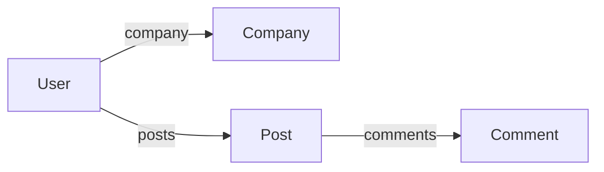

# How to Use MongoDB with Node.js (Mongoose)

Author: [nawazdhandala](https://www.github.com/nawazdhandala)

Tags: MongoDB, Node.js, Mongoose, ODM, Backend Development, JavaScript, TypeScript

Description: A comprehensive guide to building Node.js applications with MongoDB using Mongoose ODM, covering schemas, models, queries, middleware, population, and production best practices.

---

Mongoose is the most popular Object Document Mapper (ODM) for MongoDB and Node.js. It provides schema validation, middleware, type casting, and query building - making MongoDB development more structured and maintainable. This guide covers everything you need to build robust applications with Mongoose.

## Installation and Setup

```bash
# Install Mongoose
npm install mongoose

# For TypeScript support
npm install mongoose @types/mongoose
```

## Basic Connection

```javascript
const mongoose = require('mongoose');

// Simple connection
mongoose.connect('mongodb://localhost:27017/mydb')
  .then(() => console.log('Connected to MongoDB'))
  .catch(err => console.error('Connection error:', err));

// Connection with options (recommended)
mongoose.connect('mongodb://localhost:27017/mydb', {
  maxPoolSize: 50,
  minPoolSize: 10,
  socketTimeoutMS: 45000,
  serverSelectionTimeoutMS: 5000,
  heartbeatFrequencyMS: 10000,
  retryWrites: true,
  w: 'majority'
});

// Connection events
mongoose.connection.on('connected', () => console.log('Mongoose connected'));
mongoose.connection.on('error', (err) => console.error('Mongoose error:', err));
mongoose.connection.on('disconnected', () => console.log('Mongoose disconnected'));

// Graceful shutdown
process.on('SIGINT', async () => {
  await mongoose.connection.close();
  process.exit(0);
});
```

## Defining Schemas

```javascript
const mongoose = require('mongoose');
const { Schema } = mongoose;

const userSchema = new Schema({
  // Basic types
  name: {
    type: String,
    required: [true, 'Name is required'],
    trim: true,
    minlength: [2, 'Name must be at least 2 characters'],
    maxlength: [100, 'Name cannot exceed 100 characters']
  },
  email: {
    type: String,
    required: true,
    unique: true,
    lowercase: true,
    match: [/^\S+@\S+\.\S+$/, 'Please enter a valid email']
  },
  age: {
    type: Number,
    min: [0, 'Age cannot be negative'],
    max: [150, 'Age cannot exceed 150']
  },

  // Enum type
  role: {
    type: String,
    enum: ['user', 'admin', 'moderator'],
    default: 'user'
  },

  // Nested object
  profile: {
    bio: String,
    avatar: String,
    website: String
  },

  // Array of strings
  tags: [String],

  // Array of objects
  addresses: [{
    street: String,
    city: String,
    country: { type: String, default: 'USA' },
    isPrimary: { type: Boolean, default: false }
  }],

  // Reference to another model
  company: {
    type: Schema.Types.ObjectId,
    ref: 'Company'
  },

  // Timestamps
  isActive: { type: Boolean, default: true },
  lastLogin: Date
}, {
  timestamps: true,  // Adds createdAt and updatedAt
  toJSON: { virtuals: true },
  toObject: { virtuals: true }
});

// Create model
const User = mongoose.model('User', userSchema);
```

## Schema Features

### Virtual Properties

```javascript
// Virtual for full name
userSchema.virtual('fullName').get(function() {
  return `${this.firstName} ${this.lastName}`;
});

// Virtual for age from birthdate
userSchema.virtual('calculatedAge').get(function() {
  if (!this.birthDate) return null;
  const today = new Date();
  const age = today.getFullYear() - this.birthDate.getFullYear();
  return age;
});

// Virtual populate
userSchema.virtual('posts', {
  ref: 'Post',
  localField: '_id',
  foreignField: 'author'
});
```

### Instance Methods

```javascript
userSchema.methods.comparePassword = async function(candidatePassword) {
  const bcrypt = require('bcrypt');
  return bcrypt.compare(candidatePassword, this.password);
};

userSchema.methods.generateAuthToken = function() {
  const jwt = require('jsonwebtoken');
  return jwt.sign(
    { id: this._id, email: this.email },
    process.env.JWT_SECRET,
    { expiresIn: '24h' }
  );
};

// Usage
const user = await User.findOne({ email: 'test@example.com' });
const isMatch = await user.comparePassword('password123');
const token = user.generateAuthToken();
```

### Static Methods

```javascript
userSchema.statics.findByEmail = function(email) {
  return this.findOne({ email: email.toLowerCase() });
};

userSchema.statics.findActiveUsers = function() {
  return this.find({ isActive: true });
};

// Usage
const user = await User.findByEmail('test@example.com');
const activeUsers = await User.findActiveUsers();
```

### Middleware (Hooks)

```javascript
// Pre-save middleware
userSchema.pre('save', async function(next) {
  // Only hash password if modified
  if (!this.isModified('password')) return next();

  const bcrypt = require('bcrypt');
  this.password = await bcrypt.hash(this.password, 12);
  next();
});

// Post-save middleware
userSchema.post('save', function(doc) {
  console.log(`User ${doc.email} has been saved`);
});

// Pre-find middleware
userSchema.pre(/^find/, function(next) {
  // Only return active users by default
  this.find({ isActive: { $ne: false } });
  next();
});

// Pre-remove middleware
userSchema.pre('remove', async function(next) {
  // Clean up related documents
  await mongoose.model('Post').deleteMany({ author: this._id });
  next();
});
```

## CRUD Operations

### Create

```javascript
// Create single document
const user = new User({
  name: 'John Doe',
  email: 'john@example.com',
  age: 30
});
await user.save();

// Or use create method
const user = await User.create({
  name: 'Jane Doe',
  email: 'jane@example.com',
  age: 25
});

// Create multiple documents
const users = await User.insertMany([
  { name: 'User 1', email: 'user1@example.com' },
  { name: 'User 2', email: 'user2@example.com' }
]);
```

### Read

```javascript
// Find all
const users = await User.find();

// Find with conditions
const users = await User.find({ age: { $gte: 25 } });

// Find one
const user = await User.findOne({ email: 'john@example.com' });

// Find by ID
const user = await User.findById('507f1f77bcf86cd799439011');

// Select specific fields
const users = await User.find().select('name email -_id');

// Sort
const users = await User.find().sort({ createdAt: -1 });

// Limit and skip (pagination)
const users = await User.find()
  .skip(10)
  .limit(10)
  .sort({ name: 1 });

// Lean queries (return plain objects, faster)
const users = await User.find().lean();
```

### Update

```javascript
// Update one
const result = await User.updateOne(
  { email: 'john@example.com' },
  { $set: { age: 31 } }
);

// Update many
const result = await User.updateMany(
  { isActive: false },
  { $set: { status: 'inactive' } }
);

// Find and update (returns the document)
const user = await User.findOneAndUpdate(
  { email: 'john@example.com' },
  { $set: { age: 31 } },
  { new: true, runValidators: true }
);

// Find by ID and update
const user = await User.findByIdAndUpdate(
  '507f1f77bcf86cd799439011',
  { $inc: { loginCount: 1 } },
  { new: true }
);
```

### Delete

```javascript
// Delete one
const result = await User.deleteOne({ email: 'john@example.com' });

// Delete many
const result = await User.deleteMany({ isActive: false });

// Find and delete
const user = await User.findOneAndDelete({ email: 'john@example.com' });

// Find by ID and delete
const user = await User.findByIdAndDelete('507f1f77bcf86cd799439011');
```

## Query Building

```javascript
// Chainable query
const users = await User
  .find({ isActive: true })
  .where('age').gte(18).lte(65)
  .where('role').in(['user', 'admin'])
  .select('name email age')
  .sort('-createdAt')
  .limit(20)
  .exec();

// Complex query with or
const users = await User.find({
  $or: [
    { age: { $lt: 25 } },
    { role: 'admin' }
  ],
  isActive: true
});

// Text search
await User.createIndexes({ name: 'text', bio: 'text' });
const users = await User.find({ $text: { $search: 'developer' } });

// Regex search
const users = await User.find({
  name: { $regex: /john/i }
});
```

## Population (Joins)



```javascript
// Define schemas with references
const postSchema = new Schema({
  title: String,
  content: String,
  author: { type: Schema.Types.ObjectId, ref: 'User' },
  comments: [{ type: Schema.Types.ObjectId, ref: 'Comment' }]
});

// Basic population
const posts = await Post.find()
  .populate('author');

// Select specific fields in population
const posts = await Post.find()
  .populate('author', 'name email');

// Multiple populations
const posts = await Post.find()
  .populate('author', 'name')
  .populate('comments');

// Nested population
const posts = await Post.find()
  .populate({
    path: 'comments',
    populate: {
      path: 'author',
      select: 'name'
    }
  });

// Conditional population
const posts = await Post.find()
  .populate({
    path: 'author',
    match: { isActive: true },
    select: 'name email'
  });
```

## Aggregation

```javascript
// Basic aggregation
const stats = await User.aggregate([
  { $match: { isActive: true } },
  { $group: {
    _id: '$role',
    count: { $sum: 1 },
    avgAge: { $avg: '$age' }
  }},
  { $sort: { count: -1 } }
]);

// Aggregation with lookup (join)
const userOrders = await User.aggregate([
  { $match: { _id: mongoose.Types.ObjectId(userId) } },
  { $lookup: {
    from: 'orders',
    localField: '_id',
    foreignField: 'user',
    as: 'orders'
  }},
  { $addFields: {
    totalOrders: { $size: '$orders' },
    totalSpent: { $sum: '$orders.amount' }
  }},
  { $project: {
    name: 1,
    email: 1,
    totalOrders: 1,
    totalSpent: 1
  }}
]);
```

## TypeScript Integration

```typescript
import mongoose, { Schema, Document, Model } from 'mongoose';

// Interface for document
interface IUser extends Document {
  name: string;
  email: string;
  age?: number;
  role: 'user' | 'admin' | 'moderator';
  createdAt: Date;
  updatedAt: Date;
  comparePassword(candidatePassword: string): Promise<boolean>;
}

// Interface for model with statics
interface IUserModel extends Model<IUser> {
  findByEmail(email: string): Promise<IUser | null>;
}

const userSchema = new Schema<IUser>({
  name: { type: String, required: true },
  email: { type: String, required: true, unique: true },
  age: { type: Number },
  role: { type: String, enum: ['user', 'admin', 'moderator'], default: 'user' }
}, { timestamps: true });

userSchema.methods.comparePassword = async function(candidatePassword: string): Promise<boolean> {
  // Implementation
  return true;
};

userSchema.statics.findByEmail = function(email: string): Promise<IUser | null> {
  return this.findOne({ email: email.toLowerCase() });
};

const User = mongoose.model<IUser, IUserModel>('User', userSchema);

// Usage with full type support
const user = await User.findByEmail('test@example.com');
if (user) {
  console.log(user.name);  // TypeScript knows this exists
}
```

## Error Handling

```javascript
const createUser = async (userData) => {
  try {
    const user = await User.create(userData);
    return user;
  } catch (error) {
    if (error.code === 11000) {
      // Duplicate key error
      throw new Error('Email already exists');
    }
    if (error.name === 'ValidationError') {
      // Mongoose validation error
      const messages = Object.values(error.errors).map(e => e.message);
      throw new Error(messages.join(', '));
    }
    if (error.name === 'CastError') {
      // Invalid ObjectId
      throw new Error('Invalid ID format');
    }
    throw error;
  }
};
```

## Indexing

```javascript
// In schema definition
const userSchema = new Schema({
  email: { type: String, index: true, unique: true },
  name: { type: String, index: true }
});

// Compound index
userSchema.index({ firstName: 1, lastName: 1 });

// Text index
userSchema.index({ name: 'text', bio: 'text' });

// TTL index
userSchema.index({ createdAt: 1 }, { expireAfterSeconds: 3600 });

// Ensure indexes are created
await User.ensureIndexes();
```

## Production Best Practices

```javascript
// Connection management
const connectDB = async () => {
  const conn = await mongoose.connect(process.env.MONGO_URI, {
    maxPoolSize: 100,
    minPoolSize: 10,
    socketTimeoutMS: 45000,
    serverSelectionTimeoutMS: 5000
  });

  console.log(`MongoDB Connected: ${conn.connection.host}`);
};

// Query optimization
const users = await User.find({ isActive: true })
  .select('name email')  // Only fetch needed fields
  .lean()                 // Return plain objects
  .limit(100);            // Always limit results

// Use transactions for multi-document operations
const session = await mongoose.startSession();
session.startTransaction();

try {
  await User.create([{ name: 'User 1' }], { session });
  await Account.create([{ balance: 100 }], { session });
  await session.commitTransaction();
} catch (error) {
  await session.abortTransaction();
  throw error;
} finally {
  session.endSession();
}
```

## Summary

Mongoose provides a powerful abstraction layer for MongoDB in Node.js applications. With schemas, validation, middleware, and population, it brings structure and maintainability to your database code. Follow the patterns in this guide - proper schema design, effective use of middleware, and production best practices - to build scalable and reliable applications with MongoDB and Mongoose.
