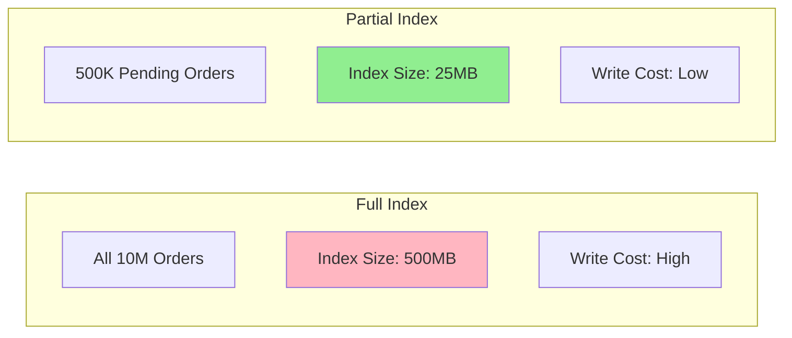

# How to Use MongoDB Partial Indexes

Author: [nawazdhandala](https://www.github.com/nawazdhandala)

Tags: MongoDB, Database, Indexes, Performance, Query Optimization

Description: Learn how to use MongoDB partial indexes to create smaller, more efficient indexes by only indexing documents that match a filter expression, reducing storage and improving write performance.

---

Partial indexes index only documents that match a specified filter expression. Instead of indexing every document in a collection, you index only the subset you actually query. This reduces index size, improves write performance, and can even enforce conditional unique constraints.

## Why Partial Indexes?

Consider a collection of orders where 95% are completed and only 5% are pending. If you frequently query pending orders, indexing all orders wastes resources:



## Creating Partial Indexes

### Basic Partial Index

```javascript
// Only index documents where status is "pending"
db.orders.createIndex(
  { createdAt: -1 },
  {
    partialFilterExpression: { status: "pending" }
  }
);

// This query uses the partial index
db.orders.find({ status: "pending" }).sort({ createdAt: -1 });

// This query CANNOT use the partial index (different status)
db.orders.find({ status: "completed" }).sort({ createdAt: -1 });
```

### Partial Index with Multiple Conditions

```javascript
// Index active users with verified email
db.users.createIndex(
  { lastLoginAt: -1 },
  {
    partialFilterExpression: {
      status: "active",
      emailVerified: true
    }
  }
);

// Uses the index
db.users.find({
  status: "active",
  emailVerified: true
}).sort({ lastLoginAt: -1 });

// Does NOT use the index (missing emailVerified condition)
db.users.find({
  status: "active"
}).sort({ lastLoginAt: -1 });
```

## Practical Use Cases

### 1. Active Records Only

Index only non-deleted documents:

```javascript
// Soft delete pattern - don't index deleted documents
db.products.createIndex(
  { category: 1, name: 1 },
  {
    partialFilterExpression: { deletedAt: { $exists: false } }
  }
);

// Active product queries use the index
db.products.find({
  category: "electronics",
  deletedAt: { $exists: false }
}).sort({ name: 1 });

// Soft delete a product (removed from index automatically)
db.products.updateOne(
  { _id: productId },
  { $set: { deletedAt: new Date() } }
);
```

### 2. Conditional Unique Constraints

Create unique constraints that only apply to certain documents:

```javascript
// Unique email only for active users
// Deleted users can have duplicate emails
db.users.createIndex(
  { email: 1 },
  {
    unique: true,
    partialFilterExpression: { status: "active" }
  }
);

// This works - active users must have unique emails
db.users.insertOne({ email: "user@example.com", status: "active" });

// This fails - duplicate email for active user
db.users.insertOne({ email: "user@example.com", status: "active" });
// Error: duplicate key

// This works - inactive/deleted users can reuse emails
db.users.updateOne(
  { email: "user@example.com" },
  { $set: { status: "deleted" } }
);
db.users.insertOne({ email: "user@example.com", status: "active" });
```

### 3. Pending Tasks Queue

Only index unprocessed items:

```javascript
// Index only pending tasks
db.taskQueue.createIndex(
  { priority: -1, createdAt: 1 },
  {
    partialFilterExpression: { status: "pending" }
  }
);

// Worker fetches next task - uses index
async function getNextTask() {
  return await db.taskQueue.findOneAndUpdate(
    { status: "pending" },
    { $set: { status: "processing", startedAt: new Date() } },
    {
      sort: { priority: -1, createdAt: 1 },
      returnDocument: 'after'
    }
  );
}

// Completed tasks are removed from the index
async function completeTask(taskId, result) {
  await db.taskQueue.updateOne(
    { _id: taskId },
    {
      $set: {
        status: "completed",
        result: result,
        completedAt: new Date()
      }
    }
  );
}
```

### 4. Feature Flags

Index only documents with specific features enabled:

```javascript
// Index users with beta features enabled
db.users.createIndex(
  { region: 1, signupDate: -1 },
  {
    partialFilterExpression: { "features.beta": true }
  }
);

// Query beta users by region
db.users.find({
  "features.beta": true,
  region: "us-west"
}).sort({ signupDate: -1 });
```

### 5. High-Value Items

Index only items above a threshold:

```javascript
// Index only high-value transactions
db.transactions.createIndex(
  { accountId: 1, date: -1 },
  {
    partialFilterExpression: { amount: { $gte: 10000 } }
  }
);

// Fraud detection on high-value transactions
db.transactions.find({
  amount: { $gte: 10000 },
  accountId: "acc123"
}).sort({ date: -1 });
```

## Filter Expression Operators

Partial indexes support these operators in filter expressions:

```javascript
// Equality
{ status: "active" }

// $exists
{ deletedAt: { $exists: false } }

// Comparison operators
{ amount: { $gt: 100 } }
{ score: { $gte: 0, $lte: 100 } }

// $type
{ field: { $type: "string" } }

// $and (implicit and explicit)
{
  $and: [
    { status: "active" },
    { type: { $in: ["premium", "enterprise"] } }
  ]
}

// $or
{
  $or: [
    { priority: "high" },
    { createdAt: { $gte: new Date("2025-01-01") } }
  ]
}
```

## Query Requirements

For MongoDB to use a partial index, your query must:

1. Include the filter expression conditions (or a subset that implies them)
2. Match the indexed fields

```javascript
// Index definition
db.orders.createIndex(
  { customerId: 1, orderDate: -1 },
  {
    partialFilterExpression: {
      status: { $in: ["pending", "processing"] },
      amount: { $gte: 100 }
    }
  }
);

// Uses index - query matches filter expression
db.orders.find({
  status: "pending",
  amount: { $gte: 100 },
  customerId: "cust123"
});

// Uses index - more restrictive than filter
db.orders.find({
  status: "pending",
  amount: { $gte: 500 },  // More restrictive
  customerId: "cust123"
});

// Does NOT use index - status doesn't match filter
db.orders.find({
  status: "completed",  // Not in ["pending", "processing"]
  amount: { $gte: 100 },
  customerId: "cust123"
});

// Does NOT use index - amount doesn't match filter
db.orders.find({
  status: "pending",
  amount: { $gte: 50 },  // Less restrictive than filter
  customerId: "cust123"
});
```

## Comparing Partial vs Sparse Indexes

Sparse indexes only include documents where the indexed field exists. Partial indexes are more flexible:

```javascript
// Sparse index - only includes docs where "email" exists
db.users.createIndex({ email: 1 }, { sparse: true });

// Partial index - equivalent to sparse
db.users.createIndex(
  { email: 1 },
  { partialFilterExpression: { email: { $exists: true } } }
);

// Partial index - more specific
db.users.createIndex(
  { email: 1 },
  {
    partialFilterExpression: {
      email: { $exists: true },
      emailVerified: true,
      status: "active"
    }
  }
);
```

## Measuring Index Size Reduction

```javascript
// Check index sizes
db.orders.stats().indexSizes

// Compare full vs partial index
// Full index on status + date
db.orders.createIndex({ status: 1, createdAt: -1 }, { name: "full_idx" });

// Partial index for pending only
db.orders.createIndex(
  { status: 1, createdAt: -1 },
  {
    partialFilterExpression: { status: "pending" },
    name: "partial_idx"
  }
);

// Check sizes
const stats = db.orders.stats();
console.log("Full index:", stats.indexSizes.full_idx);
console.log("Partial index:", stats.indexSizes.partial_idx);
// Partial index will be significantly smaller
```

## Combining with Other Index Features

### Partial + TTL

```javascript
// TTL index only for temporary sessions
db.sessions.createIndex(
  { createdAt: 1 },
  {
    expireAfterSeconds: 3600,
    partialFilterExpression: { type: "temporary" }
  }
);

// Permanent sessions won't be affected by TTL
db.sessions.insertOne({
  userId: "user123",
  type: "permanent",
  createdAt: new Date()
});

// Temporary sessions expire after 1 hour
db.sessions.insertOne({
  userId: "user456",
  type: "temporary",
  createdAt: new Date()
});
```

### Partial + Compound

```javascript
// Compound partial index
db.events.createIndex(
  { eventType: 1, timestamp: -1, userId: 1 },
  {
    partialFilterExpression: {
      eventType: { $in: ["error", "warning"] },
      timestamp: { $gte: new Date("2025-01-01") }
    }
  }
);
```

## Best Practices

1. **Analyze query patterns** - Only create partial indexes for frequently filtered subsets

2. **Include filter conditions in queries** - MongoDB must see the filter expression in your query

3. **Monitor index usage** - Verify queries actually use the partial index

4. **Document filter expressions** - Make it clear why certain documents are indexed

5. **Consider write patterns** - Partial indexes reduce write overhead for non-matching documents

```javascript
// Verify index usage
const explain = db.orders.find({
  status: "pending",
  customerId: "cust123"
}).explain("executionStats");

console.log("Index used:", explain.queryPlanner.winningPlan.inputStage.indexName);
console.log("Documents examined:", explain.executionStats.totalDocsExamined);
```

## Summary

Partial indexes are powerful for optimizing specific query patterns:

1. **Reduce index size** - Only index documents you actually query
2. **Improve write performance** - Fewer documents to update in the index
3. **Enable conditional constraints** - Unique indexes that apply only to certain documents
4. **Optimize hot paths** - Index active/pending/recent data only

When you find yourself querying a specific subset of documents repeatedly, a partial index can provide significant performance benefits while reducing storage overhead.
