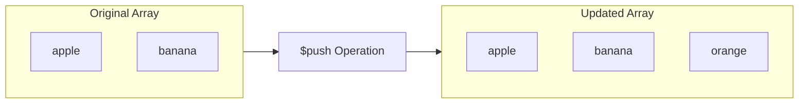
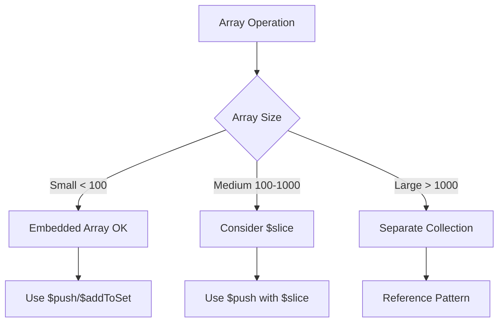

# How to Push Items to Arrays in MongoDB

Author: [nawazdhandala](https://www.github.com/nawazdhandala)

Tags: MongoDB, Database, Arrays, CRUD Operations, Node.js

Description: Master MongoDB array operations with $push, $addToSet, and related operators. Learn how to add single items, multiple items, maintain array order, and prevent duplicates.

---

MongoDB's document model excels at storing arrays within documents. Whether you are tracking user activities, managing shopping carts, or storing tags, knowing how to efficiently push items to arrays is essential. This guide covers all the array push operations you need to know.

## Basic $push Operation

The `$push` operator appends a value to an array field. If the field does not exist, it creates the array with the value as its element.

```javascript
// Sample document
{
  _id: ObjectId("..."),
  name: "John's Shopping Cart",
  items: ["apple", "banana"]
}

// Push a single item
db.carts.updateOne(
  { _id: ObjectId("...") },
  { $push: { items: "orange" } }
);

// Result: items = ["apple", "banana", "orange"]
```



## Pushing Multiple Items with $each

To push multiple items at once, use the `$each` modifier with `$push`.

```javascript
// Push multiple items at once
db.carts.updateOne(
  { _id: ObjectId("...") },
  {
    $push: {
      items: {
        $each: ["grape", "mango", "kiwi"]
      }
    }
  }
);

// Result: items = ["apple", "banana", "orange", "grape", "mango", "kiwi"]
```

## Controlling Array Size with $slice

Use `$slice` to limit the array size after pushing. This is useful for maintaining fixed-size arrays like recent activity logs.

```javascript
// Keep only the last 5 items
db.users.updateOne(
  { _id: userId },
  {
    $push: {
      recentSearches: {
        $each: ["mongodb arrays"],
        $slice: -5  // Keep last 5 elements
      }
    }
  }
);

// Using positive $slice keeps first N elements
db.users.updateOne(
  { _id: userId },
  {
    $push: {
      recentSearches: {
        $each: ["new search"],
        $slice: 5  // Keep first 5 elements
      }
    }
  }
);
```

## Maintaining Sorted Arrays with $sort

The `$sort` modifier orders array elements after pushing. Combined with `$slice`, you can maintain sorted, bounded arrays.

```javascript
// Document structure
{
  _id: ObjectId("..."),
  name: "Leaderboard",
  scores: [
    { player: "Alice", score: 850 },
    { player: "Bob", score: 720 }
  ]
}

// Add new score and keep top 10, sorted by score descending
db.leaderboards.updateOne(
  { name: "Leaderboard" },
  {
    $push: {
      scores: {
        $each: [{ player: "Charlie", score: 900 }],
        $sort: { score: -1 },  // Sort descending
        $slice: 10             // Keep top 10
      }
    }
  }
);
```

## Controlling Position with $position

By default, `$push` appends to the end. Use `$position` to insert at a specific index.

```javascript
// Insert at the beginning (index 0)
db.playlists.updateOne(
  { _id: playlistId },
  {
    $push: {
      songs: {
        $each: ["New Song"],
        $position: 0
      }
    }
  }
);

// Insert at position 2
db.playlists.updateOne(
  { _id: playlistId },
  {
    $push: {
      songs: {
        $each: ["Another Song"],
        $position: 2
      }
    }
  }
);
```

## Preventing Duplicates with $addToSet

When you want to add items only if they do not already exist, use `$addToSet` instead of `$push`.

```javascript
// Add tag only if it does not exist
db.posts.updateOne(
  { _id: postId },
  { $addToSet: { tags: "mongodb" } }
);

// If tags = ["javascript", "nodejs"]
// Result: tags = ["javascript", "nodejs", "mongodb"]

// Running again has no effect - "mongodb" already exists
db.posts.updateOne(
  { _id: postId },
  { $addToSet: { tags: "mongodb" } }
);
// Result: tags = ["javascript", "nodejs", "mongodb"] (unchanged)
```

### Using $addToSet with $each

```javascript
// Add multiple unique items
db.posts.updateOne(
  { _id: postId },
  {
    $addToSet: {
      tags: { $each: ["mongodb", "database", "nosql"] }
    }
  }
);
```

## Pushing to Nested Arrays

For documents with nested structures, use dot notation to target the correct array.

```javascript
// Document with nested array
{
  _id: ObjectId("..."),
  name: "Project Alpha",
  teams: [
    {
      name: "Backend",
      members: ["Alice", "Bob"]
    },
    {
      name: "Frontend",
      members: ["Charlie"]
    }
  ]
}

// Push to a specific nested array using positional operator
db.projects.updateOne(
  { _id: projectId, "teams.name": "Backend" },
  { $push: { "teams.$.members": "David" } }
);

// Result: Backend team members = ["Alice", "Bob", "David"]
```

### Pushing to All Matching Nested Arrays

Use `$[]` to push to all arrays in an array of objects.

```javascript
// Add "notification" to all teams' features
db.projects.updateOne(
  { _id: projectId },
  { $push: { "teams.$[].features": "notifications" } }
);
```

### Filtered Positional Operator

Use `$[<identifier>]` with `arrayFilters` for precise targeting.

```javascript
// Add member only to teams with more than 2 members
db.projects.updateOne(
  { _id: projectId },
  { $push: { "teams.$[team].members": "Eve" } },
  {
    arrayFilters: [{ "team.members.2": { $exists: true } }]
  }
);
```

## Practical Examples

### Example 1: Activity Feed with Size Limit

```javascript
// Add activity and keep last 100 entries
async function logActivity(userId, activity) {
  await db.collection('users').updateOne(
    { _id: userId },
    {
      $push: {
        activityFeed: {
          $each: [{
            action: activity,
            timestamp: new Date()
          }],
          $sort: { timestamp: -1 },
          $slice: 100
        }
      }
    }
  );
}
```

### Example 2: Shopping Cart Management

```javascript
// Add item to cart, update quantity if exists
async function addToCart(userId, product) {
  // First, try to increment if product exists
  const result = await db.collection('carts').updateOne(
    { userId: userId, "items.productId": product.productId },
    { $inc: { "items.$.quantity": product.quantity } }
  );

  // If product not in cart, push new item
  if (result.matchedCount === 0) {
    await db.collection('carts').updateOne(
      { userId: userId },
      {
        $push: {
          items: {
            productId: product.productId,
            name: product.name,
            price: product.price,
            quantity: product.quantity,
            addedAt: new Date()
          }
        }
      },
      { upsert: true }
    );
  }
}
```

### Example 3: Tag System with Normalization

```javascript
// Add tags with normalization and duplicate prevention
async function addTags(postId, newTags) {
  // Normalize tags to lowercase
  const normalizedTags = newTags.map(tag => tag.toLowerCase().trim());

  await db.collection('posts').updateOne(
    { _id: postId },
    {
      $addToSet: {
        tags: { $each: normalizedTags }
      }
    }
  );
}
```

### Example 4: Comment Thread

```javascript
// Add comment to a post
async function addComment(postId, comment) {
  const commentDoc = {
    _id: new ObjectId(),
    author: comment.author,
    text: comment.text,
    createdAt: new Date(),
    replies: []
  };

  await db.collection('posts').updateOne(
    { _id: postId },
    { $push: { comments: commentDoc } }
  );

  return commentDoc._id;
}

// Add reply to a comment
async function addReply(postId, commentId, reply) {
  await db.collection('posts').updateOne(
    { _id: postId, "comments._id": commentId },
    {
      $push: {
        "comments.$.replies": {
          _id: new ObjectId(),
          author: reply.author,
          text: reply.text,
          createdAt: new Date()
        }
      }
    }
  );
}
```

## Performance Considerations



### Best Practices

1. **Limit array size** - Use `$slice` to prevent unbounded growth
2. **Index wisely** - Multikey indexes on array fields can be expensive
3. **Avoid large arrays** - Arrays over 1000 elements should be reconsidered
4. **Use $addToSet carefully** - It compares entire documents for objects

```javascript
// Good: Bounded array with index
db.users.createIndex({ "recentOrders.orderId": 1 });

// Update with size limit
db.users.updateOne(
  { _id: userId },
  {
    $push: {
      recentOrders: {
        $each: [{ orderId: "ORD123", total: 99.99 }],
        $slice: -50  // Keep last 50 orders
      }
    }
  }
);
```

## Common Pitfalls

### Pitfall 1: Pushing to Non-Existent Field

```javascript
// This creates the array automatically - usually desired behavior
db.users.updateOne(
  { _id: userId },
  { $push: { notifications: "Welcome!" } }
);
// Creates: notifications: ["Welcome!"]
```

### Pitfall 2: Type Mismatch

```javascript
// If 'items' is not an array, $push will fail
// Ensure field is array type in schema validation
{
  $jsonSchema: {
    properties: {
      items: { bsonType: "array" }
    }
  }
}
```

### Pitfall 3: $addToSet with Objects

```javascript
// $addToSet compares entire objects
db.carts.updateOne(
  { _id: cartId },
  { $addToSet: { items: { product: "A", qty: 1 } } }
);

// This adds a NEW item because objects are different
db.carts.updateOne(
  { _id: cartId },
  { $addToSet: { items: { product: "A", qty: 2 } } }
);
// Result: items contains BOTH objects
```

---

MongoDB provides powerful operators for array manipulation. Use `$push` for straightforward additions, `$addToSet` for unique values, and combine with `$each`, `$slice`, `$sort`, and `$position` for advanced scenarios. Keep arrays bounded and consider separate collections for very large arrays to maintain optimal performance.
