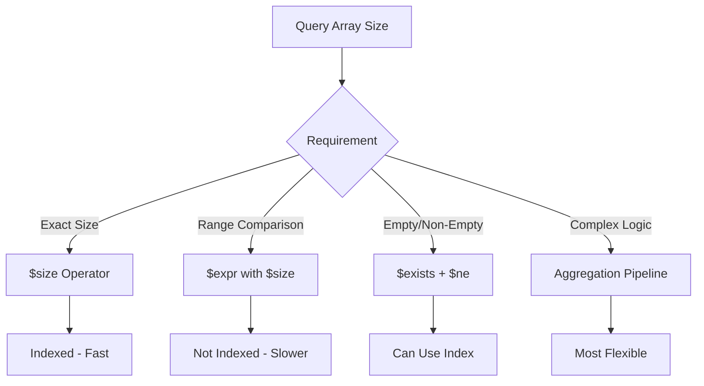
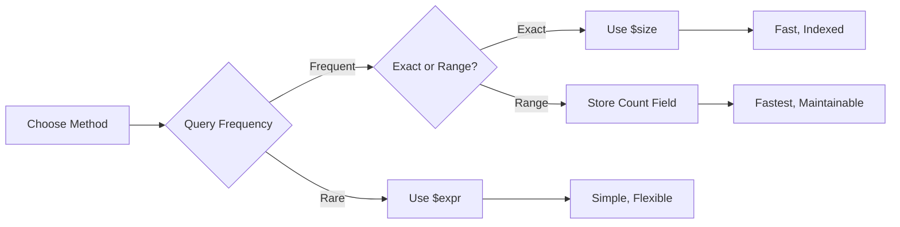

# How to Query by Array Size in MongoDB

Author: [nawazdhandala](https://www.github.com/nawazdhandala)

Tags: MongoDB, Database, Arrays, Queries, Performance

Description: Learn multiple techniques to query documents by array size in MongoDB, including $size, $expr with $size, dot notation, and aggregation approaches with performance considerations.

---

Querying documents based on array size is a common requirement in MongoDB. Whether you need to find users with exactly 3 tags, orders with more than 5 items, or products with no reviews, MongoDB provides several approaches. This guide covers all the methods with their trade-offs.

## Using the $size Operator

The `$size` operator matches arrays with exactly the specified number of elements.

```javascript
// Find documents where tags array has exactly 3 elements
db.posts.find({ tags: { $size: 3 } });

// Sample matching document
{
  _id: ObjectId("..."),
  title: "MongoDB Arrays",
  tags: ["mongodb", "database", "tutorial"]  // Exactly 3 elements
}
```

### Limitations of $size

The `$size` operator only supports exact matches. You cannot use comparison operators with it.

```javascript
// This does NOT work - will throw an error
db.posts.find({ tags: { $size: { $gt: 3 } } });  // Invalid!

// This also does NOT work
db.posts.find({ tags: { $size: { $gte: 1 } } });  // Invalid!
```



## Using $expr with $size for Comparisons

To query arrays larger or smaller than a certain size, use `$expr` with the `$size` aggregation operator.

```javascript
// Find posts with more than 5 tags
db.posts.find({
  $expr: { $gt: [{ $size: "$tags" }, 5] }
});

// Find posts with at least 3 tags
db.posts.find({
  $expr: { $gte: [{ $size: "$tags" }, 3] }
});

// Find posts with fewer than 2 tags
db.posts.find({
  $expr: { $lt: [{ $size: "$tags" }, 2] }
});

// Find posts with between 2 and 5 tags (inclusive)
db.posts.find({
  $expr: {
    $and: [
      { $gte: [{ $size: "$tags" }, 2] },
      { $lte: [{ $size: "$tags" }, 5] }
    ]
  }
});
```

## Using Dot Notation for Size Queries

A clever technique uses dot notation with array indexes to check if certain positions exist.

```javascript
// Find documents where array has at least 3 elements
// (index 2 exists, meaning positions 0, 1, 2 all exist)
db.posts.find({ "tags.2": { $exists: true } });

// Find documents where array has at least 1 element
db.posts.find({ "tags.0": { $exists: true } });

// Find documents with exactly 3 elements
// (index 2 exists but index 3 does not)
db.posts.find({
  "tags.2": { $exists: true },
  "tags.3": { $exists: false }
});
```

This approach can use indexes and is often faster than `$expr`.

```javascript
// Create an index that can help with this query
db.posts.createIndex({ "tags.2": 1 });
```

## Querying Empty and Non-Empty Arrays

### Finding Documents with Empty Arrays

```javascript
// Method 1: Using $size
db.posts.find({ tags: { $size: 0 } });

// Method 2: Using $eq with empty array
db.posts.find({ tags: { $eq: [] } });

// Method 3: Find where tags is empty array OR does not exist
db.posts.find({
  $or: [
    { tags: { $exists: false } },
    { tags: { $size: 0 } }
  ]
});
```

### Finding Documents with Non-Empty Arrays

```javascript
// Method 1: Check if first element exists
db.posts.find({ "tags.0": { $exists: true } });

// Method 2: Using $ne with empty array
db.posts.find({
  tags: { $exists: true, $ne: [] }
});

// Method 3: Using $expr
db.posts.find({
  $expr: { $gt: [{ $size: "$tags" }, 0] }
});
```

## Aggregation Pipeline Approach

For complex size-based queries, use the aggregation pipeline with `$match` and `$addFields`.

```javascript
// Add array size as a field, then filter
db.posts.aggregate([
  {
    $addFields: {
      tagCount: { $size: "$tags" }
    }
  },
  {
    $match: {
      tagCount: { $gte: 3, $lte: 10 }
    }
  },
  {
    $project: {
      tagCount: 0  // Remove the computed field from output
    }
  }
]);
```

### Grouping by Array Size

```javascript
// Count documents by array size
db.posts.aggregate([
  {
    $group: {
      _id: { $size: "$tags" },
      count: { $sum: 1 }
    }
  },
  {
    $sort: { _id: 1 }
  }
]);

// Output:
// { _id: 0, count: 15 }   // 15 posts with 0 tags
// { _id: 1, count: 42 }   // 42 posts with 1 tag
// { _id: 2, count: 87 }   // 87 posts with 2 tags
// ...
```

## Performance Optimization

### Creating a Computed Size Field

For frequently queried array sizes, store the count as a separate field.

```javascript
// Schema with computed size field
{
  _id: ObjectId("..."),
  title: "MongoDB Guide",
  tags: ["mongodb", "database", "tutorial"],
  tagCount: 3  // Denormalized count
}

// Create index on the count field
db.posts.createIndex({ tagCount: 1 });

// Fast queries on array size
db.posts.find({ tagCount: { $gt: 5 } });  // Uses index!
db.posts.find({ tagCount: { $gte: 3, $lte: 10 } });  // Uses index!
```

### Keeping the Count Field Updated

```javascript
// When pushing to array, increment count
db.posts.updateOne(
  { _id: postId },
  {
    $push: { tags: "newTag" },
    $inc: { tagCount: 1 }
  }
);

// When pulling from array, decrement count
db.posts.updateOne(
  { _id: postId },
  {
    $pull: { tags: "oldTag" },
    $inc: { tagCount: -1 }
  }
);

// When setting array, recalculate count
const newTags = ["a", "b", "c"];
db.posts.updateOne(
  { _id: postId },
  {
    $set: {
      tags: newTags,
      tagCount: newTags.length
    }
  }
);
```

### Using a Wrapper Function

```javascript
// Node.js helper to maintain array count
async function pushToArrayWithCount(collection, filter, arrayField, value) {
  const countField = `${arrayField}Count`;

  return collection.updateOne(filter, {
    $push: { [arrayField]: value },
    $inc: { [countField]: 1 }
  });
}

async function pullFromArrayWithCount(collection, filter, arrayField, value) {
  const countField = `${arrayField}Count`;

  return collection.updateOne(filter, {
    $pull: { [arrayField]: value },
    $inc: { [countField]: -1 }
  });
}

// Usage
await pushToArrayWithCount(
  db.collection('posts'),
  { _id: postId },
  'tags',
  'mongodb'
);
```

## Handling Nested Arrays

For arrays within embedded documents, combine dot notation with size queries.

```javascript
// Document structure
{
  _id: ObjectId("..."),
  name: "Order #123",
  items: [
    { product: "Widget", variants: ["red", "blue"] },
    { product: "Gadget", variants: ["small", "medium", "large"] }
  ]
}

// Find orders where any item has more than 2 variants
db.orders.find({
  "items.variants.2": { $exists: true }
});

// Using aggregation to filter by nested array size
db.orders.aggregate([
  { $unwind: "$items" },
  {
    $match: {
      $expr: { $gt: [{ $size: "$items.variants" }, 2] }
    }
  },
  {
    $group: {
      _id: "$_id",
      name: { $first: "$name" },
      matchingItems: { $push: "$items" }
    }
  }
]);
```

## Practical Examples

### Example 1: Finding Users Needing Profile Completion

```javascript
// Find users with fewer than 3 interests selected
db.users.find({
  $expr: { $lt: [{ $size: "$interests" }, 3] }
});

// Or using dot notation (faster if indexed)
db.users.find({
  "interests.2": { $exists: false }
});
```

### Example 2: E-commerce Product Queries

```javascript
// Products with no reviews
db.products.find({ reviews: { $size: 0 } });

// Products with at least 10 reviews
db.products.find({ "reviews.9": { $exists: true } });

// Products with between 5 and 20 reviews (using stored count)
db.products.find({
  reviewCount: { $gte: 5, $lte: 20 }
});
```

### Example 3: Content Moderation

```javascript
// Find posts with too many tags (potential spam)
db.posts.find({
  $expr: { $gt: [{ $size: "$tags" }, 15] }
});

// Find posts with no category assigned
db.posts.find({
  $or: [
    { categories: { $exists: false } },
    { categories: { $size: 0 } }
  ]
});
```

### Example 4: Analytics Query

```javascript
// Distribution of comment counts on posts
db.posts.aggregate([
  {
    $bucket: {
      groupBy: { $size: "$comments" },
      boundaries: [0, 1, 5, 10, 50, 100],
      default: "100+",
      output: {
        count: { $sum: 1 },
        posts: { $push: "$title" }
      }
    }
  }
]);
```

## Query Performance Comparison

| Method | Index Support | Use Case |
|--------|---------------|----------|
| `$size: n` | Yes | Exact size match |
| `$expr: { $gt: [{$size}, n] }` | No | Range comparisons |
| `"array.n": { $exists }` | Yes | At least n+1 elements |
| Stored count field | Yes | Frequent range queries |
| Aggregation | No | Complex logic |



---

MongoDB offers multiple ways to query by array size. For exact matches, use `$size`. For range queries on frequently accessed data, maintain a denormalized count field with an index. For occasional complex queries, `$expr` with `$size` provides flexibility at the cost of index utilization. Choose the approach that balances your performance requirements with schema complexity.
