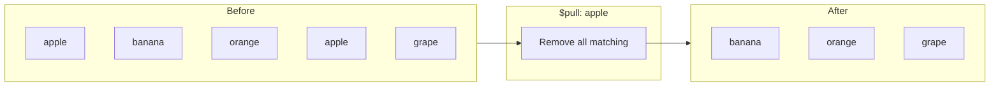
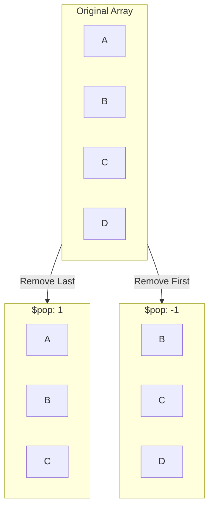
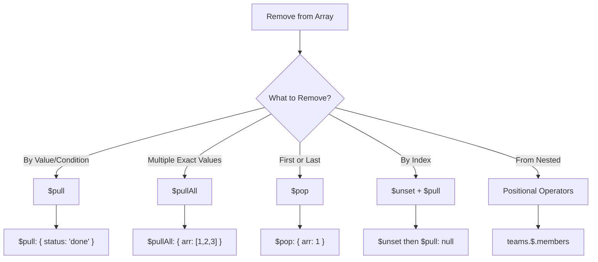

# How to Remove Elements from Arrays in MongoDB

Author: [nawazdhandala](https://www.github.com/nawazdhandala)

Tags: MongoDB, Database, Arrays, CRUD Operations, Node.js

Description: Master MongoDB array removal operations with $pull, $pop, $pullAll, and positional operators. Learn how to remove by value, condition, position, and from nested arrays.

---

Removing elements from arrays in MongoDB requires different operators depending on your use case. Whether you need to remove by value, by condition, by position, or from nested arrays, MongoDB provides the right tool. This guide covers all array removal operations with practical examples.

## Using $pull - Remove by Value or Condition

The `$pull` operator removes all array elements that match a specified condition.

```javascript
// Sample document
{
  _id: ObjectId("..."),
  name: "Shopping List",
  items: ["apple", "banana", "orange", "apple", "grape"]
}

// Remove all instances of "apple"
db.lists.updateOne(
  { _id: ObjectId("...") },
  { $pull: { items: "apple" } }
);

// Result: items = ["banana", "orange", "grape"]
```



### $pull with Conditions

Remove elements matching complex conditions.

```javascript
// Document with array of objects
{
  _id: ObjectId("..."),
  name: "Task Board",
  tasks: [
    { title: "Task 1", status: "done", priority: 1 },
    { title: "Task 2", status: "pending", priority: 2 },
    { title: "Task 3", status: "done", priority: 3 },
    { title: "Task 4", status: "pending", priority: 1 }
  ]
}

// Remove all completed tasks
db.boards.updateOne(
  { _id: ObjectId("...") },
  { $pull: { tasks: { status: "done" } } }
);

// Result: tasks with status "done" are removed

// Remove tasks with priority > 2
db.boards.updateOne(
  { _id: ObjectId("...") },
  { $pull: { tasks: { priority: { $gt: 2 } } } }
);

// Remove tasks matching multiple conditions
db.boards.updateOne(
  { _id: ObjectId("...") },
  {
    $pull: {
      tasks: {
        status: "pending",
        priority: { $lte: 1 }
      }
    }
  }
);
```

### $pull with $elemMatch for Complex Conditions

```javascript
// Remove items where quantity is 0 AND status is "backordered"
db.inventory.updateOne(
  { _id: inventoryId },
  {
    $pull: {
      items: {
        $and: [
          { quantity: 0 },
          { status: "backordered" }
        ]
      }
    }
  }
);
```

## Using $pullAll - Remove Multiple Specific Values

The `$pullAll` operator removes all occurrences of specified values.

```javascript
// Remove multiple specific values at once
db.lists.updateOne(
  { _id: ObjectId("...") },
  { $pullAll: { items: ["apple", "banana", "grape"] } }
);

// Before: items = ["apple", "banana", "orange", "apple", "grape", "kiwi"]
// After:  items = ["orange", "kiwi"]
```

### Difference Between $pull and $pullAll

```javascript
// $pullAll - exact value matching only
db.collection.updateOne(
  { _id: id },
  { $pullAll: { tags: ["mongodb", "database"] } }
);
// Removes exactly "mongodb" and "database"

// $pull - supports conditions
db.collection.updateOne(
  { _id: id },
  { $pull: { tags: { $in: ["mongodb", "database"] } } }
);
// Same result, but $pull is more flexible
```

## Using $pop - Remove First or Last Element

The `$pop` operator removes the first or last element of an array.

```javascript
// Remove the last element
db.queues.updateOne(
  { _id: queueId },
  { $pop: { items: 1 } }  // 1 = last element
);

// Remove the first element
db.queues.updateOne(
  { _id: queueId },
  { $pop: { items: -1 } }  // -1 = first element
);
```



### Implementing a Stack or Queue

```javascript
// Stack (LIFO) - push to end, pop from end
async function stackPush(stackId, item) {
  await db.collection('stacks').updateOne(
    { _id: stackId },
    { $push: { items: item } }
  );
}

async function stackPop(stackId) {
  const before = await db.collection('stacks').findOne({ _id: stackId });
  const poppedItem = before.items[before.items.length - 1];

  await db.collection('stacks').updateOne(
    { _id: stackId },
    { $pop: { items: 1 } }
  );

  return poppedItem;
}

// Queue (FIFO) - push to end, pop from beginning
async function queueEnqueue(queueId, item) {
  await db.collection('queues').updateOne(
    { _id: queueId },
    { $push: { items: item } }
  );
}

async function queueDequeue(queueId) {
  const before = await db.collection('queues').findOne({ _id: queueId });
  const dequeuedItem = before.items[0];

  await db.collection('queues').updateOne(
    { _id: queueId },
    { $pop: { items: -1 } }
  );

  return dequeuedItem;
}
```

## Using $unset with Positional Operator

Remove a specific element by index using `$unset` followed by `$pull`.

```javascript
// Two-step removal by index
// Step 1: Set element at index 2 to null
db.lists.updateOne(
  { _id: listId },
  { $unset: { "items.2": 1 } }
);

// Step 2: Remove the null value
db.lists.updateOne(
  { _id: listId },
  { $pull: { items: null } }
);
```

### Single Operation with Aggregation Pipeline Update

```javascript
// Remove element at index 2 using aggregation pipeline
db.lists.updateOne(
  { _id: listId },
  [
    {
      $set: {
        items: {
          $concatArrays: [
            { $slice: ["$items", 2] },           // Elements before index 2
            { $slice: ["$items", 3, 999] }       // Elements after index 2
          ]
        }
      }
    }
  ]
);
```

## Removing from Nested Arrays

### Using Positional $ Operator

```javascript
// Document structure
{
  _id: ObjectId("..."),
  name: "Project",
  teams: [
    { name: "Backend", members: ["Alice", "Bob", "Charlie"] },
    { name: "Frontend", members: ["David", "Eve"] }
  ]
}

// Remove "Bob" from a specific team
db.projects.updateOne(
  { _id: projectId, "teams.name": "Backend" },
  { $pull: { "teams.$.members": "Bob" } }
);

// Result: Backend team members = ["Alice", "Charlie"]
```

### Using $[] - All Positional Operator

```javascript
// Remove a member from ALL teams
db.projects.updateOne(
  { _id: projectId },
  { $pull: { "teams.$[].members": "Alice" } }
);
```

### Using $[identifier] - Filtered Positional Operator

```javascript
// Remove members only from teams with more than 2 members
db.projects.updateOne(
  { _id: projectId },
  { $pull: { "teams.$[team].members": "Charlie" } },
  { arrayFilters: [{ "team.members.2": { $exists: true } }] }
);

// Remove inactive users from specific team types
db.projects.updateOne(
  { _id: projectId },
  {
    $pull: {
      "teams.$[team].members": {
        $in: ["InactiveUser1", "InactiveUser2"]
      }
    }
  },
  { arrayFilters: [{ "team.name": { $in: ["Backend", "QA"] } }] }
);
```

## Practical Examples

### Example 1: Shopping Cart - Remove Item

```javascript
async function removeFromCart(userId, productId) {
  const result = await db.collection('carts').updateOne(
    { userId: userId },
    { $pull: { items: { productId: productId } } }
  );

  return result.modifiedCount > 0;
}

// Remove all items below a certain quantity
async function cleanupCart(userId) {
  await db.collection('carts').updateOne(
    { userId: userId },
    { $pull: { items: { quantity: { $lte: 0 } } } }
  );
}
```

### Example 2: Social Media - Unfollow

```javascript
async function unfollowUser(userId, targetUserId) {
  // Remove from following list
  await db.collection('users').updateOne(
    { _id: userId },
    { $pull: { following: targetUserId } }
  );

  // Remove from followers list
  await db.collection('users').updateOne(
    { _id: targetUserId },
    { $pull: { followers: userId } }
  );
}
```

### Example 3: Remove Expired Items

```javascript
// Remove expired notifications
async function cleanExpiredNotifications() {
  const now = new Date();

  await db.collection('users').updateMany(
    {},
    {
      $pull: {
        notifications: {
          expiresAt: { $lt: now }
        }
      }
    }
  );
}

// Remove old activity entries (keep last 100)
async function trimActivityLog(userId) {
  const user = await db.collection('users').findOne(
    { _id: userId },
    { projection: { activityLog: 1 } }
  );

  if (user.activityLog.length > 100) {
    const toRemove = user.activityLog.slice(0, -100);
    await db.collection('users').updateOne(
      { _id: userId },
      { $pullAll: { activityLog: toRemove } }
    );
  }
}
```

### Example 4: Remove Duplicate Values

```javascript
// Remove duplicates using aggregation pipeline update
db.lists.updateOne(
  { _id: listId },
  [
    {
      $set: {
        items: { $setUnion: ["$items", []] }
      }
    }
  ]
);

// Note: This removes duplicates but may change order
```

### Example 5: Conditional Batch Removal

```javascript
// Remove all cancelled orders from user's order history
async function removeOrCancelledOrders(userId) {
  await db.collection('users').updateOne(
    { _id: userId },
    {
      $pull: {
        orderHistory: {
          status: "cancelled",
          cancelledAt: { $lt: new Date(Date.now() - 30*24*60*60*1000) }
        }
      }
    }
  );
}
```

## Operator Comparison

| Operator | Use Case | Example |
|----------|----------|---------|
| `$pull` | Remove by value or condition | `{ $pull: { arr: { x: 5 } } }` |
| `$pullAll` | Remove exact values | `{ $pullAll: { arr: [1, 2, 3] } }` |
| `$pop` | Remove first/last | `{ $pop: { arr: 1 } }` |
| `$unset` + `$pull` | Remove by index | Two-step process |



## Performance Tips

1. **Index the array field** if you frequently query it
2. **Use `$pull` with conditions** instead of multiple `$pullAll` calls
3. **Batch updates** when removing the same value from many documents
4. **Limit array size** proactively to avoid expensive removals

```javascript
// Batch removal across documents
db.users.updateMany(
  { notifications: { $elemMatch: { read: true, createdAt: { $lt: oldDate } } } },
  { $pull: { notifications: { read: true, createdAt: { $lt: oldDate } } } }
);
```

---

MongoDB provides flexible operators for removing array elements. Use `$pull` for most cases as it supports both simple values and complex conditions. Use `$pop` for stack/queue patterns, `$pullAll` for removing multiple known values, and positional operators for nested arrays. Choose the right operator based on what you know about the element to remove - its value, its position, or its properties.
