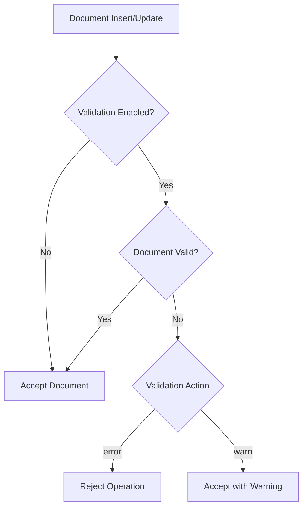

# How to Use MongoDB Schema Validation

Author: [nawazdhandala](https://www.github.com/nawazdhandala)

Tags: MongoDB, Schema Validation, JSON Schema, Data Quality, Database, Best Practices

Description: Learn how to implement MongoDB schema validation to enforce data structure and quality. This guide covers JSON Schema syntax, validation rules, and strategies for maintaining data integrity.

---

MongoDB's flexible schema is powerful, but it can lead to inconsistent data without proper validation. Schema validation allows you to enforce document structure at the database level, catching data quality issues before they become problems. Let's explore how to implement effective schema validation.

## Understanding Schema Validation

Schema validation in MongoDB uses JSON Schema to define rules for documents. Validation occurs during insert and update operations, ensuring data consistency.



## Creating Collections with Validation

Set up schema validation when creating a collection:

```javascript
// Create collection with validation
db.createCollection("users", {
    validator: {
        $jsonSchema: {
            bsonType: "object",
            required: ["email", "name", "createdAt"],
            properties: {
                email: {
                    bsonType: "string",
                    pattern: "^[a-zA-Z0-9._%+-]+@[a-zA-Z0-9.-]+\\.[a-zA-Z]{2,}$",
                    description: "must be a valid email address"
                },
                name: {
                    bsonType: "string",
                    minLength: 1,
                    maxLength: 100,
                    description: "must be a string between 1-100 characters"
                },
                age: {
                    bsonType: "int",
                    minimum: 0,
                    maximum: 150,
                    description: "must be an integer between 0-150"
                },
                status: {
                    enum: ["active", "inactive", "pending"],
                    description: "must be one of: active, inactive, pending"
                },
                createdAt: {
                    bsonType: "date",
                    description: "must be a date"
                }
            }
        }
    },
    validationLevel: "strict",
    validationAction: "error"
})
```

## JSON Schema Properties

### Basic Type Validation

```javascript
db.createCollection("products", {
    validator: {
        $jsonSchema: {
            bsonType: "object",
            required: ["name", "price", "category"],
            properties: {
                // String type with constraints
                name: {
                    bsonType: "string",
                    minLength: 3,
                    maxLength: 200
                },

                // Number types
                price: {
                    bsonType: "double",
                    minimum: 0,
                    exclusiveMinimum: false
                },
                quantity: {
                    bsonType: "int",
                    minimum: 0
                },

                // Boolean type
                active: {
                    bsonType: "bool"
                },

                // Date type
                lastUpdated: {
                    bsonType: "date"
                },

                // ObjectId type
                categoryId: {
                    bsonType: "objectId"
                },

                // Allow multiple types
                discount: {
                    oneOf: [
                        { bsonType: "double", minimum: 0, maximum: 1 },
                        { bsonType: "null" }
                    ]
                }
            }
        }
    }
})
```

### Nested Object Validation

```javascript
db.createCollection("orders", {
    validator: {
        $jsonSchema: {
            bsonType: "object",
            required: ["customerId", "items", "shippingAddress"],
            properties: {
                customerId: { bsonType: "objectId" },

                // Nested object validation
                shippingAddress: {
                    bsonType: "object",
                    required: ["street", "city", "country"],
                    properties: {
                        street: { bsonType: "string", minLength: 1 },
                        city: { bsonType: "string", minLength: 1 },
                        state: { bsonType: "string" },
                        country: {
                            bsonType: "string",
                            minLength: 2,
                            maxLength: 2
                        },
                        postalCode: { bsonType: "string" }
                    },
                    additionalProperties: false
                },

                // Billing address is optional but validated if present
                billingAddress: {
                    bsonType: "object",
                    required: ["street", "city", "country"],
                    properties: {
                        street: { bsonType: "string" },
                        city: { bsonType: "string" },
                        country: { bsonType: "string" }
                    }
                }
            }
        }
    }
})
```

### Array Validation

```javascript
db.createCollection("orders", {
    validator: {
        $jsonSchema: {
            bsonType: "object",
            required: ["items"],
            properties: {
                // Array with item validation
                items: {
                    bsonType: "array",
                    minItems: 1,
                    maxItems: 100,
                    items: {
                        bsonType: "object",
                        required: ["productId", "quantity", "price"],
                        properties: {
                            productId: { bsonType: "objectId" },
                            quantity: {
                                bsonType: "int",
                                minimum: 1
                            },
                            price: {
                                bsonType: "double",
                                minimum: 0
                            },
                            discount: {
                                bsonType: "double",
                                minimum: 0,
                                maximum: 1
                            }
                        }
                    }
                },

                // Array of strings
                tags: {
                    bsonType: "array",
                    uniqueItems: true,
                    items: {
                        bsonType: "string",
                        minLength: 1
                    }
                }
            }
        }
    }
})
```

## Advanced Validation Patterns

### Conditional Validation

```javascript
db.createCollection("payments", {
    validator: {
        $jsonSchema: {
            bsonType: "object",
            required: ["method", "amount"],
            properties: {
                method: {
                    enum: ["credit_card", "bank_transfer", "paypal"]
                },
                amount: {
                    bsonType: "double",
                    minimum: 0.01
                }
            },
            // Conditional validation based on payment method
            allOf: [
                {
                    if: {
                        properties: { method: { const: "credit_card" } }
                    },
                    then: {
                        required: ["cardNumber", "expiryDate", "cvv"],
                        properties: {
                            cardNumber: {
                                bsonType: "string",
                                pattern: "^[0-9]{16}$"
                            },
                            expiryDate: {
                                bsonType: "string",
                                pattern: "^(0[1-9]|1[0-2])/[0-9]{2}$"
                            },
                            cvv: {
                                bsonType: "string",
                                pattern: "^[0-9]{3,4}$"
                            }
                        }
                    }
                },
                {
                    if: {
                        properties: { method: { const: "bank_transfer" } }
                    },
                    then: {
                        required: ["accountNumber", "routingNumber"],
                        properties: {
                            accountNumber: { bsonType: "string" },
                            routingNumber: { bsonType: "string" }
                        }
                    }
                }
            ]
        }
    }
})
```

### Custom Validation with $expr

Combine JSON Schema with query operators:

```javascript
db.runCommand({
    collMod: "products",
    validator: {
        $and: [
            // JSON Schema validation
            {
                $jsonSchema: {
                    bsonType: "object",
                    required: ["name", "price", "cost"],
                    properties: {
                        name: { bsonType: "string" },
                        price: { bsonType: "double" },
                        cost: { bsonType: "double" }
                    }
                }
            },
            // Custom expression: price must be greater than cost
            {
                $expr: { $gt: ["$price", "$cost"] }
            }
        ]
    },
    validationLevel: "strict"
})
```

## Validation Levels and Actions

Configure how validation behaves:

```javascript
// Strict: Validate all inserts and updates (default)
db.runCommand({
    collMod: "users",
    validationLevel: "strict",
    validationAction: "error"
})

// Moderate: Only validate documents that already match the schema
// Allows existing invalid documents to be updated
db.runCommand({
    collMod: "users",
    validationLevel: "moderate",
    validationAction: "error"
})

// Warn: Log validation failures but allow operation
db.runCommand({
    collMod: "users",
    validationLevel: "strict",
    validationAction: "warn"
})

// Off: Disable validation
db.runCommand({
    collMod: "users",
    validationLevel: "off"
})
```

## Implementing Schema Validation in Node.js

Create a schema validation manager:

```javascript
const { MongoClient, ObjectId } = require('mongodb');

class SchemaValidator {
    constructor(client) {
        this.client = client;
    }

    async createValidatedCollection(dbName, collectionName, schema, options = {}) {
        const db = this.client.db(dbName);

        const {
            validationLevel = 'strict',
            validationAction = 'error'
        } = options;

        try {
            await db.createCollection(collectionName, {
                validator: { $jsonSchema: schema },
                validationLevel,
                validationAction
            });

            console.log(`Created collection ${collectionName} with validation`);
        } catch (error) {
            if (error.code === 48) {
                // Collection already exists, update validation
                await this.updateValidation(dbName, collectionName, schema, options);
            } else {
                throw error;
            }
        }
    }

    async updateValidation(dbName, collectionName, schema, options = {}) {
        const db = this.client.db(dbName);

        const {
            validationLevel = 'strict',
            validationAction = 'error'
        } = options;

        await db.command({
            collMod: collectionName,
            validator: { $jsonSchema: schema },
            validationLevel,
            validationAction
        });

        console.log(`Updated validation for ${collectionName}`);
    }

    async getValidation(dbName, collectionName) {
        const db = this.client.db(dbName);

        const collections = await db.listCollections({
            name: collectionName
        }).toArray();

        if (collections.length === 0) {
            throw new Error(`Collection ${collectionName} not found`);
        }

        return collections[0].options;
    }

    async validateDocument(dbName, collectionName, document) {
        const validation = await this.getValidation(dbName, collectionName);

        if (!validation.validator) {
            return { valid: true };
        }

        // Test insert with the document
        const db = this.client.db(dbName);
        const testCollection = db.collection(`_validation_test_${Date.now()}`);

        try {
            // Copy validation to test collection
            await db.command({
                create: testCollection.collectionName,
                validator: validation.validator,
                validationAction: 'error'
            });

            // Try to insert
            await testCollection.insertOne(document);

            return { valid: true };
        } catch (error) {
            if (error.code === 121) {  // Document validation failure
                return {
                    valid: false,
                    error: error.errInfo?.details || error.message
                };
            }
            throw error;
        } finally {
            // Clean up test collection
            try {
                await testCollection.drop();
            } catch (e) {
                // Ignore drop errors
            }
        }
    }

    async findInvalidDocuments(dbName, collectionName, schema) {
        const db = this.client.db(dbName);
        const collection = db.collection(collectionName);

        // Find documents that don't match the schema
        const invalidDocs = await collection.find({
            $nor: [{ $jsonSchema: schema }]
        }).toArray();

        return invalidDocs;
    }

    async migrateToValidation(dbName, collectionName, schema, options = {}) {
        const { fixFunction, dryRun = true } = options;
        const db = this.client.db(dbName);
        const collection = db.collection(collectionName);

        // Find invalid documents
        const invalidDocs = await this.findInvalidDocuments(dbName, collectionName, schema);

        console.log(`Found ${invalidDocs.length} invalid documents`);

        if (dryRun) {
            return {
                invalidCount: invalidDocs.length,
                samples: invalidDocs.slice(0, 5)
            };
        }

        // Fix documents if function provided
        if (fixFunction) {
            for (const doc of invalidDocs) {
                const fixed = fixFunction(doc);
                await collection.replaceOne({ _id: doc._id }, fixed);
            }
            console.log(`Fixed ${invalidDocs.length} documents`);
        }

        // Apply validation
        await this.updateValidation(dbName, collectionName, schema);

        return {
            migratedCount: invalidDocs.length,
            validationApplied: true
        };
    }
}

// Schema definitions
const schemas = {
    users: {
        bsonType: "object",
        required: ["email", "name", "createdAt"],
        properties: {
            email: {
                bsonType: "string",
                pattern: "^[a-zA-Z0-9._%+-]+@[a-zA-Z0-9.-]+\\.[a-zA-Z]{2,}$"
            },
            name: {
                bsonType: "string",
                minLength: 1,
                maxLength: 100
            },
            status: {
                enum: ["active", "inactive", "pending"]
            },
            createdAt: { bsonType: "date" }
        }
    },

    orders: {
        bsonType: "object",
        required: ["customerId", "items", "total", "status"],
        properties: {
            customerId: { bsonType: "objectId" },
            items: {
                bsonType: "array",
                minItems: 1,
                items: {
                    bsonType: "object",
                    required: ["productId", "quantity", "price"],
                    properties: {
                        productId: { bsonType: "objectId" },
                        quantity: { bsonType: "int", minimum: 1 },
                        price: { bsonType: "double", minimum: 0 }
                    }
                }
            },
            total: { bsonType: "double", minimum: 0 },
            status: {
                enum: ["pending", "processing", "shipped", "delivered", "cancelled"]
            }
        }
    }
};

// Usage
async function main() {
    const client = new MongoClient('mongodb://localhost:27017');
    await client.connect();

    const validator = new SchemaValidator(client);

    // Create collections with validation
    await validator.createValidatedCollection('ecommerce', 'users', schemas.users);
    await validator.createValidatedCollection('ecommerce', 'orders', schemas.orders);

    // Validate a document before insert
    const testUser = {
        email: "invalid-email",
        name: "John"
    };

    const result = await validator.validateDocument('ecommerce', 'users', testUser);
    console.log('Validation result:', result);

    await client.close();
}

main();
```

## Handling Validation Errors

Gracefully handle validation failures:

```javascript
const { MongoClient } = require('mongodb');

class ValidatedCollection {
    constructor(collection) {
        this.collection = collection;
    }

    async insertOne(document) {
        try {
            return await this.collection.insertOne(document);
        } catch (error) {
            if (error.code === 121) {
                const validationError = this.parseValidationError(error);
                throw new ValidationError(validationError);
            }
            throw error;
        }
    }

    async updateOne(filter, update, options) {
        try {
            return await this.collection.updateOne(filter, update, options);
        } catch (error) {
            if (error.code === 121) {
                const validationError = this.parseValidationError(error);
                throw new ValidationError(validationError);
            }
            throw error;
        }
    }

    parseValidationError(error) {
        const details = error.errInfo?.details;

        if (!details) {
            return {
                message: 'Document validation failed',
                details: error.message
            };
        }

        const errors = [];

        // Parse schema validation failures
        if (details.schemaRulesNotSatisfied) {
            for (const rule of details.schemaRulesNotSatisfied) {
                errors.push(this.parseSchemaRule(rule));
            }
        }

        return {
            message: 'Document validation failed',
            errors
        };
    }

    parseSchemaRule(rule) {
        switch (rule.operatorName) {
            case 'required':
                return {
                    type: 'missing_required',
                    fields: rule.missingProperties
                };

            case 'properties':
                const propertyErrors = [];
                for (const prop of rule.propertiesNotSatisfied || []) {
                    propertyErrors.push({
                        field: prop.propertyName,
                        reason: prop.details?.[0]?.reason || 'Invalid value'
                    });
                }
                return {
                    type: 'invalid_properties',
                    errors: propertyErrors
                };

            case 'enum':
                return {
                    type: 'invalid_enum',
                    allowedValues: rule.enum
                };

            default:
                return {
                    type: 'validation_failed',
                    details: rule
                };
        }
    }
}

class ValidationError extends Error {
    constructor(details) {
        super(details.message);
        this.name = 'ValidationError';
        this.details = details;
    }
}

// Usage
async function createUser(client, userData) {
    const collection = new ValidatedCollection(
        client.db('app').collection('users')
    );

    try {
        await collection.insertOne(userData);
        console.log('User created successfully');
    } catch (error) {
        if (error instanceof ValidationError) {
            console.log('Validation failed:');
            console.log(JSON.stringify(error.details, null, 2));
            // Return user-friendly error
            return { error: 'Invalid user data', details: error.details };
        }
        throw error;
    }
}
```

## Schema Evolution Strategies

Safely evolve schemas over time:

```javascript
class SchemaEvolution {
    constructor(client, dbName) {
        this.client = client;
        this.db = client.db(dbName);
    }

    async applyMigration(collectionName, migration) {
        const {
            version,
            schema,
            transform,
            description
        } = migration;

        console.log(`Applying migration v${version}: ${description}`);

        // 1. Set validation to moderate (allow existing invalid docs)
        await this.db.command({
            collMod: collectionName,
            validationLevel: 'moderate',
            validationAction: 'warn'
        });

        // 2. Transform existing documents if needed
        if (transform) {
            const collection = this.db.collection(collectionName);
            const cursor = collection.find({});

            while (await cursor.hasNext()) {
                const doc = await cursor.next();
                const transformed = transform(doc);

                if (transformed) {
                    await collection.replaceOne({ _id: doc._id }, transformed);
                }
            }
        }

        // 3. Apply new schema with strict validation
        await this.db.command({
            collMod: collectionName,
            validator: { $jsonSchema: schema },
            validationLevel: 'strict',
            validationAction: 'error'
        });

        // 4. Record migration
        await this.db.collection('_schema_migrations').insertOne({
            collection: collectionName,
            version,
            description,
            appliedAt: new Date()
        });

        console.log(`Migration v${version} completed`);
    }
}

// Example migration
const userMigrationV2 = {
    version: 2,
    description: 'Add required phone field with default',
    schema: {
        bsonType: "object",
        required: ["email", "name", "phone"],
        properties: {
            email: { bsonType: "string" },
            name: { bsonType: "string" },
            phone: { bsonType: "string" }
        }
    },
    transform: (doc) => {
        if (!doc.phone) {
            return { ...doc, phone: 'unknown' };
        }
        return null;  // No change needed
    }
};
```

## Conclusion

MongoDB schema validation provides a powerful way to enforce data quality without sacrificing flexibility. Key practices include: start with essential validations and add constraints gradually, use moderate validation level during migrations, implement proper error handling to provide meaningful feedback, and version your schemas for easier evolution. With proper schema validation, you can maintain data integrity while keeping the flexibility that makes MongoDB powerful.
