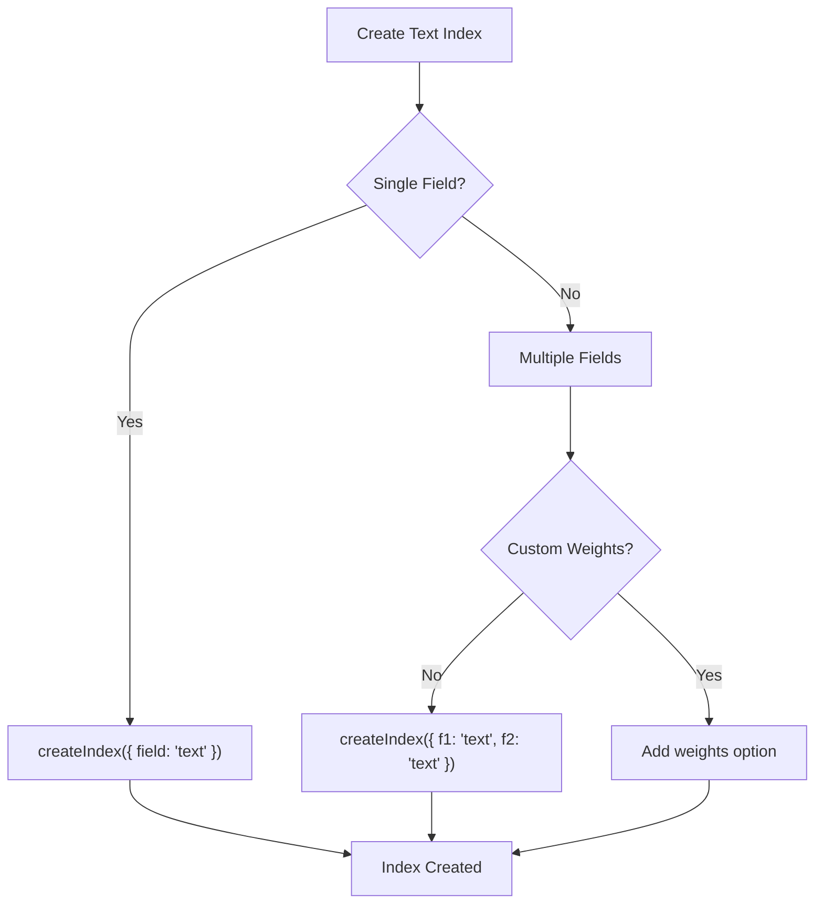
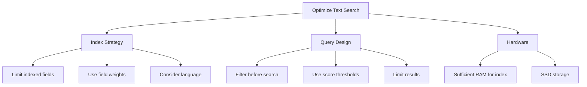

# How to Use MongoDB Text Search

Author: [nawazdhandala](https://www.github.com/nawazdhandala)

Tags: MongoDB, Database, Text Search, Full-Text Search, Indexing

Description: Implement full-text search in MongoDB using text indexes. Learn to create indexes, perform searches, rank results by relevance, and handle multiple languages with practical examples.

---

MongoDB's text search provides full-text search capabilities for string content in your collections. Unlike regex-based searches, text search uses stemming, stop words, and relevance scoring to deliver search engine-like functionality. This guide covers everything from basic setup to advanced search patterns.

## Creating a Text Index

Before using text search, you must create a text index on the fields you want to search.

```javascript
// Single field text index
db.articles.createIndex({ content: "text" });

// Multiple fields with equal weight
db.articles.createIndex({
  title: "text",
  content: "text",
  tags: "text"
});

// Multiple fields with custom weights
db.articles.createIndex(
  {
    title: "text",
    content: "text",
    tags: "text"
  },
  {
    weights: {
      title: 10,    // Title matches are 10x more important
      tags: 5,      // Tags are 5x more important
      content: 1    // Default weight
    },
    name: "ArticleTextIndex"
  }
);
```

**Important:** A collection can only have ONE text index, but it can cover multiple fields.



## Basic Text Search

Use the `$text` operator with `$search` to perform text searches.

```javascript
// Basic search - finds documents containing "mongodb" or "database"
db.articles.find({
  $text: { $search: "mongodb database" }
});

// Search for exact phrase (use quotes)
db.articles.find({
  $text: { $search: "\"mongodb tutorial\"" }
});

// Exclude words with minus sign
db.articles.find({
  $text: { $search: "mongodb -deprecated" }
});

// Combine phrase and word search
db.articles.find({
  $text: { $search: "\"getting started\" mongodb -outdated" }
});
```

### How Text Search Works

Text search performs:
1. **Tokenization** - Splits text into words
2. **Stemming** - Reduces words to root form ("running" -> "run")
3. **Stop word removal** - Ignores common words ("the", "is", "at")
4. **Case folding** - Case-insensitive matching

```javascript
// These all match documents containing "running"
db.articles.find({ $text: { $search: "run" } });
db.articles.find({ $text: { $search: "runs" } });
db.articles.find({ $text: { $search: "running" } });
db.articles.find({ $text: { $search: "RUNNING" } });
```

## Relevance Scoring with $meta

Get relevance scores to rank search results.

```javascript
// Include text score in results
db.articles.find(
  { $text: { $search: "mongodb performance" } },
  { score: { $meta: "textScore" } }
).sort({ score: { $meta: "textScore" } });

// Combine with other sorting criteria
db.articles.find(
  { $text: { $search: "mongodb" } },
  { score: { $meta: "textScore" } }
).sort({
  score: { $meta: "textScore" },
  publishDate: -1
});
```

### Understanding Text Scores

Higher scores indicate better matches. Scores are influenced by:
- Term frequency (how often the term appears)
- Field weights (configured in index)
- Document frequency (rarer terms score higher)

```javascript
// Example output with scores
{
  _id: ObjectId("..."),
  title: "MongoDB Performance Optimization",
  content: "Learn to optimize MongoDB queries...",
  score: 2.5
}
{
  _id: ObjectId("..."),
  title: "Database Comparison",
  content: "MongoDB vs other databases...",
  score: 1.2
}
```

## Language Support

MongoDB supports text search in multiple languages with language-specific stemming and stop words.

```javascript
// Specify language at index creation
db.articles.createIndex(
  { content: "text" },
  { default_language: "french" }
);

// Specify language per document
{
  _id: ObjectId("..."),
  content: "Le guide complet de MongoDB",
  language: "french"
}

// Search with specific language
db.articles.find({
  $text: {
    $search: "databases",
    $language: "english"
  }
});

// Disable language processing (no stemming/stop words)
db.articles.find({
  $text: {
    $search: "the running dogs",
    $language: "none"
  }
});
```

### Supported Languages

MongoDB supports: danish, dutch, english, finnish, french, german, hungarian, italian, norwegian, portuguese, romanian, russian, spanish, swedish, turkish, and more.

```javascript
// Check available languages
db.adminCommand({ listSearchIndexes: "articles" });
```

## Combining Text Search with Other Queries

Text search can be combined with regular query conditions.

```javascript
// Text search with additional filters
db.articles.find({
  $text: { $search: "mongodb tutorial" },
  status: "published",
  publishDate: { $gte: new Date("2024-01-01") },
  category: { $in: ["database", "nosql"] }
});

// With projection
db.articles.find(
  {
    $text: { $search: "mongodb" },
    author: "johndoe"
  },
  {
    title: 1,
    summary: 1,
    score: { $meta: "textScore" }
  }
);
```

## Aggregation Pipeline with Text Search

Use text search in aggregation for complex operations.

```javascript
// Text search with aggregation
db.articles.aggregate([
  // Text search stage (must be first or early)
  {
    $match: {
      $text: { $search: "mongodb performance" }
    }
  },

  // Add the text score
  {
    $addFields: {
      score: { $meta: "textScore" }
    }
  },

  // Additional filtering
  {
    $match: {
      score: { $gt: 1.0 },  // Minimum relevance threshold
      status: "published"
    }
  },

  // Join with authors
  {
    $lookup: {
      from: "users",
      localField: "authorId",
      foreignField: "_id",
      as: "author"
    }
  },
  { $unwind: "$author" },

  // Final projection
  {
    $project: {
      title: 1,
      summary: 1,
      authorName: "$author.name",
      score: 1,
      publishDate: 1
    }
  },

  // Sort by relevance
  { $sort: { score: -1 } },

  // Limit results
  { $limit: 20 }
]);
```

### Search with Faceted Results

```javascript
// Get search results with facets
db.articles.aggregate([
  { $match: { $text: { $search: "javascript" } } },
  {
    $facet: {
      // Search results
      results: [
        { $addFields: { score: { $meta: "textScore" } } },
        { $sort: { score: -1 } },
        { $limit: 10 },
        { $project: { title: 1, score: 1 } }
      ],

      // Category breakdown
      categories: [
        { $group: { _id: "$category", count: { $sum: 1 } } },
        { $sort: { count: -1 } }
      ],

      // Total count
      totalCount: [
        { $count: "total" }
      ]
    }
  }
]);
```

## Wildcard Text Index

Index all string fields in a collection.

```javascript
// Index ALL string fields
db.articles.createIndex({ "$**": "text" });

// This indexes every string field in every document
// Useful when schema is flexible or unknown
```

**Caution:** Wildcard text indexes can be large and slow to build on collections with many string fields.

## Practical Implementation Patterns

### Pattern 1: Search API Endpoint

```javascript
async function searchArticles(searchQuery, options = {}) {
  const {
    page = 1,
    limit = 20,
    category = null,
    minScore = 0.5
  } = options;

  const pipeline = [
    // Text search
    {
      $match: {
        $text: { $search: searchQuery },
        status: "published"
      }
    },

    // Add score
    { $addFields: { score: { $meta: "textScore" } } },

    // Filter by minimum score
    { $match: { score: { $gte: minScore } } }
  ];

  // Optional category filter
  if (category) {
    pipeline.push({ $match: { category } });
  }

  // Add pagination
  pipeline.push(
    { $sort: { score: -1, publishDate: -1 } },
    { $skip: (page - 1) * limit },
    { $limit: limit },
    {
      $project: {
        title: 1,
        summary: 1,
        category: 1,
        publishDate: 1,
        score: 1
      }
    }
  );

  return db.collection('articles').aggregate(pipeline).toArray();
}

// Usage
const results = await searchArticles("mongodb performance", {
  page: 1,
  limit: 10,
  category: "database"
});
```

### Pattern 2: Autocomplete Suggestions

```javascript
// For autocomplete, combine text index with regex for prefix matching
async function getSearchSuggestions(prefix, limit = 5) {
  // First, try text search for relevance
  const textResults = await db.collection('articles')
    .find(
      { $text: { $search: prefix } },
      { title: 1, score: { $meta: "textScore" } }
    )
    .sort({ score: { $meta: "textScore" } })
    .limit(limit)
    .toArray();

  // Also get prefix matches for better autocomplete
  const prefixResults = await db.collection('articles')
    .find(
      { title: { $regex: `^${escapeRegex(prefix)}`, $options: 'i' } },
      { title: 1 }
    )
    .limit(limit)
    .toArray();

  // Combine and deduplicate
  const seen = new Set();
  const combined = [];

  for (const doc of [...textResults, ...prefixResults]) {
    if (!seen.has(doc.title)) {
      seen.add(doc.title);
      combined.push(doc.title);
    }
  }

  return combined.slice(0, limit);
}
```

### Pattern 3: Multi-Collection Search

```javascript
async function globalSearch(query, limit = 10) {
  const [articles, products, users] = await Promise.all([
    db.collection('articles').find(
      { $text: { $search: query } },
      { title: 1, score: { $meta: "textScore" }, type: { $literal: "article" } }
    ).sort({ score: { $meta: "textScore" } }).limit(limit).toArray(),

    db.collection('products').find(
      { $text: { $search: query } },
      { name: 1, score: { $meta: "textScore" }, type: { $literal: "product" } }
    ).sort({ score: { $meta: "textScore" } }).limit(limit).toArray(),

    db.collection('users').find(
      { $text: { $search: query } },
      { name: 1, score: { $meta: "textScore" }, type: { $literal: "user" } }
    ).sort({ score: { $meta: "textScore" } }).limit(limit).toArray()
  ]);

  // Merge and sort by score
  return [...articles, ...products, ...users]
    .sort((a, b) => b.score - a.score)
    .slice(0, limit);
}
```

## Performance Optimization



### Index Size Management

```javascript
// Check text index size
db.articles.stats().indexSizes

// Drop and recreate with fewer fields if too large
db.articles.dropIndex("ArticleTextIndex");
db.articles.createIndex(
  { title: "text", tags: "text" },  // Removed content
  { name: "ArticleTextIndex" }
);
```

### Query Optimization

```javascript
// Good: Filter then search
db.articles.find({
  $text: { $search: "mongodb" },
  status: "published",           // Equality filter
  category: "database"           // Another filter
});

// Even better: Create compound index with text
db.articles.createIndex({
  status: 1,
  category: 1,
  content: "text"
});

// Use explain to verify
db.articles.find({
  $text: { $search: "mongodb" }
}).explain("executionStats");
```

## Limitations and Alternatives

| Feature | MongoDB Text Search | Atlas Search (Lucene) |
|---------|--------------------|-----------------------|
| Fuzzy matching | No | Yes |
| Synonyms | No | Yes |
| Custom analyzers | Limited | Extensive |
| Highlighting | No | Yes |
| Autocomplete | Basic | Advanced |
| Faceted search | Manual | Built-in |

For advanced search requirements, consider MongoDB Atlas Search which uses Apache Lucene under the hood.

```javascript
// Atlas Search example (if available)
db.articles.aggregate([
  {
    $search: {
      text: {
        query: "mongodb",
        path: ["title", "content"],
        fuzzy: { maxEdits: 1 }
      },
      highlight: { path: "content" }
    }
  },
  {
    $project: {
      title: 1,
      score: { $meta: "searchScore" },
      highlights: { $meta: "searchHighlights" }
    }
  }
]);
```

---

MongoDB text search provides solid full-text search capabilities for many use cases. Create text indexes with appropriate field weights, use relevance scoring to rank results, and combine with regular query filters for powerful search functionality. For applications requiring advanced features like fuzzy matching, synonyms, or highlighting, consider upgrading to MongoDB Atlas Search.
