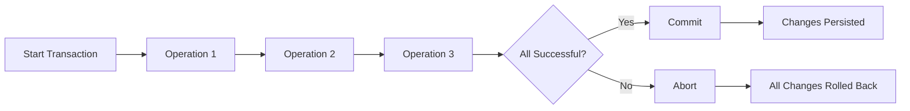

# How to Use MongoDB Transactions

Author: [nawazdhandala](https://www.github.com/nawazdhandala)

Tags: MongoDB, Transactions, ACID, Database, Data Consistency, Node.js

Description: Learn how to implement MongoDB transactions for ACID-compliant operations. This guide covers multi-document transactions, error handling, best practices, and real-world use cases.

---

MongoDB transactions allow you to execute multiple operations as a single atomic unit - either all operations succeed, or none of them do. This is essential for maintaining data consistency in complex operations. Let's explore how to implement transactions effectively.

## Understanding MongoDB Transactions

Transactions in MongoDB provide ACID guarantees:
- **Atomicity**: All operations succeed or all fail
- **Consistency**: Data remains in a valid state
- **Isolation**: Transactions don't interfere with each other
- **Durability**: Committed changes persist



## Prerequisites

Transactions require:
- MongoDB 4.0+ for replica set transactions
- MongoDB 4.2+ for sharded cluster transactions
- A replica set or sharded cluster deployment

## Basic Transaction Usage

Here's a simple transaction example:

```javascript
const { MongoClient } = require('mongodb');

async function basicTransaction() {
    const client = new MongoClient('mongodb://localhost:27017/?replicaSet=rs0');

    try {
        await client.connect();
        const session = client.startSession();

        try {
            session.startTransaction();

            const accounts = client.db('bank').collection('accounts');

            // Debit from account A
            await accounts.updateOne(
                { accountId: 'A', balance: { $gte: 100 } },
                { $inc: { balance: -100 } },
                { session }
            );

            // Credit to account B
            await accounts.updateOne(
                { accountId: 'B' },
                { $inc: { balance: 100 } },
                { session }
            );

            await session.commitTransaction();
            console.log('Transaction committed successfully');

        } catch (error) {
            await session.abortTransaction();
            console.error('Transaction aborted:', error.message);
            throw error;
        } finally {
            await session.endSession();
        }

    } finally {
        await client.close();
    }
}
```

## Using withTransaction() Helper

The `withTransaction()` method provides automatic retry and commit handling:

```javascript
const { MongoClient } = require('mongodb');

async function transferFunds(fromAccount, toAccount, amount) {
    const client = new MongoClient('mongodb://localhost:27017/?replicaSet=rs0');

    try {
        await client.connect();
        const session = client.startSession();

        const result = await session.withTransaction(async () => {
            const accounts = client.db('bank').collection('accounts');
            const transactions = client.db('bank').collection('transactions');

            // Check sufficient balance
            const source = await accounts.findOne(
                { accountId: fromAccount },
                { session }
            );

            if (!source || source.balance < amount) {
                throw new Error('Insufficient funds');
            }

            // Perform transfer
            await accounts.updateOne(
                { accountId: fromAccount },
                { $inc: { balance: -amount } },
                { session }
            );

            await accounts.updateOne(
                { accountId: toAccount },
                { $inc: { balance: amount } },
                { session }
            );

            // Record transaction
            await transactions.insertOne({
                from: fromAccount,
                to: toAccount,
                amount,
                timestamp: new Date(),
                type: 'transfer'
            }, { session });

            return { success: true, amount };

        }, {
            readPreference: 'primary',
            readConcern: { level: 'local' },
            writeConcern: { w: 'majority' }
        });

        console.log('Transfer completed:', result);
        return result;

    } finally {
        await client.close();
    }
}
```

## Transaction Options and Configuration

Configure transactions for your use case:

```javascript
const transactionOptions = {
    readPreference: 'primary',
    readConcern: { level: 'snapshot' },  // Consistent point-in-time read
    writeConcern: { w: 'majority', j: true },
    maxCommitTimeMS: 5000
};

// Read concern levels:
// - 'local': Returns most recent data (may be rolled back)
// - 'majority': Returns data acknowledged by majority
// - 'snapshot': Point-in-time consistent view

// Write concern options:
// - w: 1 - Acknowledged by primary only
// - w: 'majority' - Acknowledged by majority of nodes
// - j: true - Written to journal

session.startTransaction(transactionOptions);
```

## Real-World Transaction Patterns

### E-Commerce Order Processing

```javascript
const { MongoClient, ObjectId } = require('mongodb');

class OrderService {
    constructor(client) {
        this.client = client;
        this.db = client.db('ecommerce');
    }

    async createOrder(userId, items) {
        const session = this.client.startSession();

        try {
            const result = await session.withTransaction(async () => {
                // 1. Validate and reserve inventory
                for (const item of items) {
                    const product = await this.db.collection('products').findOneAndUpdate(
                        {
                            _id: item.productId,
                            stock: { $gte: item.quantity }
                        },
                        {
                            $inc: { stock: -item.quantity },
                            $push: {
                                reservations: {
                                    orderId: new ObjectId(),
                                    quantity: item.quantity,
                                    timestamp: new Date()
                                }
                            }
                        },
                        { session, returnDocument: 'after' }
                    );

                    if (!product.value) {
                        throw new Error(`Insufficient stock for product ${item.productId}`);
                    }

                    item.price = product.value.price;
                    item.name = product.value.name;
                }

                // 2. Calculate totals
                const subtotal = items.reduce(
                    (sum, item) => sum + (item.price * item.quantity), 0
                );
                const tax = subtotal * 0.1;
                const total = subtotal + tax;

                // 3. Create order document
                const order = {
                    _id: new ObjectId(),
                    userId,
                    items,
                    subtotal,
                    tax,
                    total,
                    status: 'pending',
                    createdAt: new Date()
                };

                await this.db.collection('orders').insertOne(order, { session });

                // 4. Update user's order history
                await this.db.collection('users').updateOne(
                    { _id: userId },
                    {
                        $push: { orderHistory: order._id },
                        $set: { lastOrderAt: new Date() }
                    },
                    { session }
                );

                return order;
            });

            return result;

        } finally {
            await session.endSession();
        }
    }

    async cancelOrder(orderId) {
        const session = this.client.startSession();

        try {
            await session.withTransaction(async () => {
                // 1. Get order details
                const order = await this.db.collection('orders').findOne(
                    { _id: orderId, status: 'pending' },
                    { session }
                );

                if (!order) {
                    throw new Error('Order not found or cannot be cancelled');
                }

                // 2. Restore inventory
                for (const item of order.items) {
                    await this.db.collection('products').updateOne(
                        { _id: item.productId },
                        {
                            $inc: { stock: item.quantity },
                            $pull: { reservations: { orderId: order._id } }
                        },
                        { session }
                    );
                }

                // 3. Update order status
                await this.db.collection('orders').updateOne(
                    { _id: orderId },
                    {
                        $set: {
                            status: 'cancelled',
                            cancelledAt: new Date()
                        }
                    },
                    { session }
                );

                // 4. Update user stats
                await this.db.collection('users').updateOne(
                    { _id: order.userId },
                    { $inc: { cancelledOrders: 1 } },
                    { session }
                );
            });

            console.log('Order cancelled successfully');

        } finally {
            await session.endSession();
        }
    }
}
```

### User Registration with Multiple Collections

```javascript
class UserService {
    constructor(client) {
        this.client = client;
        this.db = client.db('app');
    }

    async registerUser(userData) {
        const session = this.client.startSession();

        try {
            const result = await session.withTransaction(async () => {
                // 1. Check for existing user
                const existing = await this.db.collection('users').findOne(
                    { email: userData.email },
                    { session }
                );

                if (existing) {
                    throw new Error('Email already registered');
                }

                // 2. Create user document
                const userId = new ObjectId();
                const user = {
                    _id: userId,
                    email: userData.email,
                    name: userData.name,
                    createdAt: new Date(),
                    status: 'active'
                };

                await this.db.collection('users').insertOne(user, { session });

                // 3. Create user profile
                const profile = {
                    _id: new ObjectId(),
                    userId,
                    bio: '',
                    avatar: null,
                    preferences: {
                        notifications: true,
                        theme: 'light'
                    },
                    createdAt: new Date()
                };

                await this.db.collection('profiles').insertOne(profile, { session });

                // 4. Create default settings
                const settings = {
                    _id: new ObjectId(),
                    userId,
                    language: 'en',
                    timezone: 'UTC',
                    emailNotifications: true,
                    createdAt: new Date()
                };

                await this.db.collection('settings').insertOne(settings, { session });

                // 5. Initialize wallet if applicable
                if (userData.createWallet) {
                    const wallet = {
                        _id: new ObjectId(),
                        userId,
                        balance: 0,
                        currency: 'USD',
                        createdAt: new Date()
                    };

                    await this.db.collection('wallets').insertOne(wallet, { session });
                }

                // 6. Record registration event
                await this.db.collection('events').insertOne({
                    type: 'user_registered',
                    userId,
                    timestamp: new Date(),
                    metadata: { source: userData.source }
                }, { session });

                return { userId, email: user.email };
            });

            return result;

        } finally {
            await session.endSession();
        }
    }
}
```

## Error Handling and Retry Logic

Implement robust error handling for transient failures:

```javascript
const { MongoClient } = require('mongodb');

class TransactionManager {
    constructor(client) {
        this.client = client;
    }

    async executeTransaction(operation, options = {}) {
        const {
            maxRetries = 3,
            retryDelay = 1000,
            transactionOptions = {}
        } = options;

        let lastError;

        for (let attempt = 1; attempt <= maxRetries; attempt++) {
            const session = this.client.startSession();

            try {
                const result = await session.withTransaction(
                    () => operation(session),
                    {
                        readPreference: 'primary',
                        readConcern: { level: 'snapshot' },
                        writeConcern: { w: 'majority' },
                        ...transactionOptions
                    }
                );

                return result;

            } catch (error) {
                lastError = error;

                // Check if error is retryable
                if (this.isRetryableError(error) && attempt < maxRetries) {
                    console.log(`Transaction attempt ${attempt} failed, retrying...`);
                    await this.delay(retryDelay * attempt);
                    continue;
                }

                // Non-retryable error or max retries reached
                throw error;

            } finally {
                await session.endSession();
            }
        }

        throw lastError;
    }

    isRetryableError(error) {
        // Transient transaction errors are retryable
        if (error.hasErrorLabel &&
            error.hasErrorLabel('TransientTransactionError')) {
            return true;
        }

        // Certain error codes are retryable
        const retryableCodes = [
            112,  // WriteConflict
            251,  // TransactionAborted
            11600, // InterruptedAtShutdown
            11602  // InterruptedDueToReplStateChange
        ];

        return retryableCodes.includes(error.code);
    }

    delay(ms) {
        return new Promise(resolve => setTimeout(resolve, ms));
    }
}

// Usage
async function main() {
    const client = new MongoClient('mongodb://localhost:27017/?replicaSet=rs0');
    await client.connect();

    const txManager = new TransactionManager(client);

    try {
        const result = await txManager.executeTransaction(async (session) => {
            const db = client.db('test');

            await db.collection('accounts').updateOne(
                { _id: 'A' },
                { $inc: { balance: -100 } },
                { session }
            );

            await db.collection('accounts').updateOne(
                { _id: 'B' },
                { $inc: { balance: 100 } },
                { session }
            );

            return { transferred: 100 };
        }, { maxRetries: 5 });

        console.log('Result:', result);
    } catch (error) {
        console.error('Transaction failed:', error.message);
    }

    await client.close();
}
```

## Transaction Timeouts

Handle transaction timeouts appropriately:

```javascript
async function transactionWithTimeout(client, operation, timeoutMs = 30000) {
    const session = client.startSession();

    // Create timeout promise
    const timeoutPromise = new Promise((_, reject) => {
        setTimeout(() => {
            reject(new Error('Transaction timeout'));
        }, timeoutMs);
    });

    try {
        session.startTransaction({
            maxCommitTimeMS: timeoutMs
        });

        // Race between operation and timeout
        const result = await Promise.race([
            operation(session),
            timeoutPromise
        ]);

        await session.commitTransaction();
        return result;

    } catch (error) {
        if (session.inTransaction()) {
            await session.abortTransaction();
        }
        throw error;
    } finally {
        await session.endSession();
    }
}
```

## Best Practices

```javascript
// 1. Keep transactions short
// BAD: Long-running transaction
async function badTransaction(session) {
    // Reading lots of data
    const allUsers = await users.find({}).toArray();  // Slow

    for (const user of allUsers) {
        await processUser(user, session);  // Many operations
    }
}

// GOOD: Focused transaction
async function goodTransaction(session, userIds) {
    // Process specific users
    await users.updateMany(
        { _id: { $in: userIds } },
        { $set: { processed: true } },
        { session }
    );
}

// 2. Avoid operations outside transaction scope
async function properScopedTransaction(session) {
    const db = client.db('app');

    // All reads and writes use session
    const user = await db.collection('users').findOne(
        { _id: userId },
        { session }  // Include session!
    );

    await db.collection('logs').insertOne(
        { action: 'read', userId },
        { session }  // Include session!
    );
}

// 3. Handle commit conflicts
async function handleCommitConflict(session, operation) {
    try {
        session.startTransaction();
        await operation(session);
        await session.commitTransaction();
    } catch (error) {
        if (error.hasErrorLabel('UnknownTransactionCommitResult')) {
            // Commit status unknown - check manually
            console.log('Commit result unknown, verifying...');
        }
        throw error;
    }
}
```

## Monitoring Transactions

Track transaction performance:

```javascript
class TransactionMonitor {
    constructor() {
        this.metrics = {
            total: 0,
            committed: 0,
            aborted: 0,
            totalDuration: 0
        };
    }

    async monitoredTransaction(session, operation) {
        const startTime = Date.now();
        this.metrics.total++;

        try {
            const result = await session.withTransaction(operation);
            this.metrics.committed++;
            return result;
        } catch (error) {
            this.metrics.aborted++;
            throw error;
        } finally {
            this.metrics.totalDuration += Date.now() - startTime;
        }
    }

    getStats() {
        return {
            ...this.metrics,
            avgDuration: this.metrics.totalDuration / this.metrics.total,
            successRate: this.metrics.committed / this.metrics.total
        };
    }
}
```

## Conclusion

MongoDB transactions provide powerful ACID guarantees for complex multi-document operations. Key takeaways: use `withTransaction()` for automatic retry handling, keep transactions short and focused, always include the session parameter in all operations, and implement proper error handling for transient failures. With these practices, you can maintain data consistency in even the most demanding applications.
