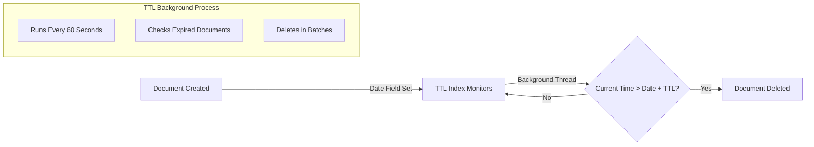

# How to Use MongoDB TTL Indexes

Author: [nawazdhandala](https://www.github.com/nawazdhandala)

Tags: MongoDB, Database, Indexes, TTL, Data Management, Performance

Description: Learn how to use MongoDB TTL (Time-To-Live) indexes to automatically expire and delete documents, perfect for session data, logs, caches, and temporary records with practical examples.

---

TTL (Time-To-Live) indexes in MongoDB automatically delete documents after a specified period. They are perfect for managing session data, temporary caches, event logs, and any data that should expire. Instead of writing cron jobs or cleanup scripts, let MongoDB handle expiration automatically.

## How TTL Indexes Work

A TTL index monitors a date field and removes documents when the current time exceeds the document's date value plus the specified TTL period.



## Creating TTL Indexes

### Basic TTL Index

Create a TTL index on a date field with an expiration time in seconds:

```javascript
// Documents expire 24 hours after the 'createdAt' field value
db.sessions.createIndex(
  { "createdAt": 1 },
  { expireAfterSeconds: 86400 }  // 24 hours
);

// Insert a document
db.sessions.insertOne({
  userId: "user123",
  token: "abc123xyz",
  createdAt: new Date()  // Will be deleted 24 hours from now
});
```

### TTL Index with Immediate Expiration

Set `expireAfterSeconds` to 0 to delete documents at the exact time specified in the date field:

```javascript
// Documents expire at the exact time in 'expiresAt' field
db.tokens.createIndex(
  { "expiresAt": 1 },
  { expireAfterSeconds: 0 }
);

// Insert a token that expires in 1 hour
db.tokens.insertOne({
  token: "verification-token",
  email: "user@example.com",
  expiresAt: new Date(Date.now() + 3600 * 1000)  // 1 hour from now
});

// Insert a token that expires in 7 days
db.tokens.insertOne({
  token: "password-reset-token",
  email: "user@example.com",
  expiresAt: new Date(Date.now() + 7 * 24 * 3600 * 1000)  // 7 days from now
});
```

## Practical Use Cases

### 1. Session Management

```javascript
// Create sessions collection with TTL
db.sessions.createIndex(
  { "lastAccess": 1 },
  { expireAfterSeconds: 1800 }  // 30 minutes of inactivity
);

// Create a new session
async function createSession(userId, sessionData) {
  const session = {
    _id: new ObjectId(),
    userId: userId,
    data: sessionData,
    lastAccess: new Date(),
    createdAt: new Date()
  };

  await db.sessions.insertOne(session);
  return session._id;
}

// Update session on activity (resets TTL)
async function touchSession(sessionId) {
  await db.sessions.updateOne(
    { _id: sessionId },
    { $set: { lastAccess: new Date() } }
  );
}

// Get session (and touch it)
async function getSession(sessionId) {
  const session = await db.sessions.findOneAndUpdate(
    { _id: sessionId },
    { $set: { lastAccess: new Date() } },
    { returnDocument: 'after' }
  );

  return session;
}
```

### 2. Event Logs with Retention

```javascript
// Keep logs for 30 days
db.eventLogs.createIndex(
  { "timestamp": 1 },
  { expireAfterSeconds: 2592000 }  // 30 days
);

// Log an event
async function logEvent(eventType, data) {
  await db.eventLogs.insertOne({
    type: eventType,
    data: data,
    timestamp: new Date(),
    metadata: {
      server: process.env.SERVER_ID,
      version: process.env.APP_VERSION
    }
  });
}
```

### 3. Rate Limiting

```javascript
// Rate limit entries expire after 1 minute
db.rateLimits.createIndex(
  { "windowStart": 1 },
  { expireAfterSeconds: 60 }
);

async function checkRateLimit(clientId, limit = 100) {
  const windowStart = new Date();
  windowStart.setSeconds(0, 0);  // Round to current minute

  const result = await db.rateLimits.findOneAndUpdate(
    {
      clientId: clientId,
      windowStart: windowStart
    },
    {
      $inc: { count: 1 },
      $setOnInsert: { windowStart: windowStart }
    },
    {
      upsert: true,
      returnDocument: 'after'
    }
  );

  return {
    allowed: result.count <= limit,
    remaining: Math.max(0, limit - result.count),
    resetAt: new Date(windowStart.getTime() + 60000)
  };
}
```

### 4. Temporary File References

```javascript
// Uploaded file references expire in 24 hours if not confirmed
db.pendingUploads.createIndex(
  { "uploadedAt": 1 },
  { expireAfterSeconds: 86400 }
);

async function createPendingUpload(userId, fileInfo) {
  const upload = {
    userId: userId,
    filename: fileInfo.filename,
    path: fileInfo.path,
    size: fileInfo.size,
    uploadedAt: new Date(),
    status: 'pending'
  };

  return await db.pendingUploads.insertOne(upload);
}

// When user confirms, move to permanent collection
async function confirmUpload(uploadId) {
  const pending = await db.pendingUploads.findOne({ _id: uploadId });

  if (!pending) {
    throw new Error('Upload not found or expired');
  }

  // Move to permanent storage
  await db.files.insertOne({
    ...pending,
    confirmedAt: new Date(),
    status: 'confirmed'
  });

  // Delete from pending (or let TTL handle it)
  await db.pendingUploads.deleteOne({ _id: uploadId });
}
```

### 5. Cache with Automatic Invalidation

```javascript
// Cache entries expire based on individual TTL
db.cache.createIndex(
  { "expiresAt": 1 },
  { expireAfterSeconds: 0 }
);

async function cacheGet(key) {
  const entry = await db.cache.findOne({ _id: key });
  return entry?.value;
}

async function cacheSet(key, value, ttlSeconds = 3600) {
  await db.cache.updateOne(
    { _id: key },
    {
      $set: {
        value: value,
        expiresAt: new Date(Date.now() + ttlSeconds * 1000),
        updatedAt: new Date()
      }
    },
    { upsert: true }
  );
}

// Cache with different TTLs
await cacheSet('user:123', userData, 300);      // 5 minutes
await cacheSet('config:global', config, 3600);  // 1 hour
await cacheSet('report:daily', report, 86400);  // 24 hours
```

## Managing TTL Indexes

### View Existing TTL Indexes

```javascript
// List all indexes including TTL
db.sessions.getIndexes().forEach(index => {
  if (index.expireAfterSeconds !== undefined) {
    console.log(`TTL Index: ${index.name}`);
    console.log(`  Field: ${Object.keys(index.key)[0]}`);
    console.log(`  Expires after: ${index.expireAfterSeconds} seconds`);
  }
});
```

### Modify TTL Duration

You cannot directly modify a TTL index. Use the `collMod` command:

```javascript
// Change TTL from 24 hours to 48 hours
db.runCommand({
  collMod: "sessions",
  index: {
    keyPattern: { createdAt: 1 },
    expireAfterSeconds: 172800  // 48 hours
  }
});
```

### Remove TTL Index

```javascript
// Drop the TTL index
db.sessions.dropIndex("createdAt_1");

// Or drop by key pattern
db.sessions.dropIndex({ createdAt: 1 });
```

## TTL Index Limitations and Gotchas

### 1. Only Works on Date Fields

```javascript
// This will NOT work - field must be a Date
db.bad.createIndex({ "ttl": 1 }, { expireAfterSeconds: 3600 });
db.bad.insertOne({ ttl: 3600 });  // Number, not Date - won't expire

// This WILL work
db.good.createIndex({ "createdAt": 1 }, { expireAfterSeconds: 3600 });
db.good.insertOne({ createdAt: new Date() });  // Date object - will expire
```

### 2. Array of Dates Uses Lowest Value

```javascript
// With array of dates, the earliest date is used for expiration
db.events.insertOne({
  name: "Multi-day event",
  dates: [
    new Date("2025-12-15"),
    new Date("2025-12-20"),  // This is used for TTL
    new Date("2025-12-25")
  ]
});
```

### 3. Background Thread Runs Every 60 Seconds

Documents may exist briefly past their expiration time:

```javascript
// Document might exist up to 60 seconds past expiration
// Don't rely on exact timing for critical operations
```

### 4. Cannot Create TTL on Capped Collections

```javascript
// This will fail
db.createCollection("logs", { capped: true, size: 100000 });
db.logs.createIndex({ timestamp: 1 }, { expireAfterSeconds: 3600 });
// Error: TTL indexes are not supported for capped collections
```

### 5. Compound Indexes Cannot Be TTL

```javascript
// This will fail
db.data.createIndex(
  { userId: 1, createdAt: 1 },
  { expireAfterSeconds: 3600 }
);
// Error: TTL index cannot be compound

// Solution: Create separate indexes
db.data.createIndex({ userId: 1 });
db.data.createIndex({ createdAt: 1 }, { expireAfterSeconds: 3600 });
```

## Monitoring TTL Deletions

```javascript
// Check TTL deletion statistics
const status = db.serverStatus();
console.log('TTL Stats:');
console.log('  Passes:', status.metrics.ttl.passes);
console.log('  Deleted documents:', status.metrics.ttl.deletedDocuments);

// Monitor in real-time with profiler
db.setProfilingLevel(2);

// Check for TTL deletions in system.profile
db.system.profile.find({
  op: "remove",
  "command.q": { $exists: true }
}).sort({ ts: -1 }).limit(10);
```

## Best Practices

1. **Choose the right date field** - Use `createdAt` for fixed expiration, `lastAccess` for sliding expiration, or `expiresAt` for precise control.

2. **Account for deletion delay** - TTL runs every 60 seconds, so design your application to handle briefly expired documents.

3. **Monitor index performance** - TTL indexes are regular B-tree indexes that also trigger deletions.

4. **Consider workload impact** - Large batch deletions can affect performance; spread expirations if possible.

5. **Test expiration logic** - Verify documents are deleted as expected in development.

TTL indexes are a powerful feature for automatic data lifecycle management. They eliminate the need for external cleanup processes and ensure your collections stay lean and performant.
