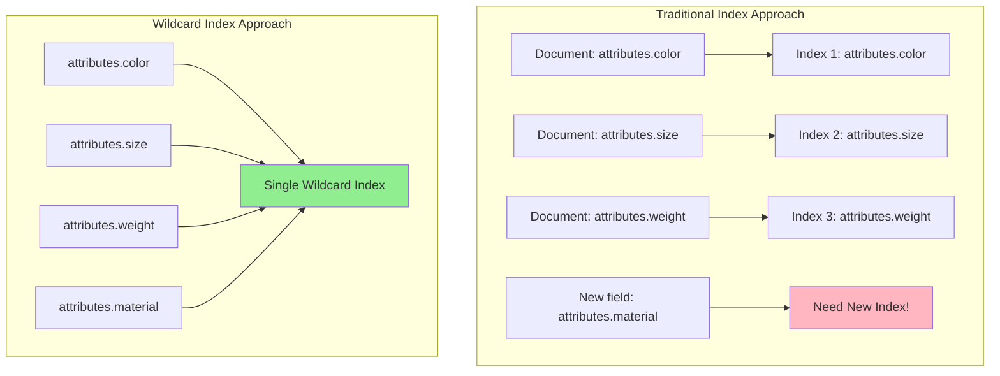

# How to Use MongoDB Wildcard Indexes

Author: [nawazdhandala](https://www.github.com/nawazdhandala)

Tags: MongoDB, Database, Indexes, Schema Design, Query Optimization

Description: Learn how to use MongoDB wildcard indexes to efficiently query documents with dynamic or unpredictable field names, perfect for user-defined attributes, metadata, and flexible schemas.

---

Wildcard indexes in MongoDB allow you to index fields without knowing their names in advance. They are designed for collections with dynamic schemas where documents have arbitrary or user-defined field names. Instead of creating separate indexes for each possible field, a single wildcard index covers all fields matching a pattern.

## When to Use Wildcard Indexes

Wildcard indexes are ideal for:

- Documents with user-defined attributes
- Collections storing arbitrary metadata
- Event data with varying properties
- Products with different attribute sets
- Any schema where field names are unpredictable



## Creating Wildcard Indexes

### Index All Fields

```javascript
// Index every field in every document
db.products.createIndex({ "$**": 1 });

// Now these queries all use the index
db.products.find({ name: "Widget" });
db.products.find({ "specs.color": "red" });
db.products.find({ "custom.field.deep.nested": "value" });
```

### Index Specific Subdocument

```javascript
// Index all fields under "attributes"
db.products.createIndex({ "attributes.$**": 1 });

// These use the index
db.products.find({ "attributes.color": "blue" });
db.products.find({ "attributes.size": "large" });
db.products.find({ "attributes.customField": "value" });

// This does NOT use the index (different path)
db.products.find({ name: "Widget" });
```

### Include/Exclude Specific Fields

```javascript
// Index only specific paths
db.events.createIndex(
  { "$**": 1 },
  {
    wildcardProjection: {
      "metadata": 1,
      "properties": 1
      // Only these paths are indexed
    }
  }
);

// Exclude specific paths
db.events.createIndex(
  { "$**": 1 },
  {
    wildcardProjection: {
      "largePayload": 0,
      "binaryData": 0
      // Everything except these is indexed
    }
  }
);
```

## Practical Use Cases

### 1. E-commerce Product Attributes

```javascript
// Products have varying attributes by category
const products = [
  {
    name: "Laptop",
    category: "electronics",
    attributes: {
      brand: "Dell",
      processor: "Intel i7",
      ram: "16GB",
      storage: "512GB SSD"
    }
  },
  {
    name: "T-Shirt",
    category: "clothing",
    attributes: {
      brand: "Nike",
      size: "L",
      color: "Blue",
      material: "Cotton"
    }
  },
  {
    name: "Sofa",
    category: "furniture",
    attributes: {
      brand: "IKEA",
      seats: 3,
      color: "Gray",
      dimensions: "200x90x85cm"
    }
  }
];

// Single wildcard index handles all attribute queries
db.products.createIndex({ "attributes.$**": 1 });

// All these queries use the index
db.products.find({ "attributes.processor": "Intel i7" });
db.products.find({ "attributes.size": "L" });
db.products.find({ "attributes.seats": 3 });
```

### 2. Event Tracking with Custom Properties

```javascript
// Events have varying properties
const events = [
  {
    type: "page_view",
    timestamp: new Date(),
    properties: {
      url: "/products",
      referrer: "google.com",
      browser: "Chrome"
    }
  },
  {
    type: "purchase",
    timestamp: new Date(),
    properties: {
      orderId: "ORD-123",
      total: 99.99,
      items: 3,
      paymentMethod: "credit_card"
    }
  },
  {
    type: "custom_event",
    timestamp: new Date(),
    properties: {
      customField1: "value1",
      customField2: 42,
      nested: { deep: "data" }
    }
  }
];

// Index event type and all properties
db.events.createIndex({ type: 1 });
db.events.createIndex({ "properties.$**": 1 });

// Query any property
db.events.find({ type: "purchase", "properties.paymentMethod": "credit_card" });
db.events.find({ "properties.browser": "Chrome" });
```

### 3. User Preferences and Settings

```javascript
// Users have custom preferences
db.users.insertMany([
  {
    email: "user1@example.com",
    preferences: {
      theme: "dark",
      language: "en",
      notifications: { email: true, sms: false }
    }
  },
  {
    email: "user2@example.com",
    preferences: {
      theme: "light",
      timezone: "UTC",
      dashboardLayout: "compact",
      customWidget: { enabled: true, position: 3 }
    }
  }
]);

// Index all preferences
db.users.createIndex({ "preferences.$**": 1 });

// Find users with specific preferences
db.users.find({ "preferences.theme": "dark" });
db.users.find({ "preferences.notifications.email": true });
db.users.find({ "preferences.customWidget.enabled": true });
```

### 4. Log Analysis

```javascript
// Application logs with varying context fields
db.logs.createIndex({ level: 1, timestamp: -1 });
db.logs.createIndex({ "context.$**": 1 });

// Insert logs with different contexts
db.logs.insertOne({
  level: "error",
  message: "Database connection failed",
  timestamp: new Date(),
  context: {
    service: "api",
    host: "server-01",
    errorCode: "ECONNREFUSED",
    port: 27017
  }
});

db.logs.insertOne({
  level: "error",
  message: "Payment failed",
  timestamp: new Date(),
  context: {
    service: "payment",
    orderId: "ORD-456",
    provider: "stripe",
    errorCode: "card_declined"
  }
});

// Query by any context field
db.logs.find({ level: "error", "context.service": "api" });
db.logs.find({ "context.errorCode": "card_declined" });
```

### 5. Dynamic Forms and Surveys

```javascript
// Survey responses with dynamic questions
db.responses.createIndex({ surveyId: 1 });
db.responses.createIndex({ "answers.$**": 1 });

// Store responses
db.responses.insertOne({
  surveyId: "survey-001",
  respondentId: "user-123",
  submittedAt: new Date(),
  answers: {
    q1_satisfaction: 4,
    q2_recommendation: "yes",
    q3_feedback: "Great product!",
    q4_custom_field: "custom value"
  }
});

// Analyze responses by any answer
db.responses.find({
  surveyId: "survey-001",
  "answers.q2_recommendation": "yes"
});
```

## Wildcard Index Limitations

### 1. No Compound Wildcard Indexes

```javascript
// This is NOT allowed
db.collection.createIndex({ category: 1, "attributes.$**": 1 });
// Error: compound wildcard indexes are not allowed

// Workaround: Create separate indexes
db.collection.createIndex({ category: 1 });
db.collection.createIndex({ "attributes.$**": 1 });
```

### 2. Cannot Index Array Elements by Position

```javascript
// Wildcard does not support positional array queries
db.collection.find({ "items.0.name": "Widget" });
// May not use wildcard index efficiently
```

### 3. Query Shape Matters

```javascript
// Wildcard index on attributes.$**
db.products.createIndex({ "attributes.$**": 1 });

// Uses index - single field query
db.products.find({ "attributes.color": "red" });

// Uses index - equality on one field
db.products.find({
  "attributes.color": "red",
  "attributes.size": "large"
});

// May use index less efficiently - range query
db.products.find({ "attributes.price": { $gt: 100 } });
```

### 4. Cannot Be Used for Sort

```javascript
// Wildcard index cannot be used for sorting
db.products.find({}).sort({ "attributes.name": 1 });
// Will require separate index or in-memory sort
```

## Analyzing Wildcard Index Usage

```javascript
// Check if wildcard index is used
const explain = db.products.find({
  "attributes.color": "red"
}).explain("executionStats");

// Look for IXSCAN stage
const plan = explain.queryPlanner.winningPlan;
console.log("Stage:", plan.stage);
if (plan.inputStage) {
  console.log("Input stage:", plan.inputStage.stage);
  console.log("Index name:", plan.inputStage.indexName);
}

// Function to analyze wildcard index usage
function analyzeWildcardUsage(collection, queries) {
  const results = [];

  for (const query of queries) {
    const explain = collection.find(query).explain("executionStats");
    const stats = explain.executionStats;

    results.push({
      query: JSON.stringify(query),
      indexUsed: explain.queryPlanner.winningPlan.inputStage?.indexName || "none",
      keysExamined: stats.totalKeysExamined,
      docsExamined: stats.totalDocsExamined,
      executionTimeMs: stats.executionTimeMillis
    });
  }

  return results;
}

// Test queries
const queries = [
  { "attributes.color": "red" },
  { "attributes.size": "large" },
  { "attributes.brand": "Nike" },
  { category: "electronics" }  // Won't use attributes wildcard
];

console.table(analyzeWildcardUsage(db.products, queries));
```

## Performance Considerations

### Index Size

```javascript
// Wildcard indexes can be large
const stats = db.products.stats();
console.log("Index sizes:");
for (const [name, size] of Object.entries(stats.indexSizes)) {
  console.log(`  ${name}: ${(size / 1024 / 1024).toFixed(2)} MB`);
}

// Use wildcardProjection to limit scope
db.products.createIndex(
  { "attributes.$**": 1 },
  {
    wildcardProjection: {
      "attributes.searchable": 1,
      "attributes.filterable": 1
    }
  }
);
```

### Write Performance

```javascript
// Wildcard indexes update on every document change
// Monitor write performance
const opCounters = db.serverStatus().opcounters;
console.log("Insert operations:", opCounters.insert);
console.log("Update operations:", opCounters.update);

// Consider partial wildcard indexes for frequently updated collections
db.events.createIndex(
  { "properties.$**": 1 },
  {
    partialFilterExpression: { archived: { $ne: true } }
  }
);
```

## Best Practices

1. **Scope wildcard indexes narrowly** - Index specific subdocuments rather than entire documents

2. **Use wildcardProjection** - Include or exclude specific paths to control index size

3. **Combine with regular indexes** - Use standard indexes for known, frequently queried fields

4. **Monitor index size** - Wildcard indexes can grow large with many unique field names

5. **Test query patterns** - Verify your queries actually use the wildcard index

```javascript
// Good: Scoped wildcard with regular indexes
db.products.createIndex({ category: 1, status: 1 });  // Known fields
db.products.createIndex({ "attributes.$**": 1 });      // Dynamic fields

// Query combines both indexes
db.products.find({
  category: "electronics",
  status: "active",
  "attributes.brand": "Apple"
});
```

## Summary

Wildcard indexes solve the challenge of querying dynamic schemas:

1. **Use for dynamic fields** - User-defined attributes, metadata, arbitrary properties
2. **Scope appropriately** - Index specific subdocuments when possible
3. **Combine with regular indexes** - Use standard indexes for known fields
4. **Monitor size and performance** - Large wildcard indexes affect write performance
5. **Test your queries** - Verify wildcard index usage with explain()

When you need to query fields that are unpredictable at schema design time, wildcard indexes provide a flexible and efficient solution.
