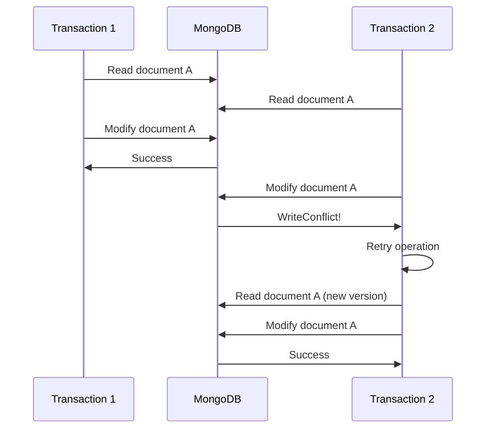

# How to Fix 'WriteConflict' Errors in MongoDB

Author: [nawazdhandala](https://www.github.com/nawazdhandala)

Tags: MongoDB, Database, Troubleshooting, Transactions, Concurrency, WiredTiger

Description: Learn how to diagnose and resolve MongoDB WriteConflict errors caused by concurrent document modifications, with strategies for transaction design, retry logic, and conflict prevention.

---

WriteConflict errors occur when multiple operations try to modify the same document simultaneously. MongoDB's WiredTiger storage engine uses optimistic concurrency control, which means it allows concurrent operations but aborts one when a conflict is detected. Understanding why these conflicts happen and how to handle them is crucial for building robust applications.

## Understanding WriteConflict

When two operations attempt to modify the same document at the same time, MongoDB detects the conflict and aborts one operation with a WriteConflict error.



## Common Causes

### 1. Hot Documents

A "hot document" is one that receives frequent concurrent updates:

```javascript
// Counter document - extremely hot
db.counters.updateOne(
  { _id: "pageViews" },
  { $inc: { count: 1 } }
);

// User balance - hot during high activity
db.users.updateOne(
  { _id: userId },
  { $inc: { balance: amount } }
);
```

### 2. Long-Running Transactions

Transactions that hold locks for extended periods increase conflict probability:

```javascript
// BAD: Long transaction
session.startTransaction();
const orders = await db.orders.find({ status: "pending" }).toArray();
// Process each order (takes time)
for (const order of orders) {
  await processOrder(order);  // External API calls
  await db.orders.updateOne(
    { _id: order._id },
    { $set: { status: "processed" } },
    { session }
  );
}
await session.commitTransaction();  // Held lock for too long
```

### 3. Overlapping Update Patterns

Multiple processes updating the same documents:

```javascript
// Worker 1: Update inventory
db.products.updateOne(
  { _id: productId },
  { $inc: { inventory: -1 } }
);

// Worker 2: Update same inventory
db.products.updateOne(
  { _id: productId },
  { $inc: { inventory: -1 } }
);
```

## Solutions

### Solution 1: Implement Retry Logic

MongoDB automatically retries WriteConflict within single operations, but you should implement application-level retries for transactions:

```javascript
async function executeWithRetry(operation, maxRetries = 5) {
  let lastError;

  for (let attempt = 1; attempt <= maxRetries; attempt++) {
    try {
      return await operation();
    } catch (error) {
      lastError = error;

      // Check if error is retryable
      if (error.hasErrorLabel?.('TransientTransactionError') ||
          error.code === 112 ||  // WriteConflict
          error.message?.includes('WriteConflict')) {

        console.log(`WriteConflict on attempt ${attempt}, retrying...`);

        // Exponential backoff with jitter
        const delay = Math.min(100 * Math.pow(2, attempt) + Math.random() * 100, 5000);
        await new Promise(resolve => setTimeout(resolve, delay));
        continue;
      }

      throw error;
    }
  }

  throw lastError;
}

// Usage
await executeWithRetry(async () => {
  const session = client.startSession();
  try {
    session.startTransaction();

    await db.accounts.updateOne(
      { _id: fromAccount },
      { $inc: { balance: -amount } },
      { session }
    );

    await db.accounts.updateOne(
      { _id: toAccount },
      { $inc: { balance: amount } },
      { session }
    );

    await session.commitTransaction();
  } finally {
    await session.endSession();
  }
});
```

### Solution 2: Use findOneAndUpdate with Atomic Operations

Reduce conflicts by using atomic operations instead of read-modify-write patterns:

```javascript
// BAD: Read-modify-write (two operations)
const user = await db.users.findOne({ _id: userId });
user.balance += amount;
await db.users.updateOne({ _id: userId }, { $set: { balance: user.balance } });

// GOOD: Single atomic operation
await db.users.updateOne(
  { _id: userId },
  { $inc: { balance: amount } }
);

// GOOD: Atomic with conditions
const result = await db.users.findOneAndUpdate(
  { _id: userId, balance: { $gte: amount } },  // Condition
  { $inc: { balance: -amount } },
  { returnDocument: 'after' }
);

if (!result) {
  throw new Error('Insufficient balance');
}
```

### Solution 3: Sharded Counters for Hot Documents

Distribute writes across multiple counter documents:

```javascript
// Create sharded counter
const SHARD_COUNT = 10;

async function incrementCounter(counterId, amount = 1) {
  const shardId = Math.floor(Math.random() * SHARD_COUNT);

  await db.counters.updateOne(
    { _id: `${counterId}_${shardId}` },
    { $inc: { count: amount } },
    { upsert: true }
  );
}

async function getCounter(counterId) {
  const shards = await db.counters.find({
    _id: { $regex: `^${counterId}_` }
  }).toArray();

  return shards.reduce((sum, shard) => sum + shard.count, 0);
}

// Usage
await incrementCounter('pageViews');
const totalViews = await getCounter('pageViews');
```

### Solution 4: Optimistic Locking with Version Numbers

Add a version field to detect stale updates:

```javascript
// Document with version
{
  _id: "doc123",
  data: { ... },
  version: 1
}

async function updateWithOptimisticLock(docId, updateFn, maxRetries = 5) {
  for (let attempt = 1; attempt <= maxRetries; attempt++) {
    // Read current document
    const doc = await db.documents.findOne({ _id: docId });

    if (!doc) {
      throw new Error('Document not found');
    }

    // Apply update function
    const updatedData = updateFn(doc.data);

    // Try to update with version check
    const result = await db.documents.updateOne(
      { _id: docId, version: doc.version },
      {
        $set: { data: updatedData },
        $inc: { version: 1 }
      }
    );

    if (result.modifiedCount === 1) {
      return { ...doc, data: updatedData, version: doc.version + 1 };
    }

    // Version mismatch - retry
    console.log(`Version conflict on attempt ${attempt}, retrying...`);
    await new Promise(resolve => setTimeout(resolve, 50 * attempt));
  }

  throw new Error('Max retries exceeded');
}

// Usage
const updated = await updateWithOptimisticLock('doc123', (data) => {
  data.lastModified = new Date();
  data.counter += 1;
  return data;
});
```

### Solution 5: Reduce Transaction Scope

Keep transactions short and focused:

```javascript
// BAD: Everything in one transaction
session.startTransaction();
const items = await db.items.find({ status: "pending" }).toArray();
for (const item of items) {
  await externalApi.process(item);  // Slow external call
  await db.items.updateOne({ _id: item._id }, { $set: { status: "done" } }, { session });
}
await session.commitTransaction();

// GOOD: Minimal transaction scope
const items = await db.items.find({ status: "pending" }).toArray();

for (const item of items) {
  // Process outside transaction
  await externalApi.process(item);

  // Quick transaction for database update
  const session = client.startSession();
  try {
    session.startTransaction();
    await db.items.updateOne(
      { _id: item._id, status: "pending" },  // Verify still pending
      { $set: { status: "done", processedAt: new Date() } },
      { session }
    );
    await session.commitTransaction();
  } finally {
    await session.endSession();
  }
}
```

### Solution 6: Document-Level Queuing

For high-contention scenarios, use a queue pattern:

```javascript
// Instead of updating directly, queue the operation
async function queueBalanceUpdate(userId, amount, type) {
  await db.balanceQueue.insertOne({
    userId: userId,
    amount: amount,
    type: type,
    status: 'pending',
    createdAt: new Date()
  });
}

// Process queue with single worker per user
async function processBalanceQueue(userId) {
  const session = client.startSession();

  try {
    session.startTransaction();

    // Get pending operations for this user
    const operations = await db.balanceQueue.find({
      userId: userId,
      status: 'pending'
    }).sort({ createdAt: 1 }).toArray();

    if (operations.length === 0) {
      await session.abortTransaction();
      return;
    }

    // Calculate total change
    const totalChange = operations.reduce((sum, op) => sum + op.amount, 0);

    // Single update
    await db.users.updateOne(
      { _id: userId },
      { $inc: { balance: totalChange } },
      { session }
    );

    // Mark as processed
    await db.balanceQueue.updateMany(
      { _id: { $in: operations.map(op => op._id) } },
      { $set: { status: 'processed', processedAt: new Date() } },
      { session }
    );

    await session.commitTransaction();
  } catch (error) {
    await session.abortTransaction();
    throw error;
  } finally {
    await session.endSession();
  }
}
```

## Monitoring WriteConflicts

Track WriteConflict frequency to identify problem areas:

```javascript
// Check server status for WriteConflict metrics
const status = await db.adminCommand({ serverStatus: 1 });

console.log('WiredTiger concurrency stats:');
console.log('  Write conflicts:', status.wiredTiger.concurrentTransactions.write.out);
console.log('  Read tickets:', status.wiredTiger.concurrentTransactions.read.available);
console.log('  Write tickets:', status.wiredTiger.concurrentTransactions.write.available);

// Enable profiling to catch conflicts
db.setProfilingLevel(1, { slowms: 100 });

// Query profiler for WriteConflict
db.system.profile.find({
  "errMsg": /WriteConflict/
}).sort({ ts: -1 }).limit(10);
```

## Summary

WriteConflict errors are a natural part of concurrent MongoDB applications. Handle them effectively by:

1. **Implement retry logic** - Automatic retries with exponential backoff
2. **Use atomic operations** - Avoid read-modify-write patterns
3. **Shard hot documents** - Distribute load across multiple documents
4. **Use optimistic locking** - Version fields for conflict detection
5. **Keep transactions short** - Minimize lock duration
6. **Consider queuing** - Serialize high-contention updates

With proper handling, WriteConflicts become a manageable aspect of concurrent programming rather than a source of application failures.
