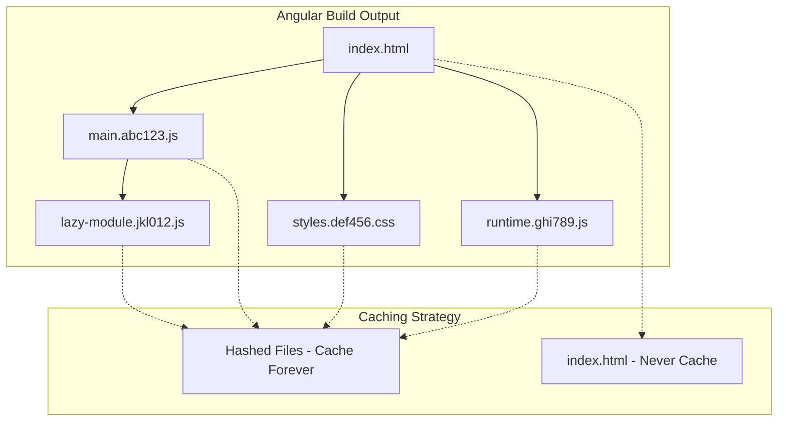

# How to Fix Angular Cache Issues After Deployment

Author: [nawazdhandala](https://github.com/nawazdhandala)

Tags: Nginx, Angular, Caching, Deployment, Web Development

Description: Learn how to configure Nginx to properly handle Angular application caching after deployments, ensuring users always get the latest version while maintaining optimal performance.

---

One of the most frustrating issues in web development is when users report seeing an old version of your Angular application after a deployment. The culprit is almost always browser caching, and the solution requires understanding how Angular's build system works with Nginx caching headers.

## Understanding the Problem

Angular applications are Single Page Applications (SPAs) that consist of several types of files:



When you run `ng build --configuration production`, Angular generates files with content hashes in their names (like `main.abc123.js`). These hashes change when the file content changes. The `index.html` references these hashed files.

The problem occurs when browsers cache `index.html` - they keep requesting the old hashed files that may no longer exist.

## The Solution: Proper Nginx Cache Headers

The key is to configure different caching policies for different file types:

```nginx
server {
    listen 80;
    server_name myapp.com;
    root /var/www/angular-app;
    index index.html;

    # HTML files - never cache
    location ~* \.html$ {
        expires -1;
        add_header Cache-Control "no-store, no-cache, must-revalidate, proxy-revalidate, max-age=0";
        add_header Pragma "no-cache";
    }

    # JavaScript and CSS with hash in filename - cache aggressively
    location ~* \.(?:css|js)$ {
        expires 1y;
        add_header Cache-Control "public, max-age=31536000, immutable";
        access_log off;
    }

    # Static assets - cache with revalidation
    location ~* \.(?:ico|gif|jpe?g|png|svg|woff2?|ttf|eot|otf)$ {
        expires 6M;
        add_header Cache-Control "public, max-age=15552000";
        access_log off;
    }

    # JSON files (may include configuration) - short cache
    location ~* \.json$ {
        expires 1h;
        add_header Cache-Control "public, max-age=3600";
    }

    # Angular routing - serve index.html for all routes
    location / {
        try_files $uri $uri/ /index.html;

        # Apply no-cache headers to index.html served via try_files
        add_header Cache-Control "no-store, no-cache, must-revalidate, proxy-revalidate, max-age=0";
        add_header Pragma "no-cache";
    }
}
```

## Complete Production Configuration

Here's a comprehensive configuration for Angular applications:

```nginx
server {
    listen 80;
    server_name myapp.com;
    return 301 https://$server_name$request_uri;
}

server {
    listen 443 ssl http2;
    server_name myapp.com;

    ssl_certificate /etc/letsencrypt/live/myapp.com/fullchain.pem;
    ssl_certificate_key /etc/letsencrypt/live/myapp.com/privkey.pem;

    root /var/www/angular-app/browser;
    index index.html;

    # Gzip compression
    gzip on;
    gzip_vary on;
    gzip_min_length 1024;
    gzip_proxied any;
    gzip_types
        text/plain
        text/css
        text/javascript
        application/javascript
        application/json
        application/xml
        image/svg+xml;

    # Brotli compression (if module available)
    # brotli on;
    # brotli_types text/plain text/css application/javascript application/json image/svg+xml;

    # Security headers
    add_header X-Frame-Options "SAMEORIGIN" always;
    add_header X-Content-Type-Options "nosniff" always;
    add_header X-XSS-Protection "1; mode=block" always;
    add_header Referrer-Policy "strict-origin-when-cross-origin" always;

    # Main location block for Angular routing
    location / {
        try_files $uri $uri/ /index.html;
    }

    # Explicit handling for index.html
    location = /index.html {
        expires -1;
        add_header Cache-Control "no-store, no-cache, must-revalidate, proxy-revalidate, max-age=0";
        add_header Pragma "no-cache";
        add_header X-Frame-Options "SAMEORIGIN" always;
        add_header X-Content-Type-Options "nosniff" always;
    }

    # ngsw-worker.js - Service Worker (never cache)
    location = /ngsw-worker.js {
        expires -1;
        add_header Cache-Control "no-store, no-cache, must-revalidate, proxy-revalidate, max-age=0";
    }

    # ngsw.json - Service Worker manifest (never cache)
    location = /ngsw.json {
        expires -1;
        add_header Cache-Control "no-store, no-cache, must-revalidate, proxy-revalidate, max-age=0";
    }

    # Hashed JavaScript files
    location ~* \.(?:[a-f0-9]{16,20})\.js$ {
        expires 1y;
        add_header Cache-Control "public, max-age=31536000, immutable";
        access_log off;
    }

    # Hashed CSS files
    location ~* \.(?:[a-f0-9]{16,20})\.css$ {
        expires 1y;
        add_header Cache-Control "public, max-age=31536000, immutable";
        access_log off;
    }

    # Non-hashed JS/CSS (runtime config, etc.) - short cache
    location ~* ^(?!.*\.[a-f0-9]{16,20}\.).*\.(?:css|js)$ {
        expires 1h;
        add_header Cache-Control "public, max-age=3600";
    }

    # Static assets
    location ~* \.(?:ico|gif|jpe?g|png|webp|svg|woff2?|ttf|eot|otf)$ {
        expires 6M;
        add_header Cache-Control "public, max-age=15552000";
        access_log off;
    }

    # API proxy (if backend on same server)
    location /api/ {
        proxy_pass http://localhost:3000/;
        proxy_http_version 1.1;
        proxy_set_header Host $host;
        proxy_set_header X-Real-IP $remote_addr;
        proxy_set_header X-Forwarded-For $proxy_add_x_forwarded_for;
        proxy_set_header X-Forwarded-Proto $scheme;

        # Never cache API responses at nginx level
        add_header Cache-Control "no-store";
    }
}
```

## Handling Angular Service Worker

If you're using Angular's PWA features with service workers, special attention is needed:

```nginx
# Service worker files must NEVER be cached
location ~ ^/(ngsw-worker\.js|ngsw\.json|safety-worker\.js)$ {
    expires -1;
    add_header Cache-Control "no-store, no-cache, must-revalidate, proxy-revalidate, max-age=0";
    add_header Pragma "no-cache";
}

# Manifest file - short cache
location = /manifest.webmanifest {
    expires 1d;
    add_header Cache-Control "public, max-age=86400";
}
```

## Version Check Implementation

Add a version check mechanism to force reload when versions mismatch:

Create a version endpoint in your API or a static file:

```json
// /assets/version.json
{
  "version": "1.2.3",
  "buildTime": "2025-12-16T10:30:00Z",
  "commit": "abc123"
}
```

Nginx configuration for version file:

```nginx
location = /assets/version.json {
    expires -1;
    add_header Cache-Control "no-store, no-cache, must-revalidate";
    add_header Access-Control-Allow-Origin "*";
}
```

Angular service to check version:

```typescript
// version-check.service.ts
import { Injectable } from '@angular/core';
import { HttpClient } from '@angular/common/http';
import { interval, firstValueFrom } from 'rxjs';

@Injectable({
  providedIn: 'root'
})
export class VersionCheckService {
  private currentVersion: string | null = null;

  constructor(private http: HttpClient) {}

  async initVersionCheck(): Promise<void> {
    // Get initial version
    const version = await this.fetchVersion();
    this.currentVersion = version;

    // Check every 5 minutes
    interval(5 * 60 * 1000).subscribe(() => {
      this.checkForUpdates();
    });
  }

  private async fetchVersion(): Promise<string> {
    const response = await firstValueFrom(
      this.http.get<{ version: string }>('/assets/version.json')
    );
    return response.version;
  }

  private async checkForUpdates(): Promise<void> {
    try {
      const latestVersion = await this.fetchVersion();

      if (this.currentVersion && latestVersion !== this.currentVersion) {
        // New version available - prompt user or auto-reload
        if (confirm('A new version is available. Reload now?')) {
          window.location.reload();
        }
      }
    } catch (error) {
      console.error('Version check failed:', error);
    }
  }
}
```

## Testing Cache Headers

Verify your cache headers are working correctly:

```bash
# Check index.html headers
curl -I https://myapp.com/

# Expected output should include:
# Cache-Control: no-store, no-cache, must-revalidate
# Pragma: no-cache

# Check hashed JS file headers
curl -I https://myapp.com/main.abc123def.js

# Expected output should include:
# Cache-Control: public, max-age=31536000, immutable
# Expires: (date 1 year in future)
```

## Deployment Script

Include cache busting in your deployment process:

```bash
#!/bin/bash
# deploy.sh

set -e

APP_DIR="/var/www/angular-app"
BACKUP_DIR="/var/www/angular-app-backup"

echo "Building Angular application..."
ng build --configuration production

echo "Creating backup..."
rm -rf $BACKUP_DIR
cp -r $APP_DIR $BACKUP_DIR

echo "Deploying new version..."
rm -rf $APP_DIR/*
cp -r dist/my-app/browser/* $APP_DIR/

echo "Setting permissions..."
chown -R www-data:www-data $APP_DIR
chmod -R 755 $APP_DIR

echo "Clearing nginx cache (if using proxy_cache)..."
rm -rf /var/cache/nginx/*

echo "Reloading nginx..."
nginx -t && systemctl reload nginx

echo "Deployment complete!"

# Generate version file
VERSION=$(node -p "require('./package.json').version")
BUILD_TIME=$(date -u +"%Y-%m-%dT%H:%M:%SZ")
COMMIT=$(git rev-parse --short HEAD 2>/dev/null || echo "unknown")

cat > $APP_DIR/assets/version.json << EOF
{
  "version": "$VERSION",
  "buildTime": "$BUILD_TIME",
  "commit": "$COMMIT"
}
EOF
```

## Cache Headers Summary

| File Type | Cache-Control | Expires | Reason |
|-----------|---------------|---------|--------|
| index.html | no-store, no-cache | -1 | Always check for updates |
| main.*.js | public, immutable | 1 year | Content-hashed, never changes |
| styles.*.css | public, immutable | 1 year | Content-hashed, never changes |
| ngsw-worker.js | no-store, no-cache | -1 | Service worker must be fresh |
| assets/*.png | public | 6 months | Static, rarely changes |
| version.json | no-store | -1 | Version checking |

## Common Issues and Solutions

1. **Browser still shows old version**: Clear browser cache manually or use incognito mode to verify the server configuration is correct.

2. **CDN caching**: If using a CDN, configure purge on deployment or use versioned URLs.

3. **Service worker caching old content**: Implement proper service worker update handling in your Angular app.

4. **Proxy caching**: If using `proxy_cache` in Nginx, clear the cache directory on deployment.

By implementing these configurations, your Angular application will always serve the latest version to users while maintaining optimal performance through aggressive caching of immutable assets.
