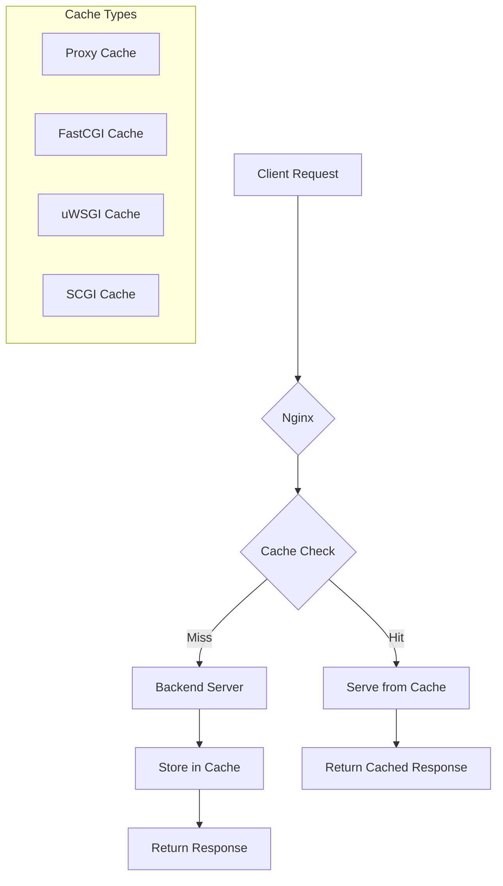

# How to Clear Nginx Cache

Author: [nawazdhandala](https://www.github.com/nawazdhandala)

Tags: Nginx, Cache, Performance, Troubleshooting, Proxy Cache, FastCGI Cache

Description: A complete guide to clearing Nginx cache including proxy cache, FastCGI cache, and browser cache. Learn manual and automated cache purging methods with practical examples.

---

## Understanding Nginx Caching

Nginx provides several caching mechanisms to improve performance and reduce backend load. Knowing how to clear these caches is essential for deploying updates and troubleshooting issues.



## Cache Types in Nginx

### 1. Proxy Cache

Used when Nginx acts as a reverse proxy:

```nginx
proxy_cache_path /var/cache/nginx/proxy levels=1:2 keys_zone=proxy_cache:10m max_size=1g inactive=60m;

server {
    location / {
        proxy_cache proxy_cache;
        proxy_cache_valid 200 60m;
        proxy_cache_valid 404 1m;
        proxy_pass http://backend;
    }
}
```

### 2. FastCGI Cache

Used with PHP-FPM and other FastCGI applications:

```nginx
fastcgi_cache_path /var/cache/nginx/fastcgi levels=1:2 keys_zone=fastcgi_cache:10m max_size=1g inactive=60m;

server {
    location ~ \.php$ {
        fastcgi_cache fastcgi_cache;
        fastcgi_cache_valid 200 60m;
        fastcgi_pass unix:/var/run/php-fpm.sock;
    }
}
```

## Method 1: Delete Cache Directory Contents

The simplest method is to remove all files from the cache directory:

```bash
# Find your cache directory from nginx config
grep -r "cache_path" /etc/nginx/

# Clear proxy cache
sudo rm -rf /var/cache/nginx/proxy/*

# Clear FastCGI cache
sudo rm -rf /var/cache/nginx/fastcgi/*

# Clear all Nginx caches
sudo rm -rf /var/cache/nginx/*

# Reload Nginx (optional but recommended)
sudo nginx -s reload
```

### Safe Cache Clearing Script

Create a reusable script for safe cache clearing:

```bash
#!/bin/bash
# clear-nginx-cache.sh

CACHE_DIR="/var/cache/nginx"
BACKUP_DIR="/var/cache/nginx-backup"
LOG_FILE="/var/log/nginx-cache-clear.log"

log() {
    echo "$(date '+%Y-%m-%d %H:%M:%S') - $1" | tee -a "$LOG_FILE"
}

# Check if cache directory exists
if [ ! -d "$CACHE_DIR" ]; then
    log "ERROR: Cache directory $CACHE_DIR does not exist"
    exit 1
fi

# Calculate cache size before clearing
CACHE_SIZE=$(du -sh "$CACHE_DIR" 2>/dev/null | cut -f1)
log "Current cache size: $CACHE_SIZE"

# Clear the cache
log "Clearing Nginx cache..."
find "$CACHE_DIR" -type f -delete
find "$CACHE_DIR" -type d -empty -delete

# Recreate directory structure
mkdir -p "$CACHE_DIR/proxy"
mkdir -p "$CACHE_DIR/fastcgi"

# Set proper permissions
chown -R nginx:nginx "$CACHE_DIR"
chmod -R 755 "$CACHE_DIR"

log "Cache cleared successfully"

# Verify Nginx is still running properly
if nginx -t 2>/dev/null; then
    nginx -s reload
    log "Nginx reloaded successfully"
else
    log "ERROR: Nginx configuration test failed"
    exit 1
fi
```

## Method 2: Use proxy_cache_purge Module

The `ngx_cache_purge` module allows selective cache purging via HTTP requests:

### Installation

```bash
# On Ubuntu/Debian with nginx-extras
sudo apt-get install nginx-extras

# Or compile from source
wget https://github.com/FRiCKLE/ngx_cache_purge/archive/master.zip
unzip master.zip
# Add --add-module=../ngx_cache_purge-master to nginx configure
```

### Configuration

```nginx
proxy_cache_path /var/cache/nginx/proxy levels=1:2 keys_zone=proxy_cache:10m max_size=1g inactive=60m;

server {
    listen 80;
    server_name example.com;

    location / {
        proxy_cache proxy_cache;
        proxy_cache_key $scheme$host$request_uri;
        proxy_cache_valid 200 60m;
        proxy_pass http://backend;

        # Add cache status header for debugging
        add_header X-Cache-Status $upstream_cache_status;
    }

    # Purge endpoint - restrict access!
    location ~ /purge(/.*) {
        allow 127.0.0.1;
        allow 10.0.0.0/8;
        deny all;

        proxy_cache_purge proxy_cache $scheme$host$1;
    }
}
```

### Usage

```bash
# Purge a specific URL
curl -X PURGE http://example.com/purge/api/users

# Purge with wildcard (if supported)
curl -X PURGE http://example.com/purge/api/*

# Check cache status
curl -I http://example.com/api/users | grep X-Cache-Status
```

## Method 3: Automatic Cache Invalidation

Configure Nginx to automatically invalidate cache based on backend responses:

```nginx
server {
    listen 80;
    server_name example.com;

    location / {
        proxy_cache proxy_cache;
        proxy_cache_key $scheme$host$request_uri;
        proxy_cache_valid 200 60m;

        # Bypass cache for specific conditions
        proxy_cache_bypass $http_cache_control;
        proxy_no_cache $http_pragma;

        # Respect backend cache headers
        proxy_cache_revalidate on;
        proxy_cache_use_stale error timeout updating http_500 http_502 http_503 http_504;

        # Bypass cache for POST requests
        proxy_cache_methods GET HEAD;

        proxy_pass http://backend;
    }
}
```

### Cache Bypass Headers

```bash
# Force cache bypass
curl -H "Cache-Control: no-cache" http://example.com/api/data

# Or use Pragma
curl -H "Pragma: no-cache" http://example.com/api/data
```

## Method 4: Clear Browser Cache via Headers

Force browsers to fetch fresh content:

```nginx
server {
    listen 80;
    server_name example.com;

    # For static assets with versioning
    location ~* \.(js|css)$ {
        expires 1y;
        add_header Cache-Control "public, immutable";
    }

    # For dynamic content - no caching
    location /api/ {
        add_header Cache-Control "no-store, no-cache, must-revalidate, proxy-revalidate";
        add_header Pragma "no-cache";
        add_header Expires "0";
        proxy_pass http://backend;
    }

    # For HTML files - short cache with revalidation
    location ~* \.html$ {
        add_header Cache-Control "no-cache, must-revalidate";
        expires 0;
    }
}
```

## Method 5: Cache Zones Management

Manage multiple cache zones independently:

```nginx
# Define multiple cache zones
proxy_cache_path /var/cache/nginx/static levels=1:2 keys_zone=static_cache:10m max_size=5g inactive=7d;
proxy_cache_path /var/cache/nginx/api levels=1:2 keys_zone=api_cache:10m max_size=1g inactive=1h;
proxy_cache_path /var/cache/nginx/images levels=1:2 keys_zone=image_cache:10m max_size=10g inactive=30d;

server {
    # Static files - long cache
    location /static/ {
        proxy_cache static_cache;
        proxy_cache_valid 200 7d;
        proxy_pass http://backend;
    }

    # API responses - short cache
    location /api/ {
        proxy_cache api_cache;
        proxy_cache_valid 200 5m;
        proxy_cache_valid 404 1m;
        proxy_pass http://backend;
    }

    # Images - medium cache
    location /images/ {
        proxy_cache image_cache;
        proxy_cache_valid 200 30d;
        proxy_pass http://backend;
    }
}
```

Clear specific zones:

```bash
# Clear only API cache
sudo rm -rf /var/cache/nginx/api/*

# Clear only static cache
sudo rm -rf /var/cache/nginx/static/*

# Keep image cache intact
```

## Cache Monitoring Script

Monitor cache usage and clear when necessary:

```bash
#!/bin/bash
# monitor-nginx-cache.sh

CACHE_DIR="/var/cache/nginx"
MAX_SIZE_GB=10
ALERT_THRESHOLD=80

# Get current cache size in GB
CACHE_SIZE=$(du -s "$CACHE_DIR" | awk '{print $1/1024/1024}')

# Calculate percentage used
PERCENT_USED=$(echo "scale=2; $CACHE_SIZE / $MAX_SIZE_GB * 100" | bc)

echo "Cache size: ${CACHE_SIZE}GB (${PERCENT_USED}% of ${MAX_SIZE_GB}GB limit)"

# Alert if above threshold
if (( $(echo "$PERCENT_USED > $ALERT_THRESHOLD" | bc -l) )); then
    echo "WARNING: Cache usage above ${ALERT_THRESHOLD}%"

    # Optional: Auto-clear old cache entries
    find "$CACHE_DIR" -type f -atime +7 -delete
    echo "Cleared cache entries older than 7 days"
fi

# Output cache statistics
echo "Cache breakdown:"
for dir in "$CACHE_DIR"/*/; do
    if [ -d "$dir" ]; then
        SIZE=$(du -sh "$dir" 2>/dev/null | cut -f1)
        echo "  $(basename "$dir"): $SIZE"
    fi
done
```

## Automated Cache Clearing with Cron

Set up automatic cache clearing:

```bash
# Edit crontab
sudo crontab -e

# Clear cache every night at 3 AM
0 3 * * * /usr/local/bin/clear-nginx-cache.sh >> /var/log/nginx-cache-cron.log 2>&1

# Monitor cache size every hour
0 * * * * /usr/local/bin/monitor-nginx-cache.sh >> /var/log/nginx-cache-monitor.log 2>&1
```

## Docker Cache Clearing

For Nginx running in Docker:

```bash
# Clear cache inside container
docker exec nginx rm -rf /var/cache/nginx/*

# Or mount cache as volume and clear from host
docker run -d --name nginx \
    -v nginx-cache:/var/cache/nginx \
    nginx:latest

# Clear from host
docker volume inspect nginx-cache --format '{{ .Mountpoint }}'
sudo rm -rf /var/lib/docker/volumes/nginx-cache/_data/*
```

## Key Takeaways

1. Know your cache directories by checking `proxy_cache_path` in your config
2. Use the `ngx_cache_purge` module for selective purging via HTTP
3. Implement proper cache headers to control browser caching
4. Monitor cache size and set up automated cleanup
5. Use multiple cache zones for different content types
6. Always reload Nginx after clearing cache to ensure consistency
7. Monitor cache hit rates with OneUptime to optimize your caching strategy

Proper cache management ensures your users receive fresh content while maintaining optimal performance from your Nginx servers.
