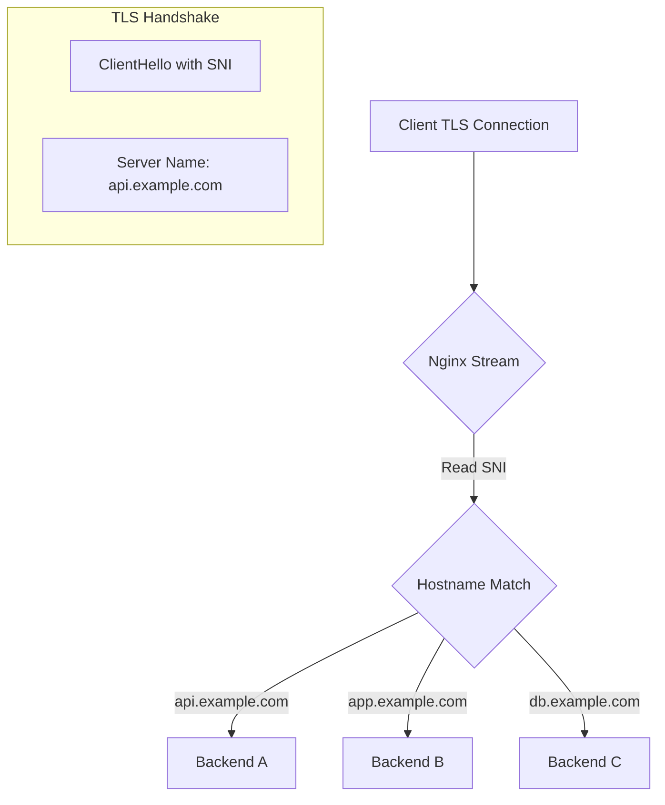

# How to Configure Nginx TCP Forwarding Based on Hostname

Author: [nawazdhandala](https://www.github.com/nawazdhandala)

Tags: Nginx, TCP Proxy, Stream Module, SNI, Load Balancing, SSL Passthrough

Description: Learn how to configure Nginx stream module for TCP forwarding based on hostname using SNI, enabling routing of TLS traffic to different backends without terminating SSL.

---

## Understanding TCP Forwarding with SNI

Unlike HTTP proxying where Nginx can inspect the Host header, TCP connections are opaque. However, for TLS connections, Nginx can use Server Name Indication (SNI) - a TLS extension that sends the hostname in the initial handshake - to route traffic to different backends without decrypting the traffic.



## Prerequisites

Nginx must be compiled with the stream module:

```bash
# Check if stream module is available
nginx -V 2>&1 | grep -o with-stream

# On Ubuntu/Debian, install nginx-full or nginx-extras
sudo apt-get install nginx-full
```

## Basic Stream Configuration

The stream configuration goes in the main nginx.conf or a separate file:

```nginx
# /etc/nginx/nginx.conf

user nginx;
worker_processes auto;
error_log /var/log/nginx/error.log warn;
pid /var/run/nginx.pid;

events {
    worker_connections 1024;
}

# Stream module for TCP/UDP proxying
stream {
    # Log format for stream connections
    log_format stream_log '$remote_addr [$time_local] '
                          '$protocol $status $bytes_sent $bytes_received '
                          '$session_time "$ssl_preread_server_name"';

    access_log /var/log/nginx/stream-access.log stream_log;

    # Map SNI hostname to backend
    map $ssl_preread_server_name $backend {
        api.example.com     api_backend;
        app.example.com     app_backend;
        db.example.com      db_backend;
        default             default_backend;
    }

    # Backend upstream definitions
    upstream api_backend {
        server 192.168.1.10:443;
    }

    upstream app_backend {
        server 192.168.1.20:443;
    }

    upstream db_backend {
        server 192.168.1.30:443;
    }

    upstream default_backend {
        server 192.168.1.100:443;
    }

    # Main server block
    server {
        listen 443;
        proxy_pass $backend;
        ssl_preread on;
    }
}

# HTTP configuration (separate from stream)
http {
    # Your HTTP configuration here
}
```

## SNI-Based Routing for Multiple Services

### Configuration with Wildcard Support

```nginx
stream {
    log_format stream '$remote_addr [$time_local] '
                      '$protocol $status $bytes_sent $bytes_received '
                      '$session_time "$ssl_preread_server_name"';

    access_log /var/log/nginx/stream.log stream;

    # Map with wildcard support
    map $ssl_preread_server_name $backend {
        hostnames;

        # Exact matches
        api.example.com             api_upstream;
        app.example.com             app_upstream;

        # Wildcard matches
        *.api.example.com           api_upstream;
        *.staging.example.com       staging_upstream;

        # Regex match (requires ~ prefix)
        ~^db-\d+\.example\.com$     db_upstream;

        # Default fallback
        default                      default_upstream;
    }

    upstream api_upstream {
        server 10.0.1.10:443;
        server 10.0.1.11:443;
    }

    upstream app_upstream {
        server 10.0.2.10:443;
        server 10.0.2.11:443;
    }

    upstream staging_upstream {
        server 10.0.3.10:443;
    }

    upstream db_upstream {
        server 10.0.4.10:3306;
    }

    upstream default_upstream {
        server 10.0.0.10:443;
    }

    server {
        listen 443;
        ssl_preread on;
        proxy_pass $backend;
        proxy_connect_timeout 10s;
    }
}
```

## Load Balancing with Health Checks

```nginx
stream {
    upstream api_backend {
        zone api_backend 64k;

        # Weighted load balancing
        server 192.168.1.10:443 weight=5;
        server 192.168.1.11:443 weight=3;
        server 192.168.1.12:443 backup;

        # Health check settings (Nginx Plus feature)
        # For open source, use max_fails and fail_timeout
        server 192.168.1.10:443 max_fails=3 fail_timeout=30s;
    }

    upstream app_backend {
        zone app_backend 64k;

        # Least connections load balancing
        least_conn;

        server 192.168.2.10:443;
        server 192.168.2.11:443;
        server 192.168.2.12:443;
    }

    map $ssl_preread_server_name $backend {
        api.example.com     api_backend;
        app.example.com     app_backend;
        default             app_backend;
    }

    server {
        listen 443;
        ssl_preread on;
        proxy_pass $backend;

        # Connection timeouts
        proxy_connect_timeout 10s;
        proxy_timeout 300s;
    }
}
```

## Mixed HTTP and Stream Configuration

When you need both HTTP proxying and TCP passthrough:

```nginx
user nginx;
worker_processes auto;
error_log /var/log/nginx/error.log warn;
pid /var/run/nginx.pid;

events {
    worker_connections 2048;
}

# TCP/TLS passthrough for specific services
stream {
    log_format stream '$remote_addr [$time_local] '
                      '$protocol $status $bytes_sent $bytes_received '
                      '$session_time sni="$ssl_preread_server_name"';

    access_log /var/log/nginx/stream.log stream;

    map $ssl_preread_server_name $stream_backend {
        # Services that need SSL passthrough (no termination)
        db.example.com          db_backend;
        mail.example.com        mail_backend;
        vpn.example.com         vpn_backend;

        # Everything else goes to HTTP handler
        default                 http_backend;
    }

    upstream db_backend {
        server 10.0.1.10:3306;
    }

    upstream mail_backend {
        server 10.0.2.10:993;
    }

    upstream vpn_backend {
        server 10.0.3.10:443;
    }

    upstream http_backend {
        server 127.0.0.1:8443;
    }

    server {
        listen 443;
        ssl_preread on;
        proxy_pass $stream_backend;
        proxy_connect_timeout 10s;
    }
}

# HTTP/HTTPS configuration
http {
    include /etc/nginx/mime.types;
    default_type application/octet-stream;

    log_format main '$remote_addr - $remote_user [$time_local] "$request" '
                    '$status $body_bytes_sent "$http_referer" '
                    '"$http_user_agent"';

    access_log /var/log/nginx/access.log main;

    # Internal HTTPS server (receives from stream)
    server {
        listen 127.0.0.1:8443 ssl;
        server_name *.example.com;

        ssl_certificate /etc/nginx/ssl/wildcard.example.com.crt;
        ssl_certificate_key /etc/nginx/ssl/wildcard.example.com.key;

        location / {
            proxy_pass http://web_backend;
            proxy_set_header Host $host;
            proxy_set_header X-Real-IP $remote_addr;
        }
    }

    upstream web_backend {
        server 10.0.0.10:8080;
        server 10.0.0.11:8080;
    }
}
```

## Non-TLS TCP Forwarding

For non-TLS TCP services, you cannot use SNI. Instead, use different ports:

```nginx
stream {
    # MySQL on different ports per environment
    upstream mysql_prod {
        server 10.0.1.10:3306;
        server 10.0.1.11:3306 backup;
    }

    upstream mysql_staging {
        server 10.0.2.10:3306;
    }

    upstream mysql_dev {
        server 10.0.3.10:3306;
    }

    # Production MySQL
    server {
        listen 3306;
        proxy_pass mysql_prod;
        proxy_connect_timeout 5s;
        proxy_timeout 3600s;
    }

    # Staging MySQL
    server {
        listen 3307;
        proxy_pass mysql_staging;
        proxy_connect_timeout 5s;
    }

    # Development MySQL
    server {
        listen 3308;
        proxy_pass mysql_dev;
        proxy_connect_timeout 5s;
    }

    # Redis
    upstream redis_cluster {
        server 10.0.4.10:6379;
        server 10.0.4.11:6379;
        server 10.0.4.12:6379;
    }

    server {
        listen 6379;
        proxy_pass redis_cluster;
        proxy_connect_timeout 5s;
        proxy_timeout 300s;
    }
}
```

## UDP Forwarding

Nginx can also forward UDP traffic:

```nginx
stream {
    upstream dns_servers {
        server 8.8.8.8:53;
        server 8.8.4.4:53;
    }

    server {
        listen 53 udp;
        proxy_pass dns_servers;
        proxy_timeout 1s;
        proxy_responses 1;
    }
}
```

## Proxy Protocol Support

When you need to preserve client IP information:

```nginx
stream {
    upstream backend_with_proxy_protocol {
        server 192.168.1.10:443;
    }

    server {
        listen 443;
        ssl_preread on;
        proxy_pass backend_with_proxy_protocol;

        # Send PROXY protocol header to backend
        proxy_protocol on;
    }
}
```

Backend must be configured to accept PROXY protocol.

## Connection Limits and Timeouts

```nginx
stream {
    # Limit connections per IP
    limit_conn_zone $binary_remote_addr zone=stream_conn:10m;

    upstream backend {
        server 192.168.1.10:443;
    }

    server {
        listen 443;
        ssl_preread on;
        proxy_pass backend;

        # Connection limits
        limit_conn stream_conn 10;

        # Timeouts
        proxy_connect_timeout 10s;
        proxy_timeout 300s;

        # TCP keepalive
        proxy_socket_keepalive on;
    }
}
```

## Debugging Stream Configuration

### Test Configuration

```bash
# Check configuration syntax
nginx -t

# View full configuration
nginx -T | grep -A 50 "stream {"
```

### Check Logs

```bash
# Watch stream access log
tail -f /var/log/nginx/stream.log

# Check for errors
tail -f /var/log/nginx/error.log | grep stream
```

### Test SNI Routing

```bash
# Test with openssl to see which backend is selected
openssl s_client -connect nginx-server:443 -servername api.example.com

# Check if connection succeeds
curl -v --resolve api.example.com:443:NGINX_IP https://api.example.com/health
```

## Complete Production Example

```nginx
user nginx;
worker_processes auto;
error_log /var/log/nginx/error.log warn;
pid /var/run/nginx.pid;

events {
    worker_connections 4096;
}

stream {
    log_format stream_detailed '$remote_addr [$time_local] '
                               'protocol=$protocol status=$status '
                               'bytes_sent=$bytes_sent bytes_recv=$bytes_received '
                               'session=$session_time upstream=$upstream_addr '
                               'sni="$ssl_preread_server_name"';

    access_log /var/log/nginx/stream.log stream_detailed;
    error_log /var/log/nginx/stream-error.log warn;

    # Connection limiting
    limit_conn_zone $binary_remote_addr zone=stream_limit:10m;

    # SNI-based routing map
    map $ssl_preread_server_name $backend {
        hostnames;

        # Production services
        api.example.com         api_prod;
        app.example.com         app_prod;
        admin.example.com       admin_prod;

        # Staging services
        *.staging.example.com   staging_cluster;

        # Database connections (TLS)
        db.example.com          db_cluster;

        # Default to main web servers
        default                 web_default;
    }

    # Upstream definitions
    upstream api_prod {
        zone api_prod 64k;
        least_conn;
        server 10.1.1.10:443 weight=5 max_fails=3 fail_timeout=30s;
        server 10.1.1.11:443 weight=5 max_fails=3 fail_timeout=30s;
        server 10.1.1.12:443 backup;
    }

    upstream app_prod {
        zone app_prod 64k;
        server 10.1.2.10:443;
        server 10.1.2.11:443;
    }

    upstream admin_prod {
        zone admin_prod 64k;
        server 10.1.3.10:443;
    }

    upstream staging_cluster {
        zone staging 64k;
        server 10.2.1.10:443;
    }

    upstream db_cluster {
        zone db 64k;
        server 10.3.1.10:5432;
        server 10.3.1.11:5432 backup;
    }

    upstream web_default {
        zone web_default 64k;
        server 10.1.0.10:443;
        server 10.1.0.11:443;
    }

    # Main TLS listener
    server {
        listen 443;
        ssl_preread on;
        proxy_pass $backend;

        # Connection settings
        limit_conn stream_limit 100;
        proxy_connect_timeout 10s;
        proxy_timeout 3600s;
        proxy_socket_keepalive on;
    }
}

http {
    # Your HTTP configuration here
}
```

## Key Takeaways

1. Use the `stream` module for TCP/UDP forwarding - it is separate from `http`
2. Enable `ssl_preread on` to read SNI from TLS handshakes
3. Use `map` directive to route based on `$ssl_preread_server_name`
4. SNI-based routing only works with TLS connections
5. For non-TLS TCP, use different ports for different services
6. Consider connection limits and timeouts for production
7. Enable detailed logging for debugging routing decisions
8. Monitor stream connections with OneUptime to track backend health and connection patterns

TCP forwarding with SNI allows you to route encrypted traffic to different backends without terminating TLS at the proxy, which is useful for database connections, mail servers, and other TCP services that manage their own encryption.
