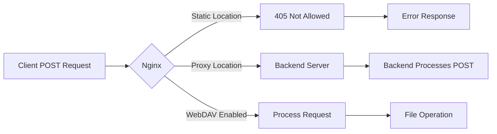

# How to Fix '405 Not Allowed' for POST Requests in Nginx

Author: [nawazdhandala](https://www.github.com/nawazdhandala)

Tags: Nginx, Troubleshooting, HTTP Methods, POST Requests, Static Files, Configuration

Description: A comprehensive guide to diagnosing and fixing HTTP 405 Not Allowed errors for POST requests in Nginx, covering static file handling, proxy configurations, and WebDAV scenarios.

---

## Understanding the 405 Error

The HTTP 405 "Method Not Allowed" status code indicates that the server recognizes the request method but it is not supported for the requested resource. In Nginx, this commonly occurs when you send POST requests to locations that are configured to serve static files.



## Common Causes

### 1. POST to Static File Locations

By default, Nginx only allows GET and HEAD methods for static file locations:

```nginx
location / {
    root /var/www/html;
    index index.html;
}
```

If you POST to this location, you will receive a 405 error because Nginx does not know how to handle POST requests for static files.

### 2. Missing Proxy Configuration

When Nginx should forward POST requests to a backend but is instead trying to serve them as static files:

```nginx
# This will fail for POST requests
location /api {
    root /var/www/html;  # Wrong - trying to serve static files
}
```

### 3. try_files Directive Issues

The `try_files` directive can cause 405 errors when it falls through to a static file:

```nginx
location / {
    try_files $uri $uri/ /index.html;  # Falls back to static index.html
}
```

## Solution 1: Allow POST for Static Files

If you genuinely need to accept POST requests to static resources (uncommon but sometimes required for single-page applications), use the `error_page` directive:

```nginx
location / {
    root /var/www/html;
    index index.html;

    # Convert 405 to 200 and serve the file anyway
    error_page 405 =200 $uri;
}
```

A more explicit approach:

```nginx
location / {
    root /var/www/html;
    index index.html;

    # Handle POST requests for static files
    if ($request_method = POST) {
        return 200;
    }
}
```

## Solution 2: Proxy POST Requests to Backend

The most common and recommended solution is to proxy POST requests to your application server:

```nginx
server {
    listen 80;
    server_name example.com;

    # Serve static files
    location / {
        root /var/www/html;
        index index.html;
        try_files $uri $uri/ @backend;
    }

    # API endpoints - proxy all methods including POST
    location /api/ {
        proxy_pass http://localhost:3000;
        proxy_http_version 1.1;
        proxy_set_header Host $host;
        proxy_set_header X-Real-IP $remote_addr;
        proxy_set_header X-Forwarded-For $proxy_add_x_forwarded_for;
        proxy_set_header X-Forwarded-Proto $scheme;
    }

    # Named location for fallback
    location @backend {
        proxy_pass http://localhost:3000;
        proxy_set_header Host $host;
        proxy_set_header X-Real-IP $remote_addr;
    }
}
```

## Solution 3: Single Page Application Configuration

For SPAs that need to handle POST requests on any route:

```nginx
server {
    listen 80;
    server_name example.com;

    root /var/www/html;
    index index.html;

    # API requests go to backend
    location /api/ {
        proxy_pass http://localhost:3000;
        proxy_http_version 1.1;
        proxy_set_header Host $host;
        proxy_set_header X-Real-IP $remote_addr;
        proxy_set_header X-Forwarded-For $proxy_add_x_forwarded_for;
    }

    # All other requests serve the SPA
    location / {
        try_files $uri $uri/ /index.html;

        # Allow POST requests to return index.html for client-side routing
        error_page 405 =200 /index.html;
    }
}
```

## Solution 4: Enable WebDAV for File Uploads

If you need POST (or PUT/DELETE) for actual file operations, enable the WebDAV module:

```nginx
location /uploads/ {
    root /var/www;

    # Enable WebDAV methods
    dav_methods PUT DELETE MKCOL COPY MOVE;
    dav_ext_methods PROPFIND OPTIONS;

    # Allow file creation
    create_full_put_path on;
    dav_access user:rw group:rw all:r;

    # Authentication (important for security)
    auth_basic "Restricted";
    auth_basic_user_file /etc/nginx/.htpasswd;
}
```

## Solution 5: Method-Based Routing

Route different HTTP methods to different backends:

```nginx
server {
    listen 80;
    server_name example.com;

    location / {
        # GET requests serve static files
        if ($request_method = GET) {
            root /var/www/html;
        }

        # POST requests go to the application
        if ($request_method = POST) {
            proxy_pass http://localhost:3000;
        }
    }
}
```

A cleaner approach using map:

```nginx
map $request_method $backend {
    GET     static;
    POST    application;
    PUT     application;
    DELETE  application;
    default static;
}

server {
    listen 80;
    server_name example.com;

    location / {
        if ($backend = static) {
            root /var/www/html;
        }

        if ($backend = application) {
            proxy_pass http://localhost:3000;
        }
    }
}
```

## Solution 6: CORS and Preflight Requests

Sometimes 405 errors occur due to CORS preflight (OPTIONS) requests. Handle them properly:

```nginx
server {
    listen 80;
    server_name api.example.com;

    location /api/ {
        # Handle CORS preflight
        if ($request_method = OPTIONS) {
            add_header Access-Control-Allow-Origin *;
            add_header Access-Control-Allow-Methods "GET, POST, PUT, DELETE, OPTIONS";
            add_header Access-Control-Allow-Headers "Authorization, Content-Type";
            add_header Access-Control-Max-Age 86400;
            add_header Content-Length 0;
            add_header Content-Type text/plain;
            return 204;
        }

        # Add CORS headers to all responses
        add_header Access-Control-Allow-Origin * always;
        add_header Access-Control-Allow-Methods "GET, POST, PUT, DELETE, OPTIONS" always;
        add_header Access-Control-Allow-Headers "Authorization, Content-Type" always;

        proxy_pass http://localhost:3000;
        proxy_http_version 1.1;
        proxy_set_header Host $host;
        proxy_set_header X-Real-IP $remote_addr;
    }
}
```

## Complete Configuration Example

Here is a comprehensive configuration handling various POST scenarios:

```nginx
user nginx;
worker_processes auto;
error_log /var/log/nginx/error.log warn;
pid /var/run/nginx.pid;

events {
    worker_connections 1024;
}

http {
    include /etc/nginx/mime.types;
    default_type application/octet-stream;

    log_format main '$remote_addr - $remote_user [$time_local] "$request" '
                    '$status $body_bytes_sent "$http_referer" '
                    '"$http_user_agent" "$request_method"';

    access_log /var/log/nginx/access.log main;

    sendfile on;
    keepalive_timeout 65;

    # Upstream backend servers
    upstream backend {
        server localhost:3000;
        keepalive 32;
    }

    server {
        listen 80;
        server_name example.com;

        root /var/www/html;
        index index.html;

        # Static assets - GET only
        location ~* \.(js|css|png|jpg|jpeg|gif|ico|svg|woff|woff2)$ {
            expires 1y;
            add_header Cache-Control "public, immutable";
            access_log off;
        }

        # API endpoints - all methods
        location /api/ {
            proxy_pass http://backend;
            proxy_http_version 1.1;
            proxy_set_header Connection "";
            proxy_set_header Host $host;
            proxy_set_header X-Real-IP $remote_addr;
            proxy_set_header X-Forwarded-For $proxy_add_x_forwarded_for;
            proxy_set_header X-Forwarded-Proto $scheme;

            # Increase timeouts for long-running POST requests
            proxy_connect_timeout 60s;
            proxy_send_timeout 60s;
            proxy_read_timeout 60s;
        }

        # File upload endpoint
        location /upload/ {
            client_max_body_size 100M;
            proxy_pass http://backend;
            proxy_http_version 1.1;
            proxy_set_header Host $host;
            proxy_request_buffering off;
        }

        # SPA fallback - serves index.html for all routes
        location / {
            try_files $uri $uri/ /index.html;
        }
    }
}
```

## Debugging 405 Errors

Use these commands to diagnose the issue:

```bash
# Test POST request with curl
curl -X POST -v http://example.com/api/endpoint

# Check which location block handles the request
nginx -T | grep -A 10 "location"

# View error logs
tail -f /var/log/nginx/error.log

# Test configuration syntax
nginx -t

# Check response headers
curl -I -X POST http://example.com/endpoint
```

## Key Takeaways

1. Nginx returns 405 for POST requests to static file locations by default
2. Use `proxy_pass` to forward POST requests to application servers
3. For SPAs, use `error_page 405 =200` as a fallback
4. Handle CORS preflight OPTIONS requests separately
5. Always test with `curl -X POST` to verify your configuration
6. Monitor 405 errors with OneUptime to catch misconfigurations early

Understanding how Nginx handles different HTTP methods helps you build proper configurations that route requests correctly to your static files and application backends.
