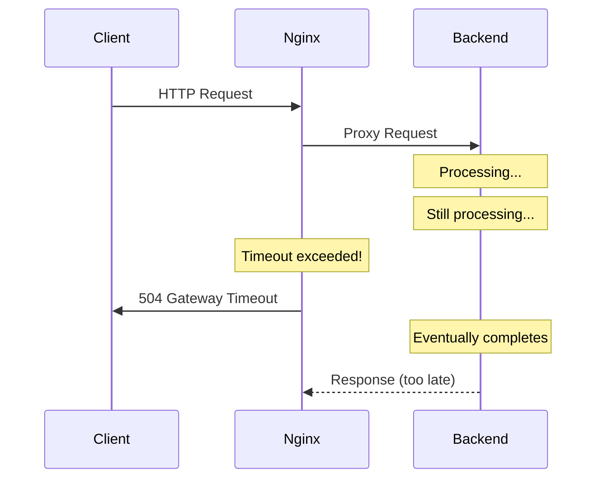

# How to Fix '504 Gateway Timeout' in Nginx Reverse Proxy

Author: [nawazdhandala](https://www.github.com/nawazdhandala)

Tags: Nginx, Troubleshooting, Gateway Timeout, Reverse Proxy, Performance, Timeout Configuration

Description: A comprehensive guide to diagnosing and fixing 504 Gateway Timeout errors in Nginx reverse proxy configurations, including timeout tuning, backend debugging, and performance optimization.

---

## Understanding 504 Gateway Timeout

The 504 Gateway Timeout error occurs when Nginx, acting as a reverse proxy, does not receive a timely response from the upstream server. This means your backend application took too long to process the request, and Nginx gave up waiting.



## Root Causes

### 1. Backend Processing Too Slow

The most common cause is that your application genuinely takes too long:

- Complex database queries
- External API calls
- Heavy computation
- Resource contention

### 2. Nginx Timeouts Too Short

Default Nginx timeouts might be insufficient for your application:

```nginx
# Default values (often too short)
proxy_connect_timeout 60s;
proxy_send_timeout 60s;
proxy_read_timeout 60s;
```

### 3. Backend Server Overloaded

The upstream server cannot handle the load:

- Too many concurrent connections
- Memory exhaustion
- CPU saturation
- Database connection pool exhausted

### 4. Network Issues

Problems between Nginx and the backend:

- DNS resolution delays
- Network latency
- Firewall issues
- Connection drops

## Solution 1: Increase Nginx Timeouts

Adjust timeout values based on your application's needs:

```nginx
server {
    listen 80;
    server_name example.com;

    location / {
        proxy_pass http://backend;

        # Connection timeout - time to establish connection to backend
        proxy_connect_timeout 60s;

        # Send timeout - time between two write operations to backend
        proxy_send_timeout 90s;

        # Read timeout - time between two read operations from backend
        proxy_read_timeout 90s;

        # Additional headers
        proxy_http_version 1.1;
        proxy_set_header Host $host;
        proxy_set_header X-Real-IP $remote_addr;
        proxy_set_header X-Forwarded-For $proxy_add_x_forwarded_for;
        proxy_set_header Connection "";
    }
}
```

### Long-Running Operations

For endpoints that legitimately take long (reports, exports, etc.):

```nginx
location /api/reports {
    proxy_pass http://backend;

    # Extended timeouts for long operations
    proxy_connect_timeout 60s;
    proxy_send_timeout 300s;
    proxy_read_timeout 300s;

    # Disable buffering for streaming responses
    proxy_buffering off;
}
```

## Solution 2: FastCGI Timeout Configuration

For PHP-FPM and other FastCGI backends:

```nginx
location ~ \.php$ {
    fastcgi_pass unix:/var/run/php-fpm.sock;
    fastcgi_index index.php;

    # FastCGI timeouts
    fastcgi_connect_timeout 60s;
    fastcgi_send_timeout 90s;
    fastcgi_read_timeout 90s;

    # Buffer settings
    fastcgi_buffer_size 128k;
    fastcgi_buffers 4 256k;
    fastcgi_busy_buffers_size 256k;

    include fastcgi_params;
    fastcgi_param SCRIPT_FILENAME $document_root$fastcgi_script_name;
}
```

## Solution 3: Upstream Configuration with Health Checks

Configure upstream servers with proper timeouts and failover:

```nginx
upstream backend {
    # Load balancing with failover
    server 192.168.1.10:3000 weight=5 max_fails=3 fail_timeout=30s;
    server 192.168.1.11:3000 weight=5 max_fails=3 fail_timeout=30s;
    server 192.168.1.12:3000 backup;

    # Connection pooling
    keepalive 32;
    keepalive_requests 1000;
    keepalive_timeout 60s;
}

server {
    listen 80;
    server_name example.com;

    location / {
        proxy_pass http://backend;
        proxy_http_version 1.1;
        proxy_set_header Connection "";

        # Timeouts
        proxy_connect_timeout 10s;
        proxy_send_timeout 60s;
        proxy_read_timeout 60s;

        # Next upstream on error
        proxy_next_upstream error timeout http_500 http_502 http_503 http_504;
        proxy_next_upstream_timeout 30s;
        proxy_next_upstream_tries 3;
    }
}
```

## Solution 4: Buffer Optimization

Improper buffering can cause timeout issues:

```nginx
location / {
    proxy_pass http://backend;

    # Buffer settings
    proxy_buffering on;
    proxy_buffer_size 4k;
    proxy_buffers 8 32k;
    proxy_busy_buffers_size 64k;

    # Temporary file settings for large responses
    proxy_temp_file_write_size 64k;
    proxy_max_temp_file_size 1024m;
}
```

For streaming or Server-Sent Events:

```nginx
location /api/stream {
    proxy_pass http://backend;

    # Disable buffering for real-time data
    proxy_buffering off;
    proxy_cache off;

    # Extended read timeout for long-lived connections
    proxy_read_timeout 3600s;

    # Required for SSE
    proxy_set_header Connection '';
    proxy_http_version 1.1;
    chunked_transfer_encoding off;
}
```

## Solution 5: Debug and Monitor

### Enable Detailed Logging

```nginx
http {
    log_format upstream_time '$remote_addr - $remote_user [$time_local] '
        '"$request" $status $body_bytes_sent '
        '"$http_referer" "$http_user_agent" '
        'rt=$request_time uct="$upstream_connect_time" '
        'uht="$upstream_header_time" urt="$upstream_response_time"';

    access_log /var/log/nginx/access.log upstream_time;
}
```

### Monitor Upstream Response Times

```bash
# Watch for slow requests
tail -f /var/log/nginx/access.log | awk '$NF > 5 {print}'

# Find 504 errors
grep " 504 " /var/log/nginx/access.log | tail -20

# Analyze upstream times
awk '{print $NF}' /var/log/nginx/access.log | sort -n | tail -20
```

## Solution 6: Backend Optimization

### Check Backend Health

```bash
# Test backend response time directly
curl -w "@curl-format.txt" -o /dev/null -s http://localhost:3000/api/endpoint

# curl-format.txt content:
#     time_namelookup:  %{time_namelookup}s\n
#        time_connect:  %{time_connect}s\n
#     time_appconnect:  %{time_appconnect}s\n
#    time_pretransfer:  %{time_pretransfer}s\n
#       time_redirect:  %{time_redirect}s\n
#  time_starttransfer:  %{time_starttransfer}s\n
#                     ----------\n
#          time_total:  %{time_total}s\n
```

### Database Query Optimization

```sql
-- Enable slow query log (MySQL)
SET GLOBAL slow_query_log = 'ON';
SET GLOBAL long_query_time = 2;
SET GLOBAL slow_query_log_file = '/var/log/mysql/slow-query.log';

-- Find slow queries
SELECT * FROM mysql.slow_log ORDER BY query_time DESC LIMIT 10;
```

### Application-Level Fixes

```python
# Python/Flask - Add request timeout
from flask import Flask
import signal

app = Flask(__name__)

class TimeoutError(Exception):
    pass

def timeout_handler(signum, frame):
    raise TimeoutError("Request timed out")

@app.before_request
def limit_request_time():
    signal.signal(signal.SIGALRM, timeout_handler)
    signal.alarm(30)  # 30 second timeout

@app.after_request
def cancel_timeout(response):
    signal.alarm(0)
    return response
```

## Solution 7: Implement Request Queuing

For high-traffic scenarios, implement proper queuing:

```nginx
# Limit connections to prevent overload
upstream backend {
    server localhost:3000 max_conns=100;
    queue 100 timeout=30s;
}

# Rate limiting
limit_req_zone $binary_remote_addr zone=api:10m rate=10r/s;

server {
    location /api/ {
        limit_req zone=api burst=20 nodelay;
        proxy_pass http://backend;
    }
}
```

## Complete Configuration Example

```nginx
user nginx;
worker_processes auto;
error_log /var/log/nginx/error.log warn;
pid /var/run/nginx.pid;

events {
    worker_connections 4096;
    use epoll;
    multi_accept on;
}

http {
    include /etc/nginx/mime.types;
    default_type application/octet-stream;

    log_format detailed '$remote_addr - $remote_user [$time_local] '
        '"$request" $status $body_bytes_sent '
        'rt=$request_time uct=$upstream_connect_time '
        'uht=$upstream_header_time urt=$upstream_response_time '
        'us=$upstream_status';

    access_log /var/log/nginx/access.log detailed;

    sendfile on;
    tcp_nopush on;
    tcp_nodelay on;
    keepalive_timeout 65;

    upstream backend {
        server app1:3000 weight=5 max_fails=3 fail_timeout=30s;
        server app2:3000 weight=5 max_fails=3 fail_timeout=30s;
        keepalive 32;
    }

    server {
        listen 80;
        server_name example.com;

        # Default location with standard timeouts
        location / {
            proxy_pass http://backend;
            proxy_http_version 1.1;
            proxy_set_header Host $host;
            proxy_set_header X-Real-IP $remote_addr;
            proxy_set_header X-Forwarded-For $proxy_add_x_forwarded_for;
            proxy_set_header Connection "";

            proxy_connect_timeout 10s;
            proxy_send_timeout 60s;
            proxy_read_timeout 60s;

            proxy_next_upstream error timeout http_502 http_503 http_504;
            proxy_next_upstream_tries 2;
        }

        # Long-running operations
        location /api/reports {
            proxy_pass http://backend;
            proxy_http_version 1.1;
            proxy_set_header Host $host;
            proxy_set_header X-Real-IP $remote_addr;

            proxy_connect_timeout 10s;
            proxy_send_timeout 300s;
            proxy_read_timeout 300s;

            proxy_buffering off;
        }

        # Health check endpoint
        location /health {
            access_log off;
            proxy_pass http://backend;
            proxy_connect_timeout 5s;
            proxy_read_timeout 5s;
        }
    }
}
```

## Monitoring with OneUptime

Set up comprehensive monitoring to catch 504 errors before they impact users:

1. Monitor Nginx access logs for 504 status codes
2. Track upstream response times and alert on degradation
3. Set up synthetic monitoring to test critical endpoints
4. Configure alerts for when error rates exceed thresholds

## Key Takeaways

1. Start by identifying whether the issue is Nginx timeouts or backend performance
2. Increase timeouts incrementally - do not just set everything to very high values
3. Use different timeout values for different endpoints based on expected response times
4. Enable detailed logging to track upstream response times
5. Implement proper upstream failover and health checks
6. Optimize your backend application and database queries
7. Use connection pooling with keepalive connections
8. Monitor continuously and set up alerts for 504 errors

The goal is not just to increase timeouts, but to understand why requests are slow and optimize accordingly. Use OneUptime to track response times and get alerted before users experience problems.
