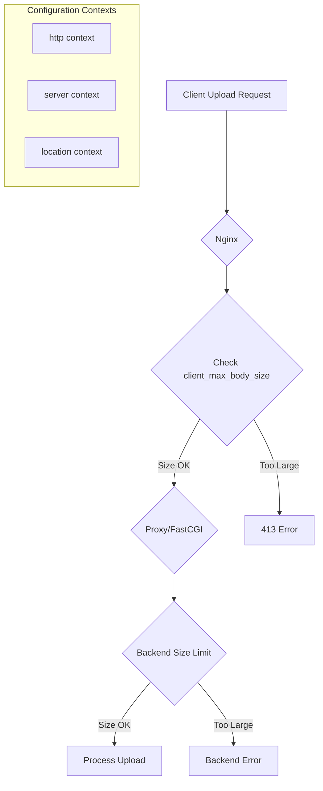
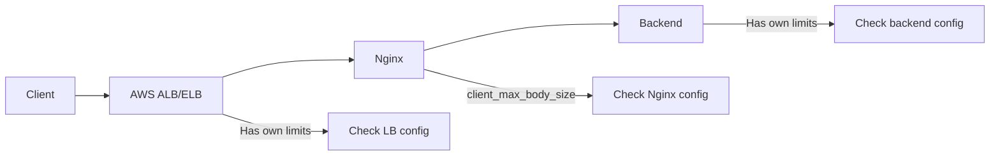

# How to Fix 'client_max_body_size has no effect' in Nginx

Author: [nawazdhandala](https://www.github.com/nawazdhandala)

Tags: Nginx, Troubleshooting, File Upload, Configuration, Proxy, PHP

Description: Learn why client_max_body_size might not work as expected in Nginx and how to properly configure upload limits across all contexts including proxy and FastCGI configurations.

---

## Understanding the Problem

You have set `client_max_body_size` in your Nginx configuration, but large file uploads still fail with "413 Request Entity Too Large" errors. This is a frustrating issue that stems from understanding how Nginx configuration contexts work and how different modules interact.



## Why client_max_body_size Might Not Work

### 1. Wrong Configuration Context

The directive must be in the correct context. Settings in inner blocks override outer blocks:

```nginx
# This won't work for location /upload/
http {
    client_max_body_size 100M;  # Applied to http context

    server {
        client_max_body_size 10M;  # Overrides http context

        location /upload/ {
            client_max_body_size 1M;  # Overrides server context - only 1M allowed!
        }
    }
}
```

### 2. Missing in Location Block

If you have it in `http` but not in your specific `location`:

```nginx
http {
    client_max_body_size 100M;

    server {
        location /upload/ {
            # client_max_body_size is inherited, but check it's not overridden
            proxy_pass http://backend;
        }
    }
}
```

### 3. Multiple Configuration Files

Nginx includes files in order, and later includes can override earlier settings:

```nginx
# /etc/nginx/nginx.conf
http {
    client_max_body_size 100M;
    include /etc/nginx/conf.d/*.conf;  # Later files might override!
}
```

Check included files:

```bash
# Find all client_max_body_size declarations
grep -r "client_max_body_size" /etc/nginx/
```

### 4. Backend Server Limits

Even if Nginx allows large uploads, your backend might reject them:

- **PHP**: `upload_max_filesize` and `post_max_size` in php.ini
- **Node.js**: Body parser limits
- **Django**: `DATA_UPLOAD_MAX_MEMORY_SIZE`
- **Spring**: `spring.servlet.multipart.max-file-size`

## Complete Solution

### Step 1: Configure Nginx Properly

```nginx
# /etc/nginx/nginx.conf
user nginx;
worker_processes auto;
error_log /var/log/nginx/error.log warn;
pid /var/run/nginx.pid;

events {
    worker_connections 1024;
}

http {
    include /etc/nginx/mime.types;
    default_type application/octet-stream;

    # Global upload limit - applies to all servers/locations unless overridden
    client_max_body_size 100M;

    # Timeouts for large uploads
    client_body_timeout 300s;
    send_timeout 300s;

    # Buffer settings for large requests
    client_body_buffer_size 128k;

    include /etc/nginx/conf.d/*.conf;
}
```

### Step 2: Server Block Configuration

```nginx
# /etc/nginx/conf.d/upload.conf
server {
    listen 80;
    server_name upload.example.com;

    # Server-level limit
    client_max_body_size 100M;

    # Regular requests - smaller limit
    location / {
        client_max_body_size 10M;
        proxy_pass http://backend;
    }

    # Upload endpoint - larger limit
    location /api/upload {
        # Override with larger limit for this specific endpoint
        client_max_body_size 500M;

        # Extended timeouts for large uploads
        client_body_timeout 600s;
        proxy_read_timeout 600s;
        proxy_send_timeout 600s;

        # Don't buffer the upload
        proxy_request_buffering off;

        # Pass to backend
        proxy_pass http://backend;
        proxy_http_version 1.1;
        proxy_set_header Host $host;
        proxy_set_header X-Real-IP $remote_addr;
        proxy_set_header X-Forwarded-For $proxy_add_x_forwarded_for;
        proxy_set_header Content-Length $content_length;
    }
}
```

### Step 3: PHP/FastCGI Configuration

For PHP applications, configure both Nginx and PHP:

```nginx
# Nginx configuration for PHP
location ~ \.php$ {
    client_max_body_size 100M;

    fastcgi_pass unix:/var/run/php-fpm.sock;
    fastcgi_index index.php;
    fastcgi_param SCRIPT_FILENAME $document_root$fastcgi_script_name;
    include fastcgi_params;

    # FastCGI specific settings for large uploads
    fastcgi_read_timeout 300s;
    fastcgi_send_timeout 300s;
    fastcgi_buffer_size 128k;
    fastcgi_buffers 4 256k;
    fastcgi_busy_buffers_size 256k;
}
```

```ini
; /etc/php/8.2/fpm/php.ini
upload_max_filesize = 100M
post_max_size = 100M
max_execution_time = 300
max_input_time = 300
memory_limit = 256M
```

### Step 4: Node.js Backend Configuration

```javascript
// Express.js configuration
const express = require('express');
const app = express();

// Body parser limits
app.use(express.json({ limit: '100mb' }));
app.use(express.urlencoded({ limit: '100mb', extended: true }));

// For file uploads with multer
const multer = require('multer');
const upload = multer({
    limits: {
        fileSize: 100 * 1024 * 1024, // 100MB
    },
    dest: 'uploads/'
});

app.post('/api/upload', upload.single('file'), (req, res) => {
    res.json({ message: 'File uploaded successfully' });
});
```

## Verification Steps

### 1. Test Configuration Syntax

```bash
nginx -t
```

### 2. Check Effective Configuration

```bash
# See the full configuration with all includes
nginx -T | grep -A 5 "client_max_body_size"

# Check specific location
nginx -T | grep -A 20 "location /upload"
```

### 3. Test Upload with curl

```bash
# Create a test file
dd if=/dev/zero of=test-50mb.bin bs=1M count=50

# Test upload
curl -X POST -F "file=@test-50mb.bin" -v http://example.com/api/upload

# Check response headers for errors
curl -I -X POST http://example.com/api/upload
```

### 4. Check Error Logs

```bash
# Watch for 413 errors
tail -f /var/log/nginx/error.log | grep -i "client intended to send too large body"
```

## Common Mistakes and Fixes

### Mistake 1: Forgetting the Unit

```nginx
# Wrong - interpreted as bytes (only 100 bytes!)
client_max_body_size 100;

# Correct - 100 megabytes
client_max_body_size 100M;
```

### Mistake 2: Using 0 to Disable

```nginx
# Setting to 0 disables checking entirely (unlimited)
# Use with caution - can lead to DoS
client_max_body_size 0;
```

### Mistake 3: Not Reloading Nginx

```bash
# After configuration changes
sudo nginx -t && sudo nginx -s reload

# Or with systemctl
sudo systemctl reload nginx
```

### Mistake 4: Load Balancer Limits

If you have a load balancer in front of Nginx, it might have its own limits:



AWS ALB/ELB, CloudFlare, and other services have their own body size limits that must also be configured.

## Docker Configuration

For Nginx in Docker, ensure the configuration is properly mounted:

```yaml
# docker-compose.yml
version: '3.8'

services:
  nginx:
    image: nginx:latest
    volumes:
      - ./nginx.conf:/etc/nginx/nginx.conf:ro
      - ./conf.d:/etc/nginx/conf.d:ro
    ports:
      - "80:80"
    environment:
      - NGINX_CLIENT_MAX_BODY_SIZE=100M
```

With environment variable substitution:

```nginx
# nginx.conf.template
http {
    client_max_body_size ${NGINX_CLIENT_MAX_BODY_SIZE};
}
```

```bash
# Use envsubst in entrypoint
envsubst '${NGINX_CLIENT_MAX_BODY_SIZE}' < /etc/nginx/nginx.conf.template > /etc/nginx/nginx.conf
```

## Complete Working Example

```nginx
user nginx;
worker_processes auto;
error_log /var/log/nginx/error.log warn;
pid /var/run/nginx.pid;

events {
    worker_connections 1024;
}

http {
    include /etc/nginx/mime.types;
    default_type application/octet-stream;

    log_format main '$remote_addr - $remote_user [$time_local] "$request" '
                    '$status $body_bytes_sent "$http_referer" '
                    '"$http_user_agent" body_size=$content_length';

    access_log /var/log/nginx/access.log main;

    sendfile on;
    keepalive_timeout 65;

    # Default body size
    client_max_body_size 10M;
    client_body_timeout 60s;
    client_body_buffer_size 128k;

    server {
        listen 80;
        server_name example.com;

        # API with moderate limits
        location /api/ {
            client_max_body_size 50M;
            proxy_pass http://localhost:3000;
            proxy_set_header Host $host;
            proxy_set_header X-Real-IP $remote_addr;
        }

        # Upload endpoint with large limits
        location /api/upload {
            client_max_body_size 500M;
            client_body_timeout 300s;

            proxy_pass http://localhost:3000;
            proxy_http_version 1.1;
            proxy_request_buffering off;
            proxy_read_timeout 300s;
            proxy_send_timeout 300s;
            proxy_set_header Host $host;
            proxy_set_header X-Real-IP $remote_addr;
            proxy_set_header Content-Length $content_length;
        }

        # Static files - no body expected
        location /static/ {
            client_max_body_size 0;
            root /var/www;
        }
    }
}
```

## Key Takeaways

1. Check all contexts: http, server, and location blocks
2. Inner contexts override outer contexts
3. Search all included configuration files for conflicting settings
4. Configure backend servers (PHP, Node.js) with matching limits
5. Adjust timeouts along with body size for large uploads
6. Consider disabling `proxy_request_buffering` for large uploads
7. Check load balancer limits if using one
8. Always test with `curl` and monitor error logs
9. Use OneUptime to monitor upload success rates and catch 413 errors early

The key to solving this issue is understanding that multiple components in your stack may have upload limits, and all of them need to be configured correctly.
