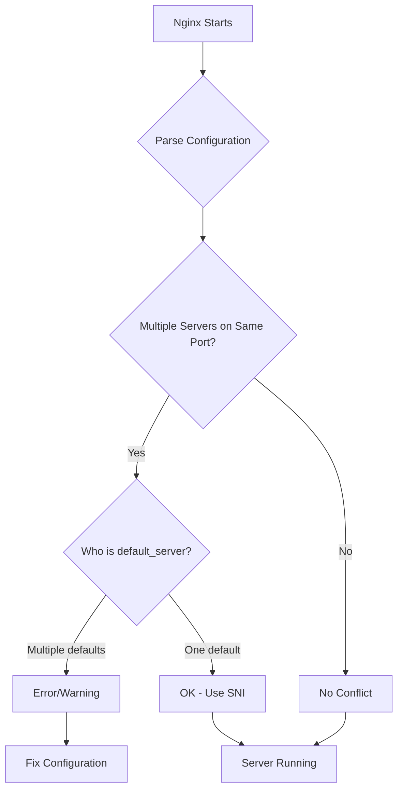

# How to Fix "doesn't listen on port 80 twice" Errors in Nginx

Author: [nawazdhandala](https://www.github.com/nawazdhandala)

Tags: Nginx, Troubleshooting, Configuration, Server Blocks, Virtual Hosts, Port Binding

Description: Learn how to diagnose and fix Nginx configuration errors related to duplicate port listeners, including proper virtual host setup and understanding the default_server directive.

---

## Understanding the Error

When you see an error like "nginx: [warn] conflicting server name ... on 0.0.0.0:80, ignored" or "nginx: [emerg] duplicate listen options for [::]:80", it means Nginx has detected conflicting listener configurations. This typically happens when multiple server blocks try to be the default server for the same port or when configuration files are duplicated.



## Common Causes

### 1. Multiple default_server Declarations

```nginx
# File: /etc/nginx/sites-enabled/site1.conf
server {
    listen 80 default_server;  # First default
    server_name site1.com;
}

# File: /etc/nginx/sites-enabled/site2.conf
server {
    listen 80 default_server;  # Second default - CONFLICT!
    server_name site2.com;
}
```

### 2. Duplicate Configuration Files

Having both a site in `sites-available` and `sites-enabled` or duplicate includes:

```nginx
# /etc/nginx/nginx.conf
http {
    include /etc/nginx/conf.d/*.conf;
    include /etc/nginx/sites-enabled/*;  # Might include same configs
}
```

### 3. IPv4 and IPv6 Conflicts

```nginx
server {
    listen 80;           # IPv4 only
    listen [::]:80;      # IPv6 only
    # vs
    listen 80 ipv6only=off;  # Both - might conflict
}
```

### 4. Default Installation Files

The default Nginx installation often includes a default site that conflicts with your custom configurations.

## Solution 1: Remove Duplicate default_server

Only one server block should be the default for each IP:port combination:

```nginx
# Primary site - IS the default
server {
    listen 80 default_server;
    listen [::]:80 default_server;
    server_name example.com www.example.com;
    root /var/www/example;
}

# Secondary site - NOT the default
server {
    listen 80;                    # No default_server
    listen [::]:80;               # No default_server
    server_name other.com;
    root /var/www/other;
}

# Third site - NOT the default
server {
    listen 80;
    listen [::]:80;
    server_name another.com;
    root /var/www/another;
}
```

## Solution 2: Remove Default Site Configuration

The default Nginx site often causes conflicts:

```bash
# On Ubuntu/Debian
# Check what's in sites-enabled
ls -la /etc/nginx/sites-enabled/

# Remove the default site link
sudo rm /etc/nginx/sites-enabled/default

# Or rename it to keep as reference
sudo mv /etc/nginx/sites-enabled/default /etc/nginx/sites-enabled/default.disabled

# Test configuration
sudo nginx -t

# Reload
sudo nginx -s reload
```

## Solution 3: Consolidate Configuration Files

Check for duplicate configurations:

```bash
# Find all configuration files
find /etc/nginx -name "*.conf" -type f

# Find all server blocks listening on port 80
grep -r "listen.*80" /etc/nginx/

# Find all default_server declarations
grep -r "default_server" /etc/nginx/

# Check nginx.conf includes
grep -r "include" /etc/nginx/nginx.conf
```

### Proper File Structure

```
/etc/nginx/
├── nginx.conf
├── conf.d/
│   ├── default.conf          # Default server (optional)
│   └── ssl-params.conf       # Shared SSL config
├── sites-available/
│   ├── example.com.conf
│   └── other.com.conf
└── sites-enabled/
    ├── example.com.conf -> ../sites-available/example.com.conf
    └── other.com.conf -> ../sites-available/other.com.conf
```

## Solution 4: Proper IPv4/IPv6 Configuration

Configure both protocols correctly without conflicts:

```nginx
# Recommended: Listen on both IPv4 and IPv6
server {
    listen 80;
    listen [::]:80;
    server_name example.com;
    root /var/www/example;
}

# If you only want one to be default
server {
    listen 80 default_server;
    listen [::]:80 default_server;
    server_name _;
    return 444;  # Close connection for unknown hosts
}
```

### IPv6 Only Systems

```nginx
# For IPv6-only servers
server {
    listen [::]:80 ipv6only=on;
    server_name example.com;
}
```

### Dual-Stack with One Listen

```nginx
# Listen on both IPv4 and IPv6 with single directive (Linux)
server {
    listen [::]:80 ipv6only=off;  # Handles both
    server_name example.com;
}
```

## Solution 5: Catch-All Server Block

Create a proper catch-all for unmatched requests:

```nginx
# Catch-all server - handles requests that don't match any server_name
server {
    listen 80 default_server;
    listen [::]:80 default_server;
    server_name _;

    # Option 1: Return a 444 (close connection)
    return 444;

    # Option 2: Return 404
    # return 404;

    # Option 3: Redirect to main site
    # return 301 https://example.com$request_uri;
}

# Real sites - not default
server {
    listen 80;
    listen [::]:80;
    server_name example.com www.example.com;
    root /var/www/example;
}

server {
    listen 80;
    listen [::]:80;
    server_name other.com;
    root /var/www/other;
}
```

## Solution 6: SSL/TLS Configuration Without Conflicts

```nginx
# HTTP catch-all - redirect to HTTPS
server {
    listen 80 default_server;
    listen [::]:80 default_server;
    server_name _;
    return 301 https://$host$request_uri;
}

# HTTPS catch-all
server {
    listen 443 ssl default_server;
    listen [::]:443 ssl default_server;
    server_name _;

    ssl_certificate /etc/nginx/ssl/default.crt;
    ssl_certificate_key /etc/nginx/ssl/default.key;

    return 444;
}

# Real HTTPS sites
server {
    listen 443 ssl http2;
    listen [::]:443 ssl http2;
    server_name example.com;

    ssl_certificate /etc/nginx/ssl/example.com.crt;
    ssl_certificate_key /etc/nginx/ssl/example.com.key;

    root /var/www/example;
}
```

## Debugging Configuration Issues

### Check Current Configuration

```bash
# Test configuration syntax
nginx -t

# Show full configuration with all includes
nginx -T

# Find all listen directives
nginx -T 2>/dev/null | grep -E "^\s*listen"

# Find all server_name directives
nginx -T 2>/dev/null | grep -E "^\s*server_name"

# Find default_server declarations
nginx -T 2>/dev/null | grep "default_server"
```

### Check What's Actually Listening

```bash
# See what's listening on port 80
sudo lsof -i :80

# Or with ss
sudo ss -tlnp | grep :80

# Or with netstat
sudo netstat -tlnp | grep :80
```

### Check Nginx Process

```bash
# Check Nginx status
systemctl status nginx

# Check Nginx error log
tail -f /var/log/nginx/error.log

# Reload with verbose output
nginx -s reload 2>&1
```

## Complete Working Configuration

Here is a complete, conflict-free multi-site configuration:

```nginx
# /etc/nginx/nginx.conf
user nginx;
worker_processes auto;
error_log /var/log/nginx/error.log warn;
pid /var/run/nginx.pid;

events {
    worker_connections 1024;
}

http {
    include /etc/nginx/mime.types;
    default_type application/octet-stream;

    log_format main '$remote_addr - $remote_user [$time_local] "$request" '
                    '$status $body_bytes_sent "$http_referer" '
                    '"$http_user_agent" "$http_x_forwarded_for"';

    access_log /var/log/nginx/access.log main;

    sendfile on;
    keepalive_timeout 65;

    # Include site configurations
    include /etc/nginx/conf.d/*.conf;
}
```

```nginx
# /etc/nginx/conf.d/00-default.conf
# Note: 00 prefix ensures this loads first

# HTTP default - redirect everything to HTTPS
server {
    listen 80 default_server;
    listen [::]:80 default_server;
    server_name _;

    # Redirect to HTTPS
    return 301 https://$host$request_uri;
}

# HTTPS default - catch unmatched hosts
server {
    listen 443 ssl http2 default_server;
    listen [::]:443 ssl http2 default_server;
    server_name _;

    ssl_certificate /etc/nginx/ssl/default.crt;
    ssl_certificate_key /etc/nginx/ssl/default.key;

    # Close connection for unknown hosts
    return 444;
}
```

```nginx
# /etc/nginx/conf.d/example.com.conf
server {
    listen 443 ssl http2;
    listen [::]:443 ssl http2;
    server_name example.com www.example.com;

    ssl_certificate /etc/nginx/ssl/example.com.crt;
    ssl_certificate_key /etc/nginx/ssl/example.com.key;

    root /var/www/example;
    index index.html;

    location / {
        try_files $uri $uri/ =404;
    }
}
```

```nginx
# /etc/nginx/conf.d/other.com.conf
server {
    listen 443 ssl http2;
    listen [::]:443 ssl http2;
    server_name other.com;

    ssl_certificate /etc/nginx/ssl/other.com.crt;
    ssl_certificate_key /etc/nginx/ssl/other.com.key;

    root /var/www/other;
    index index.html;

    location / {
        try_files $uri $uri/ =404;
    }
}
```

## Docker Considerations

In Docker environments, be careful with port binding:

```yaml
# docker-compose.yml
version: '3.8'

services:
  nginx:
    image: nginx:latest
    ports:
      - "80:80"    # Only bind once
      - "443:443"  # Only bind once
    volumes:
      - ./nginx.conf:/etc/nginx/nginx.conf:ro
      - ./conf.d:/etc/nginx/conf.d:ro
```

Do not run multiple Nginx containers trying to bind the same host ports.

## Automation Script

Script to check and fix common issues:

```bash
#!/bin/bash
# check-nginx-config.sh

echo "=== Checking Nginx Configuration ==="

# Test syntax
echo "Testing configuration syntax..."
if ! nginx -t 2>&1; then
    echo "ERROR: Configuration syntax error"
    exit 1
fi

# Check for multiple default_server on same port
echo "Checking for duplicate default_server..."
DEFAULTS=$(nginx -T 2>/dev/null | grep -c "default_server")
echo "Found $DEFAULTS default_server declarations"

# Check for duplicate listen directives
echo "Checking listen directives..."
nginx -T 2>/dev/null | grep -E "^\s*listen" | sort | uniq -c | while read count directive; do
    if [ "$count" -gt 2 ]; then
        echo "WARNING: '$directive' appears $count times"
    fi
done

# List all server blocks
echo ""
echo "=== Server Blocks ==="
nginx -T 2>/dev/null | grep -E "(listen|server_name)" | paste - - | head -20

echo ""
echo "=== Check Complete ==="
```

## Key Takeaways

1. Only one `default_server` per IP:port combination
2. Remove or disable the default Nginx site configuration
3. Use a dedicated catch-all server block for unmatched requests
4. Check for duplicate configuration files in sites-enabled
5. Properly configure both IPv4 and IPv6 listeners
6. Use `nginx -T` to see the complete merged configuration
7. Name configuration files with numeric prefixes to control load order
8. Monitor Nginx with OneUptime to catch configuration issues after deployments

Understanding how Nginx matches requests to server blocks helps you configure multiple virtual hosts without conflicts. The `default_server` flag determines which server handles requests when no `server_name` matches.
