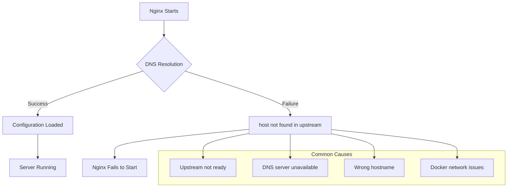

# How to Fix 'host not found in upstream' Nginx Startup Errors

Author: [nawazdhandala](https://www.github.com/nawazdhandala)

Tags: Nginx, Troubleshooting, Reverse Proxy, Docker, DNS, Configuration

Description: Learn how to diagnose and fix the 'host not found in upstream' error in Nginx, including solutions for Docker environments, DNS resolution issues, and proper upstream configuration.

---

## Understanding the Error

The "host not found in upstream" error is one of the most common issues encountered when configuring Nginx as a reverse proxy. This error occurs when Nginx cannot resolve the hostname specified in your `proxy_pass` or `upstream` directive during startup or configuration reload.

The full error message typically looks like this:

```
nginx: [emerg] host not found in upstream "backend.example.com" in /etc/nginx/nginx.conf:25
```

## Why This Error Occurs

Nginx resolves DNS names at startup time by default. Unlike some other reverse proxies, Nginx performs DNS resolution when it reads the configuration file, not when requests arrive. This behavior causes several common issues.



## Solution 1: Use IP Addresses Instead of Hostnames

The simplest fix is to use IP addresses directly, which eliminates DNS resolution entirely.

```nginx
# Instead of this
upstream backend {
    server backend.example.com:8080;
}

# Use this
upstream backend {
    server 192.168.1.100:8080;
}
```

While this works, it is not always practical in dynamic environments where IP addresses change frequently.

## Solution 2: Use the Resolver Directive

Nginx has a `resolver` directive that allows you to specify DNS servers and enable runtime DNS resolution.

```nginx
http {
    # Use Google DNS or your preferred DNS server
    resolver 8.8.8.8 8.8.4.4 valid=30s;
    resolver_timeout 5s;

    server {
        listen 80;
        server_name example.com;

        location /api/ {
            # Use a variable to force runtime DNS resolution
            set $backend "backend.example.com";
            proxy_pass http://$backend:8080;
        }
    }
}
```

The key here is using a variable (`$backend`) in the `proxy_pass` directive. When you use a variable, Nginx resolves the DNS name at request time rather than at startup.

## Solution 3: Docker-Specific Solutions

In Docker environments, this error commonly occurs when Nginx starts before dependent services are ready.

### Use Docker's Internal DNS Resolver

Docker has an embedded DNS server at `127.0.0.11` that resolves container names.

```nginx
http {
    resolver 127.0.0.11 valid=30s;

    server {
        listen 80;

        location / {
            set $upstream app;
            proxy_pass http://$upstream:3000;
        }
    }
}
```

### Use Docker Compose depends_on with Condition

In your `docker-compose.yml`, ensure Nginx waits for dependencies:

```yaml
version: '3.8'

services:
  app:
    image: your-app:latest
    healthcheck:
      test: ["CMD", "curl", "-f", "http://localhost:3000/health"]
      interval: 10s
      timeout: 5s
      retries: 5

  nginx:
    image: nginx:latest
    depends_on:
      app:
        condition: service_healthy
    volumes:
      - ./nginx.conf:/etc/nginx/nginx.conf
    ports:
      - "80:80"
```

### Use an Entrypoint Script

Create a script that waits for services before starting Nginx:

```bash
#!/bin/sh
# wait-for-services.sh

set -e

host="$1"
port="$2"
shift 2

echo "Waiting for $host:$port..."

while ! nc -z "$host" "$port"; do
  sleep 1
done

echo "$host:$port is available"
exec "$@"
```

Update your Dockerfile:

```dockerfile
FROM nginx:latest

RUN apt-get update && apt-get install -y netcat-openbsd

COPY wait-for-services.sh /wait-for-services.sh
RUN chmod +x /wait-for-services.sh

ENTRYPOINT ["/wait-for-services.sh", "app", "3000", "--"]
CMD ["nginx", "-g", "daemon off;"]
```

## Solution 4: Use Upstream with Backup Servers

Configure fallback servers to handle cases where primary servers are unavailable:

```nginx
upstream backend {
    server primary.example.com:8080;
    server backup.example.com:8080 backup;
    server 127.0.0.1:8080 backup;
}
```

## Solution 5: Nginx Plus Dynamic Upstreams

If you are using Nginx Plus, you can use the `resolve` parameter:

```nginx
upstream backend {
    zone backend 64k;
    server backend.example.com:8080 resolve;
}

server {
    resolver 8.8.8.8;

    location / {
        proxy_pass http://backend;
    }
}
```

## Complete Working Configuration

Here is a complete Nginx configuration that handles DNS resolution gracefully:

```nginx
user nginx;
worker_processes auto;
error_log /var/log/nginx/error.log warn;
pid /var/run/nginx.pid;

events {
    worker_connections 1024;
}

http {
    include /etc/nginx/mime.types;
    default_type application/octet-stream;

    log_format main '$remote_addr - $remote_user [$time_local] "$request" '
                    '$status $body_bytes_sent "$http_referer" '
                    '"$http_user_agent" "$http_x_forwarded_for"';

    access_log /var/log/nginx/access.log main;

    sendfile on;
    keepalive_timeout 65;

    # DNS resolver configuration
    resolver 127.0.0.11 8.8.8.8 valid=30s ipv6=off;
    resolver_timeout 5s;

    server {
        listen 80;
        server_name localhost;

        location / {
            # Using variable forces runtime DNS resolution
            set $backend_host "app";
            set $backend_port "3000";

            proxy_pass http://$backend_host:$backend_port;
            proxy_http_version 1.1;
            proxy_set_header Host $host;
            proxy_set_header X-Real-IP $remote_addr;
            proxy_set_header X-Forwarded-For $proxy_add_x_forwarded_for;
            proxy_set_header X-Forwarded-Proto $scheme;

            # Handle connection errors gracefully
            proxy_connect_timeout 5s;
            proxy_read_timeout 60s;
            proxy_send_timeout 60s;
        }

        # Health check endpoint
        location /nginx-health {
            access_log off;
            return 200 "healthy\n";
            add_header Content-Type text/plain;
        }
    }
}
```

## Debugging DNS Resolution Issues

Use these commands to debug DNS resolution problems:

```bash
# Test DNS resolution inside the Nginx container
docker exec nginx nslookup app

# Check if the service is reachable
docker exec nginx nc -zv app 3000

# View Nginx error logs
docker logs nginx 2>&1 | grep -i "host not found"

# Test configuration syntax
docker exec nginx nginx -t

# Reload configuration without restart
docker exec nginx nginx -s reload
```

## Monitoring DNS Resolution

Integrate with OneUptime to monitor your Nginx services and get alerts when upstream resolution fails. Configure health checks that verify both Nginx status and backend connectivity to catch these issues before they impact users.

## Key Takeaways

1. Use variables in `proxy_pass` to enable runtime DNS resolution
2. Always configure a `resolver` directive when using hostnames
3. In Docker, use the internal DNS server at `127.0.0.11`
4. Implement health checks and proper startup dependencies
5. Consider using IP addresses in static environments
6. Monitor your Nginx logs for resolution failures

By understanding how Nginx handles DNS resolution and implementing these solutions, you can build resilient reverse proxy configurations that handle dynamic environments gracefully.
