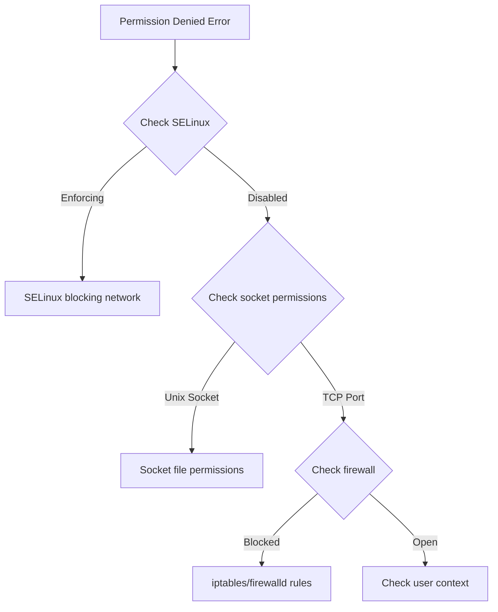

# How to Fix '(13: Permission denied)' Upstream Connection Errors in Nginx

Author: [nawazdhandala](https://github.com/nawazdhandala)

Tags: Nginx, SELinux, Linux, Troubleshooting, DevOps

Description: Learn how to diagnose and fix the '(13: Permission denied) while connecting to upstream' error in Nginx, including SELinux policies, socket permissions, and file system configuration.

---

The error "(13: Permission denied) while connecting to upstream" is one of the most common yet confusing issues when configuring Nginx as a reverse proxy. This error typically appears in your Nginx error log and results in 502 Bad Gateway responses to clients. The root cause usually involves Linux security mechanisms rather than basic file permissions.

## Understanding the Error

When you see this in your Nginx error log:

```
2024/12/16 10:23:45 [crit] 1234#1234: *1 connect() to 127.0.0.1:3000 failed
(13: Permission denied) while connecting to upstream, client: 192.168.1.100,
server: example.com, request: "GET /api/users HTTP/1.1",
upstream: "http://127.0.0.1:3000/api/users"
```

This means Nginx's worker process was blocked from establishing a network connection to your upstream server. The error code 13 corresponds to `EACCES` (Permission denied) at the system call level.

## Common Causes



## Solution 1: SELinux Configuration

SELinux is the most common cause of this error on RHEL, CentOS, Rocky Linux, and Fedora systems.

### Check SELinux Status

```bash
# Check if SELinux is enforcing
getenforce

# Check for recent SELinux denials
ausearch -m avc -ts recent

# Or check the audit log directly
grep nginx /var/log/audit/audit.log | grep denied
```

### Enable HTTP Network Connections

The SELinux boolean `httpd_can_network_connect` controls whether web servers can make outbound network connections:

```bash
# Check current setting
getsebool httpd_can_network_connect

# Enable permanently
setsebool -P httpd_can_network_connect 1
```

### For Specific Port Connections

If your upstream uses a non-standard port, you may need additional configuration:

```bash
# Allow connections to specific port ranges
setsebool -P httpd_can_network_relay 1

# Check what ports SELinux allows for http
semanage port -l | grep http

# Add a custom port to http_port_t
semanage port -a -t http_port_t -p tcp 3000
```

### For Unix Socket Connections

When proxying to a Unix socket:

```bash
# Allow httpd to connect to Unix sockets
setsebool -P httpd_execmem 1

# Set correct SELinux context on socket directory
semanage fcontext -a -t httpd_var_run_t "/var/run/myapp(/.*)?"
restorecon -Rv /var/run/myapp
```

## Solution 2: Unix Socket Permissions

If you are proxying to a Unix socket, permission issues are common.

### Check Socket Permissions

```bash
# List socket details
ls -la /var/run/gunicorn.sock

# Example output showing permission issue:
# srwxr-xr-x 1 appuser appgroup 0 Dec 16 10:00 gunicorn.sock
# Nginx user cannot access this socket
```

### Fix Socket Permissions

**Option A: Add Nginx user to the socket group**

```bash
# Check nginx user
ps aux | grep nginx

# Add nginx to the application group
usermod -aG appgroup nginx

# Restart nginx
systemctl restart nginx
```

**Option B: Configure the application to create accessible socket**

For Gunicorn:

```bash
# In gunicorn.conf.py or command line
gunicorn --bind unix:/var/run/gunicorn.sock \
         --workers 4 \
         --user appuser \
         --group www-data \
         --umask 007 \
         myapp:app
```

For uWSGI:

```ini
# uwsgi.ini
[uwsgi]
socket = /var/run/uwsgi.sock
chmod-socket = 660
uid = appuser
gid = www-data
```

**Option C: Use a shared directory with correct permissions**

```bash
# Create shared directory
mkdir -p /var/run/webapp
chown appuser:www-data /var/run/webapp
chmod 750 /var/run/webapp
```

### Nginx Configuration for Unix Socket

```nginx
upstream backend {
    server unix:/var/run/gunicorn.sock;
}

server {
    listen 80;
    server_name example.com;

    location / {
        proxy_pass http://backend;
        proxy_set_header Host $host;
        proxy_set_header X-Real-IP $remote_addr;
    }
}
```

## Solution 3: Firewall Rules

Local firewall rules can block Nginx from connecting to upstream services.

### Check iptables

```bash
# List all rules
iptables -L -n -v

# Check for rules blocking localhost
iptables -L OUTPUT -n -v
```

### Check firewalld

```bash
# List all zones and rules
firewall-cmd --list-all

# Allow connection to local port
firewall-cmd --permanent --add-port=3000/tcp
firewall-cmd --reload
```

### Check nftables

```bash
# List rules
nft list ruleset

# Check for output restrictions
nft list chain inet filter output
```

## Solution 4: Systemd Service Restrictions

If your Nginx is running under systemd, security directives might restrict network access.

### Check Service Configuration

```bash
# View nginx service settings
systemctl show nginx | grep -E "(PrivateNetwork|RestrictAddressFamilies)"
```

### Modify Service Override

```bash
# Create override file
systemctl edit nginx
```

Add:

```ini
[Service]
PrivateNetwork=false
RestrictAddressFamilies=AF_UNIX AF_INET AF_INET6
```

Then reload:

```bash
systemctl daemon-reload
systemctl restart nginx
```

## Diagnostic Script

Use this script to diagnose permission issues:

```bash
#!/bin/bash

echo "=== SELinux Status ==="
getenforce
getsebool httpd_can_network_connect

echo ""
echo "=== Nginx Process Info ==="
ps aux | grep nginx | head -5

echo ""
echo "=== Nginx User ==="
NGINX_USER=$(ps aux | grep "nginx: worker" | grep -v grep | awk '{print $1}' | head -1)
echo "Worker running as: $NGINX_USER"
id $NGINX_USER

echo ""
echo "=== Upstream Connectivity Test ==="
# Test TCP port
if nc -z 127.0.0.1 3000 2>/dev/null; then
    echo "Port 3000 is reachable"
else
    echo "Port 3000 is NOT reachable"
fi

echo ""
echo "=== Recent Audit Denials ==="
ausearch -m avc -ts recent 2>/dev/null | tail -20

echo ""
echo "=== Socket Files ==="
ls -laZ /var/run/*.sock 2>/dev/null

echo ""
echo "=== Nginx Error Log (last 10 lines) ==="
tail -10 /var/log/nginx/error.log
```

## Complete Working Configuration

Here is a production configuration addressing common permission scenarios:

```nginx
user www-data;
worker_processes auto;
error_log /var/log/nginx/error.log warn;
pid /run/nginx.pid;

events {
    worker_connections 1024;
}

http {
    upstream app_backend {
        # TCP backend
        server 127.0.0.1:3000;
        keepalive 32;
    }

    upstream socket_backend {
        # Unix socket backend
        server unix:/var/run/app/gunicorn.sock;
    }

    server {
        listen 80;
        server_name example.com;

        # API via TCP
        location /api/ {
            proxy_pass http://app_backend;
            proxy_http_version 1.1;
            proxy_set_header Host $host;
            proxy_set_header X-Real-IP $remote_addr;
            proxy_set_header X-Forwarded-For $proxy_add_x_forwarded_for;
            proxy_set_header Connection "";

            # Error handling
            proxy_intercept_errors on;
            error_page 502 503 504 /50x.html;
        }

        # App via Unix socket
        location / {
            proxy_pass http://socket_backend;
            proxy_http_version 1.1;
            proxy_set_header Host $host;
            proxy_set_header X-Real-IP $remote_addr;
            proxy_set_header X-Forwarded-For $proxy_add_x_forwarded_for;
        }

        location = /50x.html {
            root /usr/share/nginx/html;
            internal;
        }
    }
}
```

## Quick Resolution Checklist

| Check | Command | Fix |
|-------|---------|-----|
| SELinux blocking | `getenforce` | `setsebool -P httpd_can_network_connect 1` |
| Socket permissions | `ls -la /path/to/socket` | `usermod -aG appgroup nginx` |
| Firewall rules | `iptables -L -n` | Allow localhost connections |
| Port availability | `ss -tlnp | grep 3000` | Ensure upstream is running |
| Nginx user | `ps aux | grep nginx` | Match socket owner/group |

## Summary

The "(13: Permission denied)" error in Nginx upstream connections is almost always caused by:

1. **SELinux** blocking network connections - fix with `setsebool -P httpd_can_network_connect 1`
2. **Unix socket permissions** - ensure Nginx user can access the socket file
3. **Firewall rules** - verify no rules block localhost connections
4. **Systemd restrictions** - check service security directives

Always check SELinux first on RHEL-based systems - it is the cause of this error in the vast majority of cases. Use `ausearch` and `audit2why` to identify exactly what SELinux is blocking before applying fixes.
