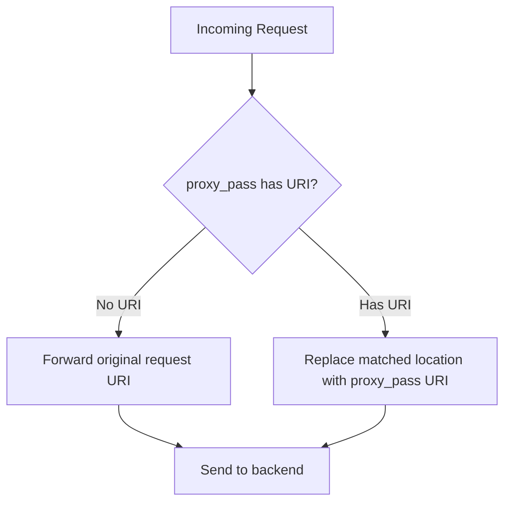

# How to Fix Trailing Slash Issues in Nginx proxy_pass

Author: [nawazdhandala](https://github.com/nawazdhandala)

Tags: Nginx, Reverse Proxy, DevOps, Troubleshooting

Description: Learn how to fix trailing slash issues in Nginx proxy_pass directives that cause 404 errors, incorrect routing, and broken URLs in your reverse proxy configuration.

---

One of the most common and frustrating issues when configuring Nginx as a reverse proxy involves trailing slashes in `proxy_pass` directives. A single slash (or its absence) can mean the difference between a working application and a cascade of 404 errors. Understanding how Nginx handles URI processing in `proxy_pass` is essential for any DevOps engineer.

## The Problem Explained

When you configure Nginx to proxy requests to a backend server, the trailing slash in your `proxy_pass` URL fundamentally changes how Nginx constructs the request to the upstream server.

Consider these two configurations that look almost identical:

```nginx
# Configuration A - WITHOUT trailing slash
location /api {
    proxy_pass http://backend:3000;
}

# Configuration B - WITH trailing slash
location /api {
    proxy_pass http://backend:3000/;
}
```

When a request comes in for `/api/users`, here is what gets sent to the backend:

| Configuration | Request to Backend |
|---------------|-------------------|
| Without trailing slash | `/api/users` |
| With trailing slash | `/users` |

This behavior catches many developers off guard and leads to routing issues.

## How URI Processing Works

Nginx follows specific rules when determining what URI to send to the upstream server:



The key rule is:
- If `proxy_pass` contains a URI (even just `/`), Nginx replaces the matched location portion with that URI
- If `proxy_pass` has no URI, the original request URI passes through unchanged

## Common Scenarios and Solutions

### Scenario 1: Proxying to Root of Backend

You want `/api/users` to reach your backend as `/api/users`:

```nginx
# Correct - no trailing slash, no URI
location /api {
    proxy_pass http://backend:3000;
    proxy_set_header Host $host;
    proxy_set_header X-Real-IP $remote_addr;
}
```

Request mapping:
- `/api` -> `http://backend:3000/api`
- `/api/users` -> `http://backend:3000/api/users`
- `/api/users/123` -> `http://backend:3000/api/users/123`

### Scenario 2: Stripping the Location Prefix

You want `/api/users` to reach your backend as `/users`:

```nginx
# Correct - trailing slash strips /api prefix
location /api/ {
    proxy_pass http://backend:3000/;
    proxy_set_header Host $host;
    proxy_set_header X-Real-IP $remote_addr;
}
```

Request mapping:
- `/api/` -> `http://backend:3000/`
- `/api/users` -> `http://backend:3000/users`
- `/api/users/123` -> `http://backend:3000/users/123`

### Scenario 3: Rewriting to a Different Path

You want `/v1/api/users` to reach your backend as `/v2/users`:

```nginx
location /v1/api/ {
    proxy_pass http://backend:3000/v2/;
    proxy_set_header Host $host;
    proxy_set_header X-Real-IP $remote_addr;
}
```

Request mapping:
- `/v1/api/users` -> `http://backend:3000/v2/users`
- `/v1/api/orders/123` -> `http://backend:3000/v2/orders/123`

## The Trailing Slash Trap with Location Blocks

A common mistake is mismatching trailing slashes between `location` and `proxy_pass`:

```nginx
# PROBLEMATIC - location has slash, proxy_pass doesn't
location /api/ {
    proxy_pass http://backend:3000;  # Missing trailing slash
}
```

This causes requests to `/api/users` to be proxied as `/api/users` (location prefix not stripped), which might not be what you intended.

### The Fix

Always be consistent. If you want to strip the prefix:

```nginx
# Both have trailing slashes
location /api/ {
    proxy_pass http://backend:3000/;
}
```

If you want to preserve the prefix:

```nginx
# Neither has a URI component
location /api {
    proxy_pass http://backend:3000;
}
```

## Handling Regex Locations

When using regex in location blocks, you cannot include a URI in `proxy_pass`. You must use `rewrite` instead:

```nginx
# This will NOT work - causes Nginx configuration error
location ~ ^/api/v(\d+)/(.*)$ {
    proxy_pass http://backend:3000/api/$2;  # ERROR!
}

# Correct approach using rewrite
location ~ ^/api/v(\d+)/(.*)$ {
    rewrite ^/api/v(\d+)/(.*)$ /api/$2 break;
    proxy_pass http://backend:3000;
}
```

## Debugging Trailing Slash Issues

### Enable Debug Logging

Add debug logging to see exactly what Nginx sends to the backend:

```nginx
http {
    log_format upstream_log '$remote_addr - $request - proxy_host: $proxy_host - uri: $uri - upstream: $upstream_addr';

    server {
        access_log /var/log/nginx/upstream.log upstream_log;

        location /api/ {
            proxy_pass http://backend:3000/;
        }
    }
}
```

### Using curl to Test

Test your configuration by examining the response headers:

```bash
# Test the endpoint
curl -v http://localhost/api/users

# Check what the backend receives - add logging to your backend
# or use tcpdump to inspect traffic
tcpdump -i lo -A -s 0 'port 3000 and tcp'
```

### Common Error Messages

| Error | Likely Cause |
|-------|--------------|
| 404 Not Found | Path mismatch due to trailing slash issue |
| 502 Bad Gateway | Backend not receiving expected path |
| Redirect loops | Trailing slash causing path duplication |

## Production-Ready Configuration

Here is a complete configuration handling multiple scenarios:

```nginx
upstream backend_servers {
    server backend1:3000;
    server backend2:3000;
    keepalive 32;
}

server {
    listen 80;
    server_name example.com;

    # API requests - strip /api prefix
    location /api/ {
        proxy_pass http://backend_servers/;

        proxy_http_version 1.1;
        proxy_set_header Host $host;
        proxy_set_header X-Real-IP $remote_addr;
        proxy_set_header X-Forwarded-For $proxy_add_x_forwarded_for;
        proxy_set_header X-Forwarded-Proto $scheme;
        proxy_set_header Connection "";

        # Timeouts
        proxy_connect_timeout 60s;
        proxy_send_timeout 60s;
        proxy_read_timeout 60s;
    }

    # Health check endpoint - preserve path
    location /health {
        proxy_pass http://backend_servers;
        proxy_set_header Host $host;
    }

    # WebSocket endpoint
    location /ws/ {
        proxy_pass http://backend_servers/websocket/;
        proxy_http_version 1.1;
        proxy_set_header Upgrade $http_upgrade;
        proxy_set_header Connection "upgrade";
    }
}
```

## Quick Reference Table

| Location | proxy_pass | Request | Sent to Backend |
|----------|------------|---------|-----------------|
| `/api` | `http://backend` | `/api/users` | `/api/users` |
| `/api` | `http://backend/` | `/api/users` | `//users` |
| `/api/` | `http://backend` | `/api/users` | `/api/users` |
| `/api/` | `http://backend/` | `/api/users` | `/users` |
| `/api/` | `http://backend/v2/` | `/api/users` | `/v2/users` |

## Summary

Trailing slash behavior in Nginx `proxy_pass` follows consistent rules once you understand them:

1. No URI in `proxy_pass` means the original request URI passes through unchanged
2. Any URI in `proxy_pass` (including just `/`) triggers replacement of the matched location
3. Match your trailing slashes between `location` and `proxy_pass` for predictable behavior
4. Use `rewrite` with regex locations since they cannot have URIs in `proxy_pass`

Test your configuration thoroughly with different request paths before deploying to production. A few minutes of testing can save hours of debugging mysterious 404 errors.
