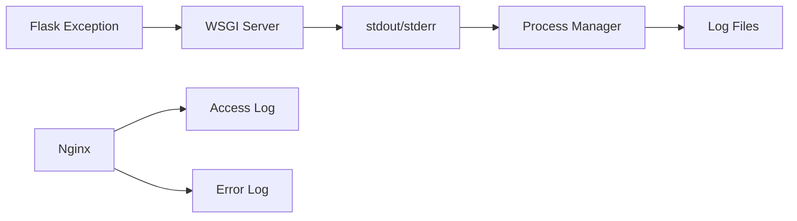

# How to Fix Flask Application Traceback Not Showing in Nginx Logs

Author: [nawazdhandala](https://github.com/nawazdhandala)

Tags: Flask, Nginx, Python, Logging, Debugging

Description: Learn how to configure Flask and Nginx to properly capture and display Python tracebacks, including stderr handling, Gunicorn logging, and production error tracking strategies.

---

When deploying Flask applications behind Nginx, Python tracebacks often disappear into the void. You see a 500 error in Nginx access logs but no details about what went wrong. This guide explains why this happens and how to configure proper error logging across your stack.

## Understanding the Log Flow

When a Flask application crashes, the traceback needs to flow through multiple components:



The problem is that Nginx only sees the HTTP response - it does not have access to your Python traceback. You need to configure each component correctly.

## The Root Causes

| Symptom | Cause |
|---------|-------|
| No traceback anywhere | Flask debug mode off, no logging configured |
| Traceback in terminal only | Running manually, not captured by process manager |
| 500 in Nginx, no details | Gunicorn not writing to accessible log |
| Partial traceback | Log truncation or buffering issues |

## Solution 1: Configure Flask Logging

### Basic Flask Logging Setup

```python
# app.py
import logging
from flask import Flask

app = Flask(__name__)

# Configure logging
if not app.debug:
    # Create file handler
    file_handler = logging.FileHandler('/var/log/flask/app.log')
    file_handler.setLevel(logging.ERROR)

    # Create formatter
    formatter = logging.Formatter(
        '%(asctime)s %(levelname)s: %(message)s [in %(pathname)s:%(lineno)d]'
    )
    file_handler.setFormatter(formatter)

    # Add handler to app logger
    app.logger.addHandler(file_handler)
    app.logger.setLevel(logging.ERROR)

@app.route('/')
def index():
    # This will be logged
    app.logger.info('Index page accessed')
    return 'Hello World'

@app.route('/error')
def error():
    # This exception will now be logged
    raise ValueError('Something went wrong!')

if __name__ == '__main__':
    app.run()
```

### Comprehensive Logging Configuration

```python
# app.py
import logging
from logging.handlers import RotatingFileHandler
import os
from flask import Flask, request

app = Flask(__name__)

def setup_logging(app):
    # Create logs directory
    if not os.path.exists('logs'):
        os.makedirs('logs')

    # File handler for all logs
    file_handler = RotatingFileHandler(
        'logs/app.log',
        maxBytes=10240000,  # 10MB
        backupCount=10
    )
    file_handler.setLevel(logging.DEBUG)

    # File handler for errors only
    error_handler = RotatingFileHandler(
        'logs/error.log',
        maxBytes=10240000,
        backupCount=10
    )
    error_handler.setLevel(logging.ERROR)

    # Formatter with full context
    formatter = logging.Formatter(
        '%(asctime)s - %(name)s - %(levelname)s - %(message)s\n'
        'File: %(pathname)s:%(lineno)d\n'
        'Function: %(funcName)s\n'
    )

    file_handler.setFormatter(formatter)
    error_handler.setFormatter(formatter)

    # Add handlers
    app.logger.addHandler(file_handler)
    app.logger.addHandler(error_handler)
    app.logger.setLevel(logging.DEBUG)

    # Also log to stderr for process managers
    stream_handler = logging.StreamHandler()
    stream_handler.setLevel(logging.ERROR)
    stream_handler.setFormatter(formatter)
    app.logger.addHandler(stream_handler)

# Error handler to log exceptions
@app.errorhandler(Exception)
def handle_exception(e):
    # Log the full traceback
    app.logger.exception('Unhandled exception: %s', str(e))

    # Log request details
    app.logger.error(
        'Request: %s %s\nHeaders: %s\nBody: %s',
        request.method,
        request.url,
        dict(request.headers),
        request.get_data(as_text=True)[:1000]  # Limit body size
    )

    # Return error response
    return {'error': 'Internal server error'}, 500

setup_logging(app)
```

## Solution 2: Configure Gunicorn Logging

### Gunicorn with Logging

```bash
# Start Gunicorn with logging
gunicorn app:app \
    --bind 127.0.0.1:5000 \
    --workers 4 \
    --access-logfile /var/log/gunicorn/access.log \
    --error-logfile /var/log/gunicorn/error.log \
    --capture-output \
    --log-level debug
```

The `--capture-output` flag is critical - it captures stdout/stderr from your Flask app.

### Gunicorn Configuration File

```python
# gunicorn.conf.py
import multiprocessing

# Binding
bind = '127.0.0.1:5000'

# Workers
workers = multiprocessing.cpu_count() * 2 + 1
worker_class = 'sync'

# Logging
accesslog = '/var/log/gunicorn/access.log'
errorlog = '/var/log/gunicorn/error.log'
loglevel = 'debug'

# Capture Flask print statements and exceptions
capture_output = True

# Log to stderr as well (for systemd)
# errorlog = '-'

# Access log format
access_log_format = '%(h)s %(l)s %(u)s %(t)s "%(r)s" %(s)s %(b)s "%(f)s" "%(a)s" %(D)s'

# Timeout
timeout = 30

# Graceful timeout
graceful_timeout = 30
```

Start with config file:

```bash
gunicorn app:app -c gunicorn.conf.py
```

## Solution 3: Systemd Service Configuration

### Flask/Gunicorn Service

```ini
# /etc/systemd/system/flask-app.service
[Unit]
Description=Flask Application
After=network.target

[Service]
User=www-data
Group=www-data
WorkingDirectory=/var/www/app
Environment="PATH=/var/www/app/venv/bin"

ExecStart=/var/www/app/venv/bin/gunicorn \
    --bind 127.0.0.1:5000 \
    --workers 4 \
    --capture-output \
    --log-level debug \
    app:app

# Log to journal
StandardOutput=journal
StandardError=journal
SyslogIdentifier=flask-app

Restart=always
RestartSec=5

[Install]
WantedBy=multi-user.target
```

View logs with journalctl:

```bash
# View all logs
journalctl -u flask-app

# Follow logs in real-time
journalctl -u flask-app -f

# View only errors
journalctl -u flask-app -p err

# View logs since last hour
journalctl -u flask-app --since "1 hour ago"
```

## Solution 4: Configure Nginx Error Logging

### Nginx Error Log Configuration

```nginx
http {
    # Global error log
    error_log /var/log/nginx/error.log warn;

    server {
        listen 80;
        server_name example.com;

        # Server-specific error log with debug level
        error_log /var/log/nginx/flask_error.log debug;

        # Access log with timing
        log_format detailed '$remote_addr - $remote_user [$time_local] '
                           '"$request" $status $body_bytes_sent '
                           '"$http_referer" "$http_user_agent" '
                           'upstream_response_time=$upstream_response_time '
                           'request_time=$request_time';

        access_log /var/log/nginx/flask_access.log detailed;

        location / {
            proxy_pass http://127.0.0.1:5000;
            proxy_set_header Host $host;
            proxy_set_header X-Real-IP $remote_addr;

            # Pass error pages to error log
            proxy_intercept_errors on;
        }
    }
}
```

### Capture Upstream Errors

```nginx
location / {
    proxy_pass http://127.0.0.1:5000;

    # Log upstream response headers for debugging
    add_header X-Upstream-Status $upstream_status always;
    add_header X-Upstream-Response-Time $upstream_response_time always;

    # Custom error pages that log details
    error_page 500 502 503 504 /50x.html;

    location = /50x.html {
        root /usr/share/nginx/html;
        internal;
    }
}
```

## Solution 5: Sentry for Production Error Tracking

For production, use an error tracking service:

```python
# app.py
import sentry_sdk
from sentry_sdk.integrations.flask import FlaskIntegration

sentry_sdk.init(
    dsn="https://your-sentry-dsn@sentry.io/project",
    integrations=[FlaskIntegration()],
    traces_sample_rate=0.1,
    environment="production"
)

app = Flask(__name__)

@app.route('/error')
def trigger_error():
    # This will be captured by Sentry with full traceback
    division_by_zero = 1 / 0
```

## Complete Production Setup

### Directory Structure

```
/var/www/app/
  app.py
  gunicorn.conf.py
  /logs/
    app.log
    error.log
  /venv/
```

### Flask Application

```python
# app.py
import logging
from logging.handlers import RotatingFileHandler
from flask import Flask, request, jsonify
import traceback

app = Flask(__name__)

# Setup logging
def configure_logging():
    handler = RotatingFileHandler(
        '/var/www/app/logs/error.log',
        maxBytes=10000000,
        backupCount=5
    )
    handler.setLevel(logging.ERROR)
    handler.setFormatter(logging.Formatter(
        '%(asctime)s %(levelname)s: %(message)s [%(pathname)s:%(lineno)d]\n'
        '%(exc_info)s'
    ))
    app.logger.addHandler(handler)

    # Also configure root logger for library errors
    logging.getLogger().addHandler(handler)

@app.errorhandler(Exception)
def handle_all_exceptions(e):
    # Get full traceback
    tb = traceback.format_exc()

    # Log with context
    app.logger.error(
        'Exception on %s [%s]\n'
        'Traceback:\n%s',
        request.path,
        request.method,
        tb
    )

    return jsonify(error='Internal server error'), 500

configure_logging()
```

### Gunicorn Config

```python
# gunicorn.conf.py
bind = '127.0.0.1:5000'
workers = 4
capture_output = True
errorlog = '/var/www/app/logs/gunicorn.log'
loglevel = 'info'
```

### Nginx Config

```nginx
server {
    listen 80;
    server_name example.com;

    error_log /var/log/nginx/flask_error.log warn;
    access_log /var/log/nginx/flask_access.log combined;

    location / {
        proxy_pass http://127.0.0.1:5000;
        proxy_set_header Host $host;
        proxy_set_header X-Real-IP $remote_addr;
        proxy_set_header X-Forwarded-For $proxy_add_x_forwarded_for;

        proxy_connect_timeout 60s;
        proxy_read_timeout 60s;
    }
}
```

## Debugging Checklist

| Check | Command |
|-------|---------|
| Flask logs | `tail -f /var/www/app/logs/error.log` |
| Gunicorn logs | `tail -f /var/www/app/logs/gunicorn.log` |
| Systemd logs | `journalctl -u flask-app -f` |
| Nginx error log | `tail -f /var/log/nginx/flask_error.log` |
| Nginx access log | `tail -f /var/log/nginx/flask_access.log` |
| Test error endpoint | `curl http://localhost/error` |

## Summary

To see Flask tracebacks when running behind Nginx:

1. **Flask level**: Configure `app.logger` with file handler and `@app.errorhandler(Exception)`
2. **Gunicorn level**: Use `--capture-output` and configure error log path
3. **Systemd level**: Set `StandardOutput=journal` and `StandardError=journal`
4. **Nginx level**: Check `error_log` directive and increase log level for debugging

The key insight is that Nginx never sees your Python tracebacks - they must be captured by your WSGI server (Gunicorn) or written to files by Flask. Configure each layer correctly, and you will never lose another traceback.
