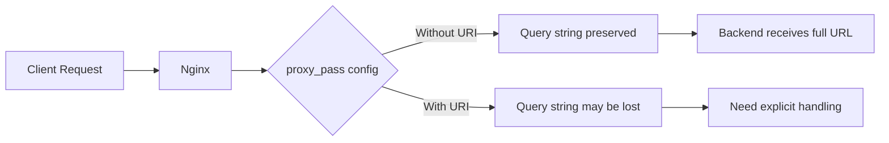

# How to Forward Query String Parameters Through proxy_pass

Author: [nawazdhandala](https://www.github.com/nawazdhandala)

Tags: Nginx, Reverse Proxy, Query String, URL Parameters, Configuration, proxy_pass

Description: Learn how to properly forward query string parameters through Nginx proxy_pass directive, including common pitfalls and solutions for various URL rewriting scenarios.

---

## Understanding Query String Forwarding

When using Nginx as a reverse proxy, you need to ensure query string parameters are correctly forwarded to your backend servers. The behavior depends on how you configure the `proxy_pass` directive and whether you use URI components.



## Default Behavior

### Without URI in proxy_pass

When `proxy_pass` does not include a URI path, query strings are automatically forwarded:

```nginx
location /api/ {
    # No URI after the host - query string is preserved automatically
    proxy_pass http://backend;
}
```

Request: `GET /api/users?page=1&limit=10`
Forwarded to: `http://backend/api/users?page=1&limit=10`

### With URI in proxy_pass

When you include a URI in `proxy_pass`, the behavior changes:

```nginx
location /api/ {
    # URI specified - the location path is replaced, query string handling changes
    proxy_pass http://backend/v2/;
}
```

Request: `GET /api/users?page=1&limit=10`
Forwarded to: `http://backend/v2/users?page=1&limit=10`

Query strings are still preserved in this case because of how Nginx handles the replacement.

## Common Problems and Solutions

### Problem 1: Query String Lost with Rewrite

When using `rewrite` before `proxy_pass`, query strings can be lost:

```nginx
# WRONG - Query string is lost
location /api/ {
    rewrite ^/api/(.*)$ /v2/$1 break;
    proxy_pass http://backend;
}
```

**Solution: Use `$is_args$args`**

```nginx
# CORRECT - Query string is preserved
location /api/ {
    rewrite ^/api/(.*)$ /v2/$1 break;
    proxy_pass http://backend;
    # Query string is automatically appended when using rewrite with break
}

# Or explicitly append query string
location /api/ {
    proxy_pass http://backend/v2/$1$is_args$args;
}
```

### Problem 2: Double Question Marks

Sometimes you end up with double question marks in URLs:

```nginx
# Can cause issues
location /search {
    proxy_pass http://backend/query?type=search;
}
```

Request: `GET /search?q=nginx`
Might forward as: `http://backend/query?type=search?q=nginx` (WRONG)

**Solution: Merge query strings properly**

```nginx
location /search {
    set $args "type=search&$args";
    proxy_pass http://backend/query?$args;
}
```

Or use map for cleaner handling:

```nginx
map $args $final_args {
    ""      "type=search";
    default "type=search&$args";
}

location /search {
    proxy_pass http://backend/query?$final_args;
}
```

### Problem 3: Named Location Blocks

Query strings behave differently with named locations:

```nginx
location /api/ {
    try_files $uri @backend;
}

location @backend {
    # Query string is preserved in named locations
    proxy_pass http://backend;
}
```

## Explicit Query String Handling

### Using $args Variable

The `$args` variable contains the query string without the leading `?`:

```nginx
location /api/ {
    # Explicitly append query string
    proxy_pass http://backend/api/$request_uri;

    # Or use $args
    proxy_pass http://backend/api/?$args;
}
```

### Using $is_args Variable

The `$is_args` variable is either `?` if there are arguments, or empty if not:

```nginx
location /api/ {
    # $is_args prevents double ? or trailing ?
    proxy_pass http://backend/v2/$is_args$args;
}
```

| Request | `$is_args` | `$args` | Result |
|---------|------------|---------|--------|
| `/api/users` | (empty) | (empty) | `/v2/` |
| `/api/users?id=1` | `?` | `id=1` | `/v2/?id=1` |

### Using $request_uri Variable

For passing the complete original URI including query string:

```nginx
location / {
    # Forward everything as-is
    proxy_pass http://backend$request_uri;
}
```

## Advanced Scenarios

### Adding Parameters to Existing Query String

Add extra parameters while preserving original ones:

```nginx
location /api/ {
    set $extra_params "source=web&version=2";

    # Merge parameters
    set $final_args $extra_params;
    if ($args != "") {
        set $final_args "$extra_params&$args";
    }

    proxy_pass http://backend/api/?$final_args;
}
```

Using map for cleaner code:

```nginx
map $args $merged_args {
    ""      "source=web&version=2";
    default "source=web&version=2&$args";
}

server {
    location /api/ {
        proxy_pass http://backend/api/?$merged_args;
    }
}
```

### Removing Specific Query Parameters

Remove sensitive parameters before forwarding:

```nginx
location /api/ {
    # Remove 'token' parameter from query string
    set $clean_args $args;
    if ($clean_args ~ "^(.*)token=[^&]*(.*)$") {
        set $clean_args $1$2;
    }
    # Clean up any double ampersands
    if ($clean_args ~ "^(.*)&&(.*)$") {
        set $clean_args $1&$2;
    }
    # Remove leading/trailing ampersands
    if ($clean_args ~ "^&(.*)$") {
        set $clean_args $1;
    }
    if ($clean_args ~ "^(.*)&$") {
        set $clean_args $1;
    }

    proxy_pass http://backend/api/?$clean_args;
}
```

### URL Encoding Query Strings

Handle special characters in query strings:

```nginx
location /api/ {
    # Nginx preserves URL encoding by default
    proxy_pass http://backend;
    proxy_set_header Host $host;

    # Pass original query string encoded
    proxy_set_header X-Original-Args $args;
}
```

### Different Backends Based on Query Parameters

Route to different backends based on query string:

```nginx
map $arg_version $backend {
    "v1"    "http://backend-v1";
    "v2"    "http://backend-v2";
    default "http://backend-v2";
}

server {
    location /api/ {
        proxy_pass $backend$request_uri;
    }
}
```

## Complete Configuration Examples

### Basic API Gateway

```nginx
upstream api_backend {
    server 192.168.1.10:3000;
    server 192.168.1.11:3000;
    keepalive 32;
}

server {
    listen 80;
    server_name api.example.com;

    # Simple proxy - query strings preserved automatically
    location /v1/ {
        proxy_pass http://api_backend;
        proxy_http_version 1.1;
        proxy_set_header Host $host;
        proxy_set_header X-Real-IP $remote_addr;
    }

    # Rewrite path but keep query string
    location /legacy/ {
        rewrite ^/legacy/(.*)$ /v1/$1 break;
        proxy_pass http://api_backend;
    }

    # Add tracking parameters
    location /tracked/ {
        set $tracking "source=nginx&timestamp=$msec";
        if ($args = "") {
            set $args $tracking;
        }
        if ($args != "") {
            set $args "$tracking&$args";
        }
        proxy_pass http://api_backend/v1/?$args;
    }
}
```

### SPA with API Proxy

```nginx
server {
    listen 80;
    server_name app.example.com;

    root /var/www/app;
    index index.html;

    # API requests - forward with query string
    location /api/ {
        proxy_pass http://localhost:3000;
        proxy_http_version 1.1;
        proxy_set_header Host $host;
        proxy_set_header X-Real-IP $remote_addr;
        proxy_set_header X-Forwarded-For $proxy_add_x_forwarded_for;
        # Query string is automatically forwarded
    }

    # WebSocket with query string auth
    location /ws/ {
        proxy_pass http://localhost:3000;
        proxy_http_version 1.1;
        proxy_set_header Upgrade $http_upgrade;
        proxy_set_header Connection "upgrade";
        # Query string preserved for auth tokens
    }

    # SPA fallback - query string preserved for client-side routing
    location / {
        try_files $uri $uri/ /index.html?$args;
    }
}
```

### Multi-Version API

```nginx
map $arg_api_version $api_backend {
    "1"     "http://api-v1:3000";
    "2"     "http://api-v2:3000";
    default "http://api-v2:3000";
}

server {
    listen 80;
    server_name api.example.com;

    location /api/ {
        # Route based on api_version parameter
        proxy_pass $api_backend$request_uri;
        proxy_http_version 1.1;
        proxy_set_header Host $host;
        proxy_set_header X-Real-IP $remote_addr;
    }
}
```

## Debugging Query String Issues

### Test with curl

```bash
# Test query string forwarding
curl -v "http://nginx-server/api/users?page=1&limit=10"

# Check what backend receives
# On backend, log the full request URL
```

### Enable Debug Logging

```nginx
http {
    log_format debug_args '$remote_addr - "$request" '
                          'args="$args" '
                          'request_uri="$request_uri" '
                          'is_args="$is_args"';

    server {
        access_log /var/log/nginx/debug.log debug_args;

        location /api/ {
            proxy_pass http://backend;
        }
    }
}
```

### Test Configuration

```bash
# Check configuration syntax
nginx -t

# View processed configuration
nginx -T | grep -A 10 "location /api"
```

## Key Takeaways

1. Without a URI in `proxy_pass`, query strings are preserved automatically
2. Use `$is_args$args` when manually constructing URLs to avoid double question marks
3. The `rewrite` directive with `break` preserves query strings
4. Use `$request_uri` to pass the complete original request path and query string
5. Use `map` directive for clean conditional query string manipulation
6. Always test with actual requests containing various query string patterns
7. Enable debug logging to see exactly what Nginx is forwarding

Understanding how Nginx handles query strings in different configurations prevents subtle bugs where parameters are lost or duplicated. Test your configuration thoroughly with the actual query patterns your application uses.
