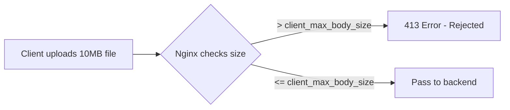

# How to Increase client_max_body_size in Nginx

Author: [nawazdhandala](https://github.com/nawazdhandala)

Tags: Nginx, File Upload, Configuration, DevOps, Troubleshooting

Description: Learn how to configure client_max_body_size in Nginx to allow larger file uploads, including context-specific settings, timeout adjustments, and backend coordination.

---

When users try to upload large files through Nginx, they often encounter "413 Request Entity Too Large" errors. This happens because Nginx limits request body size to 1MB by default. This guide shows you how to properly increase `client_max_body_size` and configure related settings for reliable large file uploads.

## Understanding the Error

When a client sends a request body larger than the configured limit, Nginx immediately rejects it:

```
HTTP/1.1 413 Request Entity Too Large
```



The default `client_max_body_size` is 1MB, which is too small for most file upload use cases.

## Quick Fix

Add `client_max_body_size` to your server or location block:

```nginx
server {
    listen 80;
    server_name example.com;

    # Allow 100MB uploads
    client_max_body_size 100M;

    location / {
        proxy_pass http://backend:3000;
    }
}
```

## Configuration Contexts

The `client_max_body_size` directive can be set at different levels:

| Context | Scope | Use Case |
|---------|-------|----------|
| `http` | All servers | Global default |
| `server` | Single virtual host | Per-site setting |
| `location` | Specific path | Fine-grained control |

### Global Setting

```nginx
http {
    # Default for all servers
    client_max_body_size 50M;

    server {
        listen 80;
        server_name example.com;
        # Inherits 50M from http context
    }
}
```

### Per-Server Setting

```nginx
http {
    client_max_body_size 10M;  # Default

    server {
        listen 80;
        server_name uploads.example.com;
        client_max_body_size 500M;  # Override for this server
    }

    server {
        listen 80;
        server_name api.example.com;
        # Uses default 10M
    }
}
```

### Per-Location Setting

```nginx
server {
    listen 80;
    server_name example.com;

    client_max_body_size 10M;  # Default for this server

    location /api/ {
        # Regular API calls - use default 10M
        proxy_pass http://backend:3000;
    }

    location /upload {
        # File uploads - allow 1GB
        client_max_body_size 1G;
        proxy_pass http://backend:3000;
    }

    location /avatar {
        # Profile pictures - allow 5MB
        client_max_body_size 5M;
        proxy_pass http://backend:3000;
    }
}
```

## Related Timeout Settings

Large file uploads take time. Adjust timeouts to prevent premature disconnection:

```nginx
server {
    listen 80;
    server_name example.com;

    # Allow 500MB uploads
    client_max_body_size 500M;

    # Timeout for reading client request body
    client_body_timeout 300s;

    # Timeout for transmitting response
    send_timeout 300s;

    location /upload {
        proxy_pass http://backend:3000;

        # Backend connection timeout
        proxy_connect_timeout 300s;

        # Timeout for reading response from backend
        proxy_read_timeout 300s;

        # Timeout for sending request to backend
        proxy_send_timeout 300s;
    }
}
```

## Buffering Configuration

Control how Nginx handles large request bodies:

```nginx
server {
    listen 80;
    server_name example.com;

    client_max_body_size 500M;

    # Directory for temporary files (ensure enough disk space)
    client_body_temp_path /var/nginx/client_body_temp 1 2;

    # Buffer size for reading client request body
    client_body_buffer_size 128k;

    # Write body to file if larger than buffer
    client_body_in_file_only off;

    location /upload {
        proxy_pass http://backend:3000;

        # Buffer settings for proxy
        proxy_request_buffering on;
        proxy_buffering on;
        proxy_buffer_size 128k;
        proxy_buffers 4 256k;
        proxy_busy_buffers_size 256k;
    }
}
```

### Streaming Large Files (Disable Buffering)

For very large files, stream directly to backend without buffering:

```nginx
location /upload {
    client_max_body_size 0;  # 0 = unlimited

    # Stream to backend without buffering
    proxy_request_buffering off;

    proxy_pass http://backend:3000;
    proxy_http_version 1.1;
    proxy_set_header Connection "";
}
```

**Warning:** Disabling request buffering means the backend must be ready to receive data immediately.

## Complete Production Configuration

```nginx
# /etc/nginx/nginx.conf
user www-data;
worker_processes auto;
error_log /var/log/nginx/error.log warn;
pid /run/nginx.pid;

events {
    worker_connections 1024;
}

http {
    include /etc/nginx/mime.types;
    default_type application/octet-stream;

    # Logging
    log_format main '$remote_addr - $remote_user [$time_local] "$request" '
                    '$status $body_bytes_sent "$http_referer" '
                    '"$http_user_agent" request_time=$request_time '
                    'body_bytes=$request_length';

    access_log /var/log/nginx/access.log main;

    # Performance
    sendfile on;
    tcp_nopush on;
    tcp_nodelay on;
    keepalive_timeout 65;

    # Global body size limit
    client_max_body_size 10M;

    # Temp directory for large uploads
    client_body_temp_path /var/lib/nginx/body 1 2;

    # Gzip (not for uploads)
    gzip on;
    gzip_types text/plain text/css application/json application/javascript;

    include /etc/nginx/conf.d/*.conf;
}
```

```nginx
# /etc/nginx/conf.d/app.conf
upstream backend {
    server 127.0.0.1:3000;
    keepalive 32;
}

server {
    listen 80;
    listen 443 ssl http2;
    server_name example.com;

    ssl_certificate /etc/ssl/certs/example.com.crt;
    ssl_certificate_key /etc/ssl/private/example.com.key;

    # Redirect HTTP to HTTPS
    if ($scheme = http) {
        return 301 https://$host$request_uri;
    }

    # Default settings
    client_max_body_size 10M;
    client_body_timeout 60s;

    # API endpoints
    location /api/ {
        proxy_pass http://backend/api/;
        proxy_http_version 1.1;
        proxy_set_header Host $host;
        proxy_set_header X-Real-IP $remote_addr;
        proxy_set_header X-Forwarded-For $proxy_add_x_forwarded_for;
        proxy_set_header X-Forwarded-Proto $scheme;
        proxy_set_header Connection "";
    }

    # File upload endpoint
    location /api/upload {
        # Allow large uploads
        client_max_body_size 500M;
        client_body_timeout 600s;

        # Proxy settings
        proxy_pass http://backend/api/upload;
        proxy_http_version 1.1;
        proxy_set_header Host $host;
        proxy_set_header X-Real-IP $remote_addr;
        proxy_set_header X-Forwarded-For $proxy_add_x_forwarded_for;
        proxy_set_header X-Forwarded-Proto $scheme;
        proxy_set_header Connection "";

        # Extended timeouts for large files
        proxy_connect_timeout 300s;
        proxy_send_timeout 600s;
        proxy_read_timeout 600s;

        # Buffering for large files
        proxy_request_buffering on;
        proxy_buffering on;
    }

    # Chunked upload endpoint (streaming)
    location /api/upload/chunked {
        client_max_body_size 0;  # Unlimited
        client_body_timeout 3600s;

        proxy_pass http://backend/api/upload/chunked;
        proxy_http_version 1.1;
        proxy_set_header Host $host;
        proxy_set_header X-Real-IP $remote_addr;
        proxy_set_header Connection "";

        # Stream without buffering
        proxy_request_buffering off;
        proxy_buffering off;

        proxy_read_timeout 3600s;
        proxy_send_timeout 3600s;
    }

    # Static files
    location /static/ {
        alias /var/www/static/;
        expires 1y;
        add_header Cache-Control "public, immutable";
    }

    # Error pages
    error_page 413 /413.html;
    location = /413.html {
        internal;
        default_type text/html;
        return 413 '<!DOCTYPE html><html><body><h1>File Too Large</h1><p>Maximum upload size is 500MB.</p></body></html>';
    }
}
```

## Backend Configuration

Your backend must also accept large requests.

### Node.js/Express

```javascript
const express = require('express');
const app = express();

// Increase body parser limit
app.use(express.json({ limit: '500mb' }));
app.use(express.urlencoded({ limit: '500mb', extended: true }));

// For file uploads with multer
const multer = require('multer');
const upload = multer({
    dest: '/tmp/uploads',
    limits: { fileSize: 500 * 1024 * 1024 }  // 500MB
});

app.post('/api/upload', upload.single('file'), (req, res) => {
    res.json({ filename: req.file.filename });
});
```

### Python/Gunicorn

```bash
# Increase Gunicorn timeout
gunicorn app:app --timeout 600 --workers 4
```

```python
# Flask
from flask import Flask
app = Flask(__name__)
app.config['MAX_CONTENT_LENGTH'] = 500 * 1024 * 1024  # 500MB
```

### PHP

```ini
; php.ini
upload_max_filesize = 500M
post_max_size = 500M
max_execution_time = 600
max_input_time = 600
```

## Testing Configuration

### Test with curl

```bash
# Create test file
dd if=/dev/zero of=test100mb.bin bs=1M count=100

# Upload test
curl -X POST -F "file=@test100mb.bin" http://example.com/api/upload -v

# Check response
# Should NOT be 413 Request Entity Too Large
```

### Verify Nginx Config

```bash
# Test configuration
nginx -t

# Reload Nginx
systemctl reload nginx

# Check effective settings
nginx -T | grep client_max_body_size
```

## Troubleshooting

| Error | Cause | Solution |
|-------|-------|----------|
| 413 Request Entity Too Large | Body exceeds limit | Increase `client_max_body_size` |
| 408 Request Timeout | Upload too slow | Increase `client_body_timeout` |
| 504 Gateway Timeout | Backend processing slow | Increase `proxy_read_timeout` |
| Disk full errors | Temp files | Check `client_body_temp_path` disk space |
| Backend 413 | Backend limit | Configure backend body size limits |

### Check Nginx Error Log

```bash
tail -f /var/log/nginx/error.log

# Example error:
# client intended to send too large body: 104857600 bytes
```

## Size Reference

| Value | Bytes | Use Case |
|-------|-------|----------|
| 1M | 1,048,576 | Default, small forms |
| 10M | 10,485,760 | Documents, images |
| 100M | 104,857,600 | Videos, archives |
| 500M | 524,288,000 | Large media files |
| 1G | 1,073,741,824 | Very large files |
| 0 | Unlimited | Streaming uploads |

## Summary

To increase `client_max_body_size` in Nginx:

1. **Set the directive** at http, server, or location level
2. **Adjust timeouts** for large file upload duration
3. **Configure buffering** based on your needs
4. **Update backend** limits to match Nginx
5. **Test thoroughly** with actual file sizes

Remember that `client_max_body_size` only controls what Nginx accepts - your backend application and any intermediate proxies also need appropriate limits configured. Use location-specific settings to allow large uploads only where needed while keeping stricter limits for regular API endpoints.
