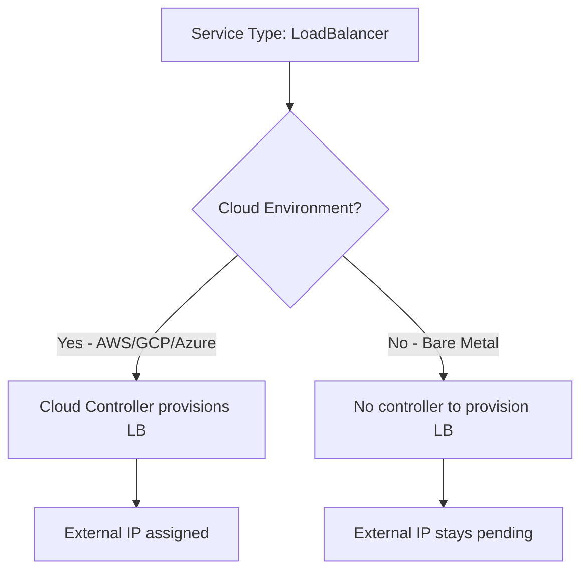

# How to Fix 'Kubernetes Service External IP Pending' with Nginx Ingress

Author: [nawazdhandala](https://github.com/nawazdhandala)

Tags: Kubernetes, Nginx, Ingress, LoadBalancer, DevOps

Description: Learn how to resolve the 'External IP Pending' status for Kubernetes services when using Nginx Ingress, including solutions for bare-metal clusters, cloud environments, and local development.

---

When deploying Nginx Ingress Controller in Kubernetes, you might encounter a frustrating situation where the LoadBalancer service shows `<pending>` for its external IP indefinitely. This guide explains why this happens and provides solutions for different environments.

## Understanding the Problem

When you check your Nginx Ingress service:

```bash
kubectl get svc -n ingress-nginx
```

You see:

```
NAME                       TYPE           CLUSTER-IP      EXTERNAL-IP   PORT(S)
ingress-nginx-controller   LoadBalancer   10.96.145.123   <pending>     80:31456/TCP,443:32167/TCP
```

The `<pending>` status means Kubernetes is waiting for an external IP that never arrives.



## Why This Happens

Kubernetes `LoadBalancer` services expect an external load balancer provisioner. This works automatically in cloud environments (AWS, GCP, Azure) because they have cloud controller managers. On bare-metal or local clusters, there is no provisioner - hence the pending status.

## Solution 1: MetalLB for Bare-Metal Clusters

MetalLB provides a network load balancer implementation for bare-metal Kubernetes clusters.

### Install MetalLB

```bash
# Install MetalLB
kubectl apply -f https://raw.githubusercontent.com/metallb/metallb/v0.13.12/config/manifests/metallb-native.yaml

# Wait for pods to be ready
kubectl wait --namespace metallb-system \
    --for=condition=ready pod \
    --selector=app=metallb \
    --timeout=90s
```

### Configure IP Address Pool

Create an IP address pool for MetalLB to use:

```yaml
# metallb-config.yaml
apiVersion: metallb.io/v1beta1
kind: IPAddressPool
metadata:
  name: default-pool
  namespace: metallb-system
spec:
  addresses:
  - 192.168.1.240-192.168.1.250  # Adjust to your network range
---
apiVersion: metallb.io/v1beta1
kind: L2Advertisement
metadata:
  name: default
  namespace: metallb-system
spec:
  ipAddressPools:
  - default-pool
```

Apply the configuration:

```bash
kubectl apply -f metallb-config.yaml
```

### Verify External IP Assignment

```bash
kubectl get svc -n ingress-nginx

# Expected output:
# NAME                       TYPE           CLUSTER-IP      EXTERNAL-IP     PORT(S)
# ingress-nginx-controller   LoadBalancer   10.96.145.123   192.168.1.240   80:31456/TCP,443:32167/TCP
```

## Solution 2: Use NodePort Instead

If you cannot use MetalLB, convert the service to NodePort:

### Modify Nginx Ingress Service

```yaml
# nginx-ingress-nodeport.yaml
apiVersion: v1
kind: Service
metadata:
  name: ingress-nginx-controller
  namespace: ingress-nginx
spec:
  type: NodePort
  ports:
  - name: http
    port: 80
    targetPort: 80
    nodePort: 30080
  - name: https
    port: 443
    targetPort: 443
    nodePort: 30443
  selector:
    app.kubernetes.io/name: ingress-nginx
    app.kubernetes.io/component: controller
```

Apply the change:

```bash
kubectl apply -f nginx-ingress-nodeport.yaml
```

Access your services at `http://<any-node-ip>:30080`.

## Solution 3: Use HostNetwork

For single-node clusters or when you need ports 80/443 directly:

```yaml
# nginx-ingress-hostnetwork.yaml
apiVersion: apps/v1
kind: Deployment
metadata:
  name: ingress-nginx-controller
  namespace: ingress-nginx
spec:
  template:
    spec:
      hostNetwork: true
      dnsPolicy: ClusterFirstWithHostNet
      containers:
      - name: controller
        ports:
        - containerPort: 80
          hostPort: 80
        - containerPort: 443
          hostPort: 443
```

## Solution 4: External Load Balancer Integration

If you have an external load balancer (HAProxy, F5, etc.), use `externalIPs`:

```yaml
apiVersion: v1
kind: Service
metadata:
  name: ingress-nginx-controller
  namespace: ingress-nginx
spec:
  type: LoadBalancer
  externalIPs:
  - 203.0.113.10  # Your external LB IP
  ports:
  - name: http
    port: 80
    targetPort: 80
  - name: https
    port: 443
    targetPort: 443
  selector:
    app.kubernetes.io/name: ingress-nginx
```

Configure your external load balancer to forward traffic to the NodePorts.

## Solution 5: Local Development with minikube/kind

### For minikube

```bash
# Start minikube tunnel (runs in foreground)
minikube tunnel
```

This creates a route to services deployed with type LoadBalancer and sets their Ingress to their ClusterIP.

### For kind

```yaml
# kind-config.yaml
kind: Cluster
apiVersion: kind.x-k8s.io/v1alpha4
nodes:
- role: control-plane
  kubeadmConfigPatches:
  - |
    kind: InitConfiguration
    nodeRegistration:
      kubeletExtraArgs:
        node-labels: "ingress-ready=true"
  extraPortMappings:
  - containerPort: 80
    hostPort: 80
    protocol: TCP
  - containerPort: 443
    hostPort: 443
    protocol: TCP
```

Create cluster and install Nginx Ingress:

```bash
kind create cluster --config kind-config.yaml

kubectl apply -f https://raw.githubusercontent.com/kubernetes/ingress-nginx/main/deploy/static/provider/kind/deploy.yaml
```

## Solution 6: Cloud-Specific Fixes

### AWS EKS

Ensure the AWS Load Balancer Controller is installed:

```bash
# Install using Helm
helm repo add eks https://aws.github.io/eks-charts
helm install aws-load-balancer-controller eks/aws-load-balancer-controller \
    -n kube-system \
    --set clusterName=my-cluster \
    --set serviceAccount.create=false \
    --set serviceAccount.name=aws-load-balancer-controller
```

Check IAM permissions for the controller.

### GKE

Verify the cloud controller manager is running:

```bash
kubectl get pods -n kube-system | grep cloud-controller
```

### Azure AKS

Ensure the Azure cloud provider is configured:

```bash
kubectl get pods -n kube-system | grep cloud-controller
```

## Troubleshooting Checklist

### Check Nginx Ingress Controller Status

```bash
# Check pods
kubectl get pods -n ingress-nginx

# Check logs
kubectl logs -n ingress-nginx -l app.kubernetes.io/name=ingress-nginx

# Describe the service
kubectl describe svc ingress-nginx-controller -n ingress-nginx
```

### Check MetalLB Status (if installed)

```bash
# Check MetalLB pods
kubectl get pods -n metallb-system

# Check speaker logs
kubectl logs -n metallb-system -l app=metallb,component=speaker

# Check controller logs
kubectl logs -n metallb-system -l app=metallb,component=controller
```

### Verify Network Configuration

```bash
# Check if IP pool is configured
kubectl get ipaddresspools -n metallb-system

# Check L2 advertisement
kubectl get l2advertisements -n metallb-system
```

## Complete MetalLB + Nginx Ingress Setup

Here is a complete setup script for bare-metal clusters:

```bash
#!/bin/bash

# Install Nginx Ingress Controller
kubectl apply -f https://raw.githubusercontent.com/kubernetes/ingress-nginx/controller-v1.9.4/deploy/static/provider/cloud/deploy.yaml

# Wait for ingress controller
kubectl wait --namespace ingress-nginx \
    --for=condition=ready pod \
    --selector=app.kubernetes.io/component=controller \
    --timeout=120s

# Install MetalLB
kubectl apply -f https://raw.githubusercontent.com/metallb/metallb/v0.13.12/config/manifests/metallb-native.yaml

# Wait for MetalLB
kubectl wait --namespace metallb-system \
    --for=condition=ready pod \
    --selector=app=metallb \
    --timeout=90s

# Configure MetalLB (adjust IPs for your network)
cat <<EOF | kubectl apply -f -
apiVersion: metallb.io/v1beta1
kind: IPAddressPool
metadata:
  name: default-pool
  namespace: metallb-system
spec:
  addresses:
  - 192.168.1.240-192.168.1.250
---
apiVersion: metallb.io/v1beta1
kind: L2Advertisement
metadata:
  name: default
  namespace: metallb-system
spec:
  ipAddressPools:
  - default-pool
EOF

# Verify external IP
echo "Waiting for external IP..."
sleep 10
kubectl get svc -n ingress-nginx ingress-nginx-controller
```

## Test Your Ingress

Once the external IP is assigned, test with a sample application:

```yaml
# test-app.yaml
apiVersion: apps/v1
kind: Deployment
metadata:
  name: test-app
spec:
  replicas: 1
  selector:
    matchLabels:
      app: test-app
  template:
    metadata:
      labels:
        app: test-app
    spec:
      containers:
      - name: nginx
        image: nginx:alpine
        ports:
        - containerPort: 80
---
apiVersion: v1
kind: Service
metadata:
  name: test-app
spec:
  ports:
  - port: 80
  selector:
    app: test-app
---
apiVersion: networking.k8s.io/v1
kind: Ingress
metadata:
  name: test-ingress
spec:
  ingressClassName: nginx
  rules:
  - host: test.example.com
    http:
      paths:
      - path: /
        pathType: Prefix
        backend:
          service:
            name: test-app
            port:
              number: 80
```

Test the ingress:

```bash
kubectl apply -f test-app.yaml

# Get the external IP
EXTERNAL_IP=$(kubectl get svc -n ingress-nginx ingress-nginx-controller -o jsonpath='{.status.loadBalancer.ingress[0].ip}')

# Test
curl -H "Host: test.example.com" http://$EXTERNAL_IP
```

## Summary

| Environment | Solution |
|-------------|----------|
| Bare-metal production | MetalLB |
| Single node / edge | HostNetwork |
| External LB available | externalIPs |
| Local development (minikube) | minikube tunnel |
| Local development (kind) | extraPortMappings |
| AWS EKS | AWS Load Balancer Controller |
| GCP GKE | Built-in (verify cloud controller) |
| Azure AKS | Built-in (verify cloud controller) |

The `<pending>` external IP is almost always caused by the absence of a load balancer provisioner. Choose the solution that matches your environment, and your Nginx Ingress will be fully functional.
