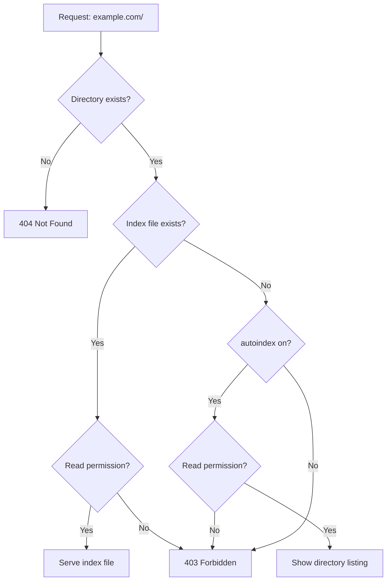

# How to Fix "403 Forbidden: directory index" Errors in Nginx

Author: [nawazdhandala](https://github.com/nawazdhandala)

Tags: Nginx, Web Server, Troubleshooting, Configuration, Security

Description: Learn how to diagnose and fix Nginx 403 Forbidden directory index errors caused by missing index files, incorrect permissions, autoindex settings, and SELinux policies.

---

The "403 Forbidden" error with a "directory index of /path/ is forbidden" message is one of the most common Nginx issues. This error occurs when Nginx cannot serve content for a requested directory. Understanding the various causes helps you quickly diagnose and fix the problem.

## Understanding the Error

When you see this in your Nginx error log:

```
directory index of "/var/www/html/" is forbidden
```

Nginx is telling you it received a request for a directory but cannot fulfill it. The request flow looks like this:



## Common Causes and Solutions

### Cause 1: Missing Index File

The most common cause is requesting a directory that doesn't contain any of the specified index files.

**Check your configuration:**

```nginx
server {
    listen 80;
    server_name example.com;
    root /var/www/html;

    # Nginx looks for these files in order
    index index.html index.htm index.php;

    location / {
        try_files $uri $uri/ =404;
    }
}
```

**Verify index files exist:**

```bash
# List files in the directory
ls -la /var/www/html/

# Check if any index file exists
ls -la /var/www/html/index.*
```

**Solution - Create an index file:**

```bash
# Create a simple index.html
echo "<h1>Welcome</h1>" > /var/www/html/index.html

# Set proper ownership
chown www-data:www-data /var/www/html/index.html
```

### Cause 2: Incorrect File Permissions

Nginx's worker process runs as a specific user (usually `www-data` or `nginx`) and needs read permissions.

**Check the Nginx user:**

```bash
# Find Nginx worker user
grep -E "^user" /etc/nginx/nginx.conf
# Output: user www-data;

# Or check running process
ps aux | grep nginx
```

**Check file permissions:**

```bash
# Check permissions recursively
ls -laR /var/www/html/

# Expected minimum permissions:
# Directories: 755 (rwxr-xr-x)
# Files: 644 (rw-r--r--)
```

**Fix permissions:**

```bash
# Fix ownership
sudo chown -R www-data:www-data /var/www/html/

# Fix directory permissions
sudo find /var/www/html -type d -exec chmod 755 {} \;

# Fix file permissions
sudo find /var/www/html -type f -exec chmod 644 {} \;
```

### Cause 3: Incorrect Directory Permissions

Every directory in the path must be traversable (execute permission):

```bash
# Check the entire path
namei -l /var/www/html/

# Output shows permissions for each path component:
# f: /var/www/html/
# drwxr-xr-x root     root     /
# drwxr-xr-x root     root     var
# drwxr-xr-x root     root     www
# drwxr-xr-x www-data www-data html
```

**Fix parent directory permissions:**

```bash
# Ensure all parent directories are accessible
chmod 755 /var
chmod 755 /var/www
chmod 755 /var/www/html
```

### Cause 4: SELinux Blocking Access

On systems with SELinux enabled (CentOS, RHEL, Fedora), the security context might prevent access.

**Check SELinux status:**

```bash
# Check if SELinux is enforcing
getenforce

# Check audit log for denials
sudo ausearch -m avc -ts recent | grep nginx
```

**Fix SELinux context:**

```bash
# View current context
ls -laZ /var/www/html/

# Set correct context for web content
sudo semanage fcontext -a -t httpd_sys_content_t "/var/www/html(/.*)?"
sudo restorecon -Rv /var/www/html/

# If using writable directories
sudo semanage fcontext -a -t httpd_sys_rw_content_t "/var/www/html/uploads(/.*)?"
sudo restorecon -Rv /var/www/html/uploads/
```

**Temporary test (not for production):**

```bash
# Temporarily disable SELinux to test if it's the cause
sudo setenforce 0

# Re-enable after testing
sudo setenforce 1
```

### Cause 5: Symbolic Link Issues

If your document root uses symbolic links, Nginx might not follow them by default.

**Check for symbolic links:**

```bash
ls -la /var/www/html
# Look for links: lrwxrwxrwx
```

**Enable symbolic link following:**

```nginx
server {
    listen 80;
    server_name example.com;
    root /var/www/html;

    # Disable symlink security check
    disable_symlinks off;

    location / {
        try_files $uri $uri/ =404;
    }
}
```

Or use the safer option that only allows symlinks owned by the same user:

```nginx
disable_symlinks if_not_owner;
```

### Cause 6: Missing autoindex for Directory Listing

If you intentionally want to show directory contents without an index file:

```nginx
server {
    listen 80;
    server_name files.example.com;
    root /var/www/files;

    location / {
        autoindex on;
        autoindex_exact_size off;  # Show human-readable sizes
        autoindex_localtime on;    # Show local time
        autoindex_format html;     # Options: html, xml, json, jsonp
    }
}
```

**Styled directory listing:**

```nginx
location / {
    autoindex on;

    # Add custom header/footer
    add_before_body /autoindex-header.html;
    add_after_body /autoindex-footer.html;
}

# Serve the header/footer files
location = /autoindex-header.html {
    root /var/www/autoindex-assets;
    internal;
}

location = /autoindex-footer.html {
    root /var/www/autoindex-assets;
    internal;
}
```

## Debugging Steps

### Step 1: Check Error Logs

```bash
# View recent errors
sudo tail -50 /var/log/nginx/error.log

# Watch errors in real-time
sudo tail -f /var/log/nginx/error.log

# Filter for 403 errors
sudo grep "forbidden" /var/log/nginx/error.log
```

### Step 2: Test Configuration

```bash
# Validate nginx configuration
sudo nginx -t

# Show effective configuration for a location
sudo nginx -T | grep -A 20 "server_name example.com"
```

### Step 3: Test as Nginx User

```bash
# Switch to nginx user and test file access
sudo -u www-data cat /var/www/html/index.html

# Test directory listing
sudo -u www-data ls /var/www/html/
```

### Step 4: Use strace for Deep Debugging

```bash
# Trace nginx worker process
# First find the worker PID
pgrep -a nginx

# Then trace file access
sudo strace -p <worker_pid> -e open,stat,access 2>&1 | grep -E "(EACCES|ENOENT)"
```

## Complete Diagnostic Script

```bash
#!/bin/bash
# nginx-403-debug.sh

DOCROOT=${1:-/var/www/html}
NGINX_USER=$(grep -E "^user" /etc/nginx/nginx.conf | awk '{print $2}' | tr -d ';')

echo "=== Nginx 403 Debugger ==="
echo "Document root: $DOCROOT"
echo "Nginx user: $NGINX_USER"
echo ""

echo "=== Checking directory exists ==="
if [ -d "$DOCROOT" ]; then
    echo "OK: Directory exists"
else
    echo "ERROR: Directory does not exist"
    exit 1
fi

echo ""
echo "=== Checking index files ==="
for f in index.html index.htm index.php; do
    if [ -f "$DOCROOT/$f" ]; then
        echo "FOUND: $f"
    else
        echo "NOT FOUND: $f"
    fi
done

echo ""
echo "=== Checking path permissions ==="
namei -l "$DOCROOT"

echo ""
echo "=== Checking as nginx user ==="
sudo -u $NGINX_USER ls "$DOCROOT" > /dev/null 2>&1
if [ $? -eq 0 ]; then
    echo "OK: Nginx user can read directory"
else
    echo "ERROR: Nginx user cannot read directory"
fi

echo ""
echo "=== SELinux status ==="
if command -v getenforce &> /dev/null; then
    echo "SELinux: $(getenforce)"
    echo "Context: $(ls -dZ $DOCROOT)"
else
    echo "SELinux not installed"
fi

echo ""
echo "=== Recent 403 errors ==="
sudo tail -10 /var/log/nginx/error.log | grep -i "forbidden" || echo "No recent 403 errors"
```

## Configuration Template

Here's a complete configuration that addresses common 403 causes:

```nginx
server {
    listen 80;
    server_name example.com;

    # Document root with explicit path
    root /var/www/html;

    # Multiple index file options
    index index.html index.htm index.php default.html;

    # Allow symlinks (if needed)
    disable_symlinks if_not_owner;

    # Main location
    location / {
        # Try file, then directory, then 404
        try_files $uri $uri/ =404;

        # Optional: enable directory listing as fallback
        # autoindex on;
    }

    # PHP handling (if applicable)
    location ~ \.php$ {
        include fastcgi_params;
        fastcgi_pass unix:/var/run/php/php-fpm.sock;
        fastcgi_param SCRIPT_FILENAME $document_root$fastcgi_script_name;
    }

    # Deny access to hidden files
    location ~ /\. {
        deny all;
        return 404;
    }
}
```

## Summary

| Cause | Symptom | Solution |
|-------|---------|----------|
| Missing index file | No index.* in directory | Create index.html or enable autoindex |
| File permissions | Files not readable by nginx user | chmod 644 for files, 755 for directories |
| Directory permissions | Cannot traverse path | Ensure 755 on all parent directories |
| Ownership | Wrong owner | chown www-data:www-data |
| SELinux | Works with setenforce 0 | Set httpd_sys_content_t context |
| Symlinks | Links not followed | disable_symlinks off or if_not_owner |

The 403 Forbidden error is almost always a permissions issue. By systematically checking file existence, permissions, ownership, and SELinux context, you can quickly identify and resolve the root cause.
