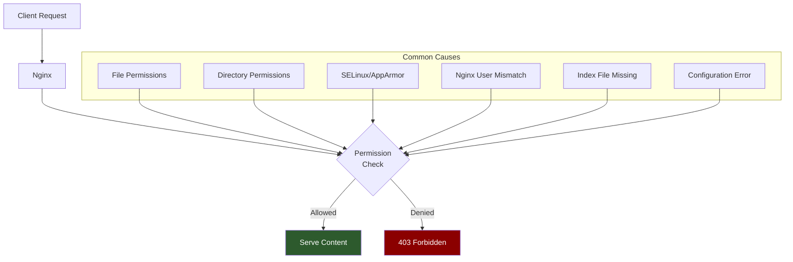
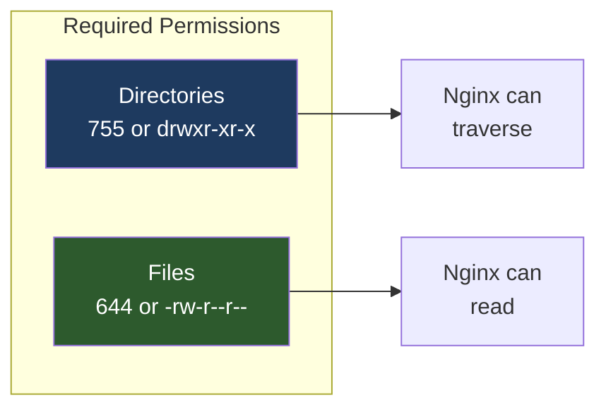
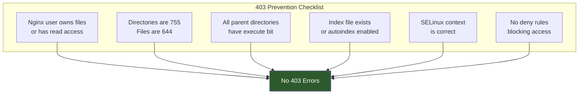

# How to Fix "403 Forbidden for All Files" in Nginx

Author: [nawazdhandala](https://www.github.com/nawazdhandala)

Tags: Nginx, Troubleshooting, Permissions, 403 Forbidden, Linux, DevOps

Description: Learn how to diagnose and fix Nginx 403 Forbidden errors for all files, covering permission issues, SELinux contexts, configuration mistakes, and common pitfalls.

---

A 403 Forbidden error in Nginx means the server understands the request but refuses to fulfill it. When this happens for all files, it typically indicates a fundamental permission or configuration issue. This guide walks through systematic debugging and solutions.

## Understanding 403 Forbidden Errors



## Diagnosing the Problem

### Step 1: Check Error Logs

The Nginx error log provides crucial information:

```bash
# View recent errors
tail -50 /var/log/nginx/error.log

# Watch errors in real-time
tail -f /var/log/nginx/error.log

# Search for permission-related errors
grep -i "permission\|forbidden\|denied" /var/log/nginx/error.log
```

Common error messages:

```
# Permission denied
directory index of "/var/www/html/" is forbidden

# File permission issue
open() "/var/www/html/index.html" failed (13: Permission denied)

# SELinux denial
connect() to 127.0.0.1:8080 failed (13: Permission denied)
```

### Step 2: Identify the Nginx User

```bash
# Find out which user Nginx runs as
ps aux | grep nginx
# or
grep -E "^user" /etc/nginx/nginx.conf

# Common Nginx users by distribution:
# Ubuntu/Debian: www-data
# CentOS/RHEL: nginx
# Alpine: nginx
```

### Step 3: Check File and Directory Permissions

```bash
# Check web root permissions
ls -la /var/www/html/

# Check directory permissions up the tree
namei -l /var/www/html/index.html

# Expected output shows permission chain:
# f: /var/www/html/index.html
# drwxr-xr-x root root /
# drwxr-xr-x root root var
# drwxr-xr-x root root www
# drwxr-xr-x www-data www-data html
# -rw-r--r-- www-data www-data index.html
```

## Solutions

### Solution 1: Fix File Permissions



Set correct permissions for your web root:

```bash
# Set ownership to Nginx user
sudo chown -R www-data:www-data /var/www/html/

# Set directory permissions (755 = rwxr-xr-x)
sudo find /var/www/html -type d -exec chmod 755 {} \;

# Set file permissions (644 = rw-r--r--)
sudo find /var/www/html -type f -exec chmod 644 {} \;

# Verify the changes
ls -la /var/www/html/
```

### Solution 2: Fix Parent Directory Permissions

Nginx needs execute permission on all parent directories:

```bash
# Check entire path
namei -l /var/www/html/

# If any directory lacks execute permission, fix it
chmod +x /var
chmod +x /var/www
chmod +x /var/www/html

# Alternative: Check with nginx user
sudo -u www-data ls /var/www/html/
```

```mermaid
flowchart TB
    subgraph Path["Directory Path"]
        Root[/ root:root<br/>rwxr-xr-x] --> Var[/var root:root<br/>rwxr-xr-x]
        Var --> Www[/var/www root:root<br/>rwxr-xr-x]
        Www --> Html[/var/www/html www-data:www-data<br/>rwxr-xr-x]
        Html --> Index[index.html<br/>rw-r--r--]
    end

    Note[All directories need<br/>execute bit for traversal]

    style Note fill:#1e3a5f,color:#fff
```

### Solution 3: Handle SELinux (CentOS/RHEL)

SELinux can block Nginx even with correct Unix permissions:

```bash
# Check if SELinux is enabled
getenforce

# Check SELinux denials
ausearch -m avc -ts recent | grep nginx

# View current context
ls -Z /var/www/html/

# Set correct SELinux context
sudo semanage fcontext -a -t httpd_sys_content_t "/var/www/html(/.*)?"
sudo restorecon -Rv /var/www/html/

# For dynamic content that needs to be written
sudo semanage fcontext -a -t httpd_sys_rw_content_t "/var/www/html/uploads(/.*)?"
sudo restorecon -Rv /var/www/html/uploads/

# Allow Nginx to connect to network (for proxy_pass)
sudo setsebool -P httpd_can_network_connect 1

# Allow Nginx to connect to specific ports
sudo semanage port -a -t http_port_t -p tcp 8080
```

### Solution 4: Add Index File or Enable Directory Listing

If no index file exists, Nginx returns 403:

```bash
# Check for index files
ls -la /var/www/html/index.*
```

Configure index directive or enable autoindex:

```nginx
server {
    listen 80;
    server_name example.com;
    root /var/www/html;

    # Specify index files
    index index.html index.htm index.php;

    location / {
        # Try files in order, then return 404
        try_files $uri $uri/ =404;
    }

    # If you want directory listing (not recommended for production)
    location /files/ {
        autoindex on;
        autoindex_exact_size off;
        autoindex_localtime on;
    }
}
```

### Solution 5: Check Nginx Configuration

Common configuration mistakes that cause 403:

```nginx
# Wrong: Using deny all without proper allow rules
location / {
    deny all;  # This blocks everything!
}

# Correct: Specify what to allow
location / {
    # Allow specific IPs
    allow 192.168.1.0/24;
    allow 10.0.0.0/8;
    deny all;
}

# Wrong: Missing root directive
server {
    listen 80;
    # root is missing - Nginx uses default which may not exist

    location / {
        # This will fail
    }
}

# Correct: Always specify root
server {
    listen 80;
    root /var/www/html;

    location / {
        try_files $uri $uri/ =404;
    }
}
```

### Solution 6: Fix User Home Directory Permissions

When serving from a user's home directory:

```bash
# User home directories often have restrictive permissions
ls -la /home/
# drwx------ (700) is typical but blocks Nginx

# Option 1: Change home directory permissions
chmod 711 /home/username

# Option 2: Add Nginx user to the user's group
usermod -aG username www-data

# Option 3: Use a different location (recommended)
# Move web files to /var/www instead
```

```nginx
# Configuration for user home directory
server {
    listen 80;
    server_name example.com;

    # Serving from home directory (not recommended)
    root /home/username/public_html;

    location / {
        try_files $uri $uri/ =404;
    }
}
```

### Solution 7: Handle Symbolic Links

Nginx may not follow symlinks by default:

```bash
# Check for symbolic links
ls -la /var/www/html/

# If index.html is a symlink
lrwxrwxrwx 1 www-data www-data 24 Dec 16 10:00 index.html -> /home/user/site/index.html
```

Configure Nginx to follow symlinks:

```nginx
server {
    listen 80;
    root /var/www/html;

    location / {
        # Disable symlink checking (follow all symlinks)
        disable_symlinks off;

        try_files $uri $uri/ =404;
    }
}
```

## Complete Debugging Script

Create a script to diagnose 403 errors:

```bash
#!/bin/bash
# debug_403.sh - Diagnose Nginx 403 Forbidden errors

WEB_ROOT="${1:-/var/www/html}"
NGINX_USER=$(grep -E "^user" /etc/nginx/nginx.conf | awk '{print $2}' | tr -d ';')

echo "=== Nginx 403 Forbidden Debugger ==="
echo ""
echo "Web root: $WEB_ROOT"
echo "Nginx user: $NGINX_USER"
echo ""

# Check if directory exists
if [ ! -d "$WEB_ROOT" ]; then
    echo "[ERROR] Web root does not exist!"
    exit 1
fi

# Check Nginx user
echo "=== Nginx Process ==="
ps aux | grep "[n]ginx"
echo ""

# Check file permissions
echo "=== File Permissions ==="
ls -la "$WEB_ROOT"
echo ""

# Check path permissions
echo "=== Path Permissions ==="
namei -l "$WEB_ROOT"
echo ""

# Check if index file exists
echo "=== Index Files ==="
ls -la "$WEB_ROOT"/index.* 2>/dev/null || echo "No index files found!"
echo ""

# Test access as Nginx user
echo "=== Access Test as $NGINX_USER ==="
sudo -u "$NGINX_USER" ls "$WEB_ROOT" && echo "SUCCESS: Can list directory" || echo "FAILED: Cannot list directory"
sudo -u "$NGINX_USER" cat "$WEB_ROOT/index.html" > /dev/null 2>&1 && echo "SUCCESS: Can read index.html" || echo "FAILED: Cannot read index.html"
echo ""

# Check SELinux
echo "=== SELinux Status ==="
if command -v getenforce &> /dev/null; then
    echo "SELinux: $(getenforce)"
    ls -Z "$WEB_ROOT" 2>/dev/null | head -5
else
    echo "SELinux: Not installed"
fi
echo ""

# Check recent errors
echo "=== Recent Nginx Errors ==="
tail -10 /var/log/nginx/error.log 2>/dev/null
echo ""

# Nginx configuration test
echo "=== Nginx Configuration Test ==="
nginx -t 2>&1
```

## Prevention Checklist



### Quick Fix Commands

```bash
# One-liner to fix most 403 issues
WEB_ROOT=/var/www/html && \
sudo chown -R www-data:www-data $WEB_ROOT && \
sudo find $WEB_ROOT -type d -exec chmod 755 {} \; && \
sudo find $WEB_ROOT -type f -exec chmod 644 {} \; && \
sudo nginx -t && sudo systemctl reload nginx

# For SELinux systems, add:
sudo restorecon -Rv $WEB_ROOT
```

## Summary

The 403 Forbidden error in Nginx typically stems from permission issues. To resolve it:

1. **Check error logs** for the specific denial reason
2. **Verify file permissions** - directories need 755, files need 644
3. **Check ownership** - Nginx user must have read access
4. **Verify parent directory permissions** - all need execute bit
5. **Handle SELinux** on RHEL/CentOS systems
6. **Ensure index files exist** or enable autoindex
7. **Review Nginx configuration** for deny rules or missing root directive

By systematically checking each of these areas, you can identify and fix the cause of 403 Forbidden errors in your Nginx server.
