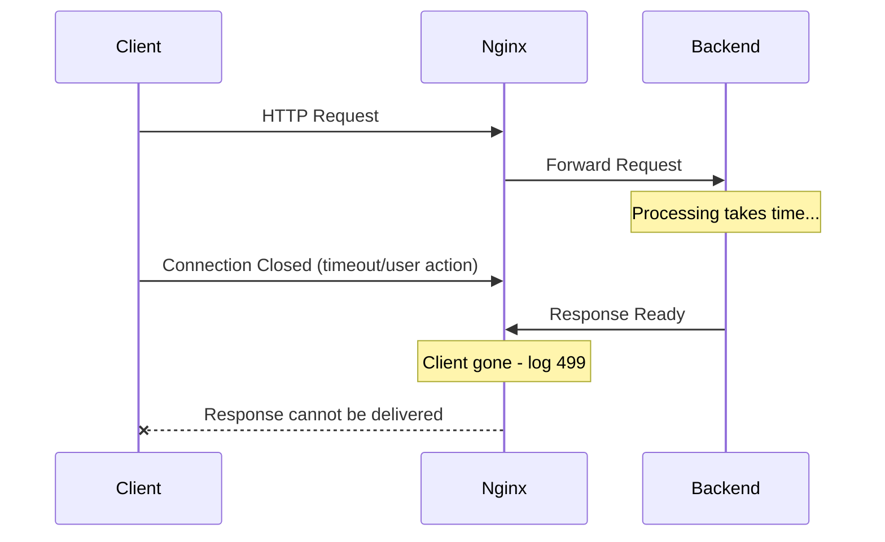
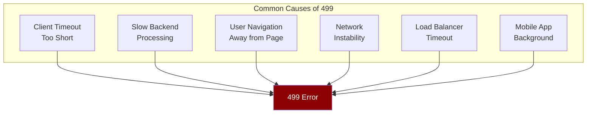
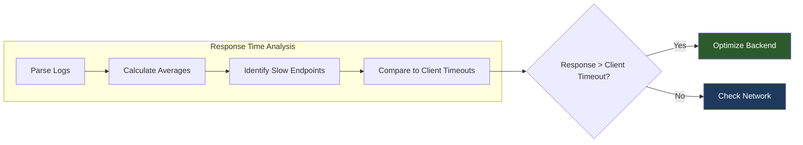
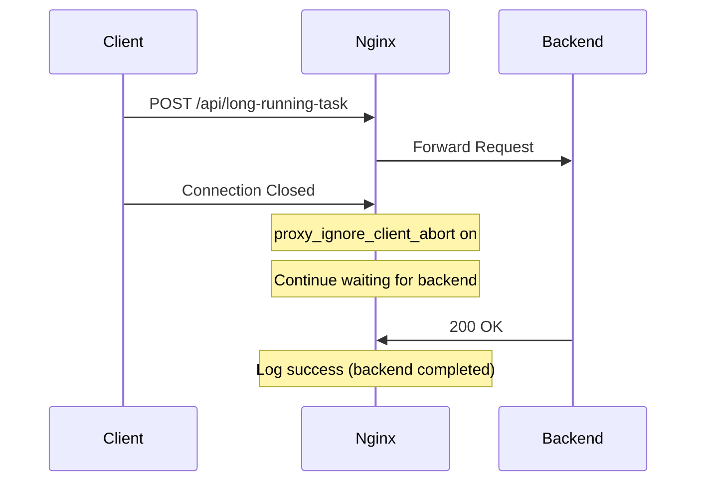
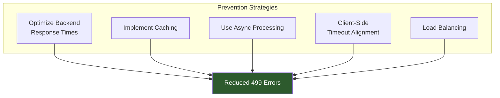

# How to Debug Nginx 499 Error Codes

Author: [nawazdhandala](https://www.github.com/nawazdhandala)

Tags: Nginx, Troubleshooting, HTTP Status Codes, Web Server, DevOps

Description: Learn how to debug and fix Nginx 499 error codes, which occur when clients close connections before the server responds. Understand the root causes and implement practical solutions.

---

The Nginx 499 status code is a non-standard HTTP status that indicates the client closed the connection before the server finished sending a response. This error does not exist in the official HTTP specification - it is specific to Nginx. Understanding and debugging this error is crucial for maintaining reliable web services.

## Understanding the 499 Status Code



The 499 error occurs in this sequence:

1. A client sends a request to Nginx
2. Nginx forwards the request to an upstream backend
3. The client closes the connection (timeout, user navigation, or network issue)
4. The backend returns a response, but Nginx has nowhere to send it

## Common Causes of 499 Errors



### Client-Side Timeouts

The most common cause is when client applications have shorter timeouts than the server needs to process the request.

```javascript
// JavaScript fetch with short timeout
const controller = new AbortController();
const timeoutId = setTimeout(() => controller.abort(), 5000); // 5 second timeout

fetch('/api/slow-endpoint', { signal: controller.signal })
  .then(response => response.json())
  .catch(err => {
    if (err.name === 'AbortError') {
      console.log('Request timed out');
    }
  });
```

### Slow Backend Processing

When backends take longer than expected, clients may give up waiting.

```nginx
# Check your upstream response times in Nginx logs
log_format upstream_time '$remote_addr - $remote_user [$time_local] '
                         '"$request" $status $body_bytes_sent '
                         '"$http_referer" "$http_user_agent" '
                         'rt=$request_time uct="$upstream_connect_time" '
                         'uht="$upstream_header_time" urt="$upstream_response_time"';

access_log /var/log/nginx/access.log upstream_time;
```

## Debugging 499 Errors

### Step 1: Analyze Your Logs

First, identify patterns in your 499 errors.

```bash
# Count 499 errors by endpoint
grep '" 499 ' /var/log/nginx/access.log | awk '{print $7}' | sort | uniq -c | sort -rn | head -20

# Find 499 errors with request times
grep '" 499 ' /var/log/nginx/access.log | awk '{print $0}' | tail -50

# Analyze 499 errors by time of day
grep '" 499 ' /var/log/nginx/access.log | awk '{print substr($4,14,2)}' | sort | uniq -c
```

### Step 2: Check Upstream Response Times



Create a script to analyze upstream response times:

```bash
#!/bin/bash
# analyze_499.sh - Analyze 499 errors and their response times

LOG_FILE="/var/log/nginx/access.log"

echo "=== 499 Error Analysis ==="
echo ""

# Total 499 errors
total_499=$(grep -c '" 499 ' "$LOG_FILE")
echo "Total 499 errors: $total_499"

# 499 errors by endpoint
echo ""
echo "Top endpoints with 499 errors:"
grep '" 499 ' "$LOG_FILE" | \
  awk '{print $7}' | \
  sed 's/\?.*//g' | \
  sort | uniq -c | sort -rn | head -10

# Average response time for 499 errors (if using custom log format)
echo ""
echo "Response times for 499 errors (last 100):"
grep '" 499 ' "$LOG_FILE" | \
  grep -oP 'rt=\K[0-9.]+' | \
  tail -100 | \
  awk '{sum+=$1; count++} END {print "Average: " sum/count " seconds"}'
```

### Step 3: Enable Detailed Error Logging

Configure Nginx to provide more detailed information:

```nginx
http {
    # Enable debug logging for specific IPs during investigation
    error_log /var/log/nginx/error.log warn;

    # For specific server blocks that have 499 issues
    server {
        listen 80;
        server_name example.com;

        # Custom log format with upstream timing
        log_format detailed '$remote_addr - $remote_user [$time_local] '
                           '"$request" $status $body_bytes_sent '
                           'rt=$request_time '
                           'ua="$upstream_addr" '
                           'us=$upstream_status '
                           'ut=$upstream_response_time '
                           'cs=$upstream_cache_status';

        access_log /var/log/nginx/detailed.log detailed;

        location / {
            proxy_pass http://backend;
        }
    }
}
```

## Solutions for 499 Errors

### Solution 1: Adjust Proxy Timeouts

Ensure Nginx does not give up on slow backends before clients do:

```nginx
http {
    upstream backend {
        server 127.0.0.1:8080;
    }

    server {
        listen 80;

        location / {
            proxy_pass http://backend;

            # Increase proxy timeouts
            proxy_connect_timeout 60s;
            proxy_send_timeout 60s;
            proxy_read_timeout 60s;

            # Buffer settings
            proxy_buffering on;
            proxy_buffer_size 4k;
            proxy_buffers 8 4k;
        }
    }
}
```

### Solution 2: Handle Client Disconnects Gracefully

Configure Nginx to ignore client disconnects for specific endpoints:

```nginx
location /api/long-running-task {
    proxy_pass http://backend;

    # Continue processing even if client disconnects
    proxy_ignore_client_abort on;

    # Extended timeouts for long operations
    proxy_read_timeout 300s;
}
```



### Solution 3: Implement Request Queuing

For endpoints that regularly cause 499 errors, implement asynchronous processing:

```nginx
# Nginx configuration for async pattern
location /api/process {
    proxy_pass http://backend;
    proxy_read_timeout 5s;
}

location /api/process/status {
    proxy_pass http://backend;
    proxy_read_timeout 5s;
}
```

```python
# Backend implementation (Python/Flask example)
from flask import Flask, jsonify
import uuid
import threading

app = Flask(__name__)
tasks = {}

@app.route('/api/process', methods=['POST'])
def start_process():
    task_id = str(uuid.uuid4())
    tasks[task_id] = {'status': 'processing'}

    # Start background processing
    thread = threading.Thread(target=process_task, args=(task_id,))
    thread.start()

    # Return immediately with task ID
    return jsonify({'task_id': task_id, 'status': 'accepted'}), 202

@app.route('/api/process/status/<task_id>')
def check_status(task_id):
    if task_id in tasks:
        return jsonify(tasks[task_id])
    return jsonify({'error': 'Task not found'}), 404

def process_task(task_id):
    # Simulate long processing
    import time
    time.sleep(30)
    tasks[task_id] = {'status': 'complete', 'result': 'done'}
```

### Solution 4: Add Health Checks and Retries

```nginx
upstream backend {
    server 127.0.0.1:8080 max_fails=3 fail_timeout=30s;
    server 127.0.0.1:8081 max_fails=3 fail_timeout=30s backup;

    # Keep connections alive
    keepalive 32;
}

server {
    location / {
        proxy_pass http://backend;

        # Retry on specific errors
        proxy_next_upstream error timeout http_502 http_503 http_504;
        proxy_next_upstream_timeout 10s;
        proxy_next_upstream_tries 3;

        # Connection settings
        proxy_http_version 1.1;
        proxy_set_header Connection "";
    }
}
```

## Monitoring 499 Errors

### Set Up Alerts

Create a monitoring script to alert on excessive 499 errors:

```bash
#!/bin/bash
# monitor_499.sh - Alert on 499 error spikes

THRESHOLD=100
WINDOW_MINUTES=5
LOG_FILE="/var/log/nginx/access.log"
ALERT_EMAIL="ops@example.com"

# Count 499 errors in the last N minutes
count=$(awk -v date="$(date -d "$WINDOW_MINUTES minutes ago" '+%d/%b/%Y:%H:%M')" \
  '$4 >= "["date && /\" 499 /' "$LOG_FILE" | wc -l)

if [ "$count" -gt "$THRESHOLD" ]; then
    echo "Alert: $count 499 errors in last $WINDOW_MINUTES minutes" | \
      mail -s "Nginx 499 Error Spike" "$ALERT_EMAIL"
fi
```

### Create a Dashboard Query

For Prometheus/Grafana monitoring:

```yaml
# Prometheus alert rule
groups:
  - name: nginx_alerts
    rules:
      - alert: High499ErrorRate
        expr: |
          sum(rate(nginx_http_requests_total{status="499"}[5m]))
          / sum(rate(nginx_http_requests_total[5m])) > 0.05
        for: 5m
        labels:
          severity: warning
        annotations:
          summary: "High rate of Nginx 499 errors"
          description: "More than 5% of requests are returning 499"
```

## Prevention Strategies



### Backend Optimization

- Profile and optimize slow database queries
- Add caching layers (Redis, Memcached)
- Implement connection pooling
- Use async processing for long-running tasks

### Client Configuration

Coordinate client timeouts with your infrastructure:

```javascript
// Align client timeout with server capabilities
const API_TIMEOUT = 30000; // 30 seconds - matches Nginx proxy_read_timeout

async function fetchWithTimeout(url, options = {}) {
    const controller = new AbortController();
    const timeout = setTimeout(() => controller.abort(), API_TIMEOUT);

    try {
        const response = await fetch(url, {
            ...options,
            signal: controller.signal
        });
        return response;
    } finally {
        clearTimeout(timeout);
    }
}
```

## Summary

Nginx 499 errors indicate clients are giving up before servers can respond. The key debugging steps are:

1. **Analyze logs** to identify patterns in endpoints, times, and response durations
2. **Check upstream response times** to find slow backends
3. **Adjust timeouts** to align client, Nginx, and backend expectations
4. **Implement async processing** for long-running operations
5. **Monitor continuously** to catch issues before they become critical

By understanding the relationship between client expectations and server capabilities, you can significantly reduce 499 errors and improve the reliability of your web services.
