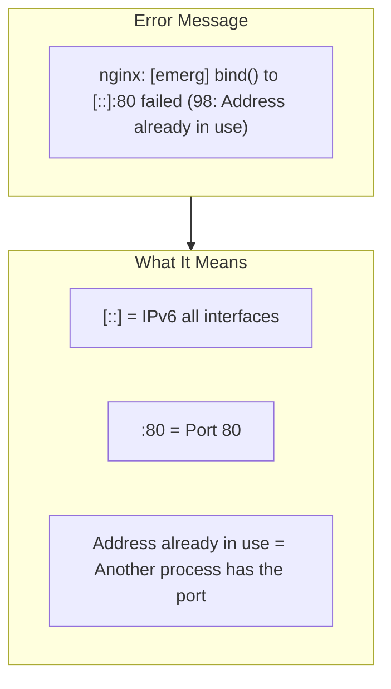
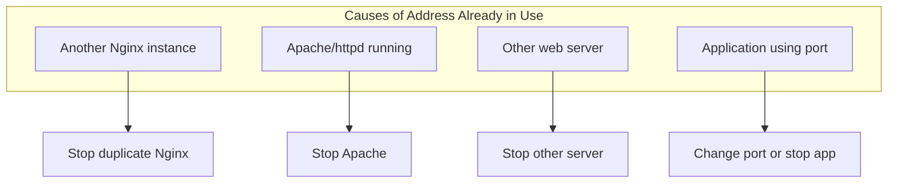
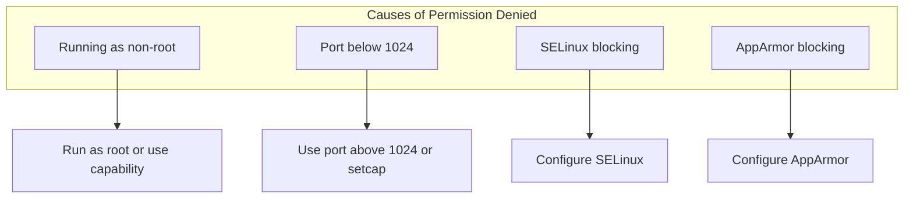
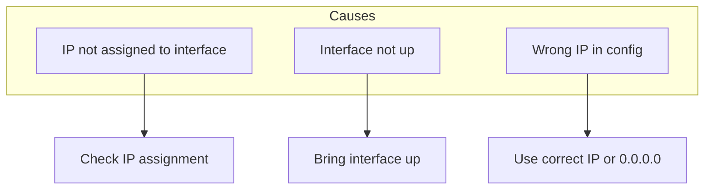

# How to Fix "bind() to [::]:80 failed" Errors in Nginx

Author: [nawazdhandala](https://www.github.com/nawazdhandala)

Tags: Nginx, Troubleshooting, Port Binding, Linux, DevOps, Networking

Description: Learn how to diagnose and fix the Nginx error "bind() to [::]:80 failed" caused by port conflicts, permission issues, or IPv6 configuration problems.

---

The "bind() to [::]:80 failed" error in Nginx prevents the server from starting because it cannot bind to the requested port. This guide covers all the common causes and their solutions.

## Understanding the Error



Common variations of this error:

```
# Port already in use
nginx: [emerg] bind() to 0.0.0.0:80 failed (98: Address already in use)

# Permission denied
nginx: [emerg] bind() to 0.0.0.0:80 failed (13: Permission denied)

# Cannot assign address
nginx: [emerg] bind() to 192.168.1.100:80 failed (99: Cannot assign requested address)
```

## Diagnosing the Problem

### Step 1: Check What Is Using the Port

```bash
# Find process using port 80
sudo lsof -i :80

# Alternative using netstat
sudo netstat -tlnp | grep :80

# Alternative using ss
sudo ss -tlnp | grep :80

# Check both IPv4 and IPv6
sudo lsof -i TCP:80
sudo lsof -i6 TCP:80
```

Example output:

```
COMMAND   PID     USER   FD   TYPE DEVICE SIZE/OFF NODE NAME
nginx    1234     root    6u  IPv4  12345      0t0  TCP *:80 (LISTEN)
nginx    1235 www-data    6u  IPv4  12345      0t0  TCP *:80 (LISTEN)
apache2  5678     root    4u  IPv6  67890      0t0  TCP *:80 (LISTEN)
```

### Step 2: Check Nginx Status

```bash
# Check if Nginx is already running
systemctl status nginx

# Check for multiple Nginx processes
ps aux | grep nginx

# Check Nginx master process
pgrep -a nginx
```

## Solutions by Error Type

### Error: "Address already in use" (Error 98)



#### Solution 1A: Stop Conflicting Nginx

```bash
# Stop Nginx properly
sudo systemctl stop nginx

# Kill all Nginx processes if needed
sudo pkill nginx

# Verify port is free
sudo lsof -i :80

# Start Nginx
sudo systemctl start nginx
```

#### Solution 1B: Stop Apache/httpd

```bash
# Stop Apache
sudo systemctl stop apache2    # Debian/Ubuntu
sudo systemctl stop httpd      # CentOS/RHEL

# Disable Apache from starting on boot
sudo systemctl disable apache2
sudo systemctl disable httpd

# Verify and start Nginx
sudo lsof -i :80
sudo systemctl start nginx
```

#### Solution 1C: Configure Different Port

If you need both services running:

```nginx
# Change Nginx to use different port
server {
    listen 8080;
    listen [::]:8080;
    server_name example.com;

    # ... rest of config
}
```

### Error: "Permission denied" (Error 13)



#### Solution 2A: Run Nginx as Root (Not Recommended)

```bash
# Check current user
whoami

# Start Nginx with sudo
sudo nginx

# Or start via systemd (runs as root by default)
sudo systemctl start nginx
```

#### Solution 2B: Use Linux Capabilities

Grant Nginx the ability to bind to privileged ports without running as root:

```bash
# Find Nginx binary
which nginx

# Grant capability to bind to low ports
sudo setcap 'cap_net_bind_service=+ep' /usr/sbin/nginx

# Verify capability
getcap /usr/sbin/nginx
# Output: /usr/sbin/nginx = cap_net_bind_service+ep

# Note: May need to reapply after Nginx updates
```

#### Solution 2C: Use authbind

```bash
# Install authbind
sudo apt install authbind

# Allow binding to port 80
sudo touch /etc/authbind/byport/80
sudo chmod 500 /etc/authbind/byport/80
sudo chown nginx /etc/authbind/byport/80

# Run Nginx with authbind
authbind --deep nginx
```

#### Solution 2D: Configure SELinux

```bash
# Check SELinux status
getenforce

# Check for SELinux denials
ausearch -m avc -ts recent | grep nginx

# Allow Nginx to bind to any port
sudo setsebool -P httpd_can_network_connect 1

# Or allow specific port
sudo semanage port -a -t http_port_t -p tcp 80
```

### Error: "Cannot assign requested address" (Error 99)



#### Solution 3A: Verify IP Address

```bash
# Check available IP addresses
ip addr show

# Check if the IP exists
ip addr show | grep "192.168.1.100"

# List all interfaces
ip link show
```

#### Solution 3B: Use Correct Listen Directive

```nginx
# Wrong - IP doesn't exist on this server
server {
    listen 192.168.1.100:80;
}

# Correct - bind to all IPv4 interfaces
server {
    listen 80;
    # or explicitly
    listen 0.0.0.0:80;
}

# Correct - bind to all IPv4 and IPv6 interfaces
server {
    listen 80;
    listen [::]:80;
}
```

### IPv6 Specific Issues

#### Disable IPv6 in Nginx

If you do not need IPv6:

```nginx
# Remove or comment out IPv6 listen directives
server {
    listen 80;
    # listen [::]:80;  # Commented out

    server_name example.com;
}
```

#### Enable IPv6 on the System

```bash
# Check if IPv6 is enabled
cat /proc/sys/net/ipv6/conf/all/disable_ipv6
# 0 = enabled, 1 = disabled

# Enable IPv6 temporarily
sudo sysctl -w net.ipv6.conf.all.disable_ipv6=0

# Enable IPv6 permanently
echo "net.ipv6.conf.all.disable_ipv6 = 0" | sudo tee -a /etc/sysctl.conf
sudo sysctl -p
```

## Docker-Specific Issues

### Port Mapping Conflicts

```yaml
# docker-compose.yml
version: '3.8'
services:
  web:
    image: nginx
    ports:
      - "80:80"    # This may conflict with host Nginx
      - "443:443"
```

Solutions:

```bash
# Option 1: Stop host Nginx
sudo systemctl stop nginx

# Option 2: Use different host port
ports:
  - "8080:80"

# Option 3: Use host network mode (shares host's network)
network_mode: host
```

### Check Docker Port Usage

```bash
# See Docker port mappings
docker ps --format "{{.Names}}: {{.Ports}}"

# Check which container uses port 80
docker ps | grep "0.0.0.0:80"

# Stop container using the port
docker stop <container_name>
```

## Prevention and Best Practices

### Nginx Configuration Validation

Always test configuration before restarting:

```bash
# Test configuration syntax
sudo nginx -t

# Test and show configuration
sudo nginx -T

# Only if test passes, reload
sudo nginx -t && sudo systemctl reload nginx
```

### Graceful Reload vs Restart

```bash
# Reload - keeps connections alive, no downtime
sudo systemctl reload nginx

# Restart - drops all connections
sudo systemctl restart nginx

# Use reload when possible
sudo nginx -s reload
```

### Startup Script to Check Port

```bash
#!/bin/bash
# pre-start-check.sh

PORT=80

if lsof -Pi :$PORT -sTCP:LISTEN -t >/dev/null; then
    echo "Error: Port $PORT is already in use"
    lsof -i :$PORT
    exit 1
fi

echo "Port $PORT is available"
nginx -t && systemctl start nginx
```

### Systemd Override for Dependencies

Create a systemd override to ensure proper startup order:

```bash
sudo systemctl edit nginx
```

Add:

```ini
[Unit]
After=network-online.target
Wants=network-online.target

[Service]
ExecStartPre=/bin/sleep 2
```

## Complete Troubleshooting Script

```bash
#!/bin/bash
# fix-nginx-bind.sh - Diagnose and help fix Nginx bind errors

PORT=${1:-80}
echo "=== Nginx Port $PORT Bind Troubleshooter ==="
echo ""

# Check what's using the port
echo "=== Checking port $PORT usage ==="
if sudo lsof -i :$PORT > /dev/null 2>&1; then
    echo "Port $PORT is in use by:"
    sudo lsof -i :$PORT
    echo ""
    echo "To free the port, stop the process or change Nginx to a different port."
else
    echo "Port $PORT is available"
fi
echo ""

# Check Nginx status
echo "=== Nginx Status ==="
if systemctl is-active --quiet nginx; then
    echo "Nginx is running"
    systemctl status nginx --no-pager | head -10
else
    echo "Nginx is not running"
fi
echo ""

# Check for permission issues
echo "=== Permission Check ==="
if [ "$PORT" -lt 1024 ]; then
    echo "Port $PORT requires root privileges or special capabilities"
    NGINX_BIN=$(which nginx)
    echo "Nginx binary: $NGINX_BIN"
    echo "Capabilities: $(getcap $NGINX_BIN 2>/dev/null || echo 'none')"
fi
echo ""

# Check IPv6
echo "=== IPv6 Status ==="
IPV6_DISABLED=$(cat /proc/sys/net/ipv6/conf/all/disable_ipv6)
if [ "$IPV6_DISABLED" = "1" ]; then
    echo "IPv6 is DISABLED - remove [::]:$PORT from Nginx config"
else
    echo "IPv6 is enabled"
fi
echo ""

# Check SELinux
echo "=== SELinux Status ==="
if command -v getenforce &> /dev/null; then
    echo "SELinux: $(getenforce)"
    if [ "$(getenforce)" = "Enforcing" ]; then
        echo "Check for denials: ausearch -m avc -ts recent | grep nginx"
    fi
else
    echo "SELinux not installed"
fi
echo ""

# Test Nginx configuration
echo "=== Nginx Configuration Test ==="
sudo nginx -t 2>&1
echo ""

echo "=== Recommendations ==="
echo "1. If port in use: sudo systemctl stop <service> or change Nginx port"
echo "2. If permission denied: sudo setcap 'cap_net_bind_service=+ep' $(which nginx)"
echo "3. If IPv6 error: Remove listen [::]:$PORT from config or enable IPv6"
```

## Summary

The "bind() to [::]:80 failed" error has several potential causes:

| Error Code | Meaning | Common Solution |
|------------|---------|-----------------|
| 98 | Address in use | Stop conflicting service |
| 13 | Permission denied | Use setcap or run as root |
| 99 | Cannot assign address | Use correct IP or 0.0.0.0 |

Key steps to resolve:

1. **Identify what is using the port** with `lsof` or `ss`
2. **Stop conflicting services** or change ports
3. **Check permissions** for ports below 1024
4. **Verify IPv6 configuration** matches your system
5. **Test configuration** before restarting Nginx

By systematically checking each potential cause, you can quickly identify and resolve Nginx bind errors.
