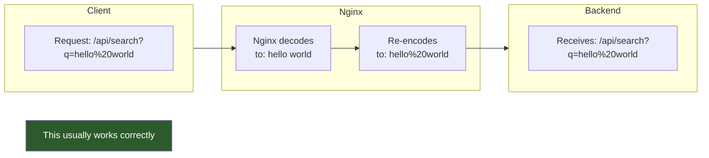
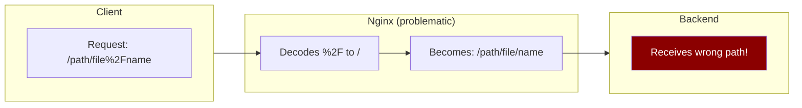
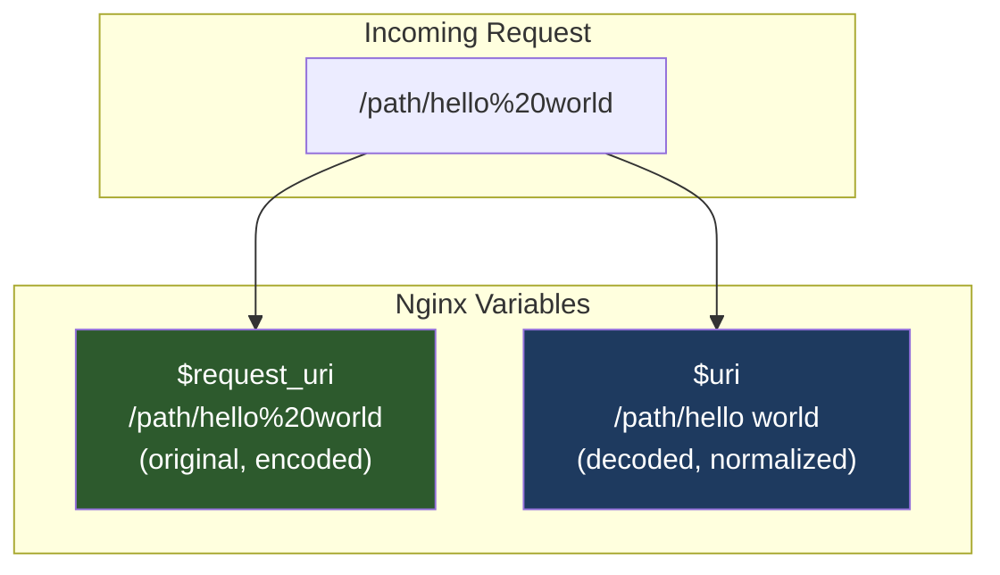
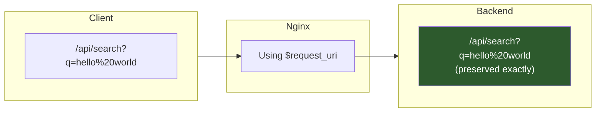
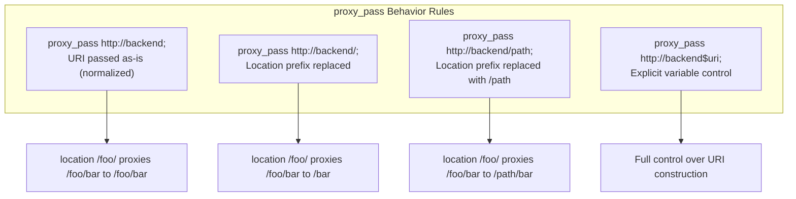

# How to Decode URLs in Nginx proxy_pass

Author: [nawazdhandala](https://www.github.com/nawazdhandala)

Tags: Nginx, Proxy, URL Encoding, proxy_pass, Reverse Proxy, DevOps

Description: Learn how to properly handle URL encoding and decoding when using Nginx proxy_pass. Understand when URLs get double-encoded and how to preserve the original encoding.

---

URL encoding issues in Nginx proxy configurations can cause unexpected behavior - requests that work when sent directly to a backend fail when proxied through Nginx. This guide explains how Nginx handles URL encoding and how to control it.

## Understanding the Problem



However, problems occur with special characters or when the backend expects specific encoding:



## How Nginx Processes URLs

### Default Behavior

By default, Nginx normalizes URIs:

1. Decodes percent-encoded characters
2. Resolves relative paths (`.` and `..`)
3. Merges consecutive slashes
4. Re-encodes when proxying

```nginx
# This configuration normalizes URIs
location /api/ {
    proxy_pass http://backend/api/;
}
```

### The URI vs $uri Variable



## Solutions

### Solution 1: Preserve Original Encoding with $request_uri

Use `$request_uri` to pass the URL exactly as received:

```nginx
location / {
    # Preserve original encoding
    proxy_pass http://backend$request_uri;
}
```



### Solution 2: Selective Path Handling

When you need to strip or modify the path prefix:

```nginx
# Problem: Stripping prefix causes re-encoding
location /api/ {
    proxy_pass http://backend/;  # URI gets re-encoded
}

# Solution: Use rewrite to preserve encoding
location /api/ {
    rewrite ^/api/(.*)$ /$1 break;
    proxy_pass http://backend;
}
```

### Solution 3: Using Variables to Control Encoding

```nginx
# Store the original URI before modification
location /api/ {
    set $original_uri $request_uri;

    # Remove the /api prefix from original URI
    if ($original_uri ~ ^/api/(.*)$) {
        set $backend_uri /$1;
    }

    proxy_pass http://backend$backend_uri;
}
```

### Solution 4: Handle Double Encoding

Sometimes URLs arrive already encoded, and Nginx encodes them again:

```nginx
# Client sends: /path/hello%2520world (already double-encoded)
# Backend expects: /path/hello%20world

# Using map to decode once
map $request_uri $decoded_uri {
    default $request_uri;
    "~^(?<prefix>.*?)%25(?<suffix>.*)$" "${prefix}%${suffix}";
}

server {
    location / {
        proxy_pass http://backend$decoded_uri;
    }
}
```

### Solution 5: Lua-Based URL Handling

For complex URL manipulation, use the Lua module:

```nginx
# Install nginx-module-lua first
# apt install libnginx-mod-http-lua

http {
    lua_package_path "/etc/nginx/lua/?.lua;;";

    server {
        location /api/ {
            set $backend_uri '';

            rewrite_by_lua_block {
                local uri = ngx.var.request_uri
                -- Remove /api prefix
                local backend_uri = string.gsub(uri, "^/api", "")
                -- Custom decoding logic if needed
                ngx.var.backend_uri = backend_uri
            }

            proxy_pass http://backend$backend_uri;
        }
    }
}
```

## Common Scenarios and Solutions

### Scenario 1: Proxying to a Different Path

```nginx
# Goal: /public/files/ -> backend /files/
# Preserving: /public/files/my%20doc.pdf -> /files/my%20doc.pdf

location /public/files/ {
    # Using rewrite with break to preserve encoding
    rewrite ^/public/files/(.*)$ /files/$1 break;
    proxy_pass http://backend;
}
```

### Scenario 2: S3 or Cloud Storage Proxy

Cloud storage URLs often contain encoded characters that must be preserved:

```nginx
# Proxy to S3 preserving exact URL encoding
location /s3/ {
    # Preserve original encoding for S3 signed URLs
    set $s3_uri $request_uri;

    # Remove /s3 prefix
    if ($s3_uri ~ ^/s3(.*)$) {
        set $s3_uri $1;
    }

    proxy_pass https://my-bucket.s3.amazonaws.com$s3_uri;

    # Required headers for S3
    proxy_set_header Host my-bucket.s3.amazonaws.com;
    proxy_hide_header x-amz-id-2;
    proxy_hide_header x-amz-request-id;
}
```

### Scenario 3: API Gateway with Query Parameters

```nginx
# Preserve query parameters exactly
location /api/ {
    # $is_args is "?" if query string exists, empty otherwise
    # $args is the query string
    proxy_pass http://backend/v2/$is_args$args;

    # Or use request_uri to preserve everything
    set $backend_path $request_uri;
    if ($backend_path ~ ^/api/(.*)$) {
        set $backend_path /v2/$1;
    }
    proxy_pass http://backend$backend_path;
}
```

### Scenario 4: GraphQL Endpoints

GraphQL queries often contain special characters:

```nginx
location /graphql {
    # Preserve exact query string for GraphQL
    proxy_pass http://backend$request_uri;

    # Important headers for GraphQL
    proxy_set_header Content-Type $content_type;
    proxy_set_header Accept application/json;
}
```

## Understanding proxy_pass Behavior



### With and Without Trailing Slash

```nginx
# No trailing slash on proxy_pass - URI appended as-is
location /api {
    proxy_pass http://backend;
    # /api/users -> http://backend/api/users
}

# Trailing slash - location prefix replaced
location /api/ {
    proxy_pass http://backend/;
    # /api/users -> http://backend/users
}

# Path on proxy_pass - prefix replaced with path
location /api/ {
    proxy_pass http://backend/v2/;
    # /api/users -> http://backend/v2/users
}
```

## Testing URL Encoding

Create a simple test to verify encoding behavior:

```bash
#!/bin/bash
# test_encoding.sh - Test URL encoding through Nginx

NGINX_URL="http://localhost"
BACKEND_URL="http://localhost:8080"

# Test cases
test_urls=(
    "/api/search?q=hello%20world"
    "/api/path/file%2Fname"
    "/api/unicode/%E4%B8%AD%E6%96%87"
    "/api/special/%26%3D%3F"
)

echo "=== URL Encoding Test ==="

for url in "${test_urls[@]}"; do
    echo ""
    echo "Testing: $url"

    # Direct to backend
    echo "Direct response:"
    curl -s "$BACKEND_URL$url" | head -1

    # Through Nginx
    echo "Via Nginx:"
    curl -s "$NGINX_URL$url" | head -1
done
```

Simple backend to echo received URLs (Node.js):

```javascript
const http = require('http');

const server = http.createServer((req, res) => {
    console.log(`Received: ${req.url}`);
    res.writeHead(200, { 'Content-Type': 'text/plain' });
    res.end(`Received URL: ${req.url}\n`);
});

server.listen(8080, () => {
    console.log('Backend listening on port 8080');
});
```

## Complete Configuration Example

```nginx
http {
    upstream backend {
        server 127.0.0.1:8080;
    }

    server {
        listen 80;
        server_name example.com;

        # Standard API - normalized URLs OK
        location /api/v1/ {
            proxy_pass http://backend/api/v1/;
            proxy_set_header Host $host;
        }

        # File storage - preserve exact encoding
        location /files/ {
            set $file_uri $request_uri;
            if ($file_uri ~ ^/files(.*)$) {
                set $file_uri $1;
            }
            proxy_pass http://backend/storage$file_uri;
            proxy_set_header Host $host;
        }

        # Search API - preserve query string encoding
        location /search {
            proxy_pass http://backend$request_uri;
            proxy_set_header Host $host;
        }

        # Legacy API - need exact URL preservation
        location /legacy/ {
            proxy_pass http://backend$request_uri;
            proxy_set_header Host $host;
        }
    }
}
```

## Summary

URL encoding in Nginx proxy configurations requires understanding how Nginx normalizes URIs:

1. **Use `$request_uri`** when you need to preserve the exact original URL
2. **Use `rewrite` with `break`** when you need to modify the path while preserving encoding
3. **Understand proxy_pass trailing slashes** - they affect how URIs are constructed
4. **Test with encoded characters** to verify your configuration handles edge cases
5. **Consider Lua module** for complex URL manipulation requirements

By choosing the right approach for your use case, you can ensure URLs are passed to backends exactly as your application expects them.
