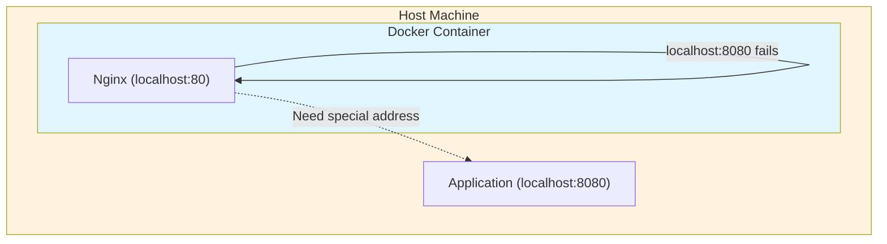

# How to Connect to Host localhost from Docker Container Through Nginx

Author: [nawazdhandala](https://github.com/nawazdhandala)

Tags: Nginx, Docker, Networking, DevOps, Containers

Description: Learn how to configure Nginx inside a Docker container to connect to services running on your host machine's localhost, including solutions for different operating systems and Docker network modes.

---

When running Nginx in a Docker container, connecting to services on the host machine's localhost is not straightforward. The container's localhost refers to the container itself, not the host machine. This guide covers multiple approaches to solve this common networking challenge.

## Understanding the Problem

Docker containers have their own network namespace. When your containerized Nginx tries to connect to `localhost:8080`, it looks for a service inside the container - not on your host machine.



## Solution 1: Using host.docker.internal (Docker Desktop)

Docker Desktop (Mac and Windows) provides a special DNS name `host.docker.internal` that resolves to the host machine.

### Nginx Configuration

```nginx
upstream backend {
    server host.docker.internal:8080;
}

server {
    listen 80;
    server_name localhost;

    location / {
        proxy_pass http://backend;
        proxy_set_header Host $host;
        proxy_set_header X-Real-IP $remote_addr;
        proxy_set_header X-Forwarded-For $proxy_add_x_forwarded_for;
        proxy_set_header X-Forwarded-Proto $scheme;
    }
}
```

### Docker Compose Configuration

```yaml
version: '3.8'

services:
  nginx:
    image: nginx:alpine
    ports:
      - "80:80"
    volumes:
      - ./nginx.conf:/etc/nginx/conf.d/default.conf:ro
    extra_hosts:
      - "host.docker.internal:host-gateway"
```

The `extra_hosts` directive ensures `host.docker.internal` works on Linux as well, where it is not available by default.

## Solution 2: Using Host Network Mode

The simplest approach is to run the container in host network mode, sharing the host's network namespace.

### Docker Run Command

```bash
docker run --network host -v ./nginx.conf:/etc/nginx/conf.d/default.conf nginx:alpine
```

### Nginx Configuration for Host Network

```nginx
server {
    listen 80;
    server_name localhost;

    location / {
        proxy_pass http://127.0.0.1:8080;
        proxy_set_header Host $host;
        proxy_set_header X-Real-IP $remote_addr;
    }
}
```

### Docker Compose with Host Network

```yaml
version: '3.8'

services:
  nginx:
    image: nginx:alpine
    network_mode: host
    volumes:
      - ./nginx.conf:/etc/nginx/conf.d/default.conf:ro
```

**Note**: Host network mode is only available on Linux. On Mac and Windows, Docker runs in a VM, so this approach will not work as expected.

## Solution 3: Using Docker Bridge Network Gateway

Find the gateway IP of the Docker bridge network and use it to reach the host.

### Finding the Gateway IP

```bash
# Get the gateway IP
docker network inspect bridge | grep Gateway

# Or inside a container
ip route | awk '/default/ { print $3 }'
```

Typically, the gateway is `172.17.0.1` for the default bridge network.

### Nginx Configuration

```nginx
upstream backend {
    server 172.17.0.1:8080;
}

server {
    listen 80;
    server_name localhost;

    location / {
        proxy_pass http://backend;
        proxy_set_header Host $host;
        proxy_set_header X-Real-IP $remote_addr;
        proxy_set_header X-Forwarded-For $proxy_add_x_forwarded_for;
    }
}
```

### Dynamic Gateway Detection

Create a startup script that detects the gateway dynamically:

```bash
#!/bin/bash
# entrypoint.sh

# Get the host gateway IP
HOST_IP=$(ip route | awk '/default/ { print $3 }')

# Replace placeholder in nginx config
sed -i "s/HOST_IP_PLACEHOLDER/$HOST_IP/g" /etc/nginx/conf.d/default.conf

# Start nginx
nginx -g 'daemon off;'
```

### Nginx Configuration Template

```nginx
upstream backend {
    server HOST_IP_PLACEHOLDER:8080;
}

server {
    listen 80;
    server_name localhost;

    location / {
        proxy_pass http://backend;
        proxy_set_header Host $host;
        proxy_set_header X-Real-IP $remote_addr;
    }
}
```

### Dockerfile

```dockerfile
FROM nginx:alpine

COPY nginx.conf.template /etc/nginx/conf.d/default.conf
COPY entrypoint.sh /entrypoint.sh

RUN chmod +x /entrypoint.sh

ENTRYPOINT ["/entrypoint.sh"]
```

## Solution 4: Custom Docker Network with Known Subnet

Create a custom network with a predictable subnet for reliable host access.

### Create Network

```bash
docker network create --subnet=192.168.100.0/24 --gateway=192.168.100.1 custom-net
```

### Docker Compose Configuration

```yaml
version: '3.8'

services:
  nginx:
    image: nginx:alpine
    ports:
      - "80:80"
    networks:
      - custom-net
    volumes:
      - ./nginx.conf:/etc/nginx/conf.d/default.conf:ro

networks:
  custom-net:
    driver: bridge
    ipam:
      config:
        - subnet: 192.168.100.0/24
          gateway: 192.168.100.1
```

### Host Firewall Configuration

On the host, allow traffic from the Docker network:

```bash
# Linux (iptables)
sudo iptables -A INPUT -i docker0 -j ACCEPT
sudo iptables -A INPUT -s 192.168.100.0/24 -j ACCEPT

# Or using ufw
sudo ufw allow from 192.168.100.0/24
```

## Complete Production Example

Here is a comprehensive example combining multiple best practices:

### docker-compose.yml

```yaml
version: '3.8'

services:
  nginx:
    image: nginx:alpine
    container_name: nginx-proxy
    ports:
      - "80:80"
      - "443:443"
    volumes:
      - ./nginx/conf.d:/etc/nginx/conf.d:ro
      - ./nginx/ssl:/etc/nginx/ssl:ro
    extra_hosts:
      - "host.docker.internal:host-gateway"
    environment:
      - BACKEND_HOST=host.docker.internal
      - BACKEND_PORT=8080
    healthcheck:
      test: ["CMD", "curl", "-f", "http://localhost/health"]
      interval: 30s
      timeout: 10s
      retries: 3
    restart: unless-stopped
```

### nginx/conf.d/default.conf

```nginx
upstream backend_app {
    server host.docker.internal:8080 max_fails=3 fail_timeout=30s;
    keepalive 32;
}

upstream backend_api {
    server host.docker.internal:3000 max_fails=3 fail_timeout=30s;
    keepalive 32;
}

server {
    listen 80;
    server_name localhost;

    # Health check endpoint
    location /health {
        access_log off;
        return 200 "healthy\n";
        add_header Content-Type text/plain;
    }

    # Proxy to main application
    location / {
        proxy_pass http://backend_app;
        proxy_http_version 1.1;
        proxy_set_header Upgrade $http_upgrade;
        proxy_set_header Connection 'upgrade';
        proxy_set_header Host $host;
        proxy_set_header X-Real-IP $remote_addr;
        proxy_set_header X-Forwarded-For $proxy_add_x_forwarded_for;
        proxy_set_header X-Forwarded-Proto $scheme;
        proxy_cache_bypass $http_upgrade;
        proxy_read_timeout 90;
        proxy_connect_timeout 30;
    }

    # Proxy to API
    location /api/ {
        proxy_pass http://backend_api/;
        proxy_http_version 1.1;
        proxy_set_header Host $host;
        proxy_set_header X-Real-IP $remote_addr;
        proxy_set_header X-Forwarded-For $proxy_add_x_forwarded_for;
        proxy_set_header X-Forwarded-Proto $scheme;
        proxy_read_timeout 120;
    }

    # Error pages
    error_page 502 503 504 /50x.html;
    location = /50x.html {
        root /usr/share/nginx/html;
        internal;
    }
}
```

## Troubleshooting

### Connection Refused Errors

If Nginx cannot connect to the host service:

1. **Verify the host service is listening on all interfaces**:
   ```bash
   # Check if service binds to 0.0.0.0 instead of 127.0.0.1
   netstat -tlnp | grep 8080
   ```

2. **Update host service binding** - Many services default to `127.0.0.1`. Change to `0.0.0.0`:
   ```javascript
   // Node.js example
   app.listen(8080, '0.0.0.0');
   ```

3. **Check host firewall**:
   ```bash
   # Allow Docker network traffic
   sudo ufw allow from 172.17.0.0/16
   ```

### Testing Connectivity

From inside the Nginx container:

```bash
# Enter the container
docker exec -it nginx-proxy sh

# Test connectivity
wget -qO- http://host.docker.internal:8080
curl -v http://host.docker.internal:8080

# Check DNS resolution
nslookup host.docker.internal
```

### Debug Nginx Configuration

```bash
# Test configuration syntax
docker exec nginx-proxy nginx -t

# View error logs
docker logs nginx-proxy

# Reload configuration
docker exec nginx-proxy nginx -s reload
```

## Summary

| Method | OS Support | Ease of Use | Production Ready |
|--------|------------|-------------|------------------|
| host.docker.internal | All (with extra_hosts) | Easy | Yes |
| Host Network Mode | Linux only | Easy | Limited |
| Bridge Gateway IP | All | Moderate | Yes |
| Custom Network | All | Moderate | Yes |

For most use cases, using `host.docker.internal` with the `extra_hosts` directive in Docker Compose provides the best balance of simplicity and portability. Ensure your host services bind to `0.0.0.0` rather than `127.0.0.1` to accept connections from Docker containers.
