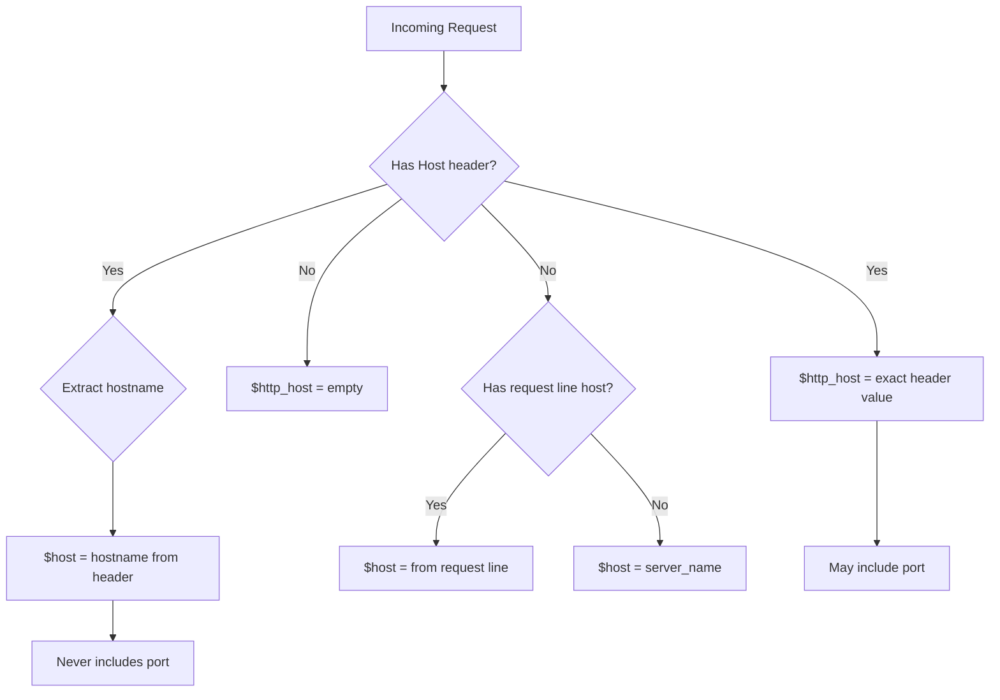

# How to Understand $host vs $http_host in Nginx

Author: [nawazdhandala](https://github.com/nawazdhandala)

Tags: Nginx, Web Server, Configuration, Proxy, HTTP Headers

Description: Learn the critical differences between $host and $http_host variables in Nginx, when to use each one, and how they affect proxy configurations, SSL termination, and application routing.

---

Nginx provides several variables for accessing the hostname of incoming requests, and choosing the wrong one can lead to subtle bugs in your configuration. The two most commonly confused variables are `$host` and `$http_host`. Understanding their differences is essential for proper proxy configuration, SSL handling, and application routing.

## The Key Differences

Here's what each variable contains:

| Variable | Contains | Port Included | Source |
|----------|----------|---------------|--------|
| `$host` | Hostname only | No | Host header, server_name, or request line |
| `$http_host` | Hostname:port | Yes (if non-standard) | Exact Host header value |



## Detailed Comparison

### $host Variable

The `$host` variable is "smart" - it extracts just the hostname:

```nginx
# Request: GET / HTTP/1.1
# Host: example.com:8080

# $host = "example.com" (port stripped)
```

Priority order for `$host`:
1. Hostname from the request line (rare, HTTP/1.0 style)
2. Hostname from the `Host` header (most common)
3. The `server_name` matching the request

**Key characteristics:**
- Always lowercase
- Never includes port number
- Never empty (falls back to server_name)

### $http_host Variable

The `$http_host` variable contains the exact `Host` header value:

```nginx
# Request: GET / HTTP/1.1
# Host: Example.COM:8080

# $http_host = "Example.COM:8080" (exact header)
```

**Key characteristics:**
- Preserves original case
- Includes port if present in header
- Can be empty if no Host header sent

## When to Use Each

### Use $host For:

**1. Server name matching and logging:**

```nginx
server {
    listen 80;
    server_name example.com www.example.com;

    # $host works even without Host header
    access_log /var/log/nginx/$host.access.log;

    # Safe to use in conditionals
    if ($host = www.example.com) {
        return 301 https://example.com$request_uri;
    }
}
```

**2. Constructing URLs without ports:**

```nginx
# Redirect HTTP to HTTPS
server {
    listen 80;
    server_name example.com;

    # $host doesn't include port, clean redirect
    return 301 https://$host$request_uri;
}
```

**3. Virtual host configuration:**

```nginx
server {
    listen 80;
    server_name ~^(?<subdomain>.+)\.example\.com$;

    # $host is always populated
    root /var/www/$host;
}
```

### Use $http_host For:

**1. Preserving the exact Host header in proxy:**

```nginx
location / {
    proxy_pass http://backend;

    # Preserve exact header including port
    proxy_set_header Host $http_host;

    # Backend receives exact Host header client sent
}
```

**2. When backend requires the port:**

```nginx
upstream backend {
    server 127.0.0.1:8080;
}

server {
    listen 8080;
    server_name example.com;

    location / {
        proxy_pass http://backend;

        # Backend app might construct URLs using this
        # Needs port for correct self-referential URLs
        proxy_set_header Host $http_host;
    }
}
```

**3. API gateways that validate Host headers:**

```nginx
location /api/ {
    proxy_pass http://api-backend;

    # API might validate Host header signature
    # Preserve exactly as sent
    proxy_set_header Host $http_host;
}
```

## Common Scenarios and Recommendations

### Scenario 1: Standard Reverse Proxy

```nginx
# Recommended: Use $host for most reverse proxies
server {
    listen 80;
    server_name example.com;

    location / {
        proxy_pass http://backend;
        proxy_set_header Host $host;
        proxy_set_header X-Real-IP $remote_addr;
        proxy_set_header X-Forwarded-For $proxy_add_x_forwarded_for;
        proxy_set_header X-Forwarded-Proto $scheme;
    }
}
```

### Scenario 2: Non-Standard Port Preservation

```nginx
# Use $http_host when port matters
server {
    listen 8080;
    server_name dev.example.com;

    location / {
        proxy_pass http://backend;
        # Preserves "dev.example.com:8080"
        proxy_set_header Host $http_host;
    }
}
```

### Scenario 3: Handling Missing Host Header

```nginx
# $http_host can be empty, $host never is
server {
    listen 80 default_server;
    server_name example.com;

    location / {
        # Safe: $host falls back to server_name
        proxy_set_header Host $host;

        # Risky: $http_host might be empty
        # proxy_set_header Host $http_host;
    }
}
```

### Scenario 4: Conditional with Port Checking

```nginx
# Use $http_host when you need to check for port
map $http_host $redirect_host {
    ~^(.+):80$   $1;        # Strip :80
    ~^(.+):443$  $1;        # Strip :443
    default      $http_host; # Keep as-is
}

server {
    listen 80;
    server_name example.com;

    return 301 https://$redirect_host$request_uri;
}
```

## Proxy Header Best Practices

### Complete Proxy Setup

```nginx
server {
    listen 443 ssl;
    server_name example.com;

    location / {
        proxy_pass http://backend;

        # Use $host - clean hostname for most apps
        proxy_set_header Host $host;

        # Provide original host info separately
        proxy_set_header X-Forwarded-Host $host;
        proxy_set_header X-Forwarded-Port $server_port;

        # Other standard headers
        proxy_set_header X-Real-IP $remote_addr;
        proxy_set_header X-Forwarded-For $proxy_add_x_forwarded_for;
        proxy_set_header X-Forwarded-Proto $scheme;
    }
}
```

### When Backend Needs Original Port

```nginx
server {
    listen 8443 ssl;
    server_name api.example.com;

    location / {
        proxy_pass http://backend;

        # Option 1: Use $http_host (includes port)
        proxy_set_header Host $http_host;

        # Option 2: Construct it explicitly
        # proxy_set_header Host $host:$server_port;
    }
}
```

## Related Variables

Understanding other host-related variables:

```nginx
# All host-related variables
server {
    listen 80;
    server_name example.com alias.example.com;

    location /debug {
        return 200 "
host: $host
http_host: $http_host
server_name: $server_name
hostname: $hostname
request: $request
";
    }
}
```

| Variable | Value Example | Description |
|----------|---------------|-------------|
| `$host` | example.com | Cleaned hostname |
| `$http_host` | example.com:8080 | Exact Host header |
| `$server_name` | example.com | First server_name in block |
| `$hostname` | nginx-server-01 | Machine hostname |

## Debugging Host Issues

### Log All Host Variables

```nginx
log_format host_debug '$remote_addr - [$time_local] '
                      'host="$host" '
                      'http_host="$http_host" '
                      'server_name="$server_name" '
                      'request="$request"';

server {
    listen 80;
    server_name example.com;

    access_log /var/log/nginx/host-debug.log host_debug;
}
```

### Test with curl

```bash
# Test with explicit Host header
curl -H "Host: example.com" http://localhost/debug
curl -H "Host: example.com:8080" http://localhost/debug
curl -H "Host: EXAMPLE.COM" http://localhost/debug

# Test without Host header (HTTP/1.0)
curl --http1.0 http://localhost/debug
```

## Common Mistakes

### Mistake 1: Using $http_host Without Fallback

```nginx
# Bad: $http_host can be empty
server {
    listen 80 default_server;

    location / {
        proxy_set_header Host $http_host;  # Might be empty!
    }
}

# Good: Provide fallback
server {
    listen 80 default_server;

    set $proxy_host $http_host;
    if ($proxy_host = "") {
        set $proxy_host $host;
    }

    location / {
        proxy_set_header Host $proxy_host;
    }
}
```

### Mistake 2: Port Confusion in Redirects

```nginx
# Might cause redirect loops
server {
    listen 8080;
    server_name example.com;

    # Bad: loses port information
    return 301 https://$host$request_uri;

    # Better: preserve port if needed
    return 301 https://$http_host$request_uri;
}
```

### Mistake 3: Case Sensitivity Issues

```nginx
# $http_host preserves case - might break matching
if ($http_host = "example.com") {
    # Won't match "Example.com" or "EXAMPLE.COM"
}

# $host is always lowercase
if ($host = "example.com") {
    # Matches regardless of original case
}
```

## Summary

| Situation | Use | Reason |
|-----------|-----|--------|
| Standard reverse proxy | `$host` | Clean, always populated |
| Need to preserve port | `$http_host` | Includes port number |
| Logging | `$host` | Consistent format |
| URL construction | `$host` | No unexpected ports |
| Exact header preservation | `$http_host` | Matches original request |
| Fallback safety | `$host` | Never empty |

Choose `$host` as your default and switch to `$http_host` only when you specifically need the port number or exact header value. This approach prevents most host-related configuration issues while maintaining flexibility when needed.
