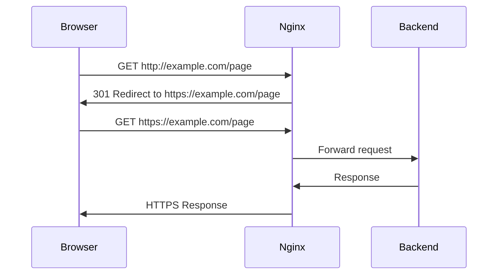

# How to Redirect HTTP to HTTPS in Nginx

Author: [nawazdhandala](https://github.com/nawazdhandala)

Tags: Nginx, SSL, HTTPS, Security, Web Server

Description: Learn how to configure Nginx to redirect all HTTP traffic to HTTPS, including proper 301 redirects, HSTS headers, and various configuration patterns for different deployment scenarios.

---

Redirecting HTTP to HTTPS ensures all traffic to your website is encrypted. This is essential for security, SEO, and user trust. Modern browsers mark HTTP sites as "Not Secure," and search engines penalize non-HTTPS websites in rankings.

## Basic HTTP to HTTPS Redirect

### The Standard Pattern

```nginx
# HTTP server - redirect all traffic to HTTPS
server {
    listen 80;
    listen [::]:80;
    server_name example.com www.example.com;

    return 301 https://$host$request_uri;
}

# HTTPS server - main configuration
server {
    listen 443 ssl http2;
    listen [::]:443 ssl http2;
    server_name example.com www.example.com;

    ssl_certificate /etc/letsencrypt/live/example.com/fullchain.pem;
    ssl_certificate_key /etc/letsencrypt/live/example.com/privkey.pem;

    root /var/www/example.com;
    index index.html;

    location / {
        try_files $uri $uri/ =404;
    }
}
```

## Understanding the Redirect



## Different Redirect Methods

### Method 1: Using return (Recommended)

```nginx
server {
    listen 80;
    server_name example.com;

    # Most efficient method
    return 301 https://$host$request_uri;
}
```

### Method 2: Using rewrite

```nginx
server {
    listen 80;
    server_name example.com;

    # Less efficient but more flexible
    rewrite ^(.*)$ https://$host$1 permanent;
}
```

### Method 3: Using if Statement (Not Recommended)

```nginx
server {
    listen 80 443 ssl;
    server_name example.com;

    ssl_certificate /path/to/cert.pem;
    ssl_certificate_key /path/to/key.pem;

    # This works but is less efficient
    if ($scheme = http) {
        return 301 https://$host$request_uri;
    }

    # ... rest of configuration
}
```

## Preserving Special Paths

### Allow Let's Encrypt Verification

```nginx
server {
    listen 80;
    server_name example.com;

    # Allow ACME challenge for Let's Encrypt
    location /.well-known/acme-challenge/ {
        root /var/www/letsencrypt;
        allow all;
    }

    # Redirect everything else to HTTPS
    location / {
        return 301 https://$host$request_uri;
    }
}
```

### Allow Health Check Endpoints

```nginx
server {
    listen 80;
    server_name example.com;

    # Health check endpoint for load balancers
    location /health {
        access_log off;
        return 200 "healthy\n";
        add_header Content-Type text/plain;
    }

    # Let's Encrypt
    location /.well-known/acme-challenge/ {
        root /var/www/letsencrypt;
    }

    # Redirect all other HTTP traffic
    location / {
        return 301 https://$host$request_uri;
    }
}
```

## Complete Production Configuration

### Full HTTPS Server with Modern SSL

```nginx
# HTTP to HTTPS redirect
server {
    listen 80;
    listen [::]:80;
    server_name example.com www.example.com;

    location /.well-known/acme-challenge/ {
        root /var/www/letsencrypt;
    }

    location / {
        return 301 https://$host$request_uri;
    }
}

# HTTPS server
server {
    listen 443 ssl http2;
    listen [::]:443 ssl http2;
    server_name example.com www.example.com;

    # SSL Certificate
    ssl_certificate /etc/letsencrypt/live/example.com/fullchain.pem;
    ssl_certificate_key /etc/letsencrypt/live/example.com/privkey.pem;

    # SSL Session settings
    ssl_session_timeout 1d;
    ssl_session_cache shared:SSL:50m;
    ssl_session_tickets off;

    # Modern SSL configuration
    ssl_protocols TLSv1.2 TLSv1.3;
    ssl_ciphers ECDHE-ECDSA-AES128-GCM-SHA256:ECDHE-RSA-AES128-GCM-SHA256:ECDHE-ECDSA-AES256-GCM-SHA384:ECDHE-RSA-AES256-GCM-SHA384;
    ssl_prefer_server_ciphers off;

    # HSTS (1 year)
    add_header Strict-Transport-Security "max-age=31536000; includeSubDomains; preload" always;

    # Other security headers
    add_header X-Frame-Options "SAMEORIGIN" always;
    add_header X-Content-Type-Options "nosniff" always;
    add_header X-XSS-Protection "1; mode=block" always;
    add_header Referrer-Policy "strict-origin-when-cross-origin" always;

    root /var/www/example.com;
    index index.html;

    location / {
        try_files $uri $uri/ =404;
    }
}
```

## HSTS - HTTP Strict Transport Security

HSTS tells browsers to always use HTTPS for your domain.

### Basic HSTS

```nginx
server {
    listen 443 ssl http2;
    server_name example.com;

    # HSTS header (1 year)
    add_header Strict-Transport-Security "max-age=31536000" always;

    # ... rest of configuration
}
```

### HSTS with Subdomains

```nginx
# Applies to all subdomains
add_header Strict-Transport-Security "max-age=31536000; includeSubDomains" always;
```

### HSTS Preload

```nginx
# For submission to browser preload lists
add_header Strict-Transport-Security "max-age=31536000; includeSubDomains; preload" always;
```

**Warning**: Only use preload if you are certain all subdomains support HTTPS. Removal from preload lists takes months.

## Handling Multiple Domains

### Redirect All Domains to HTTPS

```nginx
server {
    listen 80 default_server;
    listen [::]:80 default_server;

    # Redirect all HTTP traffic to HTTPS
    return 301 https://$host$request_uri;
}
```

### Domain-Specific Configuration

```nginx
# Domain 1
server {
    listen 80;
    server_name example.com www.example.com;
    return 301 https://example.com$request_uri;
}

server {
    listen 443 ssl http2;
    server_name example.com www.example.com;

    ssl_certificate /etc/letsencrypt/live/example.com/fullchain.pem;
    ssl_certificate_key /etc/letsencrypt/live/example.com/privkey.pem;

    # Redirect www to non-www
    if ($host = www.example.com) {
        return 301 https://example.com$request_uri;
    }

    # ... configuration
}

# Domain 2
server {
    listen 80;
    server_name another-site.com;
    return 301 https://another-site.com$request_uri;
}

server {
    listen 443 ssl http2;
    server_name another-site.com;

    ssl_certificate /etc/letsencrypt/live/another-site.com/fullchain.pem;
    ssl_certificate_key /etc/letsencrypt/live/another-site.com/privkey.pem;

    # ... configuration
}
```

## Behind a Load Balancer

When Nginx is behind a load balancer that handles SSL termination:

### AWS ALB/ELB Configuration

```nginx
server {
    listen 80;
    server_name example.com;

    # Check the X-Forwarded-Proto header from load balancer
    if ($http_x_forwarded_proto = "http") {
        return 301 https://$host$request_uri;
    }

    # ... rest of configuration
}
```

### Using map for Cleaner Configuration

```nginx
map $http_x_forwarded_proto $redirect_to_https {
    default 0;
    http 1;
}

server {
    listen 80;
    server_name example.com;

    if ($redirect_to_https) {
        return 301 https://$host$request_uri;
    }

    # ... rest of configuration
}
```

### Cloudflare Configuration

```nginx
server {
    listen 80;
    server_name example.com;

    # Trust Cloudflare's X-Forwarded-Proto header
    set_real_ip_from 103.21.244.0/22;
    set_real_ip_from 103.22.200.0/22;
    # ... add all Cloudflare IP ranges
    real_ip_header CF-Connecting-IP;

    if ($http_x_forwarded_proto = "http") {
        return 301 https://$host$request_uri;
    }

    # ... rest of configuration
}
```

## Reverse Proxy Configuration

### With Backend Application

```nginx
upstream backend {
    server 127.0.0.1:3000;
}

server {
    listen 80;
    server_name example.com;
    return 301 https://$host$request_uri;
}

server {
    listen 443 ssl http2;
    server_name example.com;

    ssl_certificate /etc/letsencrypt/live/example.com/fullchain.pem;
    ssl_certificate_key /etc/letsencrypt/live/example.com/privkey.pem;

    add_header Strict-Transport-Security "max-age=31536000" always;

    location / {
        proxy_pass http://backend;
        proxy_http_version 1.1;
        proxy_set_header Host $host;
        proxy_set_header X-Real-IP $remote_addr;
        proxy_set_header X-Forwarded-For $proxy_add_x_forwarded_for;
        proxy_set_header X-Forwarded-Proto $scheme;
    }
}
```

## Testing HTTPS Redirect

### Using curl

```bash
# Test HTTP redirect
curl -I http://example.com
# Expected: HTTP/1.1 301 Moved Permanently
# Location: https://example.com/

# Follow redirects
curl -L -I http://example.com

# Test specific path
curl -I http://example.com/some/path
# Location should preserve the path

# Test HSTS header
curl -I https://example.com | grep -i strict
```

### Using SSL Labs

Test your SSL configuration at: https://www.ssllabs.com/ssltest/

### Using Security Headers

Check security headers at: https://securityheaders.com/

## Common Issues and Fixes

### Redirect Loop

```nginx
# WRONG - causes redirect loop
server {
    listen 80 443 ssl;
    return 301 https://$host$request_uri;
}

# CORRECT - separate server blocks
server {
    listen 80;
    return 301 https://$host$request_uri;
}

server {
    listen 443 ssl;
    # ... configuration
}
```

### Mixed Content Warnings

After redirecting to HTTPS, ensure all resources are loaded via HTTPS:

```html
<!-- Wrong -->


<!-- Correct -->


<!-- Or protocol-relative (not recommended) -->

```

### Certificate Errors

```bash
# Test certificate
openssl s_client -connect example.com:443 -servername example.com

# Check certificate expiry
echo | openssl s_client -connect example.com:443 2>/dev/null | openssl x509 -noout -dates
```

## Summary

| Pattern | Use Case |
|---------|----------|
| `return 301` | Standard redirect (recommended) |
| Separate server blocks | Clean configuration |
| HSTS header | Force HTTPS in browsers |
| Allow /.well-known/ | Let's Encrypt renewal |
| Check X-Forwarded-Proto | Behind load balancer |
| Preserve $request_uri | Keep path and query string |

Always use 301 (permanent) redirects for SEO benefits, implement HSTS for enhanced security, and ensure your SSL certificates are properly configured and auto-renewed. Test your configuration thoroughly before deploying to production.
