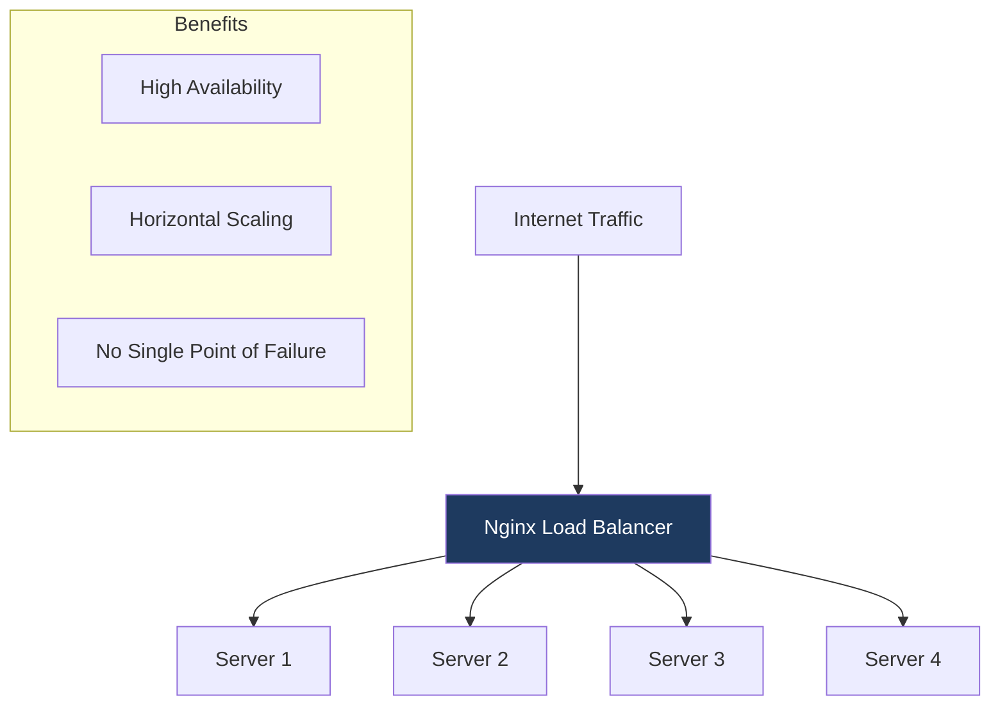
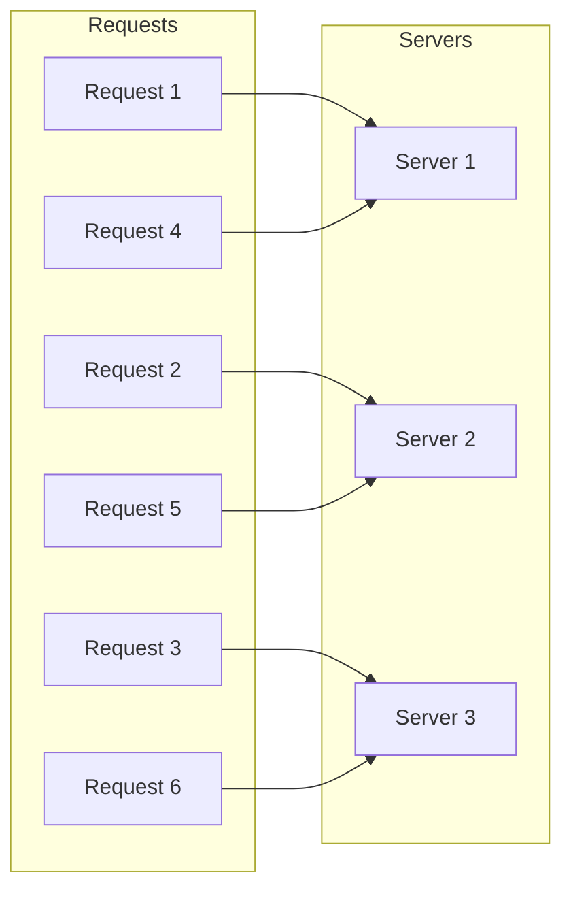
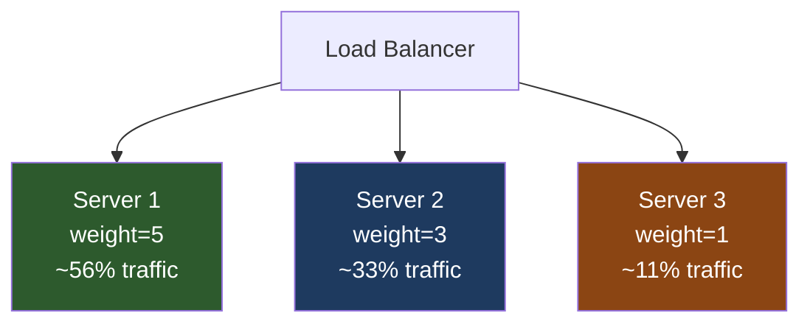
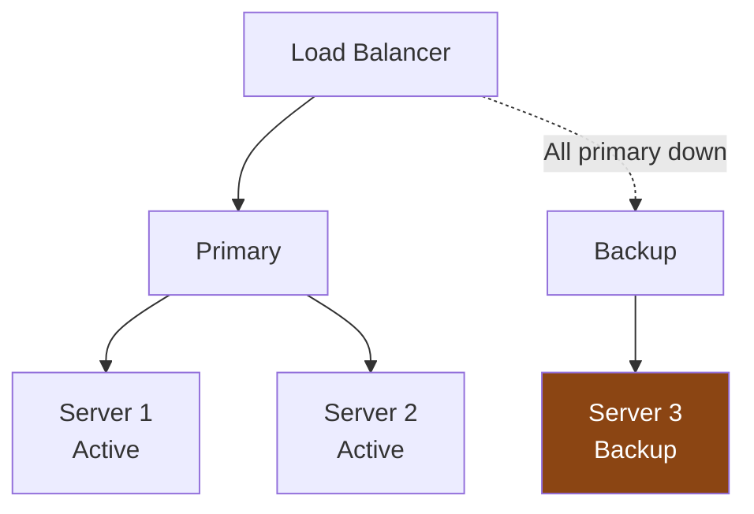
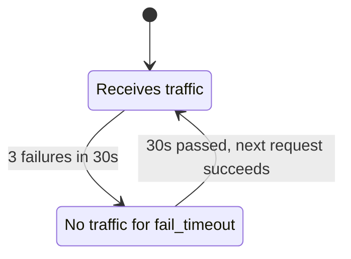
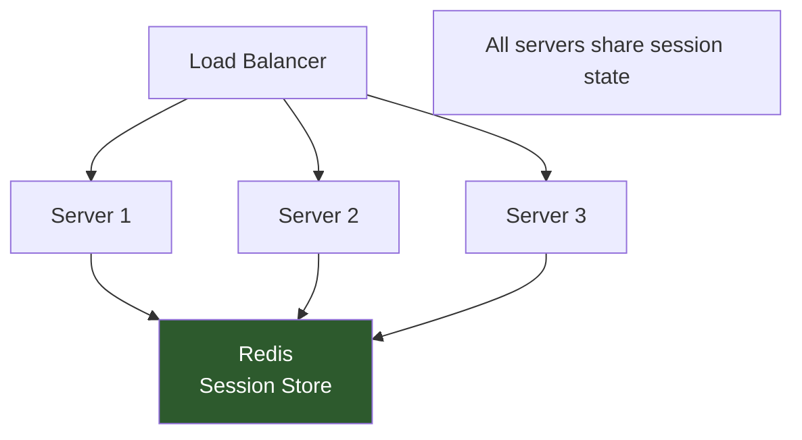
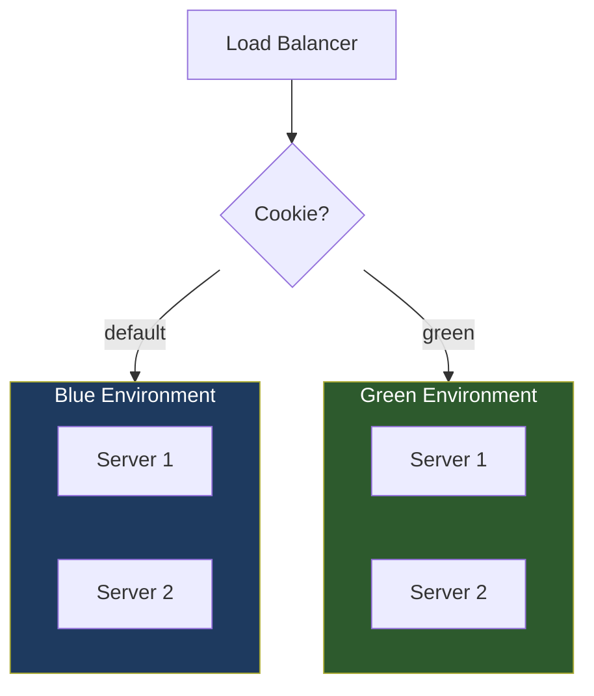

# How to Configure Nginx Load Balancing

Author: [nawazdhandala](https://www.github.com/nawazdhandala)

Tags: Nginx, Load Balancing, High Availability, Scaling, DevOps, Infrastructure

Description: Learn how to configure Nginx as a load balancer to distribute traffic across multiple backend servers, including different balancing algorithms, health checks, and session persistence.

---

Load balancing distributes incoming traffic across multiple backend servers to improve reliability, scalability, and performance. Nginx is a powerful and efficient load balancer that supports various algorithms and features. This guide covers everything from basic setup to advanced production configurations.

## Understanding Load Balancing



## Basic Load Balancing Configuration

### Minimum Configuration

```nginx
# Define upstream servers
upstream backend {
    server 192.168.1.10:8080;
    server 192.168.1.11:8080;
    server 192.168.1.12:8080;
}

server {
    listen 80;
    server_name example.com;

    location / {
        proxy_pass http://backend;
        proxy_set_header Host $host;
        proxy_set_header X-Real-IP $remote_addr;
        proxy_set_header X-Forwarded-For $proxy_add_x_forwarded_for;
        proxy_set_header X-Forwarded-Proto $scheme;
    }
}
```

## Load Balancing Algorithms

### Round Robin (Default)

Distributes requests sequentially across servers:

```nginx
upstream backend {
    # Round robin is the default - no directive needed
    server 192.168.1.10:8080;
    server 192.168.1.11:8080;
    server 192.168.1.12:8080;
}
```



### Weighted Round Robin

Assigns more requests to more powerful servers:

```nginx
upstream backend {
    server 192.168.1.10:8080 weight=5;  # Gets 5x more requests
    server 192.168.1.11:8080 weight=3;  # Gets 3x more requests
    server 192.168.1.12:8080 weight=1;  # Baseline
}
```



### Least Connections

Sends requests to the server with fewest active connections:

```nginx
upstream backend {
    least_conn;
    server 192.168.1.10:8080;
    server 192.168.1.11:8080;
    server 192.168.1.12:8080;
}
```

Best for:
- Requests with varying processing times
- Long-lived connections
- Uneven server capacities

### IP Hash

Same client IP always connects to same server:

```nginx
upstream backend {
    ip_hash;
    server 192.168.1.10:8080;
    server 192.168.1.11:8080;
    server 192.168.1.12:8080;
}
```

Best for:
- Session persistence without cookies
- Caching scenarios
- Stateful applications

### Generic Hash

Custom hash based on any variable:

```nginx
upstream backend {
    hash $request_uri consistent;  # Hash by URI
    server 192.168.1.10:8080;
    server 192.168.1.11:8080;
    server 192.168.1.12:8080;
}

# Other hash options
upstream backend_session {
    hash $cookie_sessionid consistent;  # Hash by session cookie
    server 192.168.1.10:8080;
    server 192.168.1.11:8080;
}
```

### Random

Randomly selects a server (with optional two-choice algorithm):

```nginx
upstream backend {
    random two least_conn;  # Pick 2 random, choose one with least connections
    server 192.168.1.10:8080;
    server 192.168.1.11:8080;
    server 192.168.1.12:8080;
}
```

## Server Parameters

### Server Weights and Limits

```nginx
upstream backend {
    server 192.168.1.10:8080 weight=5 max_conns=100;
    server 192.168.1.11:8080 weight=3 max_conns=50;
    server 192.168.1.12:8080 weight=1 max_conns=25;

    # Queue for when max_conns is reached
    queue 100 timeout=70s;
}
```

### Backup Servers

```nginx
upstream backend {
    server 192.168.1.10:8080;
    server 192.168.1.11:8080;
    server 192.168.1.12:8080 backup;  # Only used when others are down
}
```



### Marking Servers Down

```nginx
upstream backend {
    server 192.168.1.10:8080;
    server 192.168.1.11:8080;
    server 192.168.1.12:8080 down;  # Temporarily disabled
}
```

## Health Checks

### Passive Health Checks (Free)

Monitor backend health based on request outcomes:

```nginx
upstream backend {
    server 192.168.1.10:8080 max_fails=3 fail_timeout=30s;
    server 192.168.1.11:8080 max_fails=3 fail_timeout=30s;
    server 192.168.1.12:8080 max_fails=3 fail_timeout=30s;
}
```

Parameters:
- `max_fails=3` - Mark unhealthy after 3 failures
- `fail_timeout=30s` - Time window for failures and recovery check interval



### Active Health Checks (Nginx Plus)

```nginx
# Nginx Plus feature
upstream backend {
    zone backend 64k;

    server 192.168.1.10:8080;
    server 192.168.1.11:8080;
    server 192.168.1.12:8080;
}

server {
    location / {
        proxy_pass http://backend;
        health_check interval=5s fails=3 passes=2;
    }
}
```

### DIY Active Health Checks with External Script

```bash
#!/bin/bash
# health_check.sh - External health checker

SERVERS=("192.168.1.10" "192.168.1.11" "192.168.1.12")
PORT=8080
CONFIG="/etc/nginx/conf.d/upstream.conf"

for server in "${SERVERS[@]}"; do
    if curl -sf "http://$server:$PORT/health" > /dev/null 2>&1; then
        # Server is healthy
        sed -i "s/server $server:$PORT down;/server $server:$PORT;/" "$CONFIG"
    else
        # Server is unhealthy
        sed -i "s/server $server:$PORT;/server $server:$PORT down;/" "$CONFIG"
    fi
done

nginx -s reload
```

## Session Persistence

### Cookie-Based Persistence (Nginx Plus)

```nginx
# Nginx Plus feature
upstream backend {
    server 192.168.1.10:8080;
    server 192.168.1.11:8080;
    server 192.168.1.12:8080;

    sticky cookie srv_id expires=1h domain=.example.com path=/;
}
```

### Application-Level Persistence

Configure your application to use shared session storage:



### IP Hash for Persistence

```nginx
upstream backend {
    ip_hash;
    server 192.168.1.10:8080;
    server 192.168.1.11:8080;
    server 192.168.1.12:8080;
}
```

## Connection Optimization

### Keep-Alive Connections

Maintain persistent connections to backends:

```nginx
upstream backend {
    server 192.168.1.10:8080;
    server 192.168.1.11:8080;

    keepalive 64;  # Connection pool size
    keepalive_requests 1000;  # Requests per connection
    keepalive_timeout 60s;  # Idle timeout
}

server {
    location / {
        proxy_pass http://backend;

        # Required for keepalive
        proxy_http_version 1.1;
        proxy_set_header Connection "";
    }
}
```

### Connection Limits

```nginx
upstream backend {
    server 192.168.1.10:8080 max_conns=100;
    server 192.168.1.11:8080 max_conns=100;

    queue 100 timeout=70s;  # Queue excess connections
}
```

## SSL/TLS Configuration

### HTTPS Load Balancer

```nginx
upstream backend {
    server 192.168.1.10:8080;
    server 192.168.1.11:8080;
    server 192.168.1.12:8080;

    keepalive 64;
}

server {
    listen 443 ssl http2;
    server_name example.com;

    ssl_certificate /etc/letsencrypt/live/example.com/fullchain.pem;
    ssl_certificate_key /etc/letsencrypt/live/example.com/privkey.pem;

    ssl_protocols TLSv1.2 TLSv1.3;
    ssl_prefer_server_ciphers on;

    location / {
        proxy_pass http://backend;

        proxy_http_version 1.1;
        proxy_set_header Connection "";
        proxy_set_header Host $host;
        proxy_set_header X-Real-IP $remote_addr;
        proxy_set_header X-Forwarded-For $proxy_add_x_forwarded_for;
        proxy_set_header X-Forwarded-Proto $scheme;
    }
}
```

### SSL to Backend (End-to-End Encryption)

```nginx
upstream backend_ssl {
    server 192.168.1.10:443;
    server 192.168.1.11:443;
}

server {
    listen 443 ssl http2;
    server_name example.com;

    ssl_certificate /etc/letsencrypt/live/example.com/fullchain.pem;
    ssl_certificate_key /etc/letsencrypt/live/example.com/privkey.pem;

    location / {
        proxy_pass https://backend_ssl;

        # SSL to backend
        proxy_ssl_verify on;
        proxy_ssl_trusted_certificate /etc/ssl/certs/backend-ca.crt;
        proxy_ssl_session_reuse on;
    }
}
```

## Advanced Load Balancing

### Layer 4 (TCP/UDP) Load Balancing

```nginx
stream {
    upstream mysql_cluster {
        least_conn;
        server 192.168.1.10:3306;
        server 192.168.1.11:3306;
        server 192.168.1.12:3306;
    }

    server {
        listen 3306;
        proxy_pass mysql_cluster;
        proxy_connect_timeout 10s;
    }
}
```

### Multiple Upstream Groups

```nginx
upstream api_servers {
    least_conn;
    server 192.168.1.10:3000;
    server 192.168.1.11:3000;
}

upstream static_servers {
    server 192.168.1.20:80;
    server 192.168.1.21:80;
}

upstream websocket_servers {
    ip_hash;
    server 192.168.1.30:8080;
    server 192.168.1.31:8080;
}

server {
    listen 80;

    location /api/ {
        proxy_pass http://api_servers;
    }

    location /static/ {
        proxy_pass http://static_servers;
    }

    location /ws/ {
        proxy_pass http://websocket_servers;
        proxy_http_version 1.1;
        proxy_set_header Upgrade $http_upgrade;
        proxy_set_header Connection "upgrade";
    }
}
```

### Blue-Green Deployments

```nginx
# Define both environments
upstream blue {
    server 192.168.1.10:8080;
    server 192.168.1.11:8080;
}

upstream green {
    server 192.168.1.20:8080;
    server 192.168.1.21:8080;
}

# Map to active environment
map $cookie_deployment $backend {
    "green" green;
    default blue;
}

server {
    location / {
        proxy_pass http://$backend;
    }
}
```



## Monitoring and Debugging

### Status Module

```nginx
server {
    listen 8080;

    location /nginx_status {
        stub_status on;
        allow 127.0.0.1;
        deny all;
    }
}
```

### Logging Upstream Information

```nginx
log_format upstream_log '$remote_addr - [$time_local] '
                        '"$request" $status $body_bytes_sent '
                        'upstream: $upstream_addr '
                        'upstream_response_time: $upstream_response_time '
                        'upstream_status: $upstream_status';

server {
    access_log /var/log/nginx/upstream.log upstream_log;

    location / {
        proxy_pass http://backend;
    }
}
```

### Add Headers for Debugging

```nginx
location / {
    proxy_pass http://backend;

    # Add header showing which backend handled request
    add_header X-Upstream-Addr $upstream_addr;
    add_header X-Upstream-Response-Time $upstream_response_time;
}
```

## Complete Production Configuration

```nginx
# /etc/nginx/conf.d/load-balancer.conf

# API backend cluster
upstream api_cluster {
    least_conn;

    server 192.168.1.10:3000 weight=5 max_fails=3 fail_timeout=30s;
    server 192.168.1.11:3000 weight=5 max_fails=3 fail_timeout=30s;
    server 192.168.1.12:3000 weight=3 max_fails=3 fail_timeout=30s;
    server 192.168.1.13:3000 backup;

    keepalive 64;
    keepalive_requests 1000;
    keepalive_timeout 60s;
}

# Rate limiting
limit_req_zone $binary_remote_addr zone=api_limit:10m rate=10r/s;
limit_conn_zone $binary_remote_addr zone=conn_limit:10m;

server {
    listen 80;
    server_name api.example.com;
    return 301 https://$server_name$request_uri;
}

server {
    listen 443 ssl http2;
    server_name api.example.com;

    # SSL configuration
    ssl_certificate /etc/letsencrypt/live/api.example.com/fullchain.pem;
    ssl_certificate_key /etc/letsencrypt/live/api.example.com/privkey.pem;
    ssl_protocols TLSv1.2 TLSv1.3;
    ssl_prefer_server_ciphers on;
    ssl_session_cache shared:SSL:10m;

    # Logging
    access_log /var/log/nginx/api_access.log;
    error_log /var/log/nginx/api_error.log;

    # Rate limiting
    limit_req zone=api_limit burst=20 nodelay;
    limit_conn conn_limit 10;

    location / {
        proxy_pass http://api_cluster;

        # Connection settings
        proxy_http_version 1.1;
        proxy_set_header Connection "";

        # Timeouts
        proxy_connect_timeout 10s;
        proxy_send_timeout 60s;
        proxy_read_timeout 60s;

        # Headers
        proxy_set_header Host $host;
        proxy_set_header X-Real-IP $remote_addr;
        proxy_set_header X-Forwarded-For $proxy_add_x_forwarded_for;
        proxy_set_header X-Forwarded-Proto $scheme;
        proxy_set_header X-Request-ID $request_id;

        # Retry configuration
        proxy_next_upstream error timeout http_500 http_502 http_503 http_504;
        proxy_next_upstream_timeout 30s;
        proxy_next_upstream_tries 3;
    }

    # Health check endpoint
    location /health {
        access_log off;
        return 200 "healthy\n";
        add_header Content-Type text/plain;
    }
}
```

## Summary

Nginx load balancing provides flexible traffic distribution with:

| Algorithm | Use Case |
|-----------|----------|
| Round Robin | Default, equal servers |
| Weighted | Servers with different capacities |
| Least Connections | Varying request durations |
| IP Hash | Session persistence |
| Random | Large-scale deployments |

Key configurations:

1. **Define upstream** with server pool
2. **Choose algorithm** based on your needs
3. **Configure health checks** with `max_fails` and `fail_timeout`
4. **Enable keepalive** for connection efficiency
5. **Add backup servers** for high availability
6. **Monitor** with logging and status endpoints

By properly configuring load balancing, you can achieve high availability, improved performance, and seamless horizontal scaling for your applications.
