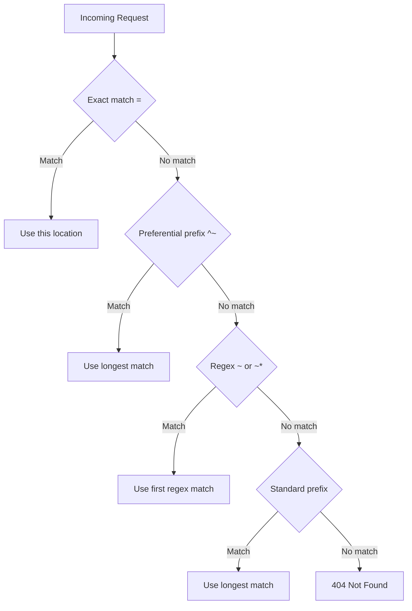

# How to Configure Nginx Location Blocks for Subfolders

Author: [nawazdhandala](https://github.com/nawazdhandala)

Tags: Nginx, Configuration, Web Server, DevOps

Description: Master Nginx location block configuration for subfolders with practical examples covering prefix matching, regex patterns, try_files, and nested locations for complex routing scenarios.

---

Nginx location blocks are the foundation of request routing. Understanding how to configure them for subfolders enables you to serve static files, proxy to backends, and handle complex URL patterns effectively. This guide provides practical examples for common subfolder configurations.

## Location Block Basics

Nginx evaluates location blocks in a specific order based on the modifier used:



| Modifier | Type | Evaluation Order |
|----------|------|------------------|
| `=` | Exact match | First (highest priority) |
| `^~` | Preferential prefix | Second |
| `~` | Case-sensitive regex | Third |
| `~*` | Case-insensitive regex | Third |
| (none) | Prefix match | Last |

## Serving Static Files from Subfolders

### Basic Subfolder Configuration

Serve files from `/var/www/site/docs` at the `/docs` URL path:

```nginx
server {
    listen 80;
    server_name example.com;
    root /var/www/site;

    location / {
        try_files $uri $uri/ =404;
    }

    location /docs/ {
        alias /var/www/documentation/;
        try_files $uri $uri/ =404;
    }

    location /images/ {
        root /var/www/assets;
        # Files served from /var/www/assets/images/
        expires 30d;
        add_header Cache-Control "public, immutable";
    }
}
```

### Understanding root vs alias

The difference between `root` and `alias` is crucial for subfolder configuration:

```nginx
# Using root - location path is appended
location /images/ {
    root /var/www;
    # Request: /images/logo.png
    # File path: /var/www/images/logo.png
}

# Using alias - location path is replaced
location /images/ {
    alias /var/www/static/img/;
    # Request: /images/logo.png
    # File path: /var/www/static/img/logo.png
}
```

**Important**: When using `alias`, always include the trailing slash on both the location and alias path to avoid path issues.

## Proxying Subfolders to Different Backends

### Multiple Applications

Route different URL paths to different backend services:

```nginx
upstream frontend_app {
    server 127.0.0.1:3000;
}

upstream api_backend {
    server 127.0.0.1:4000;
}

upstream admin_backend {
    server 127.0.0.1:5000;
}

server {
    listen 80;
    server_name example.com;

    # Main frontend application
    location / {
        proxy_pass http://frontend_app;
        proxy_set_header Host $host;
        proxy_set_header X-Real-IP $remote_addr;
    }

    # API backend - strip /api prefix
    location /api/ {
        proxy_pass http://api_backend/;
        proxy_set_header Host $host;
        proxy_set_header X-Real-IP $remote_addr;
        proxy_set_header X-Forwarded-Prefix /api;
    }

    # Admin panel - keep /admin prefix
    location /admin {
        proxy_pass http://admin_backend;
        proxy_set_header Host $host;
        proxy_set_header X-Real-IP $remote_addr;
    }
}
```

### Subfolder for SPA Applications

Single Page Applications need special handling for client-side routing:

```nginx
location /app/ {
    alias /var/www/spa/;
    try_files $uri $uri/ /app/index.html;
}

# Alternative using root
location /dashboard {
    root /var/www;
    try_files $uri $uri/ /dashboard/index.html;
}
```

## Nested Location Blocks

Use nested locations for fine-grained control within a subfolder:

```nginx
location /api/ {
    proxy_pass http://api_backend/;
    proxy_set_header Host $host;

    # Public endpoints - no auth required
    location /api/public/ {
        proxy_pass http://api_backend/public/;
    }

    # Protected endpoints - require authentication
    location /api/admin/ {
        auth_basic "Admin Area";
        auth_basic_user_file /etc/nginx/.htpasswd;
        proxy_pass http://api_backend/admin/;
    }

    # Uploads - increase body size limit
    location /api/upload/ {
        client_max_body_size 100M;
        proxy_pass http://api_backend/upload/;
    }
}
```

## Regex-Based Subfolder Matching

### Version-Based API Routing

Route different API versions to different backends:

```nginx
# Match /api/v1/, /api/v2/, etc.
location ~ ^/api/v(\d+)/(.*)$ {
    set $api_version $1;
    set $api_path $2;

    proxy_pass http://api_v$api_version/$api_path$is_args$args;
    proxy_set_header Host $host;
    proxy_set_header X-API-Version $api_version;
}

upstream api_v1 {
    server 127.0.0.1:4001;
}

upstream api_v2 {
    server 127.0.0.1:4002;
}
```

### File Extension Based Routing

Route requests based on file types within subfolders:

```nginx
# PHP files in any subfolder
location ~ \.php$ {
    root /var/www/html;
    fastcgi_pass unix:/run/php/php-fpm.sock;
    fastcgi_param SCRIPT_FILENAME $document_root$fastcgi_script_name;
    include fastcgi_params;
}

# Static assets in /assets subfolder
location ~* ^/assets/.*\.(jpg|jpeg|png|gif|ico|css|js)$ {
    root /var/www;
    expires 1y;
    add_header Cache-Control "public, immutable";
}
```

## Common Subfolder Patterns

### WordPress in Subfolder

Running WordPress at `/blog`:

```nginx
location /blog {
    root /var/www;
    index index.php;
    try_files $uri $uri/ /blog/index.php?$args;

    location ~ \.php$ {
        fastcgi_pass unix:/run/php/php-fpm.sock;
        fastcgi_param SCRIPT_FILENAME $document_root$fastcgi_script_name;
        include fastcgi_params;
    }

    location ~* \.(js|css|png|jpg|jpeg|gif|ico)$ {
        expires max;
        log_not_found off;
    }
}
```

### Documentation Site in Subfolder

Serve static documentation:

```nginx
location /docs {
    alias /var/www/documentation/build;
    index index.html;

    # Support clean URLs
    try_files $uri $uri/ $uri.html =404;

    # Cache static assets
    location ~* \.(css|js|png|jpg|svg|woff2?)$ {
        expires 7d;
        add_header Cache-Control "public";
    }
}
```

### Microservices with Path-Based Routing

Route to multiple microservices:

```nginx
map $uri $upstream_service {
    ~^/users      user_service;
    ~^/orders     order_service;
    ~^/products   product_service;
    default       default_service;
}

upstream user_service {
    server 127.0.0.1:3001;
}

upstream order_service {
    server 127.0.0.1:3002;
}

upstream product_service {
    server 127.0.0.1:3003;
}

upstream default_service {
    server 127.0.0.1:3000;
}

server {
    listen 80;

    location / {
        proxy_pass http://$upstream_service;
        proxy_set_header Host $host;
        proxy_set_header X-Real-IP $remote_addr;
    }
}
```

## Handling Special Cases

### Trailing Slash Normalization

Ensure consistent URL handling:

```nginx
# Add trailing slash if missing (for directories)
location /app {
    # Redirect /app to /app/
    rewrite ^/app$ /app/ permanent;
}

location /app/ {
    alias /var/www/application/;
    try_files $uri $uri/ /app/index.html;
}
```

### Case-Insensitive Subfolder Matching

```nginx
# Match /Docs, /docs, /DOCS
location ~* ^/docs(/.*)?$ {
    alias /var/www/documentation$1;
    try_files $uri $uri/ =404;
}
```

### Blocking Access to Subfolders

```nginx
# Block access to sensitive directories
location ~ ^/(\.git|\.svn|\.env|node_modules)/ {
    deny all;
    return 404;
}

# Block config files in any subfolder
location ~* /.*\.(ini|log|conf|bak)$ {
    deny all;
    return 404;
}
```

## Debugging Location Blocks

### Add Debug Headers

```nginx
location /api/ {
    add_header X-Debug-Location "api" always;
    proxy_pass http://api_backend/;
}

location /api/v2/ {
    add_header X-Debug-Location "api-v2" always;
    proxy_pass http://api_v2_backend/;
}
```

### Test with curl

```bash
# Check which location matched
curl -I http://localhost/api/users | grep X-Debug

# Verbose output
curl -v http://localhost/api/users
```

### Enable Debug Logging

```nginx
error_log /var/log/nginx/error.log debug;
```

## Complete Production Example

```nginx
server {
    listen 80;
    listen 443 ssl http2;
    server_name example.com;

    ssl_certificate /etc/ssl/certs/example.com.crt;
    ssl_certificate_key /etc/ssl/private/example.com.key;

    root /var/www/main;
    index index.html;

    # Main site
    location / {
        try_files $uri $uri/ /index.html;
    }

    # API with rate limiting
    location /api/ {
        limit_req zone=api burst=20 nodelay;
        proxy_pass http://api_backend/;
        proxy_set_header Host $host;
        proxy_set_header X-Real-IP $remote_addr;
    }

    # Static documentation
    location /docs/ {
        alias /var/www/documentation/;
        try_files $uri $uri/ $uri.html =404;
        expires 1d;
    }

    # Admin panel with authentication
    location /admin/ {
        auth_basic "Admin";
        auth_basic_user_file /etc/nginx/.htpasswd;
        proxy_pass http://admin_backend/;
    }

    # Uploads
    location /uploads/ {
        alias /var/www/uploads/;
        expires 30d;
        add_header Cache-Control "public";
    }

    # Health check
    location = /health {
        access_log off;
        return 200 "OK\n";
        add_header Content-Type text/plain;
    }

    # Deny hidden files
    location ~ /\. {
        deny all;
    }
}
```

## Summary

Configuring Nginx location blocks for subfolders requires understanding:

1. **Matching precedence** - Exact > Preferential prefix > Regex > Standard prefix
2. **root vs alias** - `root` appends path, `alias` replaces it
3. **Trailing slashes** - Consistency prevents routing issues
4. **Nested locations** - Enable fine-grained control within paths
5. **try_files** - Essential for SPAs and clean URLs

Test your configuration with `nginx -t` before reloading, and use debug headers during development to verify correct routing. Location block configuration is one of the most powerful features of Nginx - mastering it enables sophisticated routing for any application architecture.
