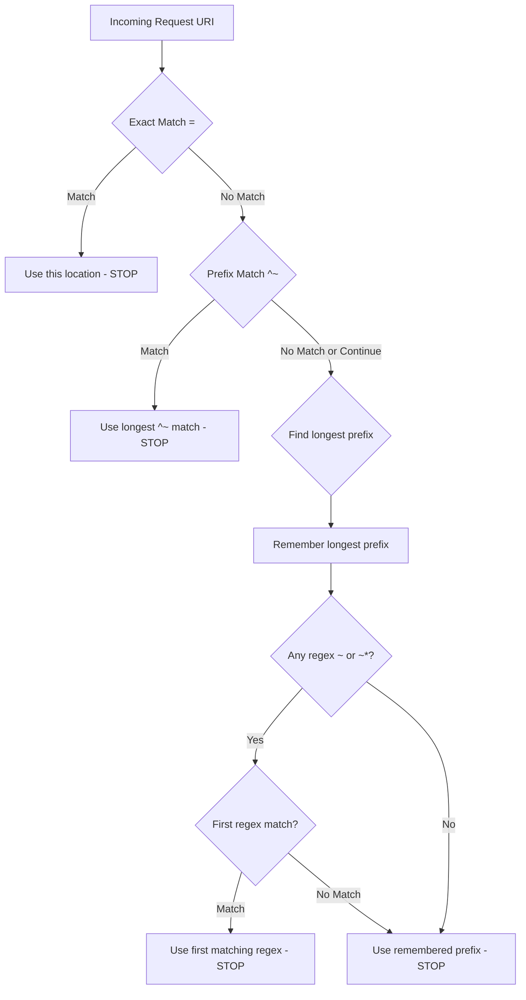

# How to Understand Nginx Location Priority

Author: [nawazdhandala](https://github.com/nawazdhandala)

Tags: Nginx, Configuration, Routing, Web Server, Best Practices

Description: Learn how Nginx evaluates and prioritizes location blocks, including exact matches, prefix matches, and regular expressions, to correctly route requests in your configuration.

---

Nginx location blocks determine how requests are handled, but their matching behavior isn't always intuitive. Understanding the priority rules is essential for writing correct configurations and debugging routing issues.

## Location Matching Priority

Nginx evaluates location blocks in a specific order, not the order they appear in your configuration:



## Priority Order

From highest to lowest priority:

| Priority | Modifier | Type | Example |
|----------|----------|------|---------|
| 1 | `=` | Exact match | `location = /path` |
| 2 | `^~` | Preferential prefix | `location ^~ /images/` |
| 3 | `~` | Case-sensitive regex | `location ~ \.php$` |
| 3 | `~*` | Case-insensitive regex | `location ~* \.(jpg\|png)$` |
| 4 | (none) | Prefix match | `location /api/` |
| 4 | (none) | Prefix match | `location /` |

## Detailed Examples

### Exact Match (`=`)

Highest priority. Stops search immediately on match:

```nginx
server {
    # Exact match - only matches /favicon.ico, nothing else
    location = /favicon.ico {
        log_not_found off;
        access_log off;
    }

    # Exact match for homepage
    location = / {
        # Only matches /, not /anything
        index index.html;
    }

    # This won't match / because exact match above wins
    location / {
        try_files $uri $uri/ =404;
    }
}
```

Test:
- `/` - matches `= /`
- `/index.html` - matches `/`
- `/favicon.ico` - matches `= /favicon.ico`

### Preferential Prefix (`^~`)

Stops regex search if this prefix matches:

```nginx
server {
    # If URI starts with /images/, stop here - don't check regex
    location ^~ /images/ {
        root /var/www/static;
        expires 30d;
    }

    # This regex won't be checked for /images/*.jpg
    location ~* \.(jpg|png|gif)$ {
        root /var/www/media;
    }
}
```

Test:
- `/images/logo.jpg` - matches `^~ /images/` (regex not checked)
- `/gallery/photo.jpg` - matches `~* \.(jpg|png|gif)$`

### Regular Expression (`~` and `~*`)

First matching regex wins:

```nginx
server {
    # Case-sensitive regex
    location ~ /API/ {
        # Matches /API/users but NOT /api/users
        proxy_pass http://api_backend;
    }

    # Case-insensitive regex
    location ~* /api/ {
        # Matches /api/users, /API/users, /Api/Users
        proxy_pass http://api_backend;
    }

    # Order matters for regex - first match wins
    location ~ \.php$ {
        # Checked before the next one
        fastcgi_pass unix:/var/run/php/php-fpm.sock;
    }

    location ~ /admin/.*\.php$ {
        # Never reached if above matches first
        fastcgi_pass unix:/var/run/php/php-fpm-admin.sock;
    }
}
```

### Prefix Match (no modifier)

Longest prefix wins, then regex is checked:

```nginx
server {
    # Short prefix
    location / {
        root /var/www/html;
    }

    # Longer prefix - more specific
    location /api/ {
        proxy_pass http://api_backend;
    }

    # Even longer prefix
    location /api/v2/ {
        proxy_pass http://api_v2_backend;
    }
}
```

Test:
- `/about.html` - matches `/`
- `/api/users` - matches `/api/`
- `/api/v2/users` - matches `/api/v2/`

## Complete Priority Example

```nginx
server {
    listen 80;
    server_name example.com;

    # Priority 1: Exact match
    location = / {
        return 200 "Exact match: /\n";
    }

    # Priority 1: Exact match
    location = /exact {
        return 200 "Exact match: /exact\n";
    }

    # Priority 2: Preferential prefix
    location ^~ /static/ {
        return 200 "Preferential prefix: /static/\n";
    }

    # Priority 3: Regex (first match)
    location ~ \.php$ {
        return 200 "Regex: .php\n";
    }

    # Priority 3: Regex (checked after above)
    location ~* \.(jpg|png)$ {
        return 200 "Regex: images\n";
    }

    # Priority 4: Prefix (longer)
    location /documents/ {
        return 200 "Prefix: /documents/\n";
    }

    # Priority 4: Prefix (shorter, fallback)
    location / {
        return 200 "Prefix: /\n";
    }
}
```

Test results:
```bash
curl localhost/                    # "Exact match: /"
curl localhost/exact               # "Exact match: /exact"
curl localhost/exact/more          # "Prefix: /"
curl localhost/static/             # "Preferential prefix: /static/"
curl localhost/static/style.css    # "Preferential prefix: /static/"
curl localhost/test.php            # "Regex: .php"
curl localhost/image.jpg           # "Regex: images"
curl localhost/static/image.jpg    # "Preferential prefix: /static/" (^~ wins)
curl localhost/documents/          # "Prefix: /documents/"
curl localhost/documents/test.php  # "Regex: .php" (regex wins over prefix)
curl localhost/anything            # "Prefix: /"
```

## Common Patterns and Best Practices

### Static Files with Fallback

```nginx
server {
    root /var/www/html;

    # Exact match for root
    location = / {
        try_files /index.html =404;
    }

    # Static files - stop at prefix, don't check regex
    location ^~ /assets/ {
        expires 1y;
        add_header Cache-Control "public, immutable";
    }

    # Images anywhere - regex
    location ~* \.(jpg|jpeg|png|gif|ico|svg)$ {
        expires 30d;
    }

    # PHP files - regex
    location ~ \.php$ {
        fastcgi_pass unix:/var/run/php/php-fpm.sock;
        include fastcgi_params;
    }

    # Everything else - prefix
    location / {
        try_files $uri $uri/ /index.php?$query_string;
    }
}
```

### API Routing

```nginx
server {
    # Exact health check endpoint
    location = /health {
        access_log off;
        return 200 "OK\n";
    }

    # API v2 (longer prefix wins over /api/)
    location /api/v2/ {
        proxy_pass http://api_v2;
    }

    # API v1 (fallback for /api/)
    location /api/ {
        proxy_pass http://api_v1;
    }

    # WebSocket - preferential prefix
    location ^~ /ws/ {
        proxy_pass http://websocket;
        proxy_http_version 1.1;
        proxy_set_header Upgrade $http_upgrade;
        proxy_set_header Connection "upgrade";
    }

    # Frontend app
    location / {
        root /var/www/frontend;
        try_files $uri $uri/ /index.html;
    }
}
```

### Nested Locations

```nginx
server {
    location /api/ {
        # Applies to all /api/* requests
        proxy_set_header X-API-Version "1";

        # Nested location for specific endpoint
        location /api/admin/ {
            # Inherits parent config plus:
            auth_basic "Admin API";
            auth_basic_user_file /etc/nginx/.htpasswd;
        }
    }
}
```

## Debugging Location Matches

### Add Debug Headers

```nginx
server {
    location = / {
        add_header X-Location "exact-root";
        # ...
    }

    location ^~ /static/ {
        add_header X-Location "preferential-static";
        # ...
    }

    location ~ \.php$ {
        add_header X-Location "regex-php";
        # ...
    }

    location / {
        add_header X-Location "prefix-root";
        # ...
    }
}
```

Test with curl:
```bash
curl -I http://localhost/test.php | grep X-Location
# X-Location: regex-php
```

### Use Return for Testing

```nginx
# Temporarily replace content with location identifier
location /api/ {
    return 200 "Matched: /api/\n";
}
```

### Enable Debug Logging

```nginx
error_log /var/log/nginx/debug.log debug;
```

## Common Mistakes

### Mistake 1: Expecting Order to Matter for Prefix

```nginx
# Order doesn't matter for prefix - longest wins
location / {
    return 200 "root";
}

location /api/ {
    return 200 "api";  # Wins for /api/* regardless of order
}
```

### Mistake 2: Regex Order Confusion

```nginx
# Order DOES matter for regex - first match wins
location ~ /admin/ {
    # This matches /admin/config.php
}

location ~ \.php$ {
    # Never processes /admin/*.php
}

# Fix: Put specific regex first
location ~ /admin/.*\.php$ {
    # Specific pattern first
}

location ~ \.php$ {
    # General pattern second
}
```

### Mistake 3: Forgetting ^~ Prevents Regex

```nginx
location ^~ /uploads/ {
    # All /uploads/* handled here
}

location ~ \.(php|phtml)$ {
    # Never processes /uploads/*.php - security issue!
}

# Fix: Add explicit denial in ^~ block
location ^~ /uploads/ {
    location ~ \.php$ {
        deny all;
    }
}
```

## Quick Reference

| Modifier | Name | Behavior |
|----------|------|----------|
| `=` | Exact | Match exact URI, highest priority |
| `^~` | Preferential | Match prefix, skip regex check |
| `~` | Regex | Case-sensitive regex |
| `~*` | Regex | Case-insensitive regex |
| (none) | Prefix | Standard prefix match |

## Summary

Understanding Nginx location priority prevents routing bugs:

1. **Exact match (`=`)** wins immediately
2. **Preferential prefix (`^~`)** stops regex checking
3. **Regex matches** are evaluated in config order
4. **Longest prefix** is remembered but regex can override
5. **Config order** only matters for regex blocks

When debugging, add response headers or use `return` statements to identify which location block handles each request. Test edge cases like trailing slashes, case variations, and overlapping patterns to ensure your configuration behaves as expected.
