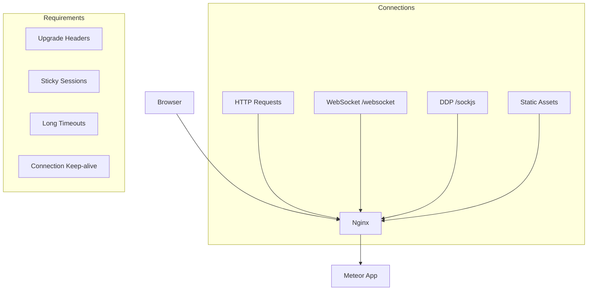

# How to Configure Nginx for Meteor Applications

Author: [nawazdhandala](https://github.com/nawazdhandala)

Tags: Nginx, Meteor, WebSocket, Node.js, Deployment

Description: Learn how to configure Nginx as a reverse proxy for Meteor applications, including WebSocket support, sticky sessions, SSL termination, and production-ready optimizations.

---

Meteor applications require specific Nginx configurations to work correctly. Unlike traditional web applications, Meteor uses WebSockets for real-time communication, long-polling as a fallback, and hot code push. Getting these working through Nginx requires careful attention to proxy settings, timeouts, and upgrade headers.

## Understanding Meteor's Requirements

Meteor applications have unique networking needs:



## Basic Meteor Configuration

Start with this minimal working configuration:

```nginx
# /etc/nginx/sites-available/meteor-app

upstream meteor_backend {
    server 127.0.0.1:3000;
    keepalive 32;
}

server {
    listen 80;
    server_name myapp.com;
    return 301 https://$server_name$request_uri;
}

server {
    listen 443 ssl http2;
    server_name myapp.com;

    ssl_certificate /etc/letsencrypt/live/myapp.com/fullchain.pem;
    ssl_certificate_key /etc/letsencrypt/live/myapp.com/privkey.pem;

    # Meteor document root (for cordova-related files)
    root /opt/meteor-app/bundle/programs/web.browser/app;

    location / {
        proxy_pass http://meteor_backend;
        proxy_http_version 1.1;

        # Headers for WebSocket support
        proxy_set_header Upgrade $http_upgrade;
        proxy_set_header Connection "upgrade";

        # Standard proxy headers
        proxy_set_header Host $host;
        proxy_set_header X-Real-IP $remote_addr;
        proxy_set_header X-Forwarded-For $proxy_add_x_forwarded_for;
        proxy_set_header X-Forwarded-Proto $scheme;

        # Timeouts for long-polling
        proxy_read_timeout 86400s;
        proxy_send_timeout 86400s;
    }
}
```

## WebSocket Configuration

WebSocket support is critical for Meteor's DDP protocol:

```nginx
# Map for WebSocket upgrade
map $http_upgrade $connection_upgrade {
    default upgrade;
    ''      close;
}

server {
    listen 443 ssl http2;
    server_name myapp.com;

    # ... SSL config ...

    # WebSocket location (Meteor uses /websocket and /sockjs)
    location ~* ^/(websocket|sockjs) {
        proxy_pass http://meteor_backend;
        proxy_http_version 1.1;

        # WebSocket headers
        proxy_set_header Upgrade $http_upgrade;
        proxy_set_header Connection $connection_upgrade;

        # Prevent buffering for real-time
        proxy_buffering off;

        # Long timeouts for persistent connections
        proxy_read_timeout 86400s;
        proxy_send_timeout 86400s;

        # Keep connection alive
        proxy_set_header Host $host;
        proxy_set_header X-Real-IP $remote_addr;
        proxy_set_header X-Forwarded-For $proxy_add_x_forwarded_for;
        proxy_set_header X-Forwarded-Proto $scheme;
    }

    location / {
        proxy_pass http://meteor_backend;
        proxy_http_version 1.1;

        proxy_set_header Host $host;
        proxy_set_header X-Real-IP $remote_addr;
        proxy_set_header X-Forwarded-For $proxy_add_x_forwarded_for;
        proxy_set_header X-Forwarded-Proto $scheme;
        proxy_set_header Upgrade $http_upgrade;
        proxy_set_header Connection $connection_upgrade;

        proxy_read_timeout 86400s;
    }
}
```

## Production Configuration with Load Balancing

For production environments with multiple Meteor instances:

```nginx
# Sticky sessions using IP hash (required for Meteor)
upstream meteor_cluster {
    ip_hash;  # Ensures same client hits same server
    server 127.0.0.1:3001;
    server 127.0.0.1:3002;
    server 127.0.0.1:3003;
    keepalive 64;
}

map $http_upgrade $connection_upgrade {
    default upgrade;
    ''      close;
}

server {
    listen 443 ssl http2;
    server_name myapp.com;

    ssl_certificate /etc/letsencrypt/live/myapp.com/fullchain.pem;
    ssl_certificate_key /etc/letsencrypt/live/myapp.com/privkey.pem;
    ssl_protocols TLSv1.2 TLSv1.3;
    ssl_ciphers ECDHE-ECDSA-AES128-GCM-SHA256:ECDHE-RSA-AES128-GCM-SHA256;
    ssl_prefer_server_ciphers on;
    ssl_session_cache shared:SSL:10m;
    ssl_session_timeout 1d;

    # Compression
    gzip on;
    gzip_vary on;
    gzip_min_length 1024;
    gzip_proxied any;
    gzip_types
        text/plain
        text/css
        text/javascript
        application/javascript
        application/json
        application/xml;

    # Static assets - served by Nginx for better performance
    location ~* "^/[a-f0-9]{40}\.(css|js)$" {
        root /opt/meteor-app/bundle/programs/web.browser;
        expires 1y;
        add_header Cache-Control "public, immutable";
        access_log off;
    }

    # Packages (static, hashed)
    location /packages/ {
        root /opt/meteor-app/bundle/programs/web.browser;
        expires 1y;
        add_header Cache-Control "public, immutable";
        access_log off;
    }

    # WebSocket and SockJS endpoints
    location ~* ^/(websocket|sockjs) {
        proxy_pass http://meteor_cluster;
        proxy_http_version 1.1;
        proxy_set_header Upgrade $http_upgrade;
        proxy_set_header Connection $connection_upgrade;
        proxy_set_header Host $host;
        proxy_set_header X-Real-IP $remote_addr;
        proxy_set_header X-Forwarded-For $proxy_add_x_forwarded_for;
        proxy_set_header X-Forwarded-Proto $scheme;
        proxy_buffering off;
        proxy_read_timeout 86400s;
        proxy_send_timeout 86400s;
    }

    # All other requests
    location / {
        proxy_pass http://meteor_cluster;
        proxy_http_version 1.1;
        proxy_set_header Upgrade $http_upgrade;
        proxy_set_header Connection $connection_upgrade;
        proxy_set_header Host $host;
        proxy_set_header X-Real-IP $remote_addr;
        proxy_set_header X-Forwarded-For $proxy_add_x_forwarded_for;
        proxy_set_header X-Forwarded-Proto $scheme;
        proxy_read_timeout 86400s;
    }
}
```

## Meteor Environment Variables

Meteor needs certain environment variables when running behind Nginx:

```bash
# /etc/systemd/system/meteor.service
[Unit]
Description=Meteor Application
After=network.target

[Service]
Type=simple
User=meteor
WorkingDirectory=/opt/meteor-app
Environment=NODE_ENV=production
Environment=ROOT_URL=https://myapp.com
Environment=PORT=3000
Environment=MONGO_URL=mongodb://localhost:27017/myapp
Environment=METEOR_SETTINGS_FILE=/opt/meteor-app/settings.json
Environment=HTTP_FORWARDED_COUNT=1

ExecStart=/usr/bin/node /opt/meteor-app/bundle/main.js
Restart=always

[Install]
WantedBy=multi-user.target
```

The `HTTP_FORWARDED_COUNT=1` is critical - it tells Meteor how many proxies are in front of it, allowing proper IP detection.

## Handling Hot Code Push

Meteor's hot code push requires WebSocket reconnection handling:

```nginx
# Add reconnection headers for hot code push
location / {
    proxy_pass http://meteor_backend;
    proxy_http_version 1.1;

    proxy_set_header Upgrade $http_upgrade;
    proxy_set_header Connection $connection_upgrade;
    proxy_set_header Host $host;
    proxy_set_header X-Real-IP $remote_addr;
    proxy_set_header X-Forwarded-For $proxy_add_x_forwarded_for;
    proxy_set_header X-Forwarded-Proto $scheme;

    # Don't close connection on backend restart
    proxy_next_upstream error timeout http_502 http_503 http_504;
    proxy_next_upstream_tries 3;

    # Quick retry on backend restart
    proxy_connect_timeout 5s;
    proxy_read_timeout 86400s;
}
```

## Mobile App (Cordova) Configuration

If your Meteor app serves mobile clients:

```nginx
server {
    listen 443 ssl http2;
    server_name myapp.com;

    # ... SSL config ...

    # CORS for Cordova apps
    location / {
        # CORS headers for mobile
        add_header Access-Control-Allow-Origin "*" always;
        add_header Access-Control-Allow-Methods "GET, POST, OPTIONS" always;
        add_header Access-Control-Allow-Headers "DNT,User-Agent,X-Requested-With,If-Modified-Since,Cache-Control,Content-Type,Range,Authorization" always;

        if ($request_method = OPTIONS) {
            return 204;
        }

        proxy_pass http://meteor_backend;
        proxy_http_version 1.1;
        proxy_set_header Upgrade $http_upgrade;
        proxy_set_header Connection $connection_upgrade;
        proxy_set_header Host $host;
        proxy_set_header X-Real-IP $remote_addr;
        proxy_set_header X-Forwarded-For $proxy_add_x_forwarded_for;
        proxy_set_header X-Forwarded-Proto $scheme;
        proxy_read_timeout 86400s;
    }

    # __cordova directory for mobile builds
    location /__cordova/ {
        root /opt/meteor-app/bundle/programs;
        expires 1d;
    }
}
```

## Debugging Meteor with Nginx

When WebSockets aren't working, debug systematically:

```bash
# Check WebSocket upgrade in Nginx logs
# Add this to your server block:
log_format ws_debug '$remote_addr - $upstream_addr [$time_local] '
                    '"$request" $status '
                    'upgrade="$http_upgrade" '
                    'connection="$http_connection"';

access_log /var/log/nginx/meteor-ws.log ws_debug;
```

Test WebSocket connection:

```bash
# Install wscat
npm install -g wscat

# Test WebSocket endpoint
wscat -c wss://myapp.com/websocket

# Should connect and show:
# Connected (press CTRL+C to quit)
```

## Common Issues and Solutions

### Issue: WebSocket Connection Fails

```nginx
# Ensure upgrade headers are set
proxy_set_header Upgrade $http_upgrade;
proxy_set_header Connection "upgrade";  # or $connection_upgrade

# Check for intermediate proxies stripping headers
# CloudFlare, AWS ELB, etc. need WebSocket support enabled
```

### Issue: Long Polling Timeout

```nginx
# Increase timeouts
proxy_read_timeout 86400s;  # 24 hours
proxy_send_timeout 86400s;

# Or at minimum
proxy_read_timeout 300s;  # 5 minutes
```

### Issue: 502 Bad Gateway on Restart

```nginx
# Use upstream with health check
upstream meteor_backend {
    server 127.0.0.1:3000 max_fails=3 fail_timeout=30s;
    keepalive 32;
}
```

### Issue: Session Lost Between Requests

```nginx
# Use ip_hash for sticky sessions
upstream meteor_cluster {
    ip_hash;
    server 127.0.0.1:3001;
    server 127.0.0.1:3002;
}
```

## Complete Production Template

```nginx
map $http_upgrade $connection_upgrade {
    default upgrade;
    ''      close;
}

upstream meteor_app {
    ip_hash;
    server 127.0.0.1:3000;
    keepalive 64;
}

server {
    listen 80;
    server_name myapp.com;
    return 301 https://$server_name$request_uri;
}

server {
    listen 443 ssl http2;
    server_name myapp.com;

    # SSL Configuration
    ssl_certificate /etc/letsencrypt/live/myapp.com/fullchain.pem;
    ssl_certificate_key /etc/letsencrypt/live/myapp.com/privkey.pem;
    ssl_protocols TLSv1.2 TLSv1.3;
    ssl_prefer_server_ciphers on;
    ssl_session_cache shared:SSL:10m;

    # Security headers
    add_header X-Frame-Options "SAMEORIGIN" always;
    add_header X-Content-Type-Options "nosniff" always;
    add_header X-XSS-Protection "1; mode=block" always;

    # Gzip
    gzip on;
    gzip_types text/plain text/css application/javascript application/json;

    # Static assets
    location ~* "^/[a-f0-9]{40}\.(css|js)$" {
        root /opt/meteor-app/bundle/programs/web.browser;
        expires 1y;
        access_log off;
    }

    # All requests to Meteor
    location / {
        proxy_pass http://meteor_app;
        proxy_http_version 1.1;

        proxy_set_header Upgrade $http_upgrade;
        proxy_set_header Connection $connection_upgrade;
        proxy_set_header Host $host;
        proxy_set_header X-Real-IP $remote_addr;
        proxy_set_header X-Forwarded-For $proxy_add_x_forwarded_for;
        proxy_set_header X-Forwarded-Proto $scheme;

        proxy_buffering off;
        proxy_read_timeout 86400s;
        proxy_send_timeout 86400s;
    }
}
```

## Summary

| Feature | Configuration |
|---------|--------------|
| WebSocket | `proxy_set_header Upgrade/Connection` |
| Long Polling | `proxy_read_timeout 86400s` |
| Sticky Sessions | `ip_hash` in upstream |
| Hot Code Push | `proxy_next_upstream` |
| Static Assets | Direct serve with long cache |
| Mobile CORS | `Access-Control-Allow-*` headers |

Meteor applications work well with Nginx when you properly configure WebSocket upgrades, long timeouts, and sticky sessions. The key is understanding that Meteor maintains persistent connections that differ from traditional HTTP request-response patterns.
