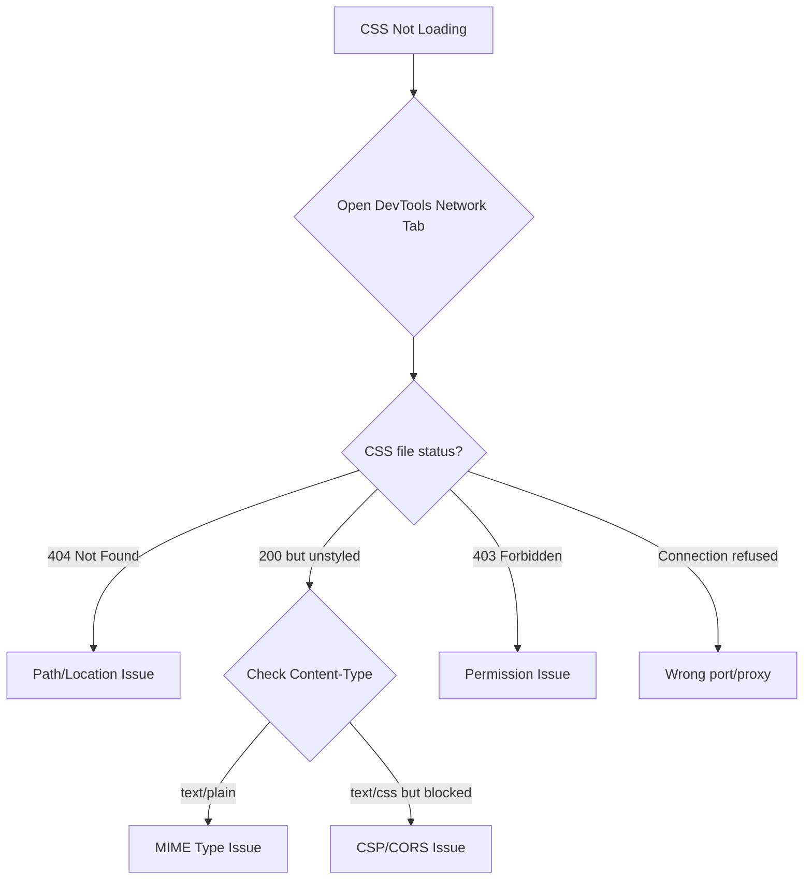

# How to Fix Nginx Not Loading CSS Files

Author: [nawazdhandala](https://github.com/nawazdhandala)

Tags: Nginx, Web Server, CSS, MIME Types, Troubleshooting

Description: Learn how to diagnose and fix Nginx not serving CSS files correctly, including MIME type issues, path problems, permissions errors, and Content Security Policy conflicts.

---

When your website loads but appears completely unstyled, with CSS files showing as text/plain or returning 404 errors, the problem usually lies in Nginx's configuration. This guide covers all the common causes and their solutions.

## Identifying the Problem

First, diagnose which issue you're facing by checking your browser's developer tools:



## Issue 1: Incorrect MIME Type

The most common issue is Nginx serving CSS with the wrong Content-Type header.

**Check current MIME type:**

```bash
curl -I https://example.com/css/styles.css | grep -i content-type
# Wrong: Content-Type: text/plain
# Correct: Content-Type: text/css
```

**Solution: Include MIME types configuration:**

```nginx
http {
    # Include default MIME types
    include /etc/nginx/mime.types;

    # Set default type for unknown extensions
    default_type application/octet-stream;

    server {
        listen 80;
        server_name example.com;
        root /var/www/html;
    }
}
```

**Verify mime.types file exists and contains CSS:**

```bash
# Check if mime.types exists
ls -la /etc/nginx/mime.types

# Verify CSS entry
grep "text/css" /etc/nginx/mime.types
# Should output: text/css css;
```

**If mime.types is missing or incomplete, create it:**

```nginx
# /etc/nginx/mime.types
types {
    text/html                             html htm shtml;
    text/css                              css;
    text/javascript                       js;
    application/javascript                js;
    application/json                      json;

    image/gif                             gif;
    image/jpeg                            jpeg jpg;
    image/png                             png;
    image/svg+xml                         svg svgz;
    image/webp                            webp;

    font/woff                             woff;
    font/woff2                            woff2;
    application/font-woff                 woff;
    application/font-woff2                woff2;

    application/pdf                       pdf;
    application/zip                       zip;
}
```

## Issue 2: Wrong Location Block Matching

CSS requests might be caught by the wrong location block:

```nginx
# Problem: catch-all PHP handler intercepts CSS
location ~ \..* {
    fastcgi_pass unix:/var/run/php/php-fpm.sock;
    # CSS files get processed by PHP - wrong!
}

# Solution: Explicit static file handling BEFORE PHP
location ~* \.(css|js|jpg|jpeg|png|gif|ico|svg|woff|woff2)$ {
    expires 30d;
    add_header Cache-Control "public, no-transform";
}

location ~ \.php$ {
    fastcgi_pass unix:/var/run/php/php-fpm.sock;
}
```

## Issue 3: Incorrect Root or Alias

The CSS file path might not match your filesystem:

```nginx
# Your HTML references:
# <link href="/assets/css/style.css">

server {
    root /var/www/html;  # File should be at /var/www/html/assets/css/style.css

    # Wrong: Using alias incorrectly
    location /assets/ {
        alias /var/www/static;  # Looks for /var/www/static/css/style.css
    }

    # Correct: Match the path structure
    location /assets/ {
        alias /var/www/static/assets/;  # Or adjust your root
    }
}
```

**Debug path resolution:**

```bash
# Check where Nginx looks for files
nginx -T 2>&1 | grep -E "(root|alias)"

# Verify file exists at expected path
ls -la /var/www/html/assets/css/style.css
```

## Issue 4: Permission Problems

Nginx worker process cannot read the CSS files:

```bash
# Check Nginx user
ps aux | grep nginx | grep worker
# www-data 12345 ... nginx: worker process

# Check file permissions
ls -la /var/www/html/css/
# -rw------- 1 root root 5432 Dec 16 10:00 style.css  # Wrong!
# -rw-r--r-- 1 www-data www-data 5432 Dec 16 10:00 style.css  # Correct

# Fix permissions
sudo chown -R www-data:www-data /var/www/html/
sudo find /var/www/html -type f -exec chmod 644 {} \;
sudo find /var/www/html -type d -exec chmod 755 {} \;
```

## Issue 5: try_files Configuration

Incorrect try_files can prevent CSS from loading:

```nginx
# Problem: All requests go to index.php (SPA/framework config)
location / {
    try_files $uri /index.php?$query_string;  # CSS -> PHP
}

# Solution: Check file exists first
location / {
    try_files $uri $uri/ /index.php?$query_string;
}

# Better: Separate static files
location ~* \.(css|js|jpg|jpeg|png|gif|ico|svg)$ {
    try_files $uri =404;
    expires 30d;
}

location / {
    try_files $uri $uri/ /index.php?$query_string;
}
```

## Issue 6: Content Security Policy Blocking

CSP headers might block inline styles or external CSS:

```nginx
# Check if CSP is blocking
# Browser console shows: "Refused to load stylesheet"

# Overly restrictive CSP
add_header Content-Security-Policy "default-src 'self'; style-src 'self'";

# Allow inline styles if needed
add_header Content-Security-Policy "default-src 'self'; style-src 'self' 'unsafe-inline'";

# Allow specific CDN
add_header Content-Security-Policy "default-src 'self'; style-src 'self' https://cdn.example.com";
```

## Issue 7: Gzip Compression Issues

Some browsers have issues with gzip-compressed CSS:

```nginx
# Ensure proper gzip configuration
gzip on;
gzip_vary on;
gzip_types text/css text/javascript application/javascript application/json;
gzip_min_length 1024;

# If issues persist, disable gzip for CSS temporarily
location ~* \.css$ {
    gzip off;
}
```

## Complete Working Configuration

Here's a comprehensive configuration that handles CSS correctly:

```nginx
http {
    include /etc/nginx/mime.types;
    default_type application/octet-stream;

    # Gzip settings
    gzip on;
    gzip_vary on;
    gzip_min_length 1024;
    gzip_proxied any;
    gzip_types
        text/plain
        text/css
        text/javascript
        application/javascript
        application/json
        image/svg+xml;

    server {
        listen 80;
        server_name example.com;
        root /var/www/html;
        index index.html index.php;

        # Static files with proper caching
        location ~* \.(css|js)$ {
            expires 1y;
            add_header Cache-Control "public, immutable";
            add_header X-Content-Type-Options "nosniff";
            access_log off;

            # Ensure correct MIME type
            types {
                text/css css;
                text/javascript js;
                application/javascript js;
            }
        }

        # Images and fonts
        location ~* \.(jpg|jpeg|png|gif|ico|svg|webp|woff|woff2|ttf|eot)$ {
            expires 6M;
            add_header Cache-Control "public";
            access_log off;
        }

        # PHP handling (if applicable)
        location ~ \.php$ {
            fastcgi_pass unix:/var/run/php/php-fpm.sock;
            fastcgi_param SCRIPT_FILENAME $document_root$fastcgi_script_name;
            include fastcgi_params;
        }

        # Default location
        location / {
            try_files $uri $uri/ /index.php?$query_string;
        }

        # Security headers
        add_header X-Frame-Options "SAMEORIGIN" always;
        add_header X-Content-Type-Options "nosniff" always;
    }
}
```

## Debugging Checklist

Use this script to diagnose CSS loading issues:

```bash
#!/bin/bash
# css-debug.sh

CSS_URL="${1:-https://example.com/css/style.css}"

echo "=== CSS Loading Debugger ==="
echo "Testing: $CSS_URL"
echo ""

echo "=== HTTP Response Headers ==="
curl -sI "$CSS_URL" | head -20

echo ""
echo "=== Content-Type Check ==="
CONTENT_TYPE=$(curl -sI "$CSS_URL" | grep -i "content-type" | tr -d '\r')
echo "$CONTENT_TYPE"

if echo "$CONTENT_TYPE" | grep -q "text/css"; then
    echo "OK: Correct MIME type"
else
    echo "ERROR: Wrong MIME type (should be text/css)"
fi

echo ""
echo "=== Response Status ==="
STATUS=$(curl -sI "$CSS_URL" | head -1)
echo "$STATUS"

echo ""
echo "=== First 5 lines of content ==="
curl -s "$CSS_URL" | head -5

echo ""
echo "=== Nginx error log (last 10 lines) ==="
sudo tail -10 /var/log/nginx/error.log 2>/dev/null || echo "Cannot read error log"
```

## Testing After Changes

```bash
# Test nginx configuration
sudo nginx -t

# Reload nginx
sudo systemctl reload nginx

# Clear browser cache and test
# Or use curl to bypass cache
curl -H "Cache-Control: no-cache" -I https://example.com/css/style.css

# Test with verbose output
curl -v https://example.com/css/style.css 2>&1 | head -50
```

## Common Mistakes Summary

| Symptom | Cause | Solution |
|---------|-------|----------|
| CSS shows as text/plain | Missing mime.types include | Add `include mime.types;` |
| 404 for CSS files | Wrong root/alias path | Check file path matches |
| 403 Forbidden | Permission denied | Fix file ownership/permissions |
| CSS cached forever | Aggressive caching | Clear cache, adjust headers |
| Blocked by browser | CSP header too strict | Update Content-Security-Policy |
| PHP code in CSS | Wrong location priority | Put static files location first |
| Works locally, not in prod | Different nginx.conf | Compare configurations |

By systematically checking MIME types, paths, permissions, and location block ordering, you can resolve most CSS loading issues in Nginx. The key is to use browser developer tools and curl to identify exactly what's happening before making configuration changes.
