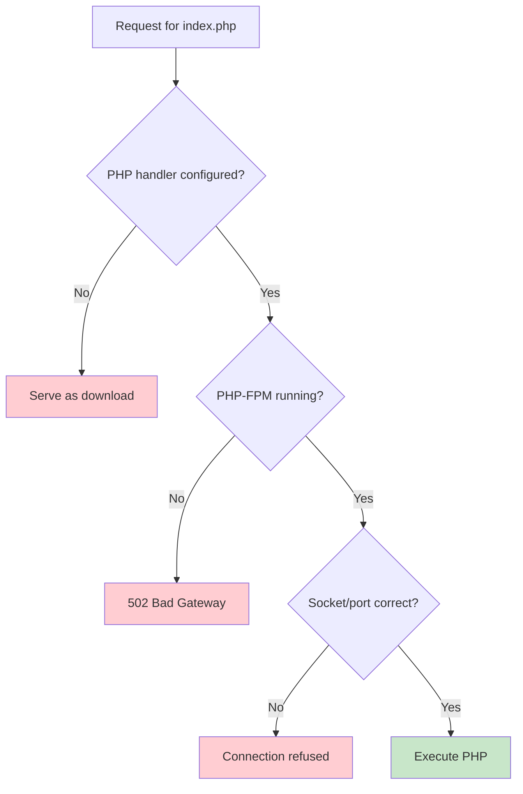

# How to Fix Nginx Serving PHP Files as Downloads

Author: [nawazdhandala](https://github.com/nawazdhandala)

Tags: Nginx, PHP, PHP-FPM, Troubleshooting, Web Server

Description: Learn how to fix the common issue where Nginx downloads PHP files instead of executing them, including PHP-FPM configuration, socket setup, and proper location block configuration.

---

When Nginx serves PHP files as downloads instead of executing them, it means Nginx does not know how to process PHP. This usually happens because PHP-FPM is not properly configured or the PHP location block is missing or incorrect.

## Understanding the Problem



## The Correct Configuration

### Basic PHP-FPM Configuration

```nginx
server {
    listen 80;
    server_name example.com;
    root /var/www/example.com;
    index index.php index.html;

    location / {
        try_files $uri $uri/ /index.php?$query_string;
    }

    location ~ \.php$ {
        include fastcgi_params;
        fastcgi_pass unix:/var/run/php/php8.2-fpm.sock;
        fastcgi_param SCRIPT_FILENAME $document_root$fastcgi_script_name;
        fastcgi_index index.php;
    }
}
```

## Common Causes and Solutions

### Cause 1: Missing PHP Location Block

The most common cause is a missing or incorrect location block for PHP files.

#### Wrong Configuration

```nginx
server {
    listen 80;
    server_name example.com;
    root /var/www/example.com;

    location / {
        try_files $uri $uri/ =404;
    }
    # Missing PHP handler - files will download!
}
```

#### Correct Configuration

```nginx
server {
    listen 80;
    server_name example.com;
    root /var/www/example.com;
    index index.php index.html;

    location / {
        try_files $uri $uri/ /index.php?$query_string;
    }

    # Add PHP handler
    location ~ \.php$ {
        include fastcgi_params;
        fastcgi_pass unix:/var/run/php/php8.2-fpm.sock;
        fastcgi_param SCRIPT_FILENAME $document_root$fastcgi_script_name;
        fastcgi_index index.php;
    }
}
```

### Cause 2: Wrong PHP-FPM Socket Path

PHP-FPM socket paths vary by distribution and PHP version.

#### Find Your Socket Path

```bash
# Check PHP-FPM configuration
grep -r "listen" /etc/php/*/fpm/pool.d/

# Common locations:
# Ubuntu/Debian: /var/run/php/php8.2-fpm.sock
# CentOS/RHEL: /var/run/php-fpm/www.sock
# Alpine: /var/run/php-fpm.sock

# Check if socket exists
ls -la /var/run/php/

# Or check if using TCP port
netstat -tlnp | grep php-fpm
```

#### Socket Configuration Examples

```nginx
# Ubuntu/Debian with PHP 8.2
fastcgi_pass unix:/var/run/php/php8.2-fpm.sock;

# Ubuntu/Debian with PHP 8.1
fastcgi_pass unix:/var/run/php/php8.1-fpm.sock;

# CentOS/RHEL
fastcgi_pass unix:/var/run/php-fpm/www.sock;

# TCP connection (127.0.0.1:9000)
fastcgi_pass 127.0.0.1:9000;
```

### Cause 3: PHP-FPM Not Running

```bash
# Check PHP-FPM status
sudo systemctl status php8.2-fpm

# Start if not running
sudo systemctl start php8.2-fpm

# Enable on boot
sudo systemctl enable php8.2-fpm

# Check for errors
sudo journalctl -u php8.2-fpm -f
```

### Cause 4: Missing fastcgi_params

Ensure you have the proper FastCGI parameters included.

#### Check fastcgi_params File Exists

```bash
ls -la /etc/nginx/fastcgi_params
```

#### Contents of fastcgi_params

```nginx
# /etc/nginx/fastcgi_params
fastcgi_param  QUERY_STRING       $query_string;
fastcgi_param  REQUEST_METHOD     $request_method;
fastcgi_param  CONTENT_TYPE       $content_type;
fastcgi_param  CONTENT_LENGTH     $content_length;

fastcgi_param  SCRIPT_NAME        $fastcgi_script_name;
fastcgi_param  REQUEST_URI        $request_uri;
fastcgi_param  DOCUMENT_URI       $document_uri;
fastcgi_param  DOCUMENT_ROOT      $document_root;
fastcgi_param  SERVER_PROTOCOL    $server_protocol;
fastcgi_param  REQUEST_SCHEME     $scheme;
fastcgi_param  HTTPS              $https if_not_empty;

fastcgi_param  GATEWAY_INTERFACE  CGI/1.1;
fastcgi_param  SERVER_SOFTWARE    nginx/$nginx_version;

fastcgi_param  REMOTE_ADDR        $remote_addr;
fastcgi_param  REMOTE_PORT        $remote_port;
fastcgi_param  SERVER_ADDR        $server_addr;
fastcgi_param  SERVER_PORT        $server_port;
fastcgi_param  SERVER_NAME        $server_name;

# PHP only, required if PHP was built with --enable-force-cgi-redirect
fastcgi_param  REDIRECT_STATUS    200;
```

### Cause 5: Incorrect default_type

If Nginx does not recognize the file type, it may serve it with a download header.

```nginx
http {
    include /etc/nginx/mime.types;
    default_type application/octet-stream;  # This causes downloads for unknown types
}
```

#### Fix: Add PHP MIME Type Handling

```nginx
location ~ \.php$ {
    # Prevent downloading if PHP-FPM fails
    try_files $uri =404;

    include fastcgi_params;
    fastcgi_pass unix:/var/run/php/php8.2-fpm.sock;
    fastcgi_param SCRIPT_FILENAME $document_root$fastcgi_script_name;
    fastcgi_index index.php;
}
```

## Complete Production Configuration

### Full Server Block

```nginx
server {
    listen 80;
    listen [::]:80;
    server_name example.com www.example.com;
    root /var/www/example.com/public;
    index index.php index.html index.htm;

    # Logging
    access_log /var/log/nginx/example.com.access.log;
    error_log /var/log/nginx/example.com.error.log;

    # Security headers
    add_header X-Frame-Options "SAMEORIGIN" always;
    add_header X-Content-Type-Options "nosniff" always;
    add_header X-XSS-Protection "1; mode=block" always;

    # Main location
    location / {
        try_files $uri $uri/ /index.php?$query_string;
    }

    # PHP handling
    location ~ \.php$ {
        # Check file exists before passing to PHP-FPM
        try_files $uri =404;

        # FastCGI settings
        fastcgi_split_path_info ^(.+\.php)(/.+)$;
        fastcgi_pass unix:/var/run/php/php8.2-fpm.sock;
        fastcgi_index index.php;

        # Include standard params
        include fastcgi_params;

        # Required parameters
        fastcgi_param SCRIPT_FILENAME $document_root$fastcgi_script_name;
        fastcgi_param PATH_INFO $fastcgi_path_info;

        # Performance settings
        fastcgi_connect_timeout 60;
        fastcgi_send_timeout 180;
        fastcgi_read_timeout 180;
        fastcgi_buffer_size 128k;
        fastcgi_buffers 4 256k;
        fastcgi_busy_buffers_size 256k;
        fastcgi_temp_file_write_size 256k;
    }

    # Block access to hidden files
    location ~ /\. {
        deny all;
    }

    # Block access to sensitive files
    location ~* \.(engine|inc|info|install|make|module|profile|test|po|sh|sql|theme|tpl|xtmpl|yml|yaml)$ {
        deny all;
    }

    # Static file handling
    location ~* \.(js|css|png|jpg|jpeg|gif|ico|svg|woff|woff2|ttf|eot)$ {
        expires 1y;
        add_header Cache-Control "public, immutable";
        access_log off;
    }
}
```

## Framework-Specific Configurations

### Laravel

```nginx
server {
    listen 80;
    server_name example.com;
    root /var/www/example.com/public;
    index index.php;

    location / {
        try_files $uri $uri/ /index.php?$query_string;
    }

    location ~ \.php$ {
        try_files $uri =404;
        fastcgi_pass unix:/var/run/php/php8.2-fpm.sock;
        fastcgi_index index.php;
        include fastcgi_params;
        fastcgi_param SCRIPT_FILENAME $document_root$fastcgi_script_name;
    }

    location ~ /\.(?!well-known).* {
        deny all;
    }
}
```

### WordPress

```nginx
server {
    listen 80;
    server_name example.com;
    root /var/www/wordpress;
    index index.php;

    location / {
        try_files $uri $uri/ /index.php?$args;
    }

    location ~ \.php$ {
        try_files $uri =404;
        fastcgi_pass unix:/var/run/php/php8.2-fpm.sock;
        fastcgi_index index.php;
        include fastcgi_params;
        fastcgi_param SCRIPT_FILENAME $document_root$fastcgi_script_name;
    }

    location ~* \.(js|css|png|jpg|jpeg|gif|ico|svg)$ {
        expires max;
        log_not_found off;
    }

    # Block PHP in uploads
    location ~* /uploads/.*\.php$ {
        deny all;
    }

    # Block access to sensitive files
    location ~* /(?:uploads|files)/.*\.php$ {
        deny all;
    }
}
```

### Symfony

```nginx
server {
    listen 80;
    server_name example.com;
    root /var/www/symfony/public;
    index index.php;

    location / {
        try_files $uri /index.php$is_args$args;
    }

    location ~ ^/index\.php(/|$) {
        fastcgi_pass unix:/var/run/php/php8.2-fpm.sock;
        fastcgi_split_path_info ^(.+\.php)(/.*)$;
        include fastcgi_params;
        fastcgi_param SCRIPT_FILENAME $realpath_root$fastcgi_script_name;
        fastcgi_param DOCUMENT_ROOT $realpath_root;
        internal;
    }

    location ~ \.php$ {
        return 404;
    }
}
```

## Debugging Steps

### Step 1: Test Nginx Configuration

```bash
sudo nginx -t
```

### Step 2: Check PHP-FPM Status

```bash
sudo systemctl status php8.2-fpm
```

### Step 3: Verify Socket Permissions

```bash
ls -la /var/run/php/

# Nginx user must be able to access the socket
# Usually www-data on Ubuntu/Debian
```

### Step 4: Check Error Logs

```bash
# Nginx error log
sudo tail -f /var/log/nginx/error.log

# PHP-FPM error log
sudo tail -f /var/log/php8.2-fpm.log
```

### Step 5: Test PHP Directly

```bash
# Create test file
echo "<?php phpinfo(); ?>" | sudo tee /var/www/example.com/test.php

# Test PHP-FPM directly
SCRIPT_NAME=/test.php \
SCRIPT_FILENAME=/var/www/example.com/test.php \
REQUEST_METHOD=GET \
cgi-fcgi -bind -connect /var/run/php/php8.2-fpm.sock
```

### Step 6: Check File Permissions

```bash
# Files should be readable by web server user
sudo chown -R www-data:www-data /var/www/example.com
sudo find /var/www/example.com -type f -exec chmod 644 {} \;
sudo find /var/www/example.com -type d -exec chmod 755 {} \;
```

## Common Error Messages

| Error | Cause | Solution |
|-------|-------|----------|
| File downloads | No PHP handler | Add location block |
| 502 Bad Gateway | PHP-FPM not running | Start PHP-FPM |
| Connection refused | Wrong socket path | Fix fastcgi_pass |
| File not found | Wrong SCRIPT_FILENAME | Check document_root |
| Permission denied | Socket permissions | Add nginx user to www-data group |

## Summary

When PHP files download instead of execute:

1. Ensure PHP location block exists with `fastcgi_pass`
2. Verify PHP-FPM is running and socket path is correct
3. Include `fastcgi_params` and set `SCRIPT_FILENAME`
4. Use `try_files $uri =404` to catch missing files
5. Check permissions on socket and PHP files

Test your configuration with `nginx -t` and monitor logs for errors. The most common fix is simply adding the correct PHP location block with the proper socket path for your system.
