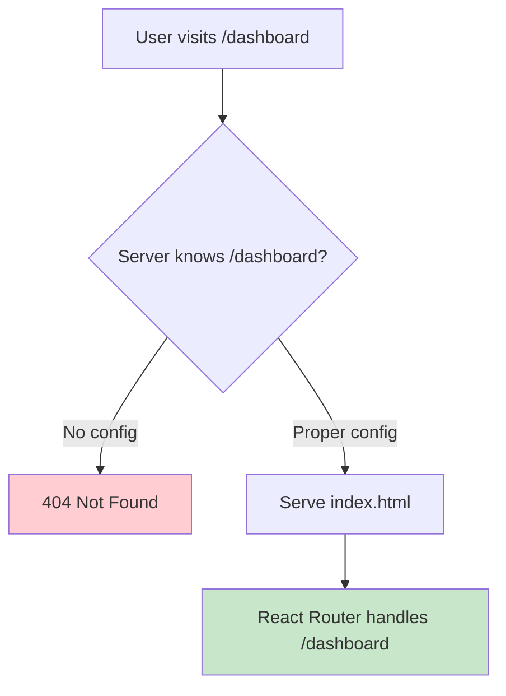

# How to Configure React Router with Nginx

Author: [nawazdhandala](https://github.com/nawazdhandala)

Tags: Nginx, React, React Router, SPA, Frontend, DevOps

Description: Learn how to configure Nginx to properly serve React applications with client-side routing, including handling direct URL access, 404 pages, API proxying, and production deployment strategies.

---

Single Page Applications (SPAs) like React use client-side routing where the JavaScript handles URL changes without making server requests. When users access URLs directly or refresh the page, Nginx must serve the React app's index.html for all routes, allowing React Router to handle the routing.

## The Problem



Without proper configuration, accessing `example.com/dashboard` directly returns a 404 because Nginx looks for a file named `dashboard` which does not exist.

## Basic Configuration

### The Essential try_files Directive

```nginx
server {
    listen 80;
    server_name example.com;

    root /var/www/react-app/build;
    index index.html;

    location / {
        try_files $uri $uri/ /index.html;
    }
}
```

This configuration tells Nginx to:
1. Try to serve the exact file requested (`$uri`)
2. Try to serve it as a directory (`$uri/`)
3. Fall back to `/index.html` for React Router to handle

## Production Configuration

### Complete Nginx Configuration

```nginx
server {
    listen 80;
    server_name example.com;

    # Redirect HTTP to HTTPS
    return 301 https://$host$request_uri;
}

server {
    listen 443 ssl http2;
    server_name example.com;

    # SSL Configuration
    ssl_certificate /etc/letsencrypt/live/example.com/fullchain.pem;
    ssl_certificate_key /etc/letsencrypt/live/example.com/privkey.pem;

    root /var/www/react-app/build;
    index index.html;

    # Security headers
    add_header X-Frame-Options "SAMEORIGIN" always;
    add_header X-Content-Type-Options "nosniff" always;
    add_header X-XSS-Protection "1; mode=block" always;

    # Gzip compression
    gzip on;
    gzip_vary on;
    gzip_min_length 1024;
    gzip_proxied expired no-cache no-store private auth;
    gzip_types text/plain text/css text/xml text/javascript application/x-javascript application/xml application/javascript application/json;

    # Static files with cache headers
    location /static/ {
        expires 1y;
        add_header Cache-Control "public, immutable";
    }

    # JavaScript and CSS files (with hash in filename)
    location ~* \.(?:css|js)$ {
        expires 1y;
        add_header Cache-Control "public, immutable";
    }

    # Images, fonts, and other assets
    location ~* \.(?:jpg|jpeg|png|gif|ico|svg|woff|woff2|ttf|eot)$ {
        expires 1y;
        add_header Cache-Control "public, immutable";
    }

    # Service worker - must not be cached
    location = /service-worker.js {
        expires off;
        add_header Cache-Control "no-cache, no-store, must-revalidate";
    }

    # Manifest file
    location = /manifest.json {
        expires 1d;
        add_header Cache-Control "public";
    }

    # Main location - React Router
    location / {
        try_files $uri $uri/ /index.html;

        # Don't cache index.html
        location = /index.html {
            expires -1;
            add_header Cache-Control "no-cache, no-store, must-revalidate";
        }
    }
}
```

## Handling API Requests

### Proxy API to Backend Server

```nginx
server {
    listen 80;
    server_name example.com;

    root /var/www/react-app/build;
    index index.html;

    # API requests - proxy to backend
    location /api/ {
        proxy_pass http://localhost:3001/;
        proxy_http_version 1.1;
        proxy_set_header Upgrade $http_upgrade;
        proxy_set_header Connection 'upgrade';
        proxy_set_header Host $host;
        proxy_set_header X-Real-IP $remote_addr;
        proxy_set_header X-Forwarded-For $proxy_add_x_forwarded_for;
        proxy_set_header X-Forwarded-Proto $scheme;
        proxy_cache_bypass $http_upgrade;
    }

    # GraphQL endpoint
    location /graphql {
        proxy_pass http://localhost:3001/graphql;
        proxy_http_version 1.1;
        proxy_set_header Host $host;
        proxy_set_header X-Real-IP $remote_addr;
    }

    # WebSocket support
    location /ws {
        proxy_pass http://localhost:3001;
        proxy_http_version 1.1;
        proxy_set_header Upgrade $http_upgrade;
        proxy_set_header Connection "upgrade";
        proxy_set_header Host $host;
        proxy_read_timeout 86400;
    }

    # React app - catch all
    location / {
        try_files $uri $uri/ /index.html;
    }
}
```

## Multiple React Apps (Micro-frontends)

### Serving Different Apps on Different Paths

```nginx
server {
    listen 80;
    server_name example.com;

    # Main app
    location / {
        alias /var/www/main-app/build/;
        try_files $uri $uri/ /index.html;
    }

    # Admin app
    location /admin {
        alias /var/www/admin-app/build/;
        try_files $uri $uri/ /admin/index.html;
    }

    # Dashboard app
    location /dashboard {
        alias /var/www/dashboard-app/build/;
        try_files $uri $uri/ /dashboard/index.html;
    }

    # API
    location /api/ {
        proxy_pass http://localhost:3001/;
    }
}
```

### Important: Set basename in React Router

When your app is not at the root path:

```jsx
// For /admin path
import { BrowserRouter } from 'react-router-dom';

function App() {
    return (
        <BrowserRouter basename="/admin">
            {/* Routes */}
        </BrowserRouter>
    );
}
```

## Custom 404 Page

### React Router 404 with Nginx Fallback

```nginx
server {
    listen 80;
    server_name example.com;

    root /var/www/react-app/build;
    index index.html;

    # For SPA routes - serve index.html
    location / {
        try_files $uri $uri/ /index.html;
    }

    # Custom 404 page for truly missing files
    error_page 404 /404.html;
    location = /404.html {
        internal;
    }
}
```

In your React app, handle 404 routes:

```jsx
import { Routes, Route } from 'react-router-dom';

function App() {
    return (
        <Routes>
            <Route path="/" element={<Home />} />
            <Route path="/about" element={<About />} />
            <Route path="/dashboard" element={<Dashboard />} />
            <Route path="*" element={<NotFound />} />
        </Routes>
    );
}
```

## Docker Deployment

### Dockerfile

```dockerfile
# Build stage
FROM node:20-alpine AS build
WORKDIR /app
COPY package*.json ./
RUN npm ci
COPY . .
RUN npm run build

# Production stage
FROM nginx:alpine
COPY --from=build /app/build /usr/share/nginx/html
COPY nginx.conf /etc/nginx/conf.d/default.conf
EXPOSE 80
CMD ["nginx", "-g", "daemon off;"]
```

### nginx.conf for Docker

```nginx
server {
    listen 80;
    server_name _;

    root /usr/share/nginx/html;
    index index.html;

    # Gzip
    gzip on;
    gzip_types text/plain text/css text/xml text/javascript application/javascript application/json;

    # Static assets
    location /static/ {
        expires 1y;
        add_header Cache-Control "public, immutable";
    }

    # React Router
    location / {
        try_files $uri $uri/ /index.html;
    }
}
```

### docker-compose.yml

```yaml
version: '3.8'

services:
  frontend:
    build: .
    ports:
      - "80:80"
    environment:
      - REACT_APP_API_URL=http://api:3001

  api:
    build: ./backend
    expose:
      - "3001"
    environment:
      - DATABASE_URL=postgres://user:pass@db/myapp

  db:
    image: postgres:15
    volumes:
      - postgres_data:/var/lib/postgresql/data

volumes:
  postgres_data:
```

## Environment-Specific Configuration

### Using Runtime Environment Variables

Create a config that reads from window:

```javascript
// public/config.js (served by Nginx)
window.RUNTIME_CONFIG = {
    API_URL: '__API_URL__',
    FEATURE_FLAGS: '__FEATURE_FLAGS__'
};
```

### Nginx Configuration with Environment Substitution

```nginx
server {
    listen 80;
    server_name _;

    root /usr/share/nginx/html;
    index index.html;

    # Substitute environment variables in config.js
    location = /config.js {
        sub_filter '__API_URL__' '${API_URL}';
        sub_filter '__FEATURE_FLAGS__' '${FEATURE_FLAGS}';
        sub_filter_once off;
        sub_filter_types application/javascript;
    }

    location / {
        try_files $uri $uri/ /index.html;
    }
}
```

### Docker entrypoint for environment substitution

```bash
#!/bin/sh
# entrypoint.sh

# Substitute environment variables in config.js
envsubst < /usr/share/nginx/html/config.js.template > /usr/share/nginx/html/config.js

# Start nginx
nginx -g 'daemon off;'
```

## Handling Query Parameters and Hash

### Preserve Query Parameters

```nginx
location / {
    try_files $uri $uri/ /index.html?$query_string;
}
```

### Handle Hash-based Routing (older React Router)

Hash-based routing (`example.com/#/dashboard`) works without special Nginx configuration since the hash is never sent to the server.

## Performance Optimization

### Brotli Compression (if available)

```nginx
server {
    listen 80;
    server_name example.com;

    root /var/www/react-app/build;

    # Brotli (requires ngx_brotli module)
    brotli on;
    brotli_comp_level 6;
    brotli_types text/plain text/css text/xml text/javascript application/javascript application/json application/xml;

    # Fallback to gzip
    gzip on;
    gzip_types text/plain text/css text/xml text/javascript application/javascript application/json;

    location / {
        try_files $uri $uri/ /index.html;
    }
}
```

### Pre-compressed Files

If you pre-compress files during build:

```nginx
server {
    listen 80;
    server_name example.com;

    root /var/www/react-app/build;

    # Serve pre-compressed files
    gzip_static on;
    brotli_static on;

    location / {
        try_files $uri $uri/ /index.html;
    }
}
```

## Testing Configuration

### Verify Routes Work

```bash
# Test root
curl -I http://example.com/

# Test React route
curl -I http://example.com/dashboard

# Test nested route
curl -I http://example.com/users/123/profile

# All should return 200 and serve index.html
```

### Check Content-Type

```bash
curl -I http://example.com/dashboard | grep content-type
# Should be: text/html
```

### Verify API Proxy

```bash
# API request should go to backend
curl http://example.com/api/users

# React route should serve index.html
curl http://example.com/users
```

## Common Issues

### Issue: 404 on Page Refresh

**Cause**: Missing `try_files` directive
**Fix**: Add `try_files $uri $uri/ /index.html;`

### Issue: Blank Page

**Cause**: Wrong `root` path or `homepage` in package.json
**Fix**: Verify paths and set correct `basename` in BrowserRouter

### Issue: API Requests Going to React

**Cause**: Location order matters - API location should come before catch-all
**Fix**: Put specific locations (`/api/`) before generic ones (`/`)

## Summary

| Requirement | Configuration |
|-------------|---------------|
| Client-side routing | `try_files $uri $uri/ /index.html` |
| Static asset caching | `expires 1y; add_header Cache-Control "public, immutable"` |
| No cache for index.html | `expires -1; add_header Cache-Control "no-cache"` |
| API proxy | `location /api/ { proxy_pass http://backend; }` |
| Sub-path deployment | Use `alias` and set `basename` in React Router |
| Compression | Enable `gzip` and optionally `brotli` |

The key to serving React applications with Nginx is the `try_files` directive that falls back to `index.html`, allowing React Router to handle client-side routing while Nginx efficiently serves static assets with proper caching headers.
