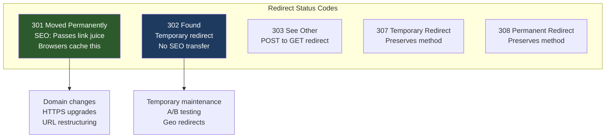
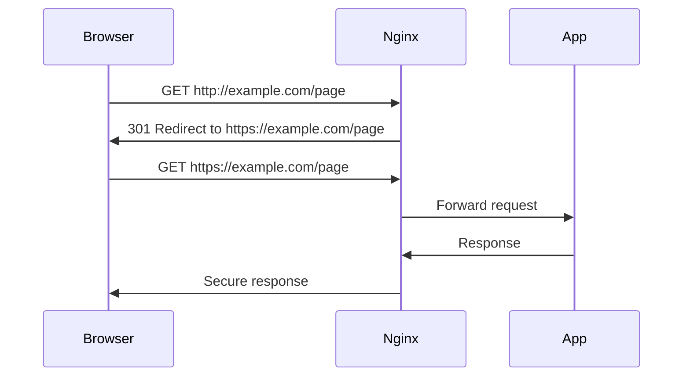

# How to Redirect URLs Properly in Nginx

Author: [nawazdhandala](https://www.github.com/nawazdhandala)

Tags: Nginx, Redirects, URL Rewriting, SEO, Web Server, DevOps

Description: Learn how to configure URL redirects in Nginx properly, including 301 vs 302 redirects, HTTP to HTTPS, www to non-www, trailing slashes, and complex redirect patterns.

---

URL redirects are essential for maintaining SEO, handling domain changes, and creating clean URL structures. Nginx provides powerful redirect capabilities, but incorrect configuration can lead to redirect loops, SEO issues, or broken links. This guide covers all common redirect scenarios with proper implementations.

## Understanding Redirect Types



## Basic Redirect Syntax

### Using return Directive

```nginx
# Simple 301 redirect
location /old-page {
    return 301 /new-page;
}

# 302 temporary redirect
location /promo {
    return 302 /current-sale;
}

# Redirect with full URL
location /external {
    return 301 https://example.com/page;
}
```

### Using rewrite Directive

```nginx
# Rewrite with permanent flag (301)
rewrite ^/old-url$ /new-url permanent;

# Rewrite with redirect flag (302)
rewrite ^/temp-url$ /destination redirect;

# Rewrite with last flag (internal rewrite, no redirect)
rewrite ^/alias$ /actual-path last;
```

## Common Redirect Scenarios

### HTTP to HTTPS Redirect

```nginx
# Method 1: Separate server block (recommended)
server {
    listen 80;
    listen [::]:80;
    server_name example.com www.example.com;

    # Redirect all HTTP to HTTPS
    return 301 https://$host$request_uri;
}

server {
    listen 443 ssl http2;
    listen [::]:443 ssl http2;
    server_name example.com www.example.com;

    ssl_certificate /etc/letsencrypt/live/example.com/fullchain.pem;
    ssl_certificate_key /etc/letsencrypt/live/example.com/privkey.pem;

    # ... rest of config
}
```



### WWW to Non-WWW Redirect

```nginx
# Redirect www to non-www
server {
    listen 80;
    listen 443 ssl http2;
    server_name www.example.com;

    ssl_certificate /etc/letsencrypt/live/example.com/fullchain.pem;
    ssl_certificate_key /etc/letsencrypt/live/example.com/privkey.pem;

    return 301 https://example.com$request_uri;
}

# Main server block
server {
    listen 443 ssl http2;
    server_name example.com;

    # ... rest of config
}
```

### Non-WWW to WWW Redirect

```nginx
# Redirect non-www to www
server {
    listen 80;
    listen 443 ssl http2;
    server_name example.com;

    ssl_certificate /etc/letsencrypt/live/example.com/fullchain.pem;
    ssl_certificate_key /etc/letsencrypt/live/example.com/privkey.pem;

    return 301 https://www.example.com$request_uri;
}

server {
    listen 443 ssl http2;
    server_name www.example.com;

    # ... rest of config
}
```

### Combined HTTP/HTTPS and WWW/Non-WWW

```nginx
# Handle all variations - redirect to https://example.com
server {
    listen 80;
    listen [::]:80;
    server_name example.com www.example.com;
    return 301 https://example.com$request_uri;
}

server {
    listen 443 ssl http2;
    listen [::]:443 ssl http2;
    server_name www.example.com;

    ssl_certificate /etc/letsencrypt/live/example.com/fullchain.pem;
    ssl_certificate_key /etc/letsencrypt/live/example.com/privkey.pem;

    return 301 https://example.com$request_uri;
}

server {
    listen 443 ssl http2;
    listen [::]:443 ssl http2;
    server_name example.com;

    ssl_certificate /etc/letsencrypt/live/example.com/fullchain.pem;
    ssl_certificate_key /etc/letsencrypt/live/example.com/privkey.pem;

    root /var/www/example.com;
    # ... rest of config
}
```

### Trailing Slash Handling

```nginx
# Add trailing slash (except for files)
server {
    listen 443 ssl http2;
    server_name example.com;

    # Add trailing slash if missing and not a file
    location ~ ^([^.\?]*[^/])$ {
        return 301 $uri/;
    }

    location / {
        try_files $uri $uri/ /index.html;
    }
}

# Remove trailing slash
server {
    listen 443 ssl http2;
    server_name example.com;

    # Remove trailing slash except for root
    rewrite ^/(.*)/$ /$1 permanent;

    location / {
        try_files $uri $uri.html =404;
    }
}
```

## Pattern-Based Redirects

### Regex Redirects

```nginx
# Redirect old blog URLs to new format
# /blog/2023/12/my-post -> /posts/my-post
rewrite ^/blog/\d{4}/\d{2}/(.*)$ /posts/$1 permanent;

# Redirect category pages
# /category/tech -> /topics/tech
rewrite ^/category/(.*)$ /topics/$1 permanent;

# Redirect with query string preservation
location /search {
    return 301 /find$is_args$args;
}
```

### Map-Based Redirects

For many redirects, use a map for better performance:

```nginx
# Define redirect map
map $request_uri $redirect_uri {
    default "";
    /old-page-1     /new-page-1;
    /old-page-2     /new-page-2;
    /products/old   /shop/new;
    ~^/legacy/(.*)$ /modern/$1;
}

server {
    listen 443 ssl http2;
    server_name example.com;

    # Apply redirects from map
    if ($redirect_uri != "") {
        return 301 $redirect_uri;
    }

    # ... rest of config
}
```

### Bulk Redirects from File

```nginx
# Include redirect rules from external file
include /etc/nginx/redirects.conf;

# redirects.conf
rewrite ^/page1$ /new-page1 permanent;
rewrite ^/page2$ /new-page2 permanent;
rewrite ^/page3$ /new-page3 permanent;
# ... hundreds more
```

## Advanced Redirect Patterns

### Query String Redirects

```nginx
# Redirect based on query parameter
# /search?q=term -> /find?query=term
location /search {
    if ($arg_q) {
        return 301 /find?query=$arg_q;
    }
    return 301 /find;
}

# Remove specific query parameters
location /page {
    if ($args ~ (.*)utm_[^&]*(.*)) {
        set $args $1$2;
        set $args $args;
        rewrite ^(.*)$ $1? permanent;
    }
}

# Redirect and preserve all query parameters
location /old-api {
    return 301 /new-api$is_args$args;
}
```

### Conditional Redirects

```nginx
# Redirect mobile users
map $http_user_agent $is_mobile {
    default 0;
    "~*mobile|android|iphone|ipad" 1;
}

server {
    listen 443 ssl http2;
    server_name example.com;

    location / {
        if ($is_mobile) {
            return 302 https://m.example.com$request_uri;
        }
        try_files $uri $uri/ =404;
    }
}

# Redirect by country (requires GeoIP module)
location / {
    if ($geoip_country_code = "DE") {
        return 302 https://de.example.com$request_uri;
    }
}
```

### Domain Migration

```nginx
# Redirect entire old domain to new domain
server {
    listen 80;
    listen 443 ssl http2;
    server_name old-domain.com www.old-domain.com;

    ssl_certificate /etc/letsencrypt/live/old-domain.com/fullchain.pem;
    ssl_certificate_key /etc/letsencrypt/live/old-domain.com/privkey.pem;

    # Preserve the path and query string
    return 301 https://new-domain.com$request_uri;
}

# Map old paths to new paths during migration
map $request_uri $new_uri {
    default $request_uri;
    /about-us /company/about;
    /contact /support/contact;
    /products /shop;
}

server {
    listen 443 ssl http2;
    server_name old-domain.com;

    location / {
        return 301 https://new-domain.com$new_uri;
    }
}
```

## Avoiding Common Mistakes

### Mistake 1: Redirect Loops

```nginx
# Wrong - creates infinite loop
server {
    listen 80;
    server_name example.com;

    location / {
        return 301 https://example.com$request_uri;
    }
}

server {
    listen 443 ssl;
    server_name example.com;

    location / {
        return 301 https://example.com$request_uri;  # Loop!
    }
}

# Correct - only redirect in HTTP block
server {
    listen 80;
    server_name example.com;
    return 301 https://example.com$request_uri;
}

server {
    listen 443 ssl;
    server_name example.com;
    # No redirect here
    root /var/www/html;
}
```


### Mistake 2: Using rewrite Instead of return

```nginx
# Less efficient - uses regex
rewrite ^ https://example.com$request_uri permanent;

# More efficient - no regex processing
return 301 https://example.com$request_uri;
```

### Mistake 3: Missing Query String

```nginx
# Wrong - loses query string
location /search {
    return 301 /find;
}

# Correct - preserves query string
location /search {
    return 301 /find$is_args$args;
}
```

### Mistake 4: Incorrect Regex Escaping

```nginx
# Wrong - . matches any character
rewrite ^/file.txt$ /document.txt permanent;

# Correct - escape the dot
rewrite ^/file\.txt$ /document\.txt permanent;
```

## Testing Redirects

### Using curl

```bash
# Test redirect (follow redirects)
curl -L https://example.com/old-page

# Show redirect chain
curl -sIL https://example.com/old-page | grep -E "HTTP/|Location:"

# Test specific redirect
curl -I http://example.com/old-page
# HTTP/1.1 301 Moved Permanently
# Location: https://example.com/new-page
```

### Redirect Testing Script

```bash
#!/bin/bash
# test_redirects.sh - Test redirect configurations

declare -A REDIRECTS=(
    ["http://example.com"]="https://example.com/"
    ["http://www.example.com"]="https://example.com/"
    ["https://www.example.com"]="https://example.com/"
    ["https://example.com/old-page"]="https://example.com/new-page"
)

echo "=== Redirect Tests ==="

for source in "${!REDIRECTS[@]}"; do
    expected="${REDIRECTS[$source]}"
    actual=$(curl -sI "$source" | grep -i "^Location:" | awk '{print $2}' | tr -d '\r')

    if [ "$actual" = "$expected" ]; then
        echo "[PASS] $source -> $expected"
    else
        echo "[FAIL] $source"
        echo "  Expected: $expected"
        echo "  Got: $actual"
    fi
done
```

## Complete Configuration Example

```nginx
# /etc/nginx/conf.d/redirects.conf

# Define redirect mappings
map $request_uri $redirect_uri {
    default "";

    # Exact matches
    /old-about      /company/about;
    /old-contact    /support;

    # Pattern matches
    ~^/blog/(\d{4})/(\d{2})/(.*)$    /posts/$3;
    ~^/category/(.*)$                /topics/$1;
}

# HTTP to HTTPS redirect
server {
    listen 80;
    listen [::]:80;
    server_name example.com www.example.com;
    return 301 https://example.com$request_uri;
}

# WWW to non-WWW redirect (HTTPS)
server {
    listen 443 ssl http2;
    listen [::]:443 ssl http2;
    server_name www.example.com;

    ssl_certificate /etc/letsencrypt/live/example.com/fullchain.pem;
    ssl_certificate_key /etc/letsencrypt/live/example.com/privkey.pem;

    return 301 https://example.com$request_uri;
}

# Main server block
server {
    listen 443 ssl http2;
    listen [::]:443 ssl http2;
    server_name example.com;

    ssl_certificate /etc/letsencrypt/live/example.com/fullchain.pem;
    ssl_certificate_key /etc/letsencrypt/live/example.com/privkey.pem;

    root /var/www/example.com;
    index index.html;

    # Apply map-based redirects
    if ($redirect_uri != "") {
        return 301 $redirect_uri;
    }

    # Add trailing slash for directories
    location ~ ^([^.]*[^/])$ {
        if (-d $document_root$uri) {
            return 301 $uri/;
        }
    }

    # Main location
    location / {
        try_files $uri $uri/ =404;
    }
}
```

## Summary

Proper URL redirects in Nginx require understanding:

1. **Use 301 for permanent redirects** - domain changes, HTTPS upgrades, URL restructuring
2. **Use 302 for temporary redirects** - maintenance, testing, temporary promotions
3. **Prefer `return` over `rewrite`** for simple redirects (better performance)
4. **Preserve query strings** with `$is_args$args`
5. **Use maps** for bulk redirects
6. **Test thoroughly** to avoid redirect loops

By following these patterns, you can implement clean, efficient, and SEO-friendly redirects in your Nginx configuration.
