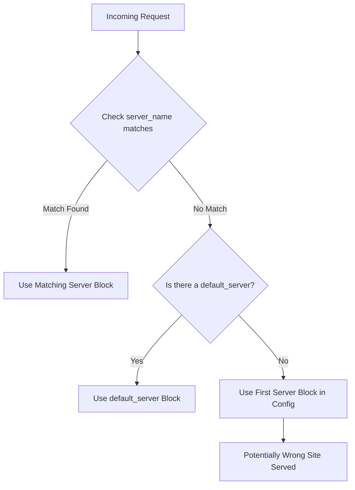

# How to Fix 'Why is Nginx Responding to Any Domain Name'

Author: [nawazdhandala](https://github.com/nawazdhandala)

Tags: Nginx, Web Server, DNS, Configuration, Security

Description: Learn why Nginx responds to any domain name and how to configure a proper default server block to control which domains your server accepts, improving security and preventing unwanted traffic.

---

When you point a new domain to your Nginx server and it suddenly serves your website without any configuration, it can be confusing and concerning. This behavior happens because of how Nginx selects server blocks to handle requests. Understanding and controlling this is essential for security and proper traffic management.

## Why This Happens

Nginx uses server blocks (similar to Apache's virtual hosts) to determine how to handle incoming requests. When a request arrives, Nginx matches it against the `server_name` directives. If no match is found, Nginx uses the default server - which might be serving your content unintentionally.



## The Problem Configuration

Here's a typical configuration that causes this issue:

```nginx
# /etc/nginx/sites-enabled/mysite.conf
server {
    listen 80;
    server_name mysite.com www.mysite.com;

    root /var/www/mysite;
    index index.html;

    location / {
        try_files $uri $uri/ =404;
    }
}
```

With this configuration, if someone points `random-domain.com` to your server's IP, Nginx will serve your site because there's no explicit default server defined.

## Solution 1: Create a Default Catch-All Server Block

The best practice is to create an explicit default server that rejects or redirects unknown domains:

```nginx
# /etc/nginx/sites-enabled/00-default.conf
# This file is named with 00- to ensure it loads first

server {
    listen 80 default_server;
    listen [::]:80 default_server;

    server_name _;

    # Return 444 - Nginx specific: close connection without response
    return 444;
}

server {
    listen 443 ssl default_server;
    listen [::]:443 ssl default_server;

    server_name _;

    # Self-signed certificate for rejecting unknown domains
    ssl_certificate /etc/nginx/ssl/default.crt;
    ssl_certificate_key /etc/nginx/ssl/default.key;

    return 444;
}
```

The `server_name _;` is a catch-all that matches any hostname. The underscore is not special - it's just a value that will never match a real hostname.

## Solution 2: Return a Proper Error Response

Instead of silently closing the connection, you might want to return a proper HTTP error:

```nginx
server {
    listen 80 default_server;
    listen [::]:80 default_server;

    server_name _;

    # Return 403 Forbidden
    return 403 "Access Denied: Unknown Host";
}
```

Or redirect to your main domain:

```nginx
server {
    listen 80 default_server;
    listen [::]:80 default_server;

    server_name _;

    # Redirect all unknown domains to your main site
    return 301 https://mysite.com$request_uri;
}
```

## Solution 3: Explicitly Define Your Server Blocks

Make sure every server block explicitly states which domains it handles:

```nginx
# /etc/nginx/sites-enabled/mysite.conf
server {
    listen 80;
    server_name mysite.com www.mysite.com;

    # Only respond to these exact domains
    if ($host !~* ^(mysite\.com|www\.mysite\.com)$) {
        return 444;
    }

    root /var/www/mysite;
    index index.html;

    location / {
        try_files $uri $uri/ =404;
    }
}
```

## Generating a Self-Signed Certificate for Default HTTPS

For the HTTPS default server, you need a certificate:

```bash
# Create SSL directory
sudo mkdir -p /etc/nginx/ssl

# Generate self-signed certificate
sudo openssl req -x509 -nodes -days 3650 \
    -newkey rsa:2048 \
    -keyout /etc/nginx/ssl/default.key \
    -out /etc/nginx/ssl/default.crt \
    -subj "/CN=default/O=Default/C=US"

# Set proper permissions
sudo chmod 600 /etc/nginx/ssl/default.key
sudo chmod 644 /etc/nginx/ssl/default.crt
```

## Complete Configuration Example

Here's a complete setup with proper default handling:

```nginx
# /etc/nginx/sites-enabled/00-default.conf
# Default server block - catches all unmatched requests

# HTTP default
server {
    listen 80 default_server;
    listen [::]:80 default_server;

    server_name _;

    # Log these requests separately for monitoring
    access_log /var/log/nginx/default.access.log;
    error_log /var/log/nginx/default.error.log;

    # Option 1: Close connection silently
    return 444;

    # Option 2: Return error page
    # return 403;

    # Option 3: Redirect to main site
    # return 301 https://mysite.com$request_uri;
}

# HTTPS default
server {
    listen 443 ssl default_server;
    listen [::]:443 ssl default_server;

    server_name _;

    ssl_certificate /etc/nginx/ssl/default.crt;
    ssl_certificate_key /etc/nginx/ssl/default.key;

    # Minimal SSL config for default block
    ssl_protocols TLSv1.2 TLSv1.3;

    access_log /var/log/nginx/default-ssl.access.log;
    error_log /var/log/nginx/default-ssl.error.log;

    return 444;
}

# /etc/nginx/sites-enabled/mysite.conf
# Your actual site configuration

server {
    listen 80;
    server_name mysite.com www.mysite.com;
    return 301 https://$server_name$request_uri;
}

server {
    listen 443 ssl http2;
    server_name mysite.com www.mysite.com;

    ssl_certificate /etc/letsencrypt/live/mysite.com/fullchain.pem;
    ssl_certificate_key /etc/letsencrypt/live/mysite.com/privkey.pem;

    root /var/www/mysite;
    index index.html;

    location / {
        try_files $uri $uri/ =404;
    }
}
```

## Verifying Your Configuration

Test that your default server is working correctly:

```bash
# Test configuration syntax
sudo nginx -t

# Reload Nginx
sudo systemctl reload nginx

# Test with a fake host header
curl -H "Host: random-domain.com" http://your-server-ip/
# Should return nothing (444) or error

# Test with correct host header
curl -H "Host: mysite.com" http://your-server-ip/
# Should return your site content
```

## Monitoring Unknown Domain Requests

Add custom logging to track attempts to access your server with unknown domains:

```nginx
# Define custom log format
log_format unknown_host '$remote_addr - [$time_local] '
                        '"$host" "$request" $status '
                        '"$http_referer" "$http_user_agent"';

server {
    listen 80 default_server;
    server_name _;

    access_log /var/log/nginx/unknown-hosts.log unknown_host;

    return 444;
}
```

Then monitor with:

```bash
# Watch unknown host attempts in real-time
tail -f /var/log/nginx/unknown-hosts.log

# Count attempts by host
awk '{print $4}' /var/log/nginx/unknown-hosts.log | sort | uniq -c | sort -rn
```

## Security Considerations

| Risk | Without Default Server | With Default Server |
|------|----------------------|---------------------|
| Domain hijacking | Possible | Prevented |
| SEO manipulation | Site indexed under wrong domains | Only correct domains indexed |
| Certificate errors | May expose valid certs | Uses dummy cert |
| Information leakage | Site content exposed | No content served |
| Resource usage | Full requests processed | Connection dropped immediately |

## Common Mistakes to Avoid

1. **Not defining a default server for both HTTP and HTTPS**
2. **Using the same certificate for default and real sites**
3. **Forgetting to place the default config file first alphabetically**
4. **Using `return 404` instead of `return 444`** - 404 still sends headers and body
5. **Not testing with raw IP address access**

## Summary

Nginx's default server selection can inadvertently serve your content to any domain pointed at your IP. By creating an explicit default server block that catches all unmatched requests and either drops the connection or returns an error, you maintain control over which domains your server responds to. This simple configuration change significantly improves your server's security posture and prevents various forms of abuse.
