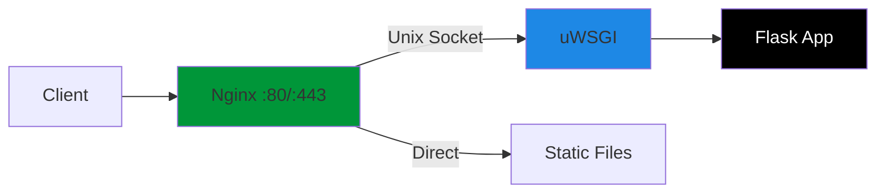

# How to Configure Nginx as Reverse Proxy for Flask/uWSGI

Author: [nawazdhandala](https://github.com/nawazdhandala)

Tags: Nginx, Flask, uWSGI, Python, Reverse Proxy, DevOps

Description: Learn how to set up Nginx as a reverse proxy for Flask applications using uWSGI, including socket configuration, performance tuning, and production deployment best practices.

---

Flask's built-in development server is not designed for production use. For production deployments, you need an application server like uWSGI to run your Flask application and a reverse proxy like Nginx to handle incoming connections, serve static files, and provide SSL termination.

## Architecture Overview



## Setting Up the Flask Application

### Project Structure

```
/var/www/myapp/
├── app/
│   ├── __init__.py
│   ├── routes.py
│   └── models.py
├── static/
│   ├── css/
│   └── js/
├── templates/
├── venv/
├── wsgi.py
├── uwsgi.ini
└── requirements.txt
```

### wsgi.py

```python
from app import create_app

application = create_app()

if __name__ == "__main__":
    application.run()
```

### app/__init__.py

```python
from flask import Flask

def create_app():
    app = Flask(__name__)
    app.config['SECRET_KEY'] = 'your-secret-key'

    from app.routes import main
    app.register_blueprint(main)

    return app
```

## Configuring uWSGI

### Installing uWSGI

```bash
# Create virtual environment
python3 -m venv /var/www/myapp/venv
source /var/www/myapp/venv/bin/activate

# Install dependencies
pip install flask uwsgi
```

### uwsgi.ini Configuration

```ini
[uwsgi]
# Application settings
module = wsgi:application
master = true
processes = 4
threads = 2

# Socket configuration (Unix socket recommended for same-server setup)
socket = /var/www/myapp/myapp.sock
chmod-socket = 660
vacuum = true

# Process management
die-on-term = true
harakiri = 60
harakiri-verbose = true

# Logging
logto = /var/log/uwsgi/myapp.log
log-maxsize = 10485760
log-backupname = /var/log/uwsgi/myapp.log.bak

# Memory management
reload-on-rss = 200
worker-reload-mercy = 60

# Performance tuning
lazy-apps = true
single-interpreter = true
enable-threads = true
thunder-lock = true

# Buffer settings
buffer-size = 65535
post-buffering = 65535

# Stats (optional, for monitoring)
stats = /var/www/myapp/uwsgi-stats.sock
```

### Alternative: TCP Socket Configuration

If Nginx and uWSGI are on different servers:

```ini
[uwsgi]
module = wsgi:application
master = true
processes = 4
threads = 2

# TCP socket instead of Unix socket
socket = 127.0.0.1:8000

# Or bind to all interfaces (for remote Nginx)
# socket = 0.0.0.0:8000

die-on-term = true
harakiri = 60
```

## Configuring Nginx

### Basic Nginx Configuration

```nginx
upstream flask_app {
    server unix:/var/www/myapp/myapp.sock fail_timeout=0;
}

server {
    listen 80;
    server_name example.com www.example.com;

    # Redirect HTTP to HTTPS
    return 301 https://$server_name$request_uri;
}

server {
    listen 443 ssl http2;
    server_name example.com www.example.com;

    # SSL Configuration
    ssl_certificate /etc/letsencrypt/live/example.com/fullchain.pem;
    ssl_certificate_key /etc/letsencrypt/live/example.com/privkey.pem;
    ssl_session_timeout 1d;
    ssl_session_cache shared:SSL:50m;
    ssl_protocols TLSv1.2 TLSv1.3;
    ssl_ciphers ECDHE-ECDSA-AES128-GCM-SHA256:ECDHE-RSA-AES128-GCM-SHA256;
    ssl_prefer_server_ciphers off;

    # Security headers
    add_header X-Frame-Options "SAMEORIGIN" always;
    add_header X-Content-Type-Options "nosniff" always;
    add_header X-XSS-Protection "1; mode=block" always;

    # Logging
    access_log /var/log/nginx/myapp_access.log;
    error_log /var/log/nginx/myapp_error.log;

    # Max upload size
    client_max_body_size 10M;

    # Static files
    location /static {
        alias /var/www/myapp/static;
        expires 30d;
        add_header Cache-Control "public, immutable";
    }

    # Favicon
    location /favicon.ico {
        alias /var/www/myapp/static/favicon.ico;
        expires 30d;
        access_log off;
    }

    # Robots.txt
    location /robots.txt {
        alias /var/www/myapp/static/robots.txt;
        access_log off;
    }

    # Flask application
    location / {
        include uwsgi_params;
        uwsgi_pass flask_app;

        # Timeouts
        uwsgi_connect_timeout 30;
        uwsgi_read_timeout 60;
        uwsgi_send_timeout 60;

        # Headers
        uwsgi_param Host $host;
        uwsgi_param X-Real-IP $remote_addr;
        uwsgi_param X-Forwarded-For $proxy_add_x_forwarded_for;
        uwsgi_param X-Forwarded-Proto $scheme;
    }
}
```

### Load Balanced Configuration

For multiple uWSGI workers or servers:

```nginx
upstream flask_app {
    least_conn;

    server unix:/var/www/myapp/myapp1.sock weight=3;
    server unix:/var/www/myapp/myapp2.sock weight=2;
    server 192.168.1.10:8000 backup;

    keepalive 32;
}

server {
    listen 80;
    server_name example.com;

    location / {
        include uwsgi_params;
        uwsgi_pass flask_app;

        # Enable keepalive to upstream
        uwsgi_http_version 1.1;
        uwsgi_param Connection "";
    }
}
```

## Systemd Service Configuration

### /etc/systemd/system/myapp.service

```ini
[Unit]
Description=uWSGI instance to serve myapp
After=network.target

[Service]
User=www-data
Group=www-data
WorkingDirectory=/var/www/myapp
Environment="PATH=/var/www/myapp/venv/bin"
ExecStart=/var/www/myapp/venv/bin/uwsgi --ini uwsgi.ini
ExecReload=/bin/kill -s HUP $MAINPID
ExecStop=/bin/kill -s TERM $MAINPID
Restart=always
RestartSec=5
KillSignal=SIGQUIT
Type=notify
NotifyAccess=all
RuntimeDirectory=uwsgi
RuntimeDirectoryMode=0755

[Install]
WantedBy=multi-user.target
```

### Enable and Start Services

```bash
# Create log directory
sudo mkdir -p /var/log/uwsgi
sudo chown www-data:www-data /var/log/uwsgi

# Set permissions
sudo chown -R www-data:www-data /var/www/myapp
sudo chmod -R 755 /var/www/myapp

# Enable and start uWSGI
sudo systemctl daemon-reload
sudo systemctl enable myapp
sudo systemctl start myapp

# Enable and start Nginx
sudo systemctl enable nginx
sudo systemctl start nginx
```

## Docker Deployment

### Dockerfile

```dockerfile
FROM python:3.11-slim

WORKDIR /app

# Install dependencies
COPY requirements.txt .
RUN pip install --no-cache-dir -r requirements.txt

# Copy application
COPY . .

# Create non-root user
RUN useradd -m appuser && chown -R appuser:appuser /app
USER appuser

EXPOSE 8000

CMD ["uwsgi", "--ini", "uwsgi-docker.ini"]
```

### uwsgi-docker.ini

```ini
[uwsgi]
module = wsgi:application
master = true
processes = 4
threads = 2

# TCP socket for Docker
http-socket = 0.0.0.0:8000

die-on-term = true
harakiri = 60
buffer-size = 65535
```

### docker-compose.yml

```yaml
version: '3.8'

services:
  nginx:
    image: nginx:alpine
    ports:
      - "80:80"
      - "443:443"
    volumes:
      - ./nginx.conf:/etc/nginx/conf.d/default.conf:ro
      - ./static:/var/www/static:ro
      - ./ssl:/etc/nginx/ssl:ro
    depends_on:
      - flask
    restart: unless-stopped

  flask:
    build: .
    expose:
      - "8000"
    environment:
      - FLASK_ENV=production
      - DATABASE_URL=postgresql://user:pass@db/myapp
    volumes:
      - ./static:/app/static:ro
    restart: unless-stopped
    healthcheck:
      test: ["CMD", "curl", "-f", "http://localhost:8000/health"]
      interval: 30s
      timeout: 10s
      retries: 3

  db:
    image: postgres:15
    environment:
      - POSTGRES_USER=user
      - POSTGRES_PASSWORD=pass
      - POSTGRES_DB=myapp
    volumes:
      - postgres_data:/var/lib/postgresql/data

volumes:
  postgres_data:
```

### nginx.conf for Docker

```nginx
upstream flask {
    server flask:8000 fail_timeout=0;
}

server {
    listen 80;
    server_name _;

    client_max_body_size 10M;

    location /static {
        alias /var/www/static;
        expires 30d;
    }

    location / {
        proxy_pass http://flask;
        proxy_set_header Host $host;
        proxy_set_header X-Real-IP $remote_addr;
        proxy_set_header X-Forwarded-For $proxy_add_x_forwarded_for;
        proxy_set_header X-Forwarded-Proto $scheme;
        proxy_redirect off;
    }
}
```

## Performance Tuning

### Calculating uWSGI Workers

```python
# Rule of thumb:
# workers = (2 * CPU_CORES) + 1 for CPU-bound
# workers = (4 * CPU_CORES) for I/O-bound

# Example for 4 CPU cores, I/O-bound Flask app:
# processes = 16
# threads = 2
# Total concurrent requests: 32
```

### uwsgi.ini Optimized

```ini
[uwsgi]
module = wsgi:application
master = true
processes = 8
threads = 2
socket = /var/www/myapp/myapp.sock
chmod-socket = 660
vacuum = true
die-on-term = true

# Performance
harakiri = 60
max-requests = 5000
max-requests-delta = 500
listen = 1024
max-fd = 65535

# Memory
reload-on-rss = 300
evil-reload-on-rss = 400
cheaper-algo = spare
cheaper = 2
cheaper-initial = 4
cheaper-step = 1

# Caching
cache2 = name=mycache,items=1000,blocksize=65535
```

### Nginx Caching Configuration

```nginx
# Enable caching
proxy_cache_path /var/cache/nginx levels=1:2 keys_zone=flask_cache:10m max_size=1g inactive=60m;

server {
    # ... other configuration ...

    location / {
        include uwsgi_params;
        uwsgi_pass flask_app;

        # Cache configuration
        uwsgi_cache flask_cache;
        uwsgi_cache_valid 200 10m;
        uwsgi_cache_valid 404 1m;
        uwsgi_cache_key $scheme$request_method$host$request_uri;
        uwsgi_cache_use_stale error timeout http_500 http_502 http_503 http_504;

        # Add cache status header
        add_header X-Cache-Status $upstream_cache_status;
    }

    # Bypass cache for authenticated users
    location /api/ {
        include uwsgi_params;
        uwsgi_pass flask_app;
        uwsgi_no_cache $http_authorization;
        uwsgi_cache_bypass $http_authorization;
    }
}
```

## Troubleshooting

### Common Issues

1. **502 Bad Gateway**: Socket permissions issue
   ```bash
   # Check socket exists and has correct permissions
   ls -la /var/www/myapp/myapp.sock

   # Ensure www-data can access the socket
   sudo usermod -a -G www-data nginx
   ```

2. **504 Gateway Timeout**: Application taking too long
   ```nginx
   # Increase timeouts
   uwsgi_read_timeout 300;
   uwsgi_connect_timeout 60;
   ```

3. **Permission Denied**: Check file ownership
   ```bash
   sudo chown -R www-data:www-data /var/www/myapp
   ```

### Testing Configuration

```bash
# Test Nginx configuration
sudo nginx -t

# Test uWSGI configuration
uwsgi --ini uwsgi.ini --check-static /var/www/myapp

# Check uWSGI status
uwsgi --connect-and-read /var/www/myapp/uwsgi-stats.sock
```

## Summary

Setting up Nginx with Flask and uWSGI provides a production-ready deployment with excellent performance. Use Unix sockets for same-server deployments, configure appropriate worker counts based on your workload, and implement caching for frequently accessed content. Regular monitoring of both Nginx and uWSGI logs helps identify and resolve issues quickly.
