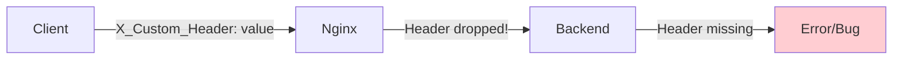

# How to Enable Underscores in HTTP Header Names in Nginx

Author: [nawazdhandala](https://github.com/nawazdhandala)

Tags: Nginx, HTTP Headers, Configuration, API, Troubleshooting

Description: Learn how to configure Nginx to accept HTTP headers with underscores in their names using the underscores_in_headers directive, including use cases, security considerations, and best practices.

---

By default, Nginx silently drops HTTP headers that contain underscores in their names. This behavior catches many developers off guard when integrating with APIs or legacy systems that use underscored headers. Understanding why this happens and how to enable underscore support is essential for proper Nginx configuration.

## The Problem



### Example of Dropped Headers

```bash
# This header gets silently dropped
curl -H "X_Custom_Header: test" http://example.com/api

# Backend receives nothing for X_Custom_Header
```

## Why Nginx Drops Underscore Headers

Nginx follows CGI specification recommendations where underscores in header names can cause ambiguity. CGI converts headers to environment variables by:

1. Converting to uppercase
2. Replacing hyphens with underscores
3. Adding `HTTP_` prefix

This means `X-Custom-Header` and `X_Custom_Header` would both become `HTTP_X_CUSTOM_HEADER`, causing conflicts.

## The Solution: underscores_in_headers

### Enable Globally (http context)

```nginx
http {
    underscores_in_headers on;

    server {
        listen 80;
        server_name example.com;
        # ...
    }
}
```

### Enable Per Server (server context)

```nginx
server {
    listen 80;
    server_name example.com;

    underscores_in_headers on;

    location / {
        proxy_pass http://backend;
    }
}
```

## Complete Configuration Examples

### Reverse Proxy with Underscore Headers

```nginx
upstream backend {
    server 127.0.0.1:8080;
}

server {
    listen 80;
    server_name api.example.com;

    # Enable underscore headers
    underscores_in_headers on;

    location / {
        proxy_pass http://backend;
        proxy_http_version 1.1;

        # Pass all headers to backend
        proxy_set_header Host $host;
        proxy_set_header X-Real-IP $remote_addr;
        proxy_set_header X-Forwarded-For $proxy_add_x_forwarded_for;
        proxy_set_header X-Forwarded-Proto $scheme;

        # Explicitly pass underscore headers
        proxy_set_header X_Custom_Header $http_x_custom_header;
        proxy_set_header X_Api_Key $http_x_api_key;
    }
}
```

### FastCGI with Underscore Headers

```nginx
server {
    listen 80;
    server_name example.com;
    root /var/www/html;

    underscores_in_headers on;

    location ~ \.php$ {
        include fastcgi_params;
        fastcgi_pass unix:/var/run/php/php8.2-fpm.sock;
        fastcgi_param SCRIPT_FILENAME $document_root$fastcgi_script_name;

        # Pass underscore headers to PHP
        fastcgi_param HTTP_X_CUSTOM_HEADER $http_x_custom_header;
    }
}
```

## Accessing Underscore Headers in Nginx

Even with `underscores_in_headers on`, you need to access them correctly.

### Using Variables

```nginx
server {
    listen 80;
    underscores_in_headers on;

    location / {
        # Access X_Custom_Header
        set $custom_header $http_x_custom_header;

        # Use in proxy headers
        proxy_set_header X-Custom-Header $http_x_custom_header;

        # Log the header
        access_log /var/log/nginx/access.log combined;

        proxy_pass http://backend;
    }
}
```

### Custom Log Format

```nginx
http {
    underscores_in_headers on;

    log_format custom '$remote_addr - [$time_local] '
                      '"$request" $status '
                      'X_Custom_Header: $http_x_custom_header';

    server {
        listen 80;
        access_log /var/log/nginx/access.log custom;

        location / {
            proxy_pass http://backend;
        }
    }
}
```

## Conditional Handling Based on Headers

```nginx
server {
    listen 80;
    underscores_in_headers on;

    # Map underscore header to variable
    set $api_version $http_x_api_version;

    location /api/ {
        # Route based on API version header
        if ($api_version = "v2") {
            proxy_pass http://backend-v2;
            break;
        }

        proxy_pass http://backend-v1;
    }
}
```

## Using map for Header Processing

```nginx
http {
    underscores_in_headers on;

    # Map underscore header values
    map $http_x_client_type $backend {
        default     backend-default;
        mobile      backend-mobile;
        desktop     backend-desktop;
        api         backend-api;
    }

    upstream backend-default {
        server 127.0.0.1:8080;
    }

    upstream backend-mobile {
        server 127.0.0.1:8081;
    }

    upstream backend-desktop {
        server 127.0.0.1:8082;
    }

    upstream backend-api {
        server 127.0.0.1:8083;
    }

    server {
        listen 80;

        location / {
            proxy_pass http://$backend;
        }
    }
}
```

## Security Considerations

Enabling underscore headers can introduce security risks if not handled properly.

### Risk: Header Injection

Some backends may not properly distinguish between `X-Custom-Header` and `X_Custom_Header`, potentially leading to security issues.

### Mitigation: Explicit Header Handling

```nginx
server {
    listen 80;
    underscores_in_headers on;

    location / {
        # Clear potentially conflicting headers
        proxy_set_header X-Custom-Header "";

        # Only pass specific underscore headers
        proxy_set_header X_Trusted_Header $http_x_trusted_header;

        # Block sensitive underscore headers
        if ($http_x_admin_override) {
            return 403;
        }

        proxy_pass http://backend;
    }
}
```

### Restrict to Specific Locations

```nginx
server {
    listen 80;
    # Don't enable globally

    # Public endpoints - no underscore headers
    location /public/ {
        proxy_pass http://public-backend;
    }

    # Legacy API - needs underscore headers
    location /legacy-api/ {
        underscores_in_headers on;
        proxy_pass http://legacy-backend;
    }
}
```

## Common Use Cases

### Legacy API Integration

```nginx
server {
    listen 80;
    server_name api.example.com;
    underscores_in_headers on;

    location /legacy/ {
        proxy_pass http://legacy-service;
        proxy_set_header X_API_KEY $http_x_api_key;
        proxy_set_header X_REQUEST_ID $http_x_request_id;
        proxy_set_header X_CORRELATION_ID $http_x_correlation_id;
    }
}
```

### AWS Load Balancer Headers

AWS Classic Load Balancers use some underscore headers.

```nginx
server {
    listen 80;
    underscores_in_headers on;

    # Get real client IP from AWS ELB
    set_real_ip_from 10.0.0.0/8;
    real_ip_header X-Forwarded-For;

    location / {
        proxy_pass http://backend;
        proxy_set_header Host $host;
        proxy_set_header X-Real-IP $remote_addr;
    }
}
```

### Custom Authentication Headers

```nginx
server {
    listen 80;
    underscores_in_headers on;

    location /api/ {
        # Validate custom auth header exists
        if ($http_x_auth_token = "") {
            return 401;
        }

        proxy_pass http://backend;
        proxy_set_header X-Auth-Token $http_x_auth_token;
    }
}
```

## Debugging Underscore Headers

### Test Header Reception

```nginx
server {
    listen 80;
    underscores_in_headers on;

    location /debug {
        return 200 "X_Custom_Header: $http_x_custom_header\n";
        add_header Content-Type text/plain;
    }
}
```

### Using curl to Test

```bash
# Test underscore header
curl -H "X_Custom_Header: test-value" http://example.com/debug

# Expected output with underscores_in_headers on:
# X_Custom_Header: test-value

# Without the directive:
# X_Custom_Header:
```

### Check Nginx Configuration

```bash
# Verify configuration is valid
sudo nginx -t

# Check if directive is set
sudo nginx -T | grep underscores_in_headers

# Reload after changes
sudo nginx -s reload
```

## Alternative: Convert Headers at Proxy Level

Instead of enabling underscore headers, convert them at the proxy level.

```nginx
server {
    listen 80;
    # Don't need underscores_in_headers

    location / {
        proxy_pass http://backend;

        # Convert hyphen headers to underscore for backend
        proxy_set_header X_Custom_Header $http_x_custom_header;

        # Or use a default if not provided
        set $custom_val $http_x_custom_header;
        if ($custom_val = "") {
            set $custom_val "default";
        }
        proxy_set_header X_Custom_Header $custom_val;
    }
}
```

## Summary

| Scenario | Solution |
|----------|----------|
| Need underscore headers | Add `underscores_in_headers on;` |
| Global setting | Place in `http` block |
| Per-server setting | Place in `server` block |
| Access in Nginx | Use `$http_x_header_name` |
| Security concern | Enable only where needed |
| Alternative | Convert at proxy level |

The `underscores_in_headers` directive is essential when working with legacy systems, certain cloud providers, or APIs that use underscore-based header names. Enable it judiciously and consider security implications when exposing underscore headers to backends.
