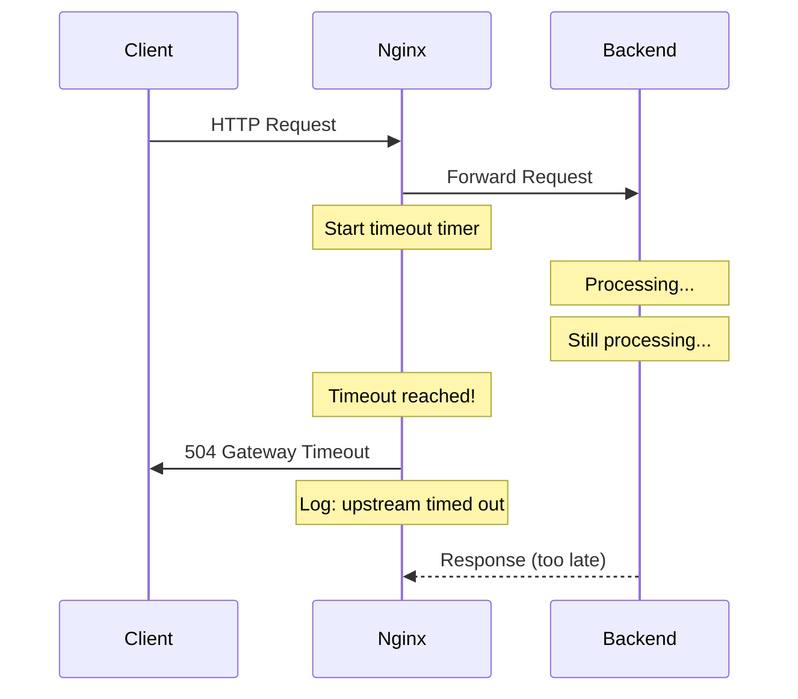
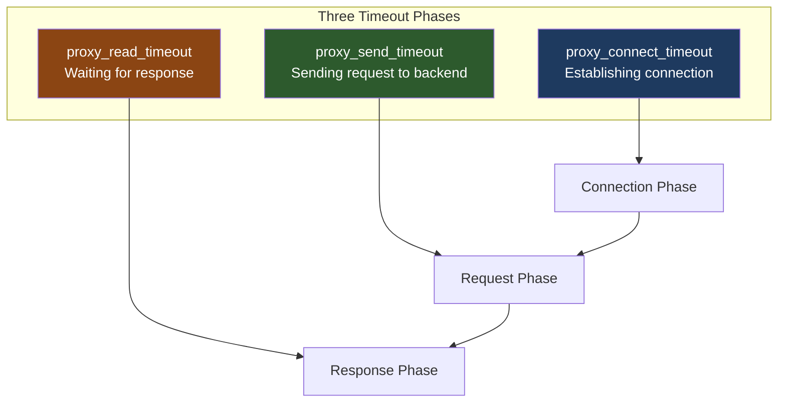
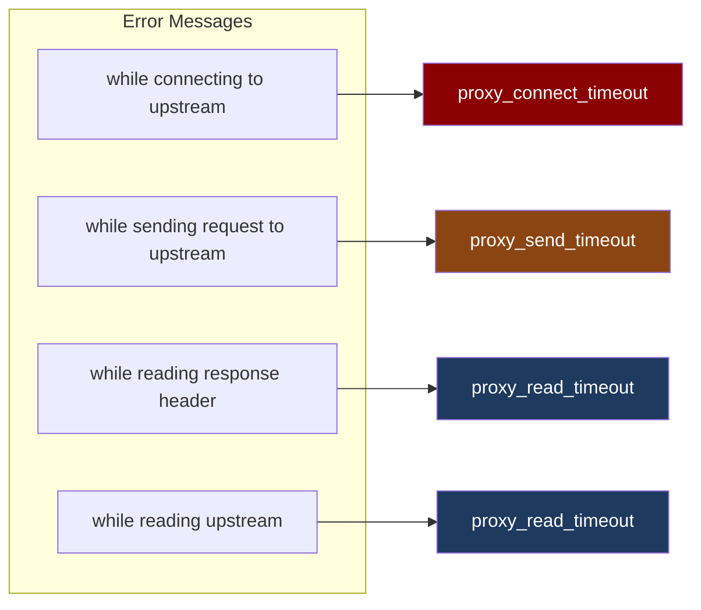
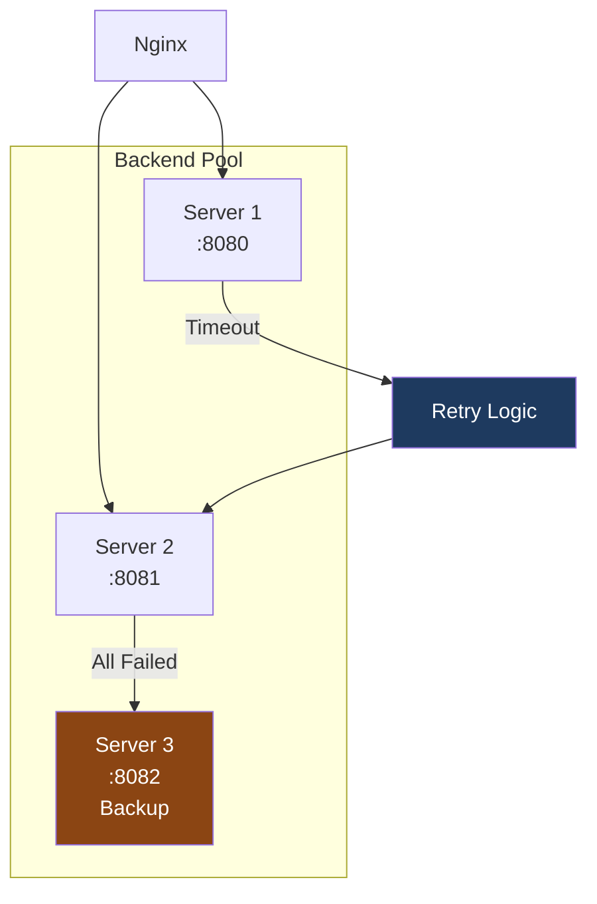
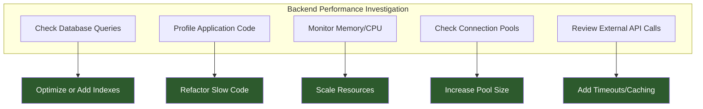

# How to Fix 'upstream timed out' Errors in Nginx

Author: [nawazdhandala](https://www.github.com/nawazdhandala)

Tags: Nginx, Troubleshooting, Upstream, Timeout, Proxy, DevOps

Description: Learn how to diagnose and fix Nginx upstream timed out errors that occur when backend servers fail to respond within configured timeouts. Includes configuration examples and debugging strategies.

---

The "upstream timed out" error in Nginx is one of the most common issues when running Nginx as a reverse proxy. This error occurs when your backend server fails to respond within the configured timeout period, resulting in a 504 Gateway Timeout error for your users.

## Understanding Upstream Timeouts



The error message in your logs looks like this:

```
upstream timed out (110: Connection timed out) while reading response header from upstream
```

## Types of Upstream Timeouts



### The Three Timeout Types

1. **proxy_connect_timeout** - Time to establish a connection with the backend
2. **proxy_send_timeout** - Time to send the request to the backend
3. **proxy_read_timeout** - Time to wait for the backend response

## Diagnosing the Problem

### Step 1: Check Error Logs

```bash
# View recent upstream timeout errors
tail -f /var/log/nginx/error.log | grep "upstream timed out"

# Count timeouts by upstream server
grep "upstream timed out" /var/log/nginx/error.log | \
  grep -oP 'upstream: "[^"]+' | sort | uniq -c | sort -rn

# Find which endpoints cause timeouts
grep "upstream timed out" /var/log/nginx/error.log | \
  grep -oP 'request: "[^"]+' | sort | uniq -c | sort -rn | head -20
```

### Step 2: Identify the Timeout Phase

The error message tells you which phase timed out:



### Step 3: Test Backend Response Time

```bash
# Test backend directly to measure response time
time curl -v http://127.0.0.1:8080/slow-endpoint

# Test with specific timeout
curl --max-time 30 http://127.0.0.1:8080/api/heavy-operation

# Use ab for load testing
ab -n 100 -c 10 http://127.0.0.1:8080/api/endpoint
```

## Solutions

### Solution 1: Increase Timeout Values

The most straightforward fix is to increase the timeout values to accommodate your backend:

```nginx
http {
    upstream backend {
        server 127.0.0.1:8080;
    }

    server {
        listen 80;
        server_name example.com;

        location / {
            proxy_pass http://backend;

            # Increase timeouts (default is 60s)
            proxy_connect_timeout 300s;
            proxy_send_timeout 300s;
            proxy_read_timeout 300s;

            # Also set send_timeout for client
            send_timeout 300s;
        }
    }
}
```

### Solution 2: Configure Different Timeouts per Location

Different endpoints may need different timeout values:

```nginx
server {
    listen 80;

    # Default API endpoints - standard timeouts
    location /api/ {
        proxy_pass http://backend;
        proxy_connect_timeout 60s;
        proxy_send_timeout 60s;
        proxy_read_timeout 60s;
    }

    # Report generation - needs longer timeouts
    location /api/reports/ {
        proxy_pass http://backend;
        proxy_connect_timeout 60s;
        proxy_send_timeout 60s;
        proxy_read_timeout 600s;  # 10 minutes for heavy reports
    }

    # File uploads - extended send timeout
    location /api/upload/ {
        proxy_pass http://backend;
        proxy_connect_timeout 60s;
        proxy_send_timeout 300s;  # 5 minutes for large uploads
        proxy_read_timeout 300s;

        # Increase body size limit
        client_max_body_size 100M;
    }

    # Health check - short timeouts
    location /health {
        proxy_pass http://backend;
        proxy_connect_timeout 5s;
        proxy_send_timeout 5s;
        proxy_read_timeout 5s;
    }
}
```

### Solution 3: Implement Upstream Health Checks

Configure Nginx to detect and avoid slow or unresponsive backends:

```nginx
upstream backend {
    # Mark server as failed after 3 failures, retry after 30 seconds
    server 127.0.0.1:8080 max_fails=3 fail_timeout=30s;
    server 127.0.0.1:8081 max_fails=3 fail_timeout=30s;
    server 127.0.0.1:8082 max_fails=3 fail_timeout=30s backup;

    # Keep connections alive to reduce connection overhead
    keepalive 32;
}

server {
    location / {
        proxy_pass http://backend;

        # HTTP/1.1 is required for keepalive
        proxy_http_version 1.1;
        proxy_set_header Connection "";

        # Retry on errors
        proxy_next_upstream error timeout http_502 http_503 http_504;
        proxy_next_upstream_timeout 30s;
        proxy_next_upstream_tries 3;
    }
}
```



### Solution 4: Optimize Backend Performance

Sometimes the issue is not Nginx but the backend itself:



Example: Optimizing a Node.js backend:

```javascript
const express = require('express');
const app = express();

// Add timeout middleware
app.use((req, res, next) => {
    // Set server timeout slightly less than Nginx timeout
    req.setTimeout(55000); // 55 seconds
    res.setTimeout(55000);
    next();
});

// Add request logging to identify slow endpoints
app.use((req, res, next) => {
    const start = Date.now();
    res.on('finish', () => {
        const duration = Date.now() - start;
        if (duration > 5000) {
            console.warn(`Slow request: ${req.method} ${req.url} took ${duration}ms`);
        }
    });
    next();
});

// Optimize database connection pooling
const { Pool } = require('pg');
const pool = new Pool({
    max: 20,                    // Maximum connections
    idleTimeoutMillis: 30000,   // Close idle connections after 30s
    connectionTimeoutMillis: 5000 // Fail fast on connection issues
});
```

### Solution 5: Use Caching to Reduce Backend Load

```nginx
http {
    # Cache configuration
    proxy_cache_path /var/cache/nginx levels=1:2 keys_zone=api_cache:10m
                     max_size=1g inactive=60m use_temp_path=off;

    upstream backend {
        server 127.0.0.1:8080;
        keepalive 32;
    }

    server {
        listen 80;

        # Cache GET requests
        location /api/ {
            proxy_pass http://backend;

            proxy_cache api_cache;
            proxy_cache_valid 200 10m;
            proxy_cache_valid 404 1m;
            proxy_cache_use_stale error timeout updating http_500 http_502 http_503 http_504;
            proxy_cache_lock on;

            # Add cache status header for debugging
            add_header X-Cache-Status $upstream_cache_status;

            proxy_connect_timeout 60s;
            proxy_read_timeout 60s;
        }

        # Do not cache POST requests
        location /api/write/ {
            proxy_pass http://backend;
            proxy_cache off;

            proxy_connect_timeout 60s;
            proxy_read_timeout 120s;
        }
    }
}
```

### Solution 6: Implement Request Buffering

```nginx
server {
    location / {
        proxy_pass http://backend;

        # Buffer the request before sending to backend
        proxy_request_buffering on;

        # Buffer the response before sending to client
        proxy_buffering on;
        proxy_buffer_size 4k;
        proxy_buffers 8 16k;
        proxy_busy_buffers_size 24k;

        # Store large responses on disk
        proxy_max_temp_file_size 1024m;
        proxy_temp_file_write_size 64k;

        proxy_connect_timeout 60s;
        proxy_send_timeout 60s;
        proxy_read_timeout 60s;
    }
}
```

## Debugging with Custom Logging

Create detailed logs to understand timeout patterns:

```nginx
http {
    log_format upstream_debug '$remote_addr - $remote_user [$time_local] '
                              '"$request" $status $body_bytes_sent '
                              'rt=$request_time '
                              'uct="$upstream_connect_time" '
                              'uht="$upstream_header_time" '
                              'urt="$upstream_response_time" '
                              'ua="$upstream_addr" '
                              'us="$upstream_status"';

    server {
        access_log /var/log/nginx/upstream_debug.log upstream_debug;

        location / {
            proxy_pass http://backend;
        }
    }
}
```

Analyze the logs:

```bash
# Find requests where upstream_response_time is close to timeout
awk -F'urt="' '{print $2}' /var/log/nginx/upstream_debug.log | \
  cut -d'"' -f1 | sort -n | tail -20

# Calculate average upstream response time
awk -F'urt="' '{print $2}' /var/log/nginx/upstream_debug.log | \
  cut -d'"' -f1 | \
  awk '{sum+=$1; count++} END {print "Average: " sum/count "s"}'
```

## Common Timeout Configuration

```nginx
# Full production configuration example
http {
    upstream api_backend {
        least_conn;
        server api1.internal:8080 weight=3 max_fails=3 fail_timeout=30s;
        server api2.internal:8080 weight=3 max_fails=3 fail_timeout=30s;
        server api3.internal:8080 weight=2 max_fails=3 fail_timeout=30s backup;

        keepalive 64;
    }

    server {
        listen 80;
        server_name api.example.com;

        # Global timeout settings
        proxy_connect_timeout 60s;
        proxy_send_timeout 60s;
        proxy_read_timeout 60s;

        location / {
            proxy_pass http://api_backend;

            proxy_http_version 1.1;
            proxy_set_header Connection "";
            proxy_set_header Host $host;
            proxy_set_header X-Real-IP $remote_addr;
            proxy_set_header X-Forwarded-For $proxy_add_x_forwarded_for;
            proxy_set_header X-Forwarded-Proto $scheme;

            # Retry configuration
            proxy_next_upstream error timeout http_502 http_503 http_504;
            proxy_next_upstream_timeout 60s;
            proxy_next_upstream_tries 2;
        }

        # Extended timeout for specific endpoints
        location ~ ^/api/(reports|exports)/ {
            proxy_pass http://api_backend;
            proxy_read_timeout 600s;
        }
    }
}
```

## Summary

Upstream timeout errors in Nginx indicate that your backend is not responding quickly enough. To fix these errors:

1. **Identify the timeout phase** from the error message (connect, send, or read)
2. **Adjust timeout values** appropriately for your application's needs
3. **Implement health checks** to route around failing backends
4. **Optimize backend performance** to reduce response times
5. **Add caching** to reduce backend load
6. **Monitor continuously** with detailed logging

Remember that increasing timeouts is often a band-aid solution. The ideal fix is to ensure your backend responds within reasonable timeframes, reserving longer timeouts only for endpoints that genuinely require them.
