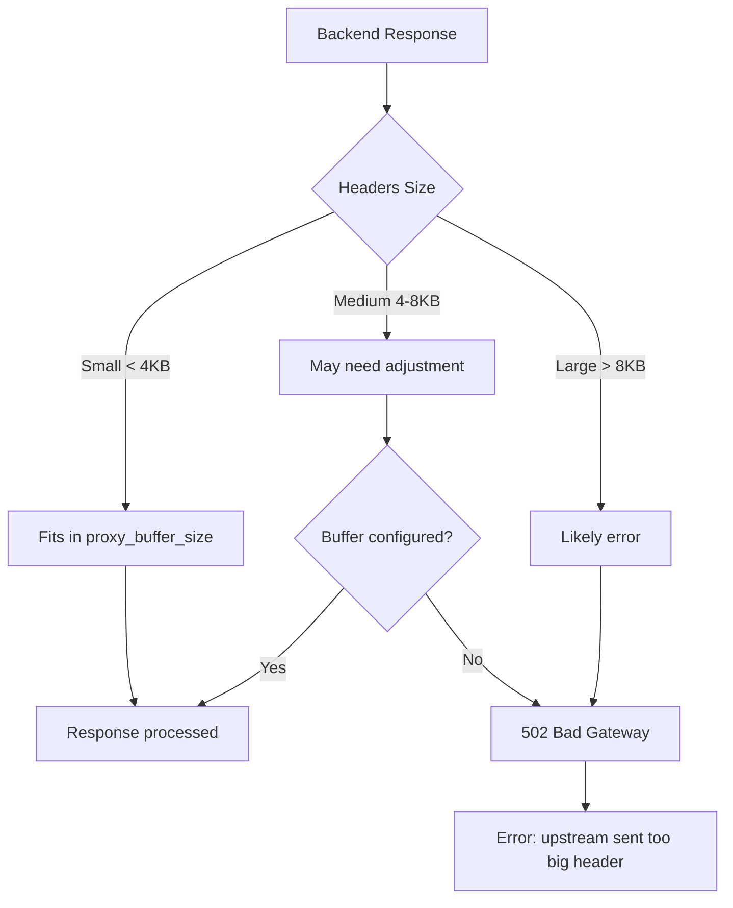

# How to Fix "upstream sent too big header" Errors

Author: [nawazdhandala](https://github.com/nawazdhandala)

Tags: Nginx, Proxy, Headers, Troubleshooting, FastCGI

Description: Learn how to diagnose and fix Nginx upstream sent too big header errors by adjusting buffer sizes for proxy, FastCGI, and uWSGI backends.

---

The "upstream sent too big header" error occurs when your backend application sends response headers that exceed Nginx's default buffer sizes. This commonly happens with applications that set large cookies, JWT tokens, or custom headers. Understanding how Nginx handles upstream responses helps you configure appropriate buffer sizes.

## Understanding the Error

When Nginx proxies requests to a backend, it allocates buffers to store the response. If the headers exceed these buffers, you'll see errors like:

```
upstream sent too big header while reading response header from upstream
```



## Common Causes

1. **Large JWT tokens** - Authentication tokens in headers
2. **Multiple Set-Cookie headers** - Session data, tracking cookies
3. **Large custom headers** - Application-specific data
4. **Verbose error responses** - Debug information in headers
5. **CORS headers** - Multiple Access-Control headers

## Solution for Reverse Proxy

For `proxy_pass` backends:

```nginx
server {
    listen 80;
    server_name example.com;

    location / {
        proxy_pass http://backend;

        # Increase header buffer size
        proxy_buffer_size 16k;

        # Increase number and size of buffers for response body
        proxy_buffers 4 32k;

        # Maximum size of response that can be busy sending to client
        proxy_busy_buffers_size 64k;
    }
}
```

### Explanation of Buffer Directives

| Directive | Default | Purpose |
|-----------|---------|---------|
| `proxy_buffer_size` | 4k/8k | Buffer for first part of response (headers) |
| `proxy_buffers` | 8 4k/8k | Buffers for response body |
| `proxy_busy_buffers_size` | 8k/16k | Limit on busy buffers |

## Solution for FastCGI (PHP-FPM)

For PHP applications using FastCGI:

```nginx
server {
    listen 80;
    server_name example.com;
    root /var/www/html;

    location ~ \.php$ {
        fastcgi_pass unix:/var/run/php/php-fpm.sock;
        fastcgi_index index.php;
        fastcgi_param SCRIPT_FILENAME $document_root$fastcgi_script_name;
        include fastcgi_params;

        # Increase FastCGI buffer sizes
        fastcgi_buffer_size 32k;
        fastcgi_buffers 8 32k;
        fastcgi_busy_buffers_size 64k;
    }
}
```

## Solution for uWSGI (Python)

For Python applications using uWSGI:

```nginx
server {
    listen 80;
    server_name example.com;

    location / {
        uwsgi_pass unix:/var/run/uwsgi/app.sock;
        include uwsgi_params;

        # Increase uWSGI buffer sizes
        uwsgi_buffer_size 32k;
        uwsgi_buffers 8 32k;
        uwsgi_busy_buffers_size 64k;
    }
}
```

## Complete Production Configuration

Here's a comprehensive configuration handling all buffer scenarios:

```nginx
http {
    # Global defaults for all upstreams
    proxy_buffer_size 16k;
    proxy_buffers 4 32k;
    proxy_busy_buffers_size 64k;

    # If buffering is enabled (default)
    proxy_max_temp_file_size 0;  # Don't write to disk

    server {
        listen 443 ssl http2;
        server_name example.com;

        # API endpoints with potentially large headers
        location /api/ {
            proxy_pass http://api_backend;
            proxy_http_version 1.1;

            # Large buffers for API responses with JWT headers
            proxy_buffer_size 32k;
            proxy_buffers 8 32k;
            proxy_busy_buffers_size 128k;

            # Standard proxy headers
            proxy_set_header Host $host;
            proxy_set_header X-Real-IP $remote_addr;
            proxy_set_header X-Forwarded-For $proxy_add_x_forwarded_for;
            proxy_set_header X-Forwarded-Proto $scheme;
        }

        # WebSocket endpoints - disable buffering entirely
        location /ws/ {
            proxy_pass http://websocket_backend;
            proxy_http_version 1.1;

            # Disable buffering for WebSocket
            proxy_buffering off;

            proxy_set_header Upgrade $http_upgrade;
            proxy_set_header Connection "upgrade";
        }

        # Static file serving - no proxy buffers needed
        location /static/ {
            alias /var/www/static/;
            expires 1y;
        }

        # Default location
        location / {
            proxy_pass http://app_backend;

            # Moderate buffer sizes
            proxy_buffer_size 16k;
            proxy_buffers 4 16k;
            proxy_busy_buffers_size 32k;
        }
    }
}
```

## Diagnosing Header Size Issues

### Check Current Header Sizes

```bash
# Use curl to see response headers
curl -sI https://example.com/api/endpoint | wc -c
# Shows total header size in bytes

# Detailed header breakdown
curl -sI https://example.com/api/endpoint | \
    awk '{print length($0), $0}' | sort -rn | head -10
```

### Enable Debug Logging

```nginx
error_log /var/log/nginx/error.log debug;

# Or for specific location
location /api/ {
    error_log /var/log/nginx/api-error.log debug;
    # ...
}
```

### Monitor Buffer Usage

```bash
# Check error log for buffer warnings
grep -i "big header" /var/log/nginx/error.log

# Count occurrences
grep -c "upstream sent too big header" /var/log/nginx/error.log
```

## Calculating Buffer Sizes

Determine appropriate buffer sizes based on your headers:

```bash
#!/bin/bash
# check-header-sizes.sh

URL="${1:-https://example.com/}"

echo "=== Header Size Analysis for $URL ==="
echo ""

# Get headers
HEADERS=$(curl -sI "$URL")

# Total size
TOTAL=$(echo "$HEADERS" | wc -c)
echo "Total header size: $TOTAL bytes"

# Recommend buffer size (round up to nearest 4k)
RECOMMENDED=$(( (TOTAL / 4096 + 1) * 4096 ))
echo "Recommended proxy_buffer_size: ${RECOMMENDED} bytes ($(( RECOMMENDED / 1024 ))k)"

echo ""
echo "=== Largest Headers ==="
echo "$HEADERS" | awk '{print length($0), $0}' | sort -rn | head -5

echo ""
echo "=== Set-Cookie Headers ==="
echo "$HEADERS" | grep -i "set-cookie" | wc -l
echo "Set-Cookie headers found"
```

## Handling Specific Scenarios

### Large JWT Tokens

```nginx
# API returning JWT in Authorization header
location /api/auth/ {
    proxy_pass http://auth_backend;

    # JWT tokens can be 2-4KB each
    proxy_buffer_size 64k;
    proxy_buffers 8 32k;
    proxy_busy_buffers_size 128k;
}
```

### Multiple Session Cookies

```nginx
# Application with multiple cookies
location / {
    proxy_pass http://app_backend;

    # Each Set-Cookie header can be 4KB+
    # Assume up to 10 cookies
    proxy_buffer_size 64k;
    proxy_buffers 16 32k;
}
```

### Disable Buffering for Streaming

```nginx
# For Server-Sent Events or streaming responses
location /events/ {
    proxy_pass http://sse_backend;

    # Disable buffering entirely
    proxy_buffering off;

    # Still need buffer for initial headers
    proxy_buffer_size 16k;

    # SSE-specific settings
    proxy_read_timeout 86400s;
    proxy_http_version 1.1;
    proxy_set_header Connection "";
}
```

## Buffer Size Reference

| Application Type | proxy_buffer_size | proxy_buffers |
|-----------------|-------------------|---------------|
| Simple web app | 8k | 4 8k |
| REST API | 16k | 4 16k |
| API with JWT | 32k | 8 32k |
| Heavy cookies | 64k | 8 32k |
| Large responses | 32k | 16 64k |

## Troubleshooting Checklist

```bash
#!/bin/bash
# nginx-buffer-debug.sh

echo "=== Nginx Buffer Troubleshooting ==="

echo ""
echo "1. Current error log entries:"
sudo tail -20 /var/log/nginx/error.log | grep -i "header\|buffer"

echo ""
echo "2. Nginx configuration test:"
sudo nginx -t

echo ""
echo "3. Current buffer settings:"
sudo nginx -T 2>/dev/null | grep -E "(proxy_buffer|fastcgi_buffer|uwsgi_buffer)"

echo ""
echo "4. Memory available for buffers:"
free -h

echo ""
echo "5. Worker connections:"
sudo nginx -T 2>/dev/null | grep -E "worker_connections"

echo ""
echo "6. Upstream response test (replace URL):"
echo "Run: curl -sI https://your-api.com/endpoint | wc -c"
```

## Performance Considerations

Increasing buffer sizes uses more memory:

```nginx
# Memory calculation:
# proxy_buffers 8 32k = 256KB per connection
# With 1000 concurrent connections = 256MB just for proxy buffers

# Balance size with connection count
worker_processes auto;
events {
    worker_connections 1024;
}

http {
    # Reasonable defaults
    proxy_buffer_size 16k;
    proxy_buffers 4 16k;  # 64KB per connection

    # Override only where needed
    location /api/heavy-headers/ {
        proxy_buffer_size 64k;
        proxy_buffers 8 32k;  # 256KB for this location only
    }
}
```

## Summary

| Error Type | Primary Setting | Typical Fix |
|------------|----------------|-------------|
| proxy_pass | proxy_buffer_size | 16k-64k |
| fastcgi_pass | fastcgi_buffer_size | 16k-64k |
| uwsgi_pass | uwsgi_buffer_size | 16k-64k |
| WebSocket | proxy_buffering off | Disable buffering |
| SSE/Streaming | proxy_buffering off | Disable buffering |

The "upstream sent too big header" error is resolved by increasing buffer sizes, but always measure your actual header sizes first to avoid wasting memory. Start with moderate increases and adjust based on real-world data from your applications.
