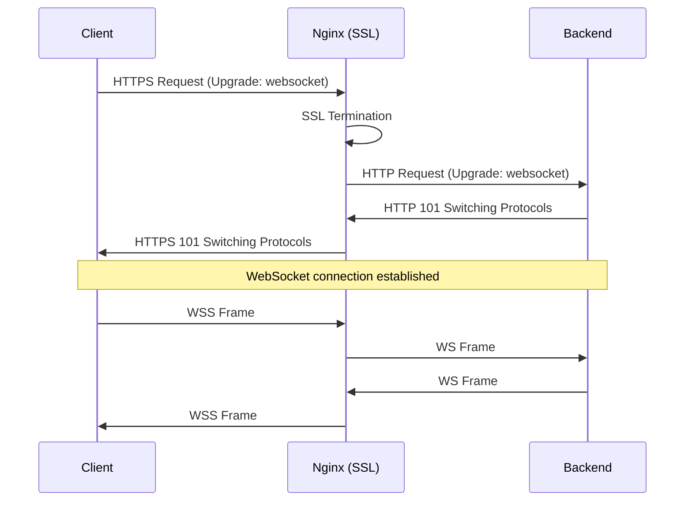

# How to Configure Nginx as WebSocket Proxy with SSL

Author: [nawazdhandala](https://github.com/nawazdhandala)

Tags: Nginx, WebSocket, SSL, TLS, Proxy, Real-time

Description: Learn how to configure Nginx as a secure WebSocket proxy with SSL termination, including connection upgrades, timeouts, load balancing, and troubleshooting common issues.

---

WebSocket connections require special handling in Nginx because they upgrade from HTTP to a persistent bidirectional connection. When adding SSL termination, the configuration becomes more complex but is essential for secure real-time applications. This guide covers everything from basic setup to production-ready configurations.

## WebSocket Connection Flow

Understanding the WebSocket upgrade process helps explain the required configuration:



## Basic WebSocket Proxy Configuration

Start with this minimal configuration:

```nginx
# /etc/nginx/sites-available/websocket

# Map for connection upgrade header
map $http_upgrade $connection_upgrade {
    default upgrade;
    ''      close;
}

server {
    listen 443 ssl http2;
    server_name ws.example.com;

    # SSL certificates
    ssl_certificate /etc/letsencrypt/live/ws.example.com/fullchain.pem;
    ssl_certificate_key /etc/letsencrypt/live/ws.example.com/privkey.pem;

    location / {
        proxy_pass http://127.0.0.1:8080;
        proxy_http_version 1.1;

        # WebSocket upgrade headers
        proxy_set_header Upgrade $http_upgrade;
        proxy_set_header Connection $connection_upgrade;

        # Pass client information
        proxy_set_header Host $host;
        proxy_set_header X-Real-IP $remote_addr;
        proxy_set_header X-Forwarded-For $proxy_add_x_forwarded_for;
        proxy_set_header X-Forwarded-Proto $scheme;
    }
}
```

## Production Configuration

A complete production setup with all necessary options:

```nginx
# /etc/nginx/conf.d/websocket.conf

map $http_upgrade $connection_upgrade {
    default upgrade;
    ''      close;
}

# Upstream definition for backend WebSocket servers
upstream websocket_backend {
    # Use IP hash for sticky sessions (important for WebSocket)
    ip_hash;

    server 127.0.0.1:8080 weight=5;
    server 127.0.0.1:8081 weight=5;

    # Keep connections alive to backend
    keepalive 32;
}

server {
    listen 80;
    server_name ws.example.com;
    return 301 https://$server_name$request_uri;
}

server {
    listen 443 ssl http2;
    server_name ws.example.com;

    # SSL Configuration
    ssl_certificate /etc/letsencrypt/live/ws.example.com/fullchain.pem;
    ssl_certificate_key /etc/letsencrypt/live/ws.example.com/privkey.pem;

    # Modern SSL settings
    ssl_protocols TLSv1.2 TLSv1.3;
    ssl_ciphers ECDHE-ECDSA-AES128-GCM-SHA256:ECDHE-RSA-AES128-GCM-SHA256:ECDHE-ECDSA-AES256-GCM-SHA384:ECDHE-RSA-AES256-GCM-SHA384;
    ssl_prefer_server_ciphers off;

    # SSL session caching
    ssl_session_cache shared:SSL:10m;
    ssl_session_timeout 1d;
    ssl_session_tickets off;

    # OCSP Stapling
    ssl_stapling on;
    ssl_stapling_verify on;
    resolver 8.8.8.8 8.8.4.4 valid=300s;
    resolver_timeout 5s;

    # Security headers
    add_header Strict-Transport-Security "max-age=63072000" always;
    add_header X-Frame-Options "SAMEORIGIN" always;
    add_header X-Content-Type-Options "nosniff" always;

    # WebSocket endpoint
    location /ws {
        proxy_pass http://websocket_backend;
        proxy_http_version 1.1;

        # Upgrade headers for WebSocket
        proxy_set_header Upgrade $http_upgrade;
        proxy_set_header Connection $connection_upgrade;

        # Client information headers
        proxy_set_header Host $host;
        proxy_set_header X-Real-IP $remote_addr;
        proxy_set_header X-Forwarded-For $proxy_add_x_forwarded_for;
        proxy_set_header X-Forwarded-Proto $scheme;

        # Timeouts for long-lived connections
        proxy_connect_timeout 7d;
        proxy_send_timeout 7d;
        proxy_read_timeout 7d;

        # Disable buffering for real-time
        proxy_buffering off;

        # Don't close connection on backend errors
        proxy_intercept_errors off;
    }

    # Regular HTTP endpoints
    location / {
        proxy_pass http://127.0.0.1:3000;
        proxy_set_header Host $host;
        proxy_set_header X-Real-IP $remote_addr;
        proxy_set_header X-Forwarded-For $proxy_add_x_forwarded_for;
        proxy_set_header X-Forwarded-Proto $scheme;
    }

    # Health check endpoint
    location /health {
        access_log off;
        return 200 "healthy\n";
        add_header Content-Type text/plain;
    }
}
```

## Socket.IO Specific Configuration

Socket.IO requires special handling for its polling fallback:

```nginx
server {
    listen 443 ssl http2;
    server_name app.example.com;

    # ... SSL config ...

    # Socket.IO endpoint
    location /socket.io/ {
        proxy_pass http://socketio_backend;
        proxy_http_version 1.1;

        # WebSocket upgrade
        proxy_set_header Upgrade $http_upgrade;
        proxy_set_header Connection $connection_upgrade;

        # Required for Socket.IO polling
        proxy_set_header Host $host;
        proxy_set_header X-Real-IP $remote_addr;
        proxy_set_header X-Forwarded-For $proxy_add_x_forwarded_for;
        proxy_set_header X-Forwarded-Proto $scheme;

        # Longer timeouts for polling
        proxy_read_timeout 86400s;
        proxy_send_timeout 86400s;

        # Required for Socket.IO sticky sessions
        # If using multiple backends, use ip_hash in upstream
    }
}

upstream socketio_backend {
    ip_hash;  # Sticky sessions required for Socket.IO
    server 127.0.0.1:3000;
    server 127.0.0.1:3001;
    keepalive 32;
}
```

## Multiple WebSocket Paths

Handle different WebSocket endpoints:

```nginx
server {
    listen 443 ssl http2;
    server_name example.com;

    # ... SSL config ...

    # Chat WebSocket
    location /ws/chat {
        proxy_pass http://chat_backend;
        proxy_http_version 1.1;
        proxy_set_header Upgrade $http_upgrade;
        proxy_set_header Connection $connection_upgrade;
        proxy_read_timeout 86400s;
    }

    # Notifications WebSocket
    location /ws/notifications {
        proxy_pass http://notifications_backend;
        proxy_http_version 1.1;
        proxy_set_header Upgrade $http_upgrade;
        proxy_set_header Connection $connection_upgrade;
        proxy_read_timeout 86400s;
    }

    # Live data feed
    location /ws/feed {
        proxy_pass http://feed_backend;
        proxy_http_version 1.1;
        proxy_set_header Upgrade $http_upgrade;
        proxy_set_header Connection $connection_upgrade;
        proxy_read_timeout 86400s;
    }
}

upstream chat_backend {
    server 127.0.0.1:8001;
    keepalive 16;
}

upstream notifications_backend {
    server 127.0.0.1:8002;
    keepalive 16;
}

upstream feed_backend {
    server 127.0.0.1:8003;
    keepalive 16;
}
```

## Timeout Configuration

WebSocket connections need careful timeout handling:

```nginx
location /ws {
    proxy_pass http://websocket_backend;
    proxy_http_version 1.1;
    proxy_set_header Upgrade $http_upgrade;
    proxy_set_header Connection $connection_upgrade;

    # Connection timeout - initial connection to backend
    proxy_connect_timeout 60s;

    # Read timeout - time between reads from backend
    # Set high for WebSocket to prevent premature closes
    proxy_read_timeout 3600s;  # 1 hour

    # Send timeout - time between writes to backend
    proxy_send_timeout 3600s;

    # Client timeouts
    client_body_timeout 60s;
    send_timeout 60s;
}
```

## Load Balancing WebSocket Connections

For multiple backend servers:

```nginx
upstream websocket_cluster {
    # Consistent hashing for sticky sessions
    hash $remote_addr consistent;

    server ws1.internal:8080 weight=3;
    server ws2.internal:8080 weight=3;
    server ws3.internal:8080 weight=3;

    # Health checks (commercial Nginx Plus feature)
    # health_check interval=10 fails=3 passes=2;

    keepalive 64;
}

server {
    listen 443 ssl http2;
    server_name ws.example.com;

    location / {
        proxy_pass http://websocket_cluster;
        proxy_http_version 1.1;

        proxy_set_header Upgrade $http_upgrade;
        proxy_set_header Connection $connection_upgrade;

        # Pass the real client IP for hash
        proxy_set_header X-Real-IP $remote_addr;
        proxy_set_header X-Forwarded-For $proxy_add_x_forwarded_for;

        proxy_read_timeout 86400s;
    }
}
```

## Debugging WebSocket Connections

### Enable Debug Logging

```nginx
error_log /var/log/nginx/websocket-debug.log debug;

server {
    listen 443 ssl;
    server_name ws.example.com;

    # Custom access log for WebSocket
    log_format websocket '$remote_addr - [$time_local] '
                         '"$request" $status '
                         'upgrade="$http_upgrade" '
                         'connection="$http_connection" '
                         'backend="$upstream_addr"';

    access_log /var/log/nginx/websocket-access.log websocket;

    location /ws {
        # ... proxy config ...
    }
}
```

### Testing WebSocket Connection

```bash
# Install websocat
# macOS: brew install websocat
# Linux: cargo install websocat

# Test WebSocket connection
websocat wss://ws.example.com/ws

# With headers
websocat -H "Authorization: Bearer token123" wss://ws.example.com/ws

# Verbose mode
websocat -v wss://ws.example.com/ws
```

### Check Connection Upgrade

```bash
# Verify upgrade headers
curl -i -N \
    -H "Connection: Upgrade" \
    -H "Upgrade: websocket" \
    -H "Sec-WebSocket-Key: dGhlIHNhbXBsZSBub25jZQ==" \
    -H "Sec-WebSocket-Version: 13" \
    https://ws.example.com/ws

# Should return:
# HTTP/1.1 101 Switching Protocols
# Upgrade: websocket
# Connection: Upgrade
```

## Common Issues and Solutions

### Issue: Connection Drops After 60 Seconds

```nginx
# Increase timeouts
proxy_read_timeout 86400s;
proxy_send_timeout 86400s;
```

### Issue: 502 Bad Gateway on Upgrade

```nginx
# Ensure correct HTTP version
proxy_http_version 1.1;

# Check upgrade headers
proxy_set_header Upgrade $http_upgrade;
proxy_set_header Connection $connection_upgrade;
```

### Issue: WebSocket Works Locally But Not Through Nginx

```nginx
# Check if SSL is terminating correctly
# Ensure backend expects non-SSL connection
proxy_pass http://backend;  # Not https://
```

### Issue: Mixed Content Errors

```nginx
# Ensure X-Forwarded-Proto is set
proxy_set_header X-Forwarded-Proto $scheme;

# Backend should use this header to generate correct URLs
```

### Issue: Connection Reset by Peer

```nginx
# Disable proxy buffering
proxy_buffering off;

# Increase buffer sizes if needed
proxy_buffer_size 64k;
proxy_buffers 8 64k;
```

## Complete Production Example

```nginx
map $http_upgrade $connection_upgrade {
    default upgrade;
    ''      close;
}

upstream ws_backend {
    ip_hash;
    server 127.0.0.1:8080;
    server 127.0.0.1:8081;
    keepalive 64;
}

server {
    listen 443 ssl http2;
    server_name app.example.com;

    ssl_certificate /etc/letsencrypt/live/app.example.com/fullchain.pem;
    ssl_certificate_key /etc/letsencrypt/live/app.example.com/privkey.pem;
    ssl_protocols TLSv1.2 TLSv1.3;
    ssl_session_cache shared:SSL:10m;

    # WebSocket endpoint
    location /ws {
        proxy_pass http://ws_backend;
        proxy_http_version 1.1;

        proxy_set_header Upgrade $http_upgrade;
        proxy_set_header Connection $connection_upgrade;
        proxy_set_header Host $host;
        proxy_set_header X-Real-IP $remote_addr;
        proxy_set_header X-Forwarded-For $proxy_add_x_forwarded_for;
        proxy_set_header X-Forwarded-Proto $scheme;

        proxy_connect_timeout 7d;
        proxy_send_timeout 7d;
        proxy_read_timeout 7d;

        proxy_buffering off;
    }

    # API and static files
    location / {
        proxy_pass http://127.0.0.1:3000;
        proxy_set_header Host $host;
        proxy_set_header X-Real-IP $remote_addr;
        proxy_set_header X-Forwarded-For $proxy_add_x_forwarded_for;
        proxy_set_header X-Forwarded-Proto $scheme;
    }
}
```

## Summary

| Configuration | Purpose |
|--------------|---------|
| `proxy_http_version 1.1` | Required for WebSocket upgrade |
| `Upgrade` header | Signals protocol upgrade |
| `Connection` header | Manages connection type |
| `proxy_read_timeout` | Prevents idle disconnection |
| `proxy_buffering off` | Real-time data delivery |
| `ip_hash` | Sticky sessions for load balancing |

Nginx handles WebSocket proxying well when properly configured. The key requirements are the upgrade headers, appropriate timeouts, and sticky sessions when load balancing. Always test your configuration with actual WebSocket clients to ensure the connection remains stable under load.
