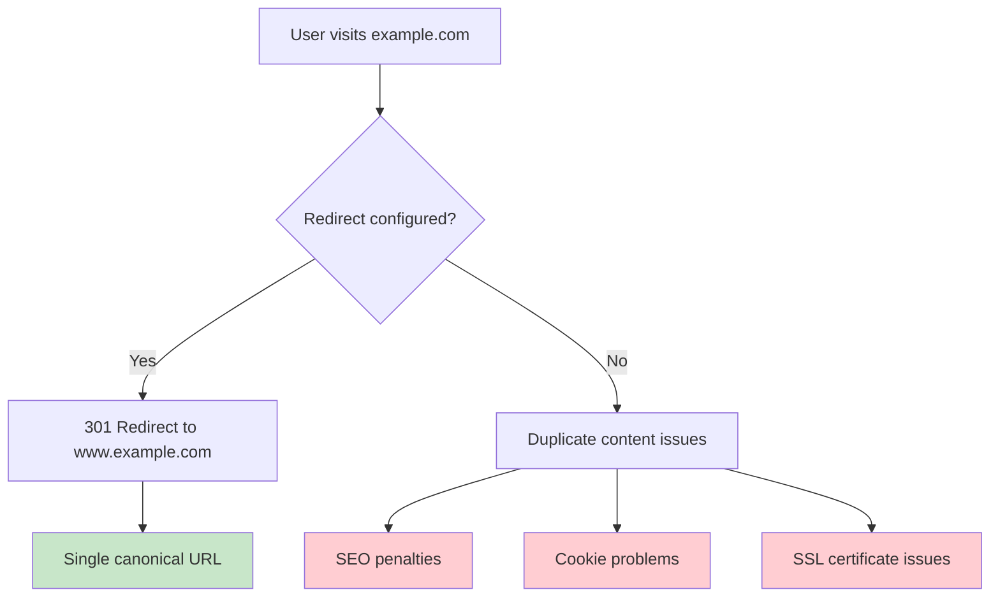

# How to Redirect non-www to www (and vice versa) in Nginx

Author: [nawazdhandala](https://github.com/nawazdhandala)

Tags: Nginx, SEO, Redirects, DNS, Web Server

Description: Learn how to configure Nginx redirects between www and non-www domains for consistent URLs, better SEO, and proper SSL certificate handling with practical configuration examples.

---

Having both www and non-www versions of your website accessible creates duplicate content issues for SEO and can cause problems with cookies and SSL certificates. Nginx makes it easy to redirect all traffic to your preferred domain format.

## Why Canonicalize Your Domain?



## Redirect non-www to www

### Basic Configuration

```nginx
# Redirect non-www to www
server {
    listen 80;
    listen [::]:80;
    server_name example.com;

    return 301 http://www.example.com$request_uri;
}

# Main server block for www
server {
    listen 80;
    listen [::]:80;
    server_name www.example.com;

    root /var/www/example.com/html;
    index index.html;

    location / {
        try_files $uri $uri/ =404;
    }
}
```

### With HTTPS

```nginx
# HTTP non-www to HTTPS www
server {
    listen 80;
    listen [::]:80;
    server_name example.com;

    return 301 https://www.example.com$request_uri;
}

# HTTP www to HTTPS www
server {
    listen 80;
    listen [::]:80;
    server_name www.example.com;

    return 301 https://www.example.com$request_uri;
}

# HTTPS non-www to HTTPS www
server {
    listen 443 ssl http2;
    listen [::]:443 ssl http2;
    server_name example.com;

    ssl_certificate /etc/letsencrypt/live/example.com/fullchain.pem;
    ssl_certificate_key /etc/letsencrypt/live/example.com/privkey.pem;

    return 301 https://www.example.com$request_uri;
}

# Main HTTPS www server
server {
    listen 443 ssl http2;
    listen [::]:443 ssl http2;
    server_name www.example.com;

    ssl_certificate /etc/letsencrypt/live/www.example.com/fullchain.pem;
    ssl_certificate_key /etc/letsencrypt/live/www.example.com/privkey.pem;

    root /var/www/example.com/html;
    index index.html;

    location / {
        try_files $uri $uri/ =404;
    }
}
```

## Redirect www to non-www

### Basic Configuration

```nginx
# Redirect www to non-www
server {
    listen 80;
    listen [::]:80;
    server_name www.example.com;

    return 301 http://example.com$request_uri;
}

# Main server block for non-www
server {
    listen 80;
    listen [::]:80;
    server_name example.com;

    root /var/www/example.com/html;
    index index.html;

    location / {
        try_files $uri $uri/ =404;
    }
}
```

### With HTTPS

```nginx
# HTTP www to HTTPS non-www
server {
    listen 80;
    listen [::]:80;
    server_name www.example.com;

    return 301 https://example.com$request_uri;
}

# HTTP non-www to HTTPS non-www
server {
    listen 80;
    listen [::]:80;
    server_name example.com;

    return 301 https://example.com$request_uri;
}

# HTTPS www to HTTPS non-www
server {
    listen 443 ssl http2;
    listen [::]:443 ssl http2;
    server_name www.example.com;

    ssl_certificate /etc/letsencrypt/live/www.example.com/fullchain.pem;
    ssl_certificate_key /etc/letsencrypt/live/www.example.com/privkey.pem;

    return 301 https://example.com$request_uri;
}

# Main HTTPS non-www server
server {
    listen 443 ssl http2;
    listen [::]:443 ssl http2;
    server_name example.com;

    ssl_certificate /etc/letsencrypt/live/example.com/fullchain.pem;
    ssl_certificate_key /etc/letsencrypt/live/example.com/privkey.pem;

    root /var/www/example.com/html;
    index index.html;

    location / {
        try_files $uri $uri/ =404;
    }
}
```

## Combined SSL Certificate Approach

If you have a certificate that covers both domains (or use a wildcard):

### non-www to www with Shared Certificate

```nginx
# Combined HTTP redirect
server {
    listen 80;
    listen [::]:80;
    server_name example.com www.example.com;

    return 301 https://www.example.com$request_uri;
}

# Combined HTTPS server with redirect logic
server {
    listen 443 ssl http2;
    listen [::]:443 ssl http2;
    server_name example.com www.example.com;

    # Certificate covers both domains
    ssl_certificate /etc/letsencrypt/live/example.com/fullchain.pem;
    ssl_certificate_key /etc/letsencrypt/live/example.com/privkey.pem;

    # Redirect non-www to www
    if ($host = example.com) {
        return 301 https://www.example.com$request_uri;
    }

    root /var/www/example.com/html;
    index index.html;

    location / {
        try_files $uri $uri/ =404;
    }
}
```

### www to non-www with Shared Certificate

```nginx
server {
    listen 80;
    listen [::]:80;
    server_name example.com www.example.com;

    return 301 https://example.com$request_uri;
}

server {
    listen 443 ssl http2;
    listen [::]:443 ssl http2;
    server_name example.com www.example.com;

    ssl_certificate /etc/letsencrypt/live/example.com/fullchain.pem;
    ssl_certificate_key /etc/letsencrypt/live/example.com/privkey.pem;

    # Redirect www to non-www
    if ($host = www.example.com) {
        return 301 https://example.com$request_uri;
    }

    root /var/www/example.com/html;
    index index.html;

    location / {
        try_files $uri $uri/ =404;
    }
}
```

## Using map Directive for Multiple Domains

For configurations with many domains:

```nginx
map $host $canonical_host {
    default         $host;
    example.com     www.example.com;
    site2.com       www.site2.com;
    site3.com       www.site3.com;
}

map $host $needs_redirect {
    default         0;
    example.com     1;
    site2.com       1;
    site3.com       1;
}

server {
    listen 80;
    listen [::]:80;
    server_name example.com www.example.com site2.com www.site2.com site3.com www.site3.com;

    return 301 https://$canonical_host$request_uri;
}

server {
    listen 443 ssl http2;
    listen [::]:443 ssl http2;
    server_name example.com www.example.com site2.com www.site2.com site3.com www.site3.com;

    ssl_certificate /etc/letsencrypt/live/example.com/fullchain.pem;
    ssl_certificate_key /etc/letsencrypt/live/example.com/privkey.pem;

    if ($needs_redirect) {
        return 301 https://$canonical_host$request_uri;
    }

    root /var/www/$host/html;
    index index.html;

    location / {
        try_files $uri $uri/ =404;
    }
}
```

## With Reverse Proxy

### non-www to www with Backend Application

```nginx
upstream backend {
    server 127.0.0.1:3000;
}

server {
    listen 80;
    listen [::]:80;
    server_name example.com www.example.com;

    return 301 https://www.example.com$request_uri;
}

server {
    listen 443 ssl http2;
    listen [::]:443 ssl http2;
    server_name example.com;

    ssl_certificate /etc/letsencrypt/live/example.com/fullchain.pem;
    ssl_certificate_key /etc/letsencrypt/live/example.com/privkey.pem;

    return 301 https://www.example.com$request_uri;
}

server {
    listen 443 ssl http2;
    listen [::]:443 ssl http2;
    server_name www.example.com;

    ssl_certificate /etc/letsencrypt/live/www.example.com/fullchain.pem;
    ssl_certificate_key /etc/letsencrypt/live/www.example.com/privkey.pem;

    location / {
        proxy_pass http://backend;
        proxy_http_version 1.1;
        proxy_set_header Host $host;
        proxy_set_header X-Real-IP $remote_addr;
        proxy_set_header X-Forwarded-For $proxy_add_x_forwarded_for;
        proxy_set_header X-Forwarded-Proto $scheme;
    }
}
```

## Let's Encrypt Certificate Setup

### For Both Domains

```bash
# Request certificate for both domains
sudo certbot certonly --nginx -d example.com -d www.example.com

# Or with standalone mode
sudo certbot certonly --standalone -d example.com -d www.example.com
```

### Auto-renewal Configuration

```bash
# Test renewal
sudo certbot renew --dry-run

# Crontab entry (usually auto-configured)
0 0 * * * /usr/bin/certbot renew --quiet --post-hook "systemctl reload nginx"
```

## DNS Configuration

Ensure both DNS records point to your server:

```
# DNS A Records
example.com.        A     123.45.67.89
www.example.com.    A     123.45.67.89

# Or use CNAME for www
example.com.        A       123.45.67.89
www.example.com.    CNAME   example.com.
```

## Testing Redirects

### Using curl

```bash
# Test non-www redirect
curl -I http://example.com
# Expected: HTTP/1.1 301 Moved Permanently
# Location: https://www.example.com/

# Test www redirect (if redirecting to non-www)
curl -I http://www.example.com
# Expected: HTTP/1.1 301 Moved Permanently
# Location: https://example.com/

# Follow redirects
curl -L -I http://example.com

# Test with specific path
curl -I http://example.com/path/to/page
# Location should preserve the path
```

### Using Browser Developer Tools

1. Open DevTools (F12)
2. Go to Network tab
3. Check "Preserve log"
4. Visit http://example.com
5. Verify 301 status and correct Location header

## Common Mistakes to Avoid

### Avoid Redirect Loops

```nginx
# WRONG - causes redirect loop
server {
    server_name example.com www.example.com;

    if ($host = example.com) {
        return 301 https://www.example.com$request_uri;
    }

    if ($host = www.example.com) {
        return 301 https://example.com$request_uri;
    }
}
```

### Avoid Multiple Redirects

```nginx
# WRONG - two redirects (HTTP > HTTPS > www)
server {
    listen 80;
    server_name example.com;
    return 301 https://example.com$request_uri;  # First redirect
}

server {
    listen 443 ssl;
    server_name example.com;
    return 301 https://www.example.com$request_uri;  # Second redirect
}

# RIGHT - single redirect
server {
    listen 80;
    server_name example.com;
    return 301 https://www.example.com$request_uri;  # Direct to final destination
}
```

### Preserve Query Strings

```nginx
# Always use $request_uri to preserve query strings
return 301 https://www.example.com$request_uri;

# NOT just $uri which loses query parameters
return 301 https://www.example.com$uri;  # WRONG
```

## Performance Considerations

301 redirects are cached by browsers, which is good for performance but can cause issues during testing:

```bash
# Clear browser cache or use incognito mode for testing

# Test without browser caching
curl -H "Cache-Control: no-cache" -I http://example.com
```

## Summary

| Scenario | Configuration |
|----------|--------------|
| non-www to www (HTTP only) | Single redirect server block |
| www to non-www (HTTP only) | Single redirect server block |
| non-www to www (HTTPS) | Separate blocks for HTTP and HTTPS redirects |
| Shared certificate | Use `if` directive within single HTTPS block |
| Multiple domains | Use `map` directive for scalability |

Choose your canonical URL format, configure proper 301 redirects, and ensure your SSL certificates cover both domain variants. Test thoroughly to avoid redirect loops and ensure query strings are preserved.
