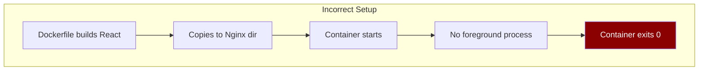
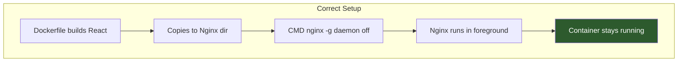
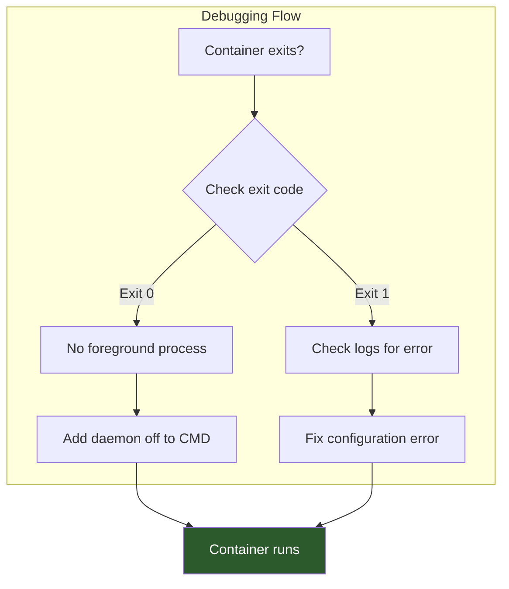

# How to Fix React App Exiting with Code 0 in Docker with Nginx

Author: [nawazdhandala](https://www.github.com/nawazdhandala)

Tags: React, Docker, Nginx, Container, DevOps, Troubleshooting

Description: Learn how to fix the common issue of React applications exiting immediately with code 0 when containerized with Docker and Nginx. Understand the root cause and implement proper solutions.

---

A common issue when containerizing React applications with Nginx is the container exiting immediately after starting with exit code 0. This happens because the container has nothing to keep it running. This guide explains why this occurs and provides multiple solutions.

## Understanding the Problem



The exit code 0 means the container completed successfully - there was no error. The problem is that Docker containers need a foreground process to keep running. If no process stays in the foreground, the container exits.

### Common Broken Dockerfile

```dockerfile
# This Dockerfile will cause the container to exit immediately
FROM node:18 AS build
WORKDIR /app
COPY package*.json ./
RUN npm install
COPY . .
RUN npm run build

FROM nginx:alpine
COPY --from=build /app/build /usr/share/nginx/html
# Missing CMD - container will exit!
```

## Solutions

### Solution 1: Use Nginx in Foreground Mode

The most common fix is to run Nginx in the foreground:

```dockerfile
FROM node:18-alpine AS build
WORKDIR /app
COPY package*.json ./
RUN npm ci --only=production
COPY . .
RUN npm run build

FROM nginx:alpine
COPY --from=build /app/build /usr/share/nginx/html
COPY nginx.conf /etc/nginx/conf.d/default.conf

# Run Nginx in foreground mode
CMD ["nginx", "-g", "daemon off;"]
```



### Solution 2: Create Proper nginx.conf

Create a custom Nginx configuration for serving React:

```nginx
# nginx.conf
server {
    listen 80;
    server_name localhost;
    root /usr/share/nginx/html;
    index index.html;

    # Serve static files
    location / {
        try_files $uri $uri/ /index.html;
    }

    # Cache static assets
    location ~* \.(js|css|png|jpg|jpeg|gif|ico|svg|woff|woff2)$ {
        expires 1y;
        add_header Cache-Control "public, immutable";
    }

    # Security headers
    add_header X-Frame-Options "SAMEORIGIN" always;
    add_header X-Content-Type-Options "nosniff" always;

    # Gzip compression
    gzip on;
    gzip_types text/plain text/css application/json application/javascript text/xml application/xml;
    gzip_min_length 1000;
}
```

### Solution 3: Complete Multi-Stage Dockerfile

Here is a complete, production-ready Dockerfile:

```dockerfile
# Stage 1: Build the React application
FROM node:18-alpine AS build

# Set working directory
WORKDIR /app

# Copy package files
COPY package.json package-lock.json ./

# Install dependencies
RUN npm ci --only=production --silent

# Copy source code
COPY . .

# Set build-time environment variables if needed
ARG REACT_APP_API_URL
ENV REACT_APP_API_URL=$REACT_APP_API_URL

# Build the application
RUN npm run build

# Stage 2: Serve with Nginx
FROM nginx:alpine

# Remove default Nginx config
RUN rm /etc/nginx/conf.d/default.conf

# Copy custom Nginx config
COPY nginx.conf /etc/nginx/conf.d/

# Copy built React app
COPY --from=build /app/build /usr/share/nginx/html

# Expose port 80
EXPOSE 80

# Health check
HEALTHCHECK --interval=30s --timeout=3s --start-period=5s --retries=3 \
    CMD wget --quiet --tries=1 --spider http://localhost/ || exit 1

# Start Nginx in foreground
CMD ["nginx", "-g", "daemon off;"]
```

### Solution 4: Using ENTRYPOINT for Configuration

When you need runtime configuration:

```dockerfile
FROM node:18-alpine AS build
WORKDIR /app
COPY package*.json ./
RUN npm ci
COPY . .
RUN npm run build

FROM nginx:alpine
COPY --from=build /app/build /usr/share/nginx/html
COPY nginx.conf /etc/nginx/conf.d/default.conf
COPY entrypoint.sh /entrypoint.sh

RUN chmod +x /entrypoint.sh

ENTRYPOINT ["/entrypoint.sh"]
CMD ["nginx", "-g", "daemon off;"]
```

Create the entrypoint script:

```bash
#!/bin/sh
# entrypoint.sh

# Replace environment variables in the React build
# This allows runtime configuration

echo "Configuring application..."

# Replace placeholder with actual API URL
if [ -n "$REACT_APP_API_URL" ]; then
    find /usr/share/nginx/html -type f -name '*.js' -exec \
        sed -i "s|REACT_APP_API_URL_PLACEHOLDER|$REACT_APP_API_URL|g" {} \;
fi

echo "Starting Nginx..."

# Execute the CMD
exec "$@"
```

### Solution 5: Docker Compose Setup

For development and production with docker-compose:

```yaml
# docker-compose.yml
version: '3.8'

services:
  frontend:
    build:
      context: .
      dockerfile: Dockerfile
      args:
        REACT_APP_API_URL: http://api.example.com
    ports:
      - "80:80"
    environment:
      - REACT_APP_API_URL=http://api.example.com
    restart: unless-stopped
    healthcheck:
      test: ["CMD", "wget", "--quiet", "--tries=1", "--spider", "http://localhost/"]
      interval: 30s
      timeout: 10s
      retries: 3
      start_period: 10s
    networks:
      - app-network

networks:
  app-network:
    driver: bridge
```

## Debugging Container Issues

### Check Container Logs

```bash
# Build the image
docker build -t react-app .

# Run and check if it stays running
docker run -d --name react-test react-app

# Check container status
docker ps -a

# View logs
docker logs react-test

# If container exited, check exit code
docker inspect react-test --format='{{.State.ExitCode}}'
```

### Interactive Debugging

```bash
# Run container interactively
docker run -it --entrypoint /bin/sh react-app

# Inside container, try starting Nginx
nginx -g 'daemon off;'

# Check Nginx configuration
nginx -t

# Check if files exist
ls -la /usr/share/nginx/html/
```



## Common Mistakes and Fixes

### Mistake 1: Missing CMD

```dockerfile
# Wrong - no CMD
FROM nginx:alpine
COPY --from=build /app/build /usr/share/nginx/html

# Correct - add CMD
FROM nginx:alpine
COPY --from=build /app/build /usr/share/nginx/html
CMD ["nginx", "-g", "daemon off;"]
```

### Mistake 2: Daemon Mode in nginx.conf

```nginx
# Wrong - daemon on will background Nginx
daemon on;

# Correct - remove this line or use
daemon off;
```

### Mistake 3: Incorrect Build Output Path

```dockerfile
# Check your React framework's build output directory

# Create React App uses 'build'
COPY --from=build /app/build /usr/share/nginx/html

# Vite uses 'dist'
COPY --from=build /app/dist /usr/share/nginx/html

# Next.js static export uses 'out'
COPY --from=build /app/out /usr/share/nginx/html
```

### Mistake 4: Permission Issues

```dockerfile
# If you encounter permission issues
FROM nginx:alpine

# Copy files
COPY --from=build /app/build /usr/share/nginx/html

# Fix permissions
RUN chown -R nginx:nginx /usr/share/nginx/html && \
    chmod -R 755 /usr/share/nginx/html

CMD ["nginx", "-g", "daemon off;"]
```

## Production-Ready Configuration

### Complete nginx.conf for React SPA

```nginx
# /etc/nginx/nginx.conf
user nginx;
worker_processes auto;
error_log /var/log/nginx/error.log warn;
pid /var/run/nginx.pid;

events {
    worker_connections 1024;
}

http {
    include /etc/nginx/mime.types;
    default_type application/octet-stream;

    log_format main '$remote_addr - $remote_user [$time_local] "$request" '
                    '$status $body_bytes_sent "$http_referer" '
                    '"$http_user_agent" "$http_x_forwarded_for"';

    access_log /var/log/nginx/access.log main;

    sendfile on;
    tcp_nopush on;
    tcp_nodelay on;
    keepalive_timeout 65;
    types_hash_max_size 2048;

    # Gzip settings
    gzip on;
    gzip_disable "msie6";
    gzip_vary on;
    gzip_proxied any;
    gzip_comp_level 6;
    gzip_types text/plain text/css text/xml application/json application/javascript
               application/xml application/rss+xml application/atom+xml image/svg+xml;

    server {
        listen 80;
        server_name _;
        root /usr/share/nginx/html;
        index index.html;

        # Security headers
        add_header X-Frame-Options "SAMEORIGIN" always;
        add_header X-Content-Type-Options "nosniff" always;
        add_header X-XSS-Protection "1; mode=block" always;
        add_header Referrer-Policy "strict-origin-when-cross-origin" always;

        # Handle React Router - all routes serve index.html
        location / {
            try_files $uri $uri/ /index.html;
        }

        # Cache static assets aggressively
        location /static/ {
            expires 1y;
            add_header Cache-Control "public, immutable";
        }

        # Cache other assets
        location ~* \.(ico|css|js|gif|jpeg|jpg|png|woff|woff2|ttf|svg|eot)$ {
            expires 1M;
            add_header Cache-Control "public";
        }

        # Health check endpoint
        location /health {
            access_log off;
            return 200 "healthy\n";
            add_header Content-Type text/plain;
        }
    }
}
```

### Final Dockerfile

```dockerfile
# syntax=docker/dockerfile:1

# Build stage
FROM node:18-alpine AS build
WORKDIR /app

# Install dependencies
COPY package.json package-lock.json ./
RUN npm ci --silent

# Copy source and build
COPY . .
ARG REACT_APP_API_URL
ENV REACT_APP_API_URL=$REACT_APP_API_URL
RUN npm run build

# Production stage
FROM nginx:alpine

# Copy custom nginx config
COPY nginx.conf /etc/nginx/nginx.conf

# Copy built application
COPY --from=build /app/build /usr/share/nginx/html

# Set proper permissions
RUN chown -R nginx:nginx /usr/share/nginx/html && \
    chmod -R 755 /usr/share/nginx/html

# Expose port
EXPOSE 80

# Health check
HEALTHCHECK --interval=30s --timeout=3s --start-period=5s --retries=3 \
    CMD wget --quiet --tries=1 --spider http://localhost/health || exit 1

# Run nginx in foreground
CMD ["nginx", "-g", "daemon off;"]
```

## Summary

When a React Docker container with Nginx exits immediately with code 0:

1. **The cause** is that Nginx runs as a daemon by default, which backgrounds the process
2. **The solution** is to run Nginx in foreground mode with `nginx -g 'daemon off;'`
3. **Best practice** is to use a proper CMD instruction in your Dockerfile
4. **Always include** a health check for production deployments
5. **Verify** your build output path matches what you copy to Nginx

By following these patterns, your React application will run reliably in a Docker container with Nginx serving the static files.
